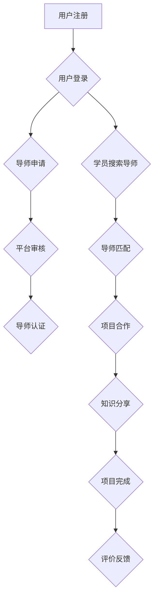

> 技术mentoring, 线上平台, 运营策略, 社区建设, 技术交流, 人才培养, 知识共享

## 1. 背景介绍

在当今科技飞速发展的时代，技术人才的需求日益增长，而传统的教育模式和学习方式难以满足快速迭代的技术发展需求。技术mentoring，即技术指导或技术辅导，作为一种新型的学习模式，逐渐成为技术人才培养和知识共享的重要途径。线上技术mentoring平台作为一种便捷高效的技术交流和学习平台，为技术人员提供了更灵活、更个性化的学习体验。

## 2. 核心概念与联系

**2.1 技术mentoring的概念**

技术mentoring是指经验丰富的技术专家（导师）与有学习需求的技术人员（学员）之间建立一对一或小组指导关系，通过知识传授、经验分享、项目合作等方式，帮助学员提升技术水平、解决技术难题、实现职业发展目标。

**2.2 线上技术mentoring平台的架构**

线上技术mentoring平台通常由以下几个核心模块组成：

* **用户管理模块:** 用于管理平台上的用户，包括导师和学员，并提供用户注册、登录、个人信息管理等功能。
* **项目管理模块:** 用于管理平台上的技术项目，包括项目发布、项目分配、项目进度跟踪等功能。
* **知识库模块:** 用于存储和管理技术相关的知识资源，包括文章、视频、代码等，方便学员学习和参考。
* **沟通协作模块:** 用于提供导师和学员之间沟通协作的工具，例如聊天、视频会议、文件共享等。
* **评价体系模块:** 用于建立导师和学员的评价体系，方便用户选择合适的导师和评估学习效果。

**2.3 线上技术mentoring平台的流程图**



## 3. 核心算法原理 & 具体操作步骤

**3.1 算法原理概述**

线上技术mentoring平台的推荐算法是核心算法之一，其目的是根据用户的兴趣、技能和需求，推荐合适的导师和项目。常见的推荐算法包括：

* **基于内容的推荐算法:** 根据用户的历史行为和导师/项目的特征进行匹配。
* **基于协同过滤的推荐算法:** 根据用户的相似用户或导师/项目相似项目的推荐。
* **基于深度学习的推荐算法:** 利用深度神经网络学习用户和导师/项目的复杂关系，进行个性化推荐。

**3.2 算法步骤详解**

以基于内容的推荐算法为例，其具体步骤如下：

1. **数据收集:** 收集用户、导师和项目的相关数据，例如用户兴趣、技能、导师经验、项目领域等。
2. **数据预处理:** 对收集到的数据进行清洗、转换和特征提取，例如将用户兴趣转换为数值表示。
3. **相似度计算:** 计算用户与导师/项目之间的相似度，可以使用余弦相似度、皮尔逊相关系数等方法。
4. **推荐结果生成:** 根据相似度排序，推荐与用户最相似的导师和项目。

**3.3 算法优缺点**

* **优点:** 能够根据用户的具体需求进行个性化推荐，推荐结果更精准。
* **缺点:** 需要大量的用户数据和特征信息，算法复杂度较高，难以处理冷启动问题。

**3.4 算法应用领域**

* **电商推荐:** 推荐商品、店铺和优惠券。
* **视频网站推荐:** 推荐视频、用户和频道。
* **音乐平台推荐:** 推荐歌曲、艺术家和歌单。
* **社交媒体推荐:** 推荐好友、群组和内容。

## 4. 数学模型和公式 & 详细讲解 & 举例说明

**4.1 数学模型构建**

基于内容的推荐算法可以使用向量空间模型来表示用户、导师和项目的特征。假设用户集合为U，导师集合为T，项目集合为P，则可以将用户、导师和项目分别表示为向量：

* 用户向量：u ∈ R^d，其中d为特征维度。
* 导师向量：t ∈ R^d。
* 项目向量：p ∈ R^d。

**4.2 公式推导过程**

用户与导师/项目的相似度可以使用余弦相似度来计算：

```latex
sim(u, t) = \frac{u \cdot t}{||u|| ||t||}
```

其中：

* u ⋅ t 为用户向量和导师向量的点积。
* ||u|| 和 ||t|| 为用户向量和导师向量的模长。

**4.3 案例分析与讲解**

假设有一个用户u，其兴趣向量为 [0.8, 0.5, 0.2]，表示用户对编程、设计和写作的兴趣程度分别为高、中、低。

假设有一个导师t，其经验向量为 [0.6, 0.7, 0.1]，表示导师在编程、设计和写作方面的经验程度分别为中、高、低。

则用户u与导师t的余弦相似度为：

```latex
sim(u, t) = \frac{0.8 \cdot 0.6 + 0.5 \cdot 0.7 + 0.2 \cdot 0.1}{\sqrt{0.8^2 + 0.5^2 + 0.2^2} \sqrt{0.6^2 + 0.7^2 + 0.1^2}} \approx 0.75
```

该结果表明，用户u与导师t的兴趣和经验有一定的匹配度，因此可以推荐用户u与导师t进行技术mentoring。

## 5. 项目实践：代码实例和详细解释说明

**5.1 开发环境搭建**

* 操作系统：Linux/macOS/Windows
* 编程语言：Python
* 框架：Django/Flask
* 数据库：MySQL/PostgreSQL

**5.2 源代码详细实现**

```python
# 用户模型
class User(models.Model):
    username = models.CharField(max_length=255, unique=True)
    password = models.CharField(max_length=255)
    # ... 其他用户属性

# 导师模型
class Mentor(models.Model):
    user = models.OneToOneField(User, on_delete=models.CASCADE)
    # ... 导师属性

# 项目模型
class Project(models.Model):
    title = models.CharField(max_length=255)
    description = models.TextField()
    # ... 项目属性

# 推荐算法类
class Recommender:
    def __init__(self, user_data, mentor_data, project_data):
        self.user_data = user_data
        self.mentor_data = mentor_data
        self.project_data = project_data

    def recommend_mentors(self, user_id):
        # ... 基于内容的推荐算法实现
        pass

    def recommend_projects(self, user_id):
        # ... 基于内容的推荐算法实现
        pass
```

**5.3 代码解读与分析**

* 用户、导师和项目模型定义了平台上的数据结构。
* Recommender类实现了推荐算法，可以根据用户的兴趣和需求推荐合适的导师和项目。

**5.4 运行结果展示**

通过运行代码，可以实现线上技术mentoring平台的功能，例如用户注册、导师申请、项目发布、推荐导师和项目等。

## 6. 实际应用场景

**6.1 教育培训领域**

线上技术mentoring平台可以为学生提供个性化的技术指导，帮助他们提升编程、数据分析、人工智能等方面的技能。

**6.2 企业人才培养**

企业可以利用线上技术mentoring平台进行内部人才培养，帮助员工提升技术水平，适应企业发展需求。

**6.3 开源社区建设**

开源社区可以利用线上技术mentoring平台搭建技术交流平台，促进开源项目的开发和维护。

**6.4 未来应用展望**

随着人工智能技术的不断发展，线上技术mentoring平台将更加智能化、个性化，能够提供更精准的推荐和更丰富的学习资源。

## 7. 工具和资源推荐

**7.1 学习资源推荐**

* **书籍:**
    * 《Python编程：从入门到实践》
    * 《机器学习实战》
    * 《深度学习》
* **在线课程:**
    * Coursera
    * edX
    * Udemy

**7.2 开发工具推荐**

* **Python:**
    * PyCharm
    * VS Code
* **框架:**
    * Django
    * Flask
* **数据库:**
    * MySQL
    * PostgreSQL

**7.3 相关论文推荐**

* **基于内容的推荐算法:**
    * "Item-Based Collaborative Filtering Recommendation"
    * "Content-Based Recommendation Systems"
* **深度学习推荐算法:**
    * "Deep Learning for Recommender Systems"
    * "Neural Collaborative Filtering"

## 8. 总结：未来发展趋势与挑战

**8.1 研究成果总结**

线上技术mentoring平台已经取得了一定的发展成果，为技术人才培养和知识共享提供了新的途径。

**8.2 未来发展趋势**

* **人工智能技术应用:** 利用人工智能技术，实现更智能化、个性化的推荐和学习体验。
* **虚拟现实技术应用:** 利用虚拟现实技术，构建沉浸式的技术mentoring环境。
* **跨平台协作:** 打破平台壁垒，实现不同平台的资源共享和协作。

**8.3 面临的挑战**

* **数据安全和隐私保护:** 线上技术mentoring平台需要妥善处理用户数据，保障数据安全和隐私。
* **算法公平性和可解释性:** 算法推荐结果需要公平、透明、可解释，避免算法偏见和歧视。
* **平台运营和维护:** 线上技术mentoring平台需要持续运营和维护，不断优化平台功能和用户体验。

**8.4 研究展望**

未来，线上技术mentoring平台将朝着更加智能化、个性化、协作化的方向发展，为技术人才培养和知识共享提供更有效、更便捷的平台。

## 9. 附录：常见问题与解答

* **Q1: 如何注册成为平台导师？**
* **A1:** 导师需要通过平台的申请流程，提交相关信息和资质证明，并经过平台审核后才能成为导师。
* **Q2: 如何搜索合适的导师？**
* **A2:** 用户可以通过平台的搜索功能，根据导师的经验、技能、领域等条件进行搜索。
* **Q3: 如何进行技术mentoring？**
* **A3:** 导师和学员可以通过平台提供的沟通协作工具，例如聊天、视频会议、文件共享等方式进行技术mentoring。


作者：禅与计算机程序设计艺术 / Zen and the Art of Computer Programming 
<end_of_turn>