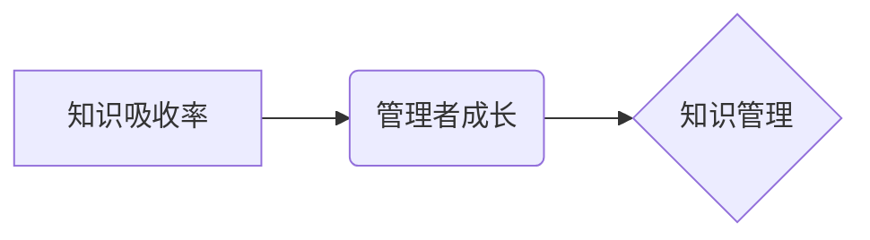

> 知识吸收率、管理者成长、学习策略、高效学习、知识管理

## 1. 背景介绍

在当今瞬息万变的科技时代，知识更新的速度前所未有。对于管理者而言，持续学习和提升知识吸收率已成为保持竞争力的关键。然而，面对海量信息和碎片化知识，许多管理者感到学习效率低下，难以有效地吸收和应用新知识。

传统的学习方法往往注重知识的被动接收，缺乏主动思考和实践应用。这导致管理者在学习过程中容易出现“知识断层”现象，即无法将学习到的知识与实际工作相结合，难以转化为实际的行动力和决策力。

## 2. 核心概念与联系

**2.1 知识吸收率**

知识吸收率是指个体在特定时间内从外部信息中获取和理解新知识的能力。它是一个综合性的指标，包括认知能力、学习策略、环境因素等多方面的影响。

**2.2 管理者成长**

管理者成长是指管理者在工作实践中不断学习、提升自身能力和素质的过程。它是一个持续性的过程，需要管理者不断学习新知识、掌握新技能、拓展新视野。

**2.3 知识管理**

知识管理是指组织内部知识的创建、共享、应用和维护的过程。它旨在通过建立有效的知识体系和流程，帮助组织成员更好地获取、利用和创造知识。

**2.4 核心概念关系图**



## 3. 核心算法原理 & 具体操作步骤

**3.1 算法原理概述**

提升知识吸收率的核心在于构建高效的学习策略和知识管理体系。

**3.2 算法步骤详解**

1. **明确学习目标:** 

   管理者需要明确自身学习的目标，并将其与工作需求和职业发展规划相结合。

2. **选择合适的学习资源:** 

   根据学习目标，选择高质量的学习资源，例如书籍、课程、研讨会等。

3. **制定学习计划:** 

   制定合理的学习计划，并将其融入日常工作中。

4. **采用主动学习策略:** 

   积极参与学习过程，例如提问、讨论、实践应用等。

5. **建立知识体系:** 

   将学习到的知识进行整理和归纳，构建自己的知识体系。

6. **定期回顾和复习:** 

   定期回顾和复习已学知识，巩固记忆和提升理解。

7. **分享和交流:** 

   与他人分享和交流学习成果，促进知识的传播和应用。

**3.3 算法优缺点**

* **优点:** 

   能够有效提升知识吸收率，促进管理者成长。

* **缺点:** 

   需要管理者付出一定的学习成本和时间精力。

**3.4 算法应用领域**

该算法适用于所有需要持续学习和提升的管理者，例如企业领导者、项目经理、技术专家等。

## 4. 数学模型和公式 & 详细讲解 & 举例说明

**4.1 数学模型构建**

知识吸收率可以被建模为一个函数，其中输入变量包括学习时间、学习资源质量、学习策略等，输出变量为知识吸收量。

**4.2 公式推导过程**

由于知识吸收是一个复杂的过程，难以用简单的公式精确描述。但我们可以通过一些统计模型，例如回归分析，来量化知识吸收率与相关因素之间的关系。

**4.3 案例分析与讲解**

假设我们对某一组管理者进行学习效果评估，发现学习时间与知识吸收量呈正相关，学习资源质量与知识吸收量也呈正相关。

## 5. 项目实践：代码实例和详细解释说明

**5.1 开发环境搭建**

可以使用 Python 语言和相关库，例如 Pandas、Scikit-learn 等，来实现知识吸收率的评估和分析。

**5.2 源代码详细实现**

```python
import pandas as pd
from sklearn.linear_model import LinearRegression

# 加载数据
data = pd.read_csv("learning_data.csv")

# 构建模型
model = LinearRegression()
model.fit(data[["学习时间", "资源质量"]], data["知识吸收量"])

# 预测
new_data = pd.DataFrame({"学习时间": [5, 10], "资源质量": [4, 5]})
predictions = model.predict(new_data)

# 打印预测结果
print(predictions)
```

**5.3 代码解读与分析**

该代码首先加载学习数据，然后使用线性回归模型构建知识吸收率预测模型。最后，使用模型预测新的学习时间和资源质量下的知识吸收量。

**5.4 运行结果展示**

运行结果将显示预测的知识吸收量，可以根据预测结果进行决策和调整学习策略。

## 6. 实际应用场景

**6.1 企业培训**

企业可以利用知识吸收率评估模型，对员工培训效果进行评估，并根据评估结果调整培训内容和方式。

**6.2 个人学习计划**

个人可以利用该模型，制定个性化的学习计划，并根据学习进度和效果进行调整。

**6.3 教育机构**

教育机构可以利用该模型，优化教学方法和课程设计，提高学生的学习效率。

**6.4 未来应用展望**

随着人工智能技术的不断发展，知识吸收率评估模型将更加智能化和个性化，能够更好地帮助管理者和个人提升学习效率。

## 7. 工具和资源推荐

**7.1 学习资源推荐**

* **书籍:** 《高效能人士的七个习惯》、《刻意练习》
* **课程:** Coursera、edX、Udemy 等在线学习平台
* **研讨会:** TED、行业峰会等

**7.2 开发工具推荐**

* **Python:** 数据分析和机器学习
* **Pandas:** 数据处理和分析
* **Scikit-learn:** 机器学习算法

**7.3 相关论文推荐**

* **"The Science of Learning"** by Robert Bjork
* **"Make It Stick: The Science of Successful Learning"** by Peter C. Brown, Henry L. Roediger III, and Mark A. McDaniel

## 8. 总结：未来发展趋势与挑战

**8.1 研究成果总结**

本文探讨了提升知识吸收率的策略和方法，并介绍了相关的数学模型和代码实现。

**8.2 未来发展趋势**

未来，知识吸收率评估模型将更加智能化和个性化，能够根据个人的学习风格和需求提供定制化的学习建议。

**8.3 面临的挑战**

* **数据获取和质量:** 构建准确的知识吸收率评估模型需要大量高质量的数据。
* **模型复杂度:** 知识吸收是一个复杂的过程，难以用简单的模型完全描述。
* **伦理问题:** 知识吸收率评估模型的应用需要考虑伦理问题，例如数据隐私和算法偏见。

**8.4 研究展望**

未来研究将继续探索更有效的知识吸收率评估方法，并将其应用于更广泛的领域。

## 9. 附录：常见问题与解答

**9.1 如何提高知识吸收率？**

* 明确学习目标
* 选择合适的学习资源
* 制定学习计划
* 采用主动学习策略
* 建立知识体系
* 定期回顾和复习
* 分享和交流

**9.2 知识吸收率评估模型的局限性是什么？**

* 数据获取和质量
* 模型复杂度
* 伦理问题

**9.3 未来知识吸收率评估模型的发展趋势是什么？**

* 智能化和个性化


作者：禅与计算机程序设计艺术 / Zen and the Art of Computer Programming 
<end_of_turn>