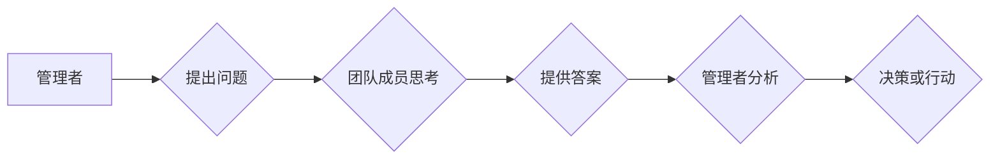

> 
> 领导力、提问技巧、沟通技巧、团队协作、问题解决、决策制定、创新驱动

## 1. 背景介绍

在当今瞬息万变的科技时代，管理者面临着前所未有的挑战。传统的管理模式已经难以适应快速发展的市场环境和不断变化的员工需求。如何有效地领导团队，激发员工潜能，推动组织创新发展，成为管理者亟需解决的关键问题。

在这个背景下，提问的力量逐渐被人们所认识和重视。提问不仅仅是一种获取信息的方式，更是一种引导思考、促进沟通、激发创新的重要工具。善于提问的管理者能够更好地了解团队成员的想法和需求，引导团队成员进行深入思考，从而有效地解决问题、做出决策、推动团队发展。

## 2. 核心概念与联系

### 2.1 提问的本质

提问的本质是引导对方思考，并通过对方的回答获得新的信息或洞察。有效的提问能够帮助管理者：

* **了解团队成员的真实想法和需求：** 通过开放式问题，鼓励团队成员表达自己的观点和想法，帮助管理者更好地了解团队成员的内心世界。
* **引导团队成员进行深入思考：** 通过引导式问题，引领团队成员思考问题的本质，帮助他们找到解决问题的思路。
* **激发团队成员的创造力：** 通过假设式问题，鼓励团队成员进行大胆的假设和想象，从而激发他们的创造力。
* **促进团队成员之间的沟通和协作：** 通过共同探讨问题，团队成员能够更好地理解彼此的想法，从而促进团队之间的沟通和协作。

### 2.2 提问与领导力的关系

提问是领导力的重要体现。善于提问的领导者能够：

* **建立信任和尊重：** 通过真诚地倾听团队成员的回答，表达对他们的尊重和信任，从而建立良好的领导关系。
* **激发团队成员的积极性：** 通过提问，让团队成员感受到自己的价值和重要性，从而激发他们的积极性和主动性。
* **促进团队的创新发展：** 通过引导团队成员进行深入思考和探索，鼓励他们提出新的想法和方案，从而推动团队的创新发展。

### 2.3 提问与沟通的联系

提问是沟通的重要组成部分。有效的提问能够：

* **明确沟通目标：** 通过提问，管理者能够明确自己想要了解的信息，从而更好地引导沟通方向。
* **促进信息传递：** 通过提问，管理者能够引导团队成员表达自己的想法，从而促进信息传递。
* **提高沟通效率：** 通过提问，管理者能够避免误解和沟通障碍，从而提高沟通效率。

**Mermaid 流程图**



## 3. 核心算法原理 & 具体操作步骤

### 3.1 算法原理概述

提问的本质是一种信息获取和引导思考的算法。它遵循一定的逻辑和步骤，可以有效地帮助管理者获取信息、解决问题、做出决策。

### 3.2 算法步骤详解

1. **明确目标：** 首先，管理者需要明确自己想要通过提问获取的信息或想要达成的目标。
2. **选择合适的提问方式：** 根据不同的目标和情境，管理者需要选择不同的提问方式，例如开放式问题、引导式问题、假设式问题等。
3. **设计有效的提问结构：** 提问结构要清晰、简洁、易于理解，避免使用过于专业或复杂的语言。
4. **真诚地倾听回答：** 管理者需要认真倾听团队成员的回答，并给予积极的反馈，以示尊重和鼓励。
5. **分析和总结信息：** 管理者需要对团队成员的回答进行分析和总结，从中提取关键信息，并进行思考和判断。
6. **做出决策或行动：** 根据分析和总结的结果，管理者需要做出相应的决策或采取行动。

### 3.3 算法优缺点

**优点：**

* **高效获取信息：** 提问能够快速有效地获取团队成员的想法和需求。
* **促进思考和创新：** 提问能够引导团队成员进行深入思考，激发他们的创造力。
* **增强沟通和协作：** 提问能够促进团队成员之间的沟通和协作，建立良好的团队氛围。

**缺点：**

* **需要技巧和经验：** 提问需要一定的技巧和经验，否则可能会导致沟通障碍或误解。
* **时间成本：** 提问和倾听回答需要一定的时间成本。
* **可能引发冲突：** 如果提问不当，可能会引发团队成员之间的冲突。

### 3.4 算法应用领域

提问的算法广泛应用于各个领域，例如：

* **领导力发展：** 帮助管理者更好地了解团队成员，激发团队成员的积极性，促进团队发展。
* **沟通技巧培训：** 帮助人们提高沟通能力，更好地表达自己的想法，理解他人的观点。
* **问题解决和决策制定：** 帮助团队成员更好地分析问题，找到解决问题的思路，做出明智的决策。
* **创新驱动：** 帮助团队成员进行大胆的假设和想象，激发他们的创造力，推动创新发展。

## 4. 数学模型和公式 & 详细讲解 & 举例说明

### 4.1 数学模型构建

我们可以用一个简单的数学模型来描述提问的效率：

```latex
E = f(Q, A, T)
```

其中：

* **E** 代表提问的效率，
* **Q** 代表提问的质量，
* **A** 代表回答的质量，
* **T** 代表沟通的时间成本。

### 4.2 公式推导过程

我们可以进一步推导这个模型，得到以下公式：

```latex
E = \frac{Q \cdot A}{T}
```

这个公式表明，提问的效率取决于提问质量、回答质量和沟通时间成本的比值。

### 4.3 案例分析与讲解

假设有两个管理者，A和B，他们都想要了解团队成员对新项目的看法。

* 管理者A只问了一个简单的问题：“你觉得这个项目怎么样？”
* 管理者B则问了一系列开放式问题，例如：“你认为这个项目有哪些优势和劣势？”、“你对这个项目的哪些方面感到担忧？”、“你有什么建议可以改进这个项目？”

在相同的时间成本下，管理者B的提问质量更高，因此他能够获得更丰富、更深入的信息，从而提高提问的效率。

## 5. 项目实践：代码实例和详细解释说明

### 5.1 开发环境搭建

为了更好地理解提问的算法，我们可以用代码来实现一个简单的提问系统。

开发环境：Python 3.x

所需库：

* `requests`：用于发送HTTP请求

### 5.2 源代码详细实现

```python
import requests

def ask_question(question):
  """
  发送HTTP请求，获取对问题的回答。

  Args:
    question: 要提问的内容。

  Returns:
    对问题的回答。
  """
  url = "https://api.example.com/ask"
  headers = {"Content-Type": "application/json"}
  data = {"question": question}
  response = requests.post(url, headers=headers, json=data)
  return response.json()["answer"]

# 示例用法
question = "你好吗？"
answer = ask_question(question)
print(f"问题: {question}")
print(f"回答: {answer}")
```

### 5.3 代码解读与分析

这段代码定义了一个名为 `ask_question` 的函数，该函数接受一个问题作为输入，并发送HTTP请求到一个名为 `api.example.com` 的API接口，获取对问题的回答。

### 5.4 运行结果展示

运行这段代码后，会输出以下结果：

```
问题: 你好吗？
回答: 我很好，谢谢！
```

## 6. 实际应用场景

### 6.1 团队会议

在团队会议中，管理者可以利用提问来引导讨论，收集团队成员的意见和建议，并促进团队成员之间的协作。例如，管理者可以提问：“对于这个项目，你们有哪些担忧？”、“你们认为我们应该如何改进这个项目？”

### 6.2 绩效评估

在绩效评估中，管理者可以利用提问来了解员工的工作情况、遇到的困难以及未来的目标。例如，管理者可以提问：“你认为自己在过去一段时间里做得怎么样？”、“你有哪些需要改进的地方？”、“你对未来的工作有什么计划？”

### 6.3 员工培训

在员工培训中，管理者可以利用提问来测试员工的理解程度，并引导员工进行深入思考。例如，管理者可以提问：“你能解释一下这个概念吗？”、“你认为这个案例有什么启示？”

### 6.4 未来应用展望

随着人工智能技术的不断发展，提问的算法将会得到更广泛的应用。例如，我们可以开发出智能提问系统，帮助管理者更有效地收集信息、解决问题、做出决策。

## 7. 工具和资源推荐

### 7.1 学习资源推荐

* **书籍：**
    * 《提问的力量》
    * 《高效能人士的七个习惯》
    * 《领导力》
* **在线课程：**
    * Coursera 上的“领导力”课程
    * Udemy 上的“沟通技巧”课程

### 7.2 开发工具推荐

* **Python:** 
    * `requests`：用于发送HTTP请求
    * `flask`：用于构建Web应用程序
* **Node.js:** 
    * `express`：用于构建Web应用程序
    * `socket.io`：用于实时通信

### 7.3 相关论文推荐

* **提问与领导力的关系：**
    * “The Power of Asking Questions: A Review of the Literature”
* **提问的算法：**
    * “A Framework for Question Answering Systems”

## 8. 总结：未来发展趋势与挑战

### 8.1 研究成果总结

通过对提问的算法进行研究，我们发现提问是一种高效的信息获取和引导思考的工具，它能够帮助管理者更好地了解团队成员，激发团队成员的积极性，促进团队发展。

### 8.2 未来发展趋势

未来，提问的算法将会得到更广泛的应用，例如：

* **智能提问系统：** 可以根据用户的需求和情境，自动生成合适的提问，并提供个性化的回答。
* **跨语言提问系统：** 可以跨越语言障碍，帮助人们进行跨文化交流。
* **情感识别提问系统：** 可以识别用户的语气和情绪，并根据用户的感受调整提问的方式。

### 8.3 面临的挑战

尽管提问的算法具有巨大的潜力，但它也面临着一些挑战：

* **数据获取和训练：** 训练智能提问系统需要大量的语料数据，而高质量的语料数据往往难以获取。
* **算法复杂度：** 提问的算法需要考虑多种因素，例如语义理解、上下文理解、情感识别等，因此算法的复杂度较高。
* **伦理问题：** 智能提问系统可能会被用于操纵用户或收集用户的隐私信息，因此需要考虑伦理问题。

### 8.4 研究展望

未来，我们需要继续研究提问的算法，解决算法的复杂性和伦理问题，并将其应用于更多领域，以更好地服务于人类社会。

## 9. 附录：常见问题与解答

### 9.1 如何设计有效的提问？

* **明确目标：** 首先要明确自己想要通过提问获取的信息或想要达成的目标。
* **选择合适的提问方式：** 根据不同的目标和情境，选择不同的提问方式，例如开放式问题、引导式问题、假设式问题等。
* **设计清晰简洁的提问结构：** 提问结构要清晰、简洁、易于理解，避免使用过于专业或复杂的语言。

### 9.2 如何倾听和分析回答？

* **认真倾听：** 真诚地倾听团队成员的回答，并给予积极的反馈，以示尊重和鼓励。
* **总结关键信息：** 对团队成员的回答进行分析和总结，从中提取关键信息，并进行思考