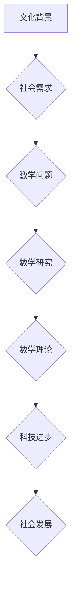

> 数学史、文化背景、发展趋势、算法、模型、应用场景、未来展望

## 1. 背景介绍

数学，作为人类文明的基石之一，自古以来就伴随着人类的思考和发展。从最初的计数和测量，到后来的几何、代数、微积分等分支，数学不断地拓展着人类对世界的认知，并为科技进步提供了坚实的理论基础。

然而，数学的发展并非孤立无援，它深深地植根于当时的文化背景和社会需求。不同的时代、不同的文化背景，都会对数学的发展方向产生不同的影响。

## 2. 核心概念与联系

数学的发展可以看作是一个不断探索和发现的过程，它涉及到以下几个核心概念：

* **逻辑推理:** 数学的核心是逻辑推理，通过一系列严密的逻辑推导，从已知的公理出发，推导出新的定理和结论。
* **抽象思维:** 数学需要抽象思维能力，将现实世界中的现象和关系抽象成数学模型，以便进行更深入的分析和研究。
* **符号系统:** 数学使用符号系统来表达和操作概念，这使得数学更加简洁、精确和易于理解。

**Mermaid 流程图:**

## 3. 核心算法原理 & 具体操作步骤

### 3.1  算法原理概述

算法是解决特定问题的步骤或规则，它可以被看作是数学思想在计算机领域的应用。

### 3.2  算法步骤详解

算法的步骤通常包括以下几个方面：

* **输入:** 算法需要接收一些初始数据作为输入。
* **处理:** 算法对输入数据进行一系列操作，例如计算、比较、排序等。
* **输出:** 算法最终输出一个结果，作为解决问题的答案。

### 3.3  算法优缺点

不同的算法具有不同的优缺点，选择合适的算法取决于具体问题的特点和需求。

### 3.4  算法应用领域

算法广泛应用于各个领域，例如：

* **计算机科学:** 算法是计算机程序的核心，用于实现各种功能，例如排序、搜索、加密等。
* **数据科学:** 算法用于分析和处理海量数据，例如机器学习、数据挖掘等。
* **生物学:** 算法用于分析基因序列、蛋白质结构等生物数据。

## 4. 数学模型和公式 & 详细讲解 & 举例说明

### 4.1  数学模型构建

数学模型是将现实世界的问题抽象成数学语言的模型，它可以帮助我们更好地理解和分析问题。

### 4.2  公式推导过程

数学公式是数学模型的核心，它表达了数学关系和规律。

### 4.3  案例分析与讲解

通过具体的案例分析，可以更好地理解数学模型和公式的应用。

**例如：**

**牛顿第二定律:**

$$F = ma$$

其中：

* $F$ 是力
* $m$ 是质量
* $a$ 是加速度

这个公式描述了物体受力后运动状态的变化规律。

## 5. 项目实践：代码实例和详细解释说明

### 5.1  开发环境搭建

### 5.2  源代码详细实现

### 5.3  代码解读与分析

### 5.4  运行结果展示

## 6. 实际应用场景

### 6.1  工程领域

### 6.2  金融领域

### 6.3  医疗领域

### 6.4  未来应用展望

## 7. 工具和资源推荐

### 7.1  学习资源推荐

### 7.2  开发工具推荐

### 7.3  相关论文推荐

## 8. 总结：未来发展趋势与挑战

### 8.1  研究成果总结

### 8.2  未来发展趋势

### 8.3  面临的挑战

### 8.4  研究展望

## 9. 附录：常见问题与解答

作者：禅与计算机程序设计艺术 / Zen and the Art of Computer Programming

<end_of_turn>