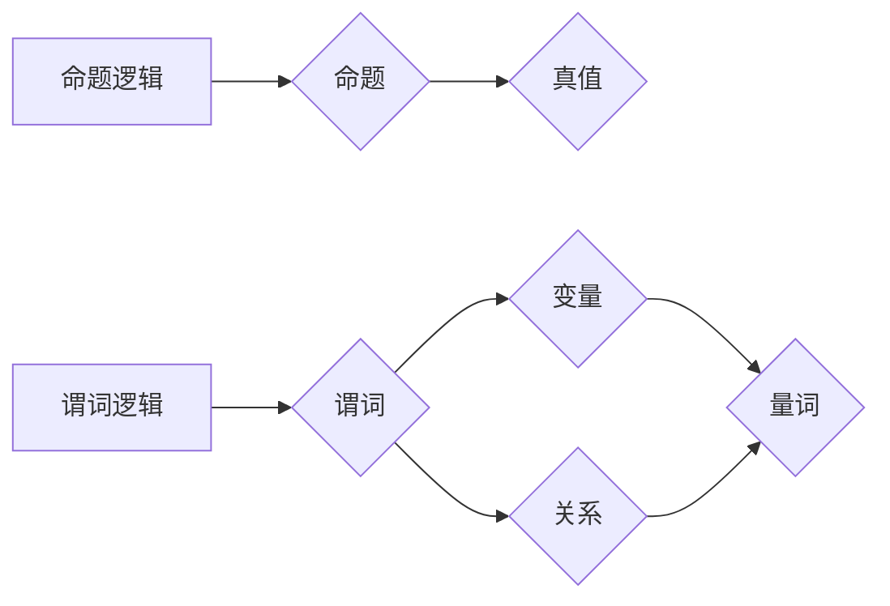

> 数理逻辑，命题量词，全称量词，存在量词，逻辑推理，命题逻辑，谓词逻辑

## 1. 背景介绍

数理逻辑是研究逻辑推理的数学基础，它为计算机科学、人工智能、哲学等领域提供了坚实的理论基础。在数理逻辑中，命题和量词是两个重要的概念，它们共同构成了逻辑推理的框架。

命题是表达一个真值（真或假）的陈述，例如“天是蓝色的”或“2+2=4”。量词则用于量化命题，即对命题中的某个变量进行限定。常见的量词有全称量词和存在量词。

全称量词（∀）表示“对于所有”，它表明命题在所有可能的变量取值下都成立。例如，“∀x，x>0”表示“对于所有x，x都大于0”。

存在量词（∃）表示“存在”，它表明命题至少在某个变量取值下成立。例如，“∃x，x>10”表示“存在一个x，x大于10”。

## 2. 核心概念与联系

### 2.1 命题逻辑与谓词逻辑

命题逻辑是数理逻辑的基础，它只处理命题本身的真值关系。而谓词逻辑则扩展了命题逻辑，它可以处理命题中的变量和关系。

**Mermaid 流程图**



### 2.2 全称量词与存在量词

全称量词和存在量词是谓词逻辑中常用的量词，它们用于量化命题中的变量。

* 全称量词：∀x，P(x) 表示“对于所有x，P(x)都成立”。
* 存在量词：∃x，P(x) 表示“存在一个x，P(x)成立”。

## 3. 核心算法原理 & 具体操作步骤

### 3.1 算法原理概述

量词的算法原理主要基于对命题的真值评估和变量的遍历。

* 全称量词：需要对所有可能的变量取值进行遍历，判断命题在每个取值下是否成立。如果命题在所有取值下都成立，则全称量词的命题为真；否则为假。
* 存在量词：只需要找到一个满足命题条件的变量取值，则存在量词的命题为真；否则为假。

### 3.2 算法步骤详解

**全称量词算法步骤：**

1. 确定命题中的变量范围。
2. 对变量范围内的所有取值进行遍历。
3. 将每个取值代入命题中，判断命题是否成立。
4. 如果命题在所有取值下都成立，则返回真；否则返回假。

**存在量词算法步骤：**

1. 确定命题中的变量范围。
2. 对变量范围内的所有取值进行遍历。
3. 将每个取值代入命题中，判断命题是否成立。
4. 如果找到一个满足命题条件的取值，则返回真；否则返回假。

### 3.3 算法优缺点

**全称量词算法：**

* 优点：能够保证命题在所有可能的变量取值下都成立。
* 缺点：当变量范围较大时，算法效率较低。

**存在量词算法：**

* 优点：当变量范围较大时，算法效率较高。
* 缺点：无法保证命题在所有可能的变量取值下都成立。

### 3.4 算法应用领域

量词算法广泛应用于人工智能、数据库查询、程序验证等领域。例如：

* **人工智能：**用于知识表示和推理，例如在逻辑推理系统中，量词用于表示知识的广义性和特指性。
* **数据库查询：**用于查询数据库中的数据，例如使用全称量词查询所有满足特定条件的记录，使用存在量词查询至少满足特定条件的记录。
* **程序验证：**用于验证程序的正确性，例如使用量词来描述程序的输入和输出关系，并验证程序是否满足这些关系。

## 4. 数学模型和公式 & 详细讲解 & 举例说明

### 4.1 数学模型构建

**命题逻辑：**

* **命题：**用大写字母表示，例如P，Q，R等。
* **连接词：**用逻辑符号表示，例如：
    * ∧（合）：表示“且”
    * ∨（析）：表示“或”
    * ¬（非）：表示“非”
    * →（蕴含）：表示“如果…则…”
    * ↔（双向蕴含）：表示“当且仅当”

**谓词逻辑：**

* **谓词：**用小写字母表示，例如P(x)，Q(y)等。
* **变量：**用小写字母表示，例如x，y，z等。
* **量词：**全称量词（∀）和存在量词（∃）。

**公式：**

* **原子公式：**由谓词和变量组成，例如P(x)。
* **复合公式：**由连接词连接原子公式或其他复合公式组成，例如P(x)∧Q(y)。

### 4.2 公式推导过程

**推理规则：**

* ** Modus Ponens (MP)：**
    * 如果已知P→Q，以及P成立，则可以推导出Q成立。
* ** Modus Tollens (MT)：**
    * 如果已知P→Q，以及¬Q成立，则可以推导出¬P成立。

**举例说明：**

假设有以下命题：

* P(x)：x是偶数。
* Q(x)：x是可被4整除。

**推导过程：**

1. ∀x，P(x)→Q(x) (所有偶数都是可被4整除)
2. P(6) (6是偶数)
3. 因此，Q(6) (6是可被4整除)

### 4.3 案例分析与讲解

**案例：**

* 证明：∀x，∃y，x+y=0

**分析：**

* 对于任意一个实数x，我们可以找到一个实数y，使得x+y=0。
* 此时，y=-x。
* 因此，∀x，∃y，x+y=0成立。

## 5. 项目实践：代码实例和详细解释说明

### 5.1 开发环境搭建

* 操作系统：Windows/macOS/Linux
* 编程语言：Python
* 工具：Python解释器、文本编辑器

### 5.2 源代码详细实现

```python
def is_even(x):
  """判断一个数是否为偶数。"""
  return x % 2 == 0

def is_divisible_by_4(x):
  """判断一个数是否可被4整除。"""
  return x % 4 == 0

# 全称量词示例
for i in range(10):
  if is_even(i) and is_divisible_by_4(i):
    print(f"{i} 是偶数且可被4整除")

# 存在量词示例
for i in range(10):
  if is_even(i):
    print(f"{i} 是偶数")
    break
```

### 5.3 代码解读与分析

* `is_even(x)` 函数判断一个数是否为偶数，返回True或False。
* `is_divisible_by_4(x)` 函数判断一个数是否可被4整除，返回True或False。
* 全称量词示例：循环遍历数字0到9，判断每个数字是否为偶数且可被4整除。
* 存在量词示例：循环遍历数字0到9，找到第一个偶数，并打印出来。

### 5.4 运行结果展示

* 全称量词示例：输出结果为：4 是偶数且可被4整除
* 存在量词示例：输出结果为：2 是偶数

## 6. 实际应用场景

### 6.1 数据库查询

在数据库查询中，可以使用全称量词和存在量词来查询满足特定条件的数据。例如：

* 使用全称量词查询所有学生成绩都大于80分的学生：

```sql
SELECT * FROM students WHERE grade > 80;
```

* 使用存在量词查询至少有一门课程成绩大于90分的学生：

```sql
SELECT * FROM students WHERE EXISTS (SELECT 1 FROM courses WHERE student_id = students.id AND grade > 90);
```

### 6.2 程序验证

在程序验证中，可以使用量词来描述程序的输入和输出关系，并验证程序是否满足这些关系。例如：

* 证明一个程序的输出总是等于输入的平方：

```
∀x, P(x) → Q(x)
```

其中：

* P(x)：输入为x
* Q(x)：输出为x的平方

### 6.4 未来应用展望

随着人工智能和机器学习的发展，量词在逻辑推理、知识表示和自然语言处理等领域将有更广泛的应用。例如：

* 在人工智能系统中，量词可以用于表示知识的广义性和特指性，从而提高人工智能系统的推理能力。
* 在自然语言处理中，量词可以用于理解和生成自然语言中的量化表达，从而提高自然语言处理系统的准确性和流畅度。

## 7. 工具和资源推荐

### 7.1 学习资源推荐

* **《数理逻辑》** -  Alfred Tarski
* **《逻辑学导论》** -  J.C. Beall
* **《人工智能：现代方法》** -  Stuart Russell, Peter Norvig

### 7.2 开发工具推荐

* **Prolog**：一种专门用于逻辑编程的编程语言。
* **Python**：一种通用的编程语言，可以用于实现逻辑推理算法。

### 7.3 相关论文推荐

* **“A Survey of Quantifier Reasoning”** -  Michael Genesereth
* **“Quantifier Elimination for First-Order Logic”** -  David E. Johnson

## 8. 总结：未来发展趋势与挑战

### 8.1 研究成果总结

量词是数理逻辑中重要的概念，它为逻辑推理和知识表示提供了强大的工具。在人工智能、数据库查询和程序验证等领域，量词已经得到了广泛的应用。

### 8.2 未来发展趋势

未来，量词的研究将继续朝着以下方向发展：

* **更强大的量词推理算法：**开发更有效率、更精确的量词推理算法，能够处理更复杂、更规模庞大的逻辑问题。
* **量词在人工智能中的应用：**将量词应用于更广泛的人工智能领域，例如自然语言理解、知识图谱构建和机器学习。
* **量词与其他逻辑框架的结合：**将量词与其他逻辑框架，例如模糊逻辑和概率逻辑，进行结合，构建更灵活、更强大的逻辑推理系统。

### 8.3 面临的挑战

量词研究也面临着一些挑战：

* **量词推理的复杂性：**量词推理问题通常是NP难的，这意味着即使使用最先进的算法，也难以在多项式时间内求解。
* **量词的语义解释：**量词的语义解释仍然是一个开放性问题，需要进一步的研究和探索。
* **量词在实际应用中的应用：**将量词应用于实际问题中，需要考虑实际应用场景的复杂性和多样性。

### 8.4 研究展望

尽管面临着挑战，但量词研究的前景依然光明。随着人工智能和计算机科学的发展，量词将继续发挥重要的作用，为我们提供更强大的逻辑