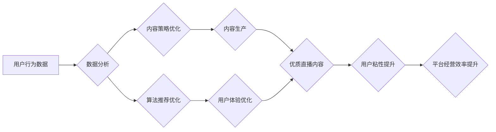

> 直播、经营形态、效率、数据分析、用户行为、算法推荐、互动体验、内容生产

## 1. 背景介绍

直播作为一种新型的互联网内容传播方式，近年来发展迅速，已成为社交、娱乐、电商等多个领域的热门应用。其实时互动、沉浸式体验等特点，为用户提供了全新的内容消费方式，也为企业带来了新的营销和运营机会。然而，直播平台的经营模式也面临着诸多挑战，如何提高直播的经营效率，是平台和创作者共同关注的问题。

直播平台的经营效率，主要体现在以下几个方面：

* **用户粘性：** 提高用户在平台上的停留时间和复购率。
* **内容质量：** 确保直播内容的丰富性和吸引力，满足用户多样化的需求。
* **商业化收益：** 通过广告、电商、会员等方式，实现平台的盈利目标。
* **运营成本：** 控制平台运营的成本支出，提高资源利用效率。

## 2. 核心概念与联系

直播平台的经营效率是一个复杂的系统工程，涉及到用户行为、内容生产、算法推荐、互动体验等多个环节。

**2.1 直播平台经营形态**

直播平台的经营形态主要分为以下几种：

* **内容平台：** 以提供优质直播内容为核心，例如斗鱼、虎牙等游戏直播平台，B站等综合内容平台。
* **电商平台：** 以直播带货为核心，例如淘宝直播、抖音电商等。
* **社交平台：** 以直播社交为核心，例如微信视频号、快手等。

**2.2 直播平台经营效率的要素**

直播平台的经营效率受以下因素影响：

* **用户行为：** 用户的观看时长、互动频率、付费意愿等行为数据，是平台运营的重要参考指标。
* **内容质量：** 直播内容的丰富性、专业性、娱乐性等，直接影响用户粘性和复购率。
* **算法推荐：** 精准的算法推荐，可以帮助用户发现感兴趣的内容，提高用户体验。
* **互动体验：** 直播间的互动功能，例如弹幕、点赞、礼物等，可以增强用户参与感和粘性。

**2.3 直播平台经营效率的优化**

直播平台可以通过以下方式优化经营效率：

* **数据分析：** 利用大数据分析技术，洞察用户行为，优化内容策略和算法推荐。
* **内容生产：** 鼓励优质内容创作者，提升内容质量和多样性。
* **互动体验：** 完善直播间的互动功能，增强用户参与感和粘性。
* **商业化模式：** 探索新的商业化模式，例如会员订阅、品牌合作等。

**2.4 Mermaid 流程图**



## 3. 核心算法原理 & 具体操作步骤

### 3.1 算法原理概述

直播平台的经营效率优化，离不开算法的支撑。其中，推荐算法、用户画像算法、内容分类算法等，都是关键算法。

**3.1.1 推荐算法**

推荐算法旨在根据用户的历史行为、偏好等信息，推荐用户可能感兴趣的内容。常见的推荐算法包括：

* **基于内容的推荐算法：** 根据内容的主题、标签等特征，推荐与用户历史观看内容相似的直播。
* **基于用户的推荐算法：** 根据用户的观看历史、点赞、评论等行为，推荐与其他用户具有相似行为的用户观看过的直播。
* **协同过滤推荐算法：** 通过分析用户之间的行为相似性，推荐用户可能感兴趣的直播。
* **深度学习推荐算法：** 利用深度学习模型，从海量用户行为数据中学习用户偏好，进行更精准的推荐。

**3.1.2 用户画像算法**

用户画像算法旨在构建用户的行为、兴趣、偏好等方面的画像，以便更好地理解用户需求，提供个性化服务。

**3.1.3 内容分类算法**

内容分类算法旨在对直播内容进行分类，例如游戏直播、音乐直播、美食直播等，以便用户更方便地搜索和浏览感兴趣的内容。

### 3.2 算法步骤详解

**3.2.1 推荐算法步骤**

1. **数据收集：** 收集用户观看历史、点赞、评论等行为数据，以及直播内容的主题、标签等特征数据。
2. **数据预处理：** 对数据进行清洗、转换、编码等预处理操作，以便算法模型的训练和使用。
3. **模型训练：** 选择合适的推荐算法模型，利用训练数据进行模型训练，学习用户偏好和内容特征之间的关系。
4. **模型评估：** 利用测试数据评估模型的性能，例如准确率、召回率等指标。
5. **模型部署：** 将训练好的模型部署到线上环境，实时进行推荐。

**3.2.2 用户画像算法步骤**

1. **数据收集：** 收集用户的基本信息、行为数据、兴趣数据等。
2. **特征提取：** 从数据中提取用户的特征，例如年龄、性别、职业、观看时长、点赞频率等。
3. **聚类分析：** 利用聚类算法将用户划分为不同的用户群体，例如游戏爱好者、音乐爱好者等。
4. **用户画像构建：** 为每个用户群体构建相应的画像，描述其特征、行为、偏好等。

**3.2.3 内容分类算法步骤**

1. **数据收集：** 收集直播内容的文本描述、视频片段等数据。
2. **特征提取：** 从数据中提取内容的特征，例如关键词、主题、标签等。
3. **模型训练：** 选择合适的分类算法模型，利用训练数据进行模型训练，学习内容特征和类别之间的关系。
4. **模型评估：** 利用测试数据评估模型的性能，例如准确率、召回率等指标。
5. **模型部署：** 将训练好的模型部署到线上环境，实时对直播内容进行分类。

### 3.3 算法优缺点

**3.3.1 推荐算法**

* **优点：** 可以根据用户兴趣推荐个性化内容，提高用户粘性和复购率。
* **缺点：** 需要大量的用户行为数据进行训练，容易陷入“冷启动”问题，难以推荐新用户或新内容。

**3.3.2 用户画像算法**

* **优点：** 可以深入了解用户的需求和偏好，为用户提供更精准的服务。
* **缺点：** 需要收集和分析大量的用户数据，存在隐私安全问题。

**3.3.3 内容分类算法**

* **优点：** 可以帮助用户更方便地搜索和浏览感兴趣的内容，提高内容发现效率。
* **缺点：** 内容分类的准确性依赖于特征提取和模型训练的质量，存在分类误差的风险。

### 3.4 算法应用领域

推荐算法、用户画像算法、内容分类算法等，广泛应用于直播平台、电商平台、社交平台等多个领域。

## 4. 数学模型和公式 & 详细讲解 & 举例说明

### 4.1 数学模型构建

**4.1.1 推荐算法数学模型**

推荐算法的数学模型通常基于用户-物品交互矩阵，例如协同过滤算法的评分预测模型。

**用户-物品交互矩阵**

```
| 用户 | 物品1 | 物品2 | 物品3 |
|---|---|---|---|
| 用户1 | 5 | 3 | 4 |
| 用户2 | 4 | 5 | 2 |
| 用户3 | 3 | 4 | 5 |
```

其中，每个用户对每个物品的评分都存储在矩阵中。

**协同过滤算法的评分预测模型**

$$
\hat{r}_{u,i} = \bar{r}_u + \frac{\sum_{v \in N(u)} (r_{v,i} - \bar{r}_v) \cdot sim(u,v)}{\sum_{v \in N(u)} sim(u,v)}
$$

其中：

* $\hat{r}_{u,i}$：预测用户 $u$ 对物品 $i$ 的评分
* $\bar{r}_u$：用户 $u$ 的平均评分
* $r_{v,i}$：用户 $v$ 对物品 $i$ 的评分
* $sim(u,v)$：用户 $u$ 和用户 $v$ 之间的相似度

**4.1.2 用户画像算法数学模型**

用户画像算法的数学模型通常基于聚类算法，例如K-means聚类算法。

**K-means聚类算法**

1. 随机选择K个数据点作为初始聚类中心。
2. 将每个数据点分配到距离其最近的聚类中心所属的类别。
3. 计算每个聚类中心的新的位置，作为新的聚类中心。
4. 重复步骤2和步骤3，直到聚类中心不再变化。

### 4.2 公式推导过程

**4.2.1 协同过滤算法评分预测模型推导**

协同过滤算法的评分预测模型基于以下假设：

* 用户对相似物品的评分相似。
* 用户与用户之间存在相似性。

根据这些假设，我们可以通过计算用户之间的相似度，以及用户对相似物品的评分，来预测用户对特定物品的评分。

**4.2.2 K-means聚类算法推导**

K-means聚类算法的目标是将数据点划分为K个簇，使得每个簇内的数据点尽可能相似，而不同簇之间的数据点尽可能不同。

K-means算法的迭代过程可以看作是不断优化聚类中心的的过程。

### 4.3 案例分析与讲解

**4.3.1 推荐算法案例分析**

Netflix使用协同过滤算法推荐电影，根据用户的观看历史和评分，推荐用户可能感兴趣的电影。

**4.3.2 用户画像算法案例分析**

淘宝根据用户的购物历史、浏览记录等数据，构建用户的画像，为用户提供个性化的商品推荐和广告。

**4.3.3 内容分类算法案例分析**

YouTube使用深度学习模型对视频内容进行分类，例如将视频归类为音乐、游戏、教育等类别，方便用户搜索和浏览。

## 5. 项目实践：代码实例和详细解释说明

### 5.1 开发环境搭建

* 操作系统：Windows/macOS/Linux
* Python版本：3.6+
* 必要的库：pandas, numpy, scikit-learn, tensorflow等

### 5.2 源代码详细实现

```python
# 协同过滤算法的评分预测模型
import pandas as pd
from sklearn.metrics.pairwise import cosine_similarity

# 加载用户-物品交互矩阵
data = pd.read_csv('user_item_matrix.csv')

# 计算用户之间的相似度
user_similarity = cosine_similarity(data)

# 预测用户对物品的评分
def predict_rating(user_id, item_id):
    user_ratings = data.loc[user_id]
    similar_users = user_similarity[user_id].argsort()[:-10:-1]  # 获取相似用户
    weighted_ratings = []
    for similar_user in similar_users:
        if data.loc[similar_user, item_id] is not None:
            weighted_ratings.append(data.loc[similar_user, item_id] * user_similarity[user_id][similar_user])
    return sum(weighted_ratings) / sum(user_similarity[user_id][similar_users])

# 示例：预测用户1对物品3的评分
predicted_rating = predict_rating(1, 3)
print(f'Predicted rating for user 1 on item 3: {predicted_rating}')
```

### 5.3 代码解读与分析

* 代码首先加载用户-物品交互矩阵，并计算用户之间的相似度。
* 然后，定义了一个`predict_rating`函数，用于预测用户对特定物品的评分。
* 该函数首先