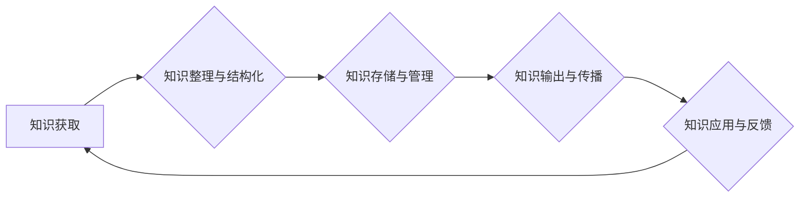

> 知识管理, 知识输出, 系统化, 知识图谱, 知识库, 知识共享, 知识传播, 知识应用

## 1. 背景介绍

在当今信息爆炸的时代，知识已成为最宝贵的资源。然而，知识的获取、存储、传播和应用都面临着巨大的挑战。如何有效地管理和输出知识，使其能够被人们更好地理解、利用和创新，成为一个亟待解决的问题。

传统的知识管理方法往往局限于文档存储和检索，缺乏对知识的深度理解和应用。随着人工智能、大数据等技术的快速发展，知识管理迎来了一次新的变革。系统化的知识输出和管理，不仅能够提高知识的利用效率，还能促进知识的创新和共享。

## 2. 核心概念与联系

**2.1 知识管理 (KM)**

知识管理是指组织为了获取、创造、共享和应用知识而采取的一系列策略、流程和工具。其目标是将知识转化为有价值的资产，并将其应用于组织的决策、运营和创新。

**2.2 知识输出**

知识输出是指将知识以易于理解和应用的形式呈现出来，使其能够被他人获取和利用的过程。知识输出的形式多种多样，包括文档、报告、演示文稿、视频、音频等。

**2.3 系统化**

系统化是指将知识按照一定的逻辑和结构进行组织和管理，使其能够被人们更好地理解和应用。系统化的知识管理能够提高知识的可发现性、可理解性和可应用性。

**2.4 知识图谱 (KG)**

知识图谱是一种基于知识表示的数据库，它将知识表示为实体、关系和属性，并通过图结构进行组织和连接。知识图谱能够有效地存储、检索和推理知识，为知识的发现和应用提供强大的支持。

**2.5 知识库 (KB)**

知识库是一种专门用于存储和管理知识的数据库。知识库通常包含大量的结构化和非结构化知识，并提供查询、检索和推理等功能。

**2.6 知识共享**

知识共享是指人们之间分享和传播知识的行为。知识共享能够促进知识的传播和创新，并推动社会进步。

**2.7 知识传播**

知识传播是指将知识从一个主体传递到另一个主体的过程。知识传播可以通过多种方式进行，包括口头交流、书面文档、网络平台等。

**2.8 知识应用**

知识应用是指将知识应用于实际问题解决的过程。知识应用能够帮助人们更好地理解世界，并解决实际问题。

**2.9 系统化知识输出与管理流程图**



## 3. 核心算法原理 & 具体操作步骤

**3.1 算法原理概述**

系统化知识输出与管理的核心算法原理是基于知识图谱和知识库的构建和应用。通过将知识表示为实体、关系和属性，并将其存储和管理在知识图谱和知识库中，可以实现知识的有效存储、检索、推理和应用。

**3.2 算法步骤详解**

1. **知识获取:** 从各种来源获取知识，包括文本、图像、音频、视频等。
2. **知识整理与结构化:** 将获取到的知识进行整理和结构化，提取实体、关系和属性，并将其转换为知识图谱和知识库的格式。
3. **知识存储与管理:** 将知识图谱和知识库存储在数据库中，并提供查询、检索和推理等功能。
4. **知识输出与传播:** 将知识以多种形式输出，包括文本、图像、视频、音频等，并通过网络平台、移动应用等渠道进行传播。
5. **知识应用与反馈:** 将知识应用于实际问题解决，并收集用户反馈，用于改进知识库和知识图谱的构建和维护。

**3.3 算法优缺点**

**优点:**

* 能够有效地存储、检索和推理知识。
* 能够将知识表示为结构化的形式，方便知识的理解和应用。
* 能够促进知识的共享和传播。

**缺点:**

* 知识获取和结构化需要大量的专业知识和人工参与。
* 知识图谱和知识库的构建和维护需要投入大量的资源。
* 知识的准确性和完整性依赖于知识获取和结构化的质量。

**3.4 算法应用领域**

* **教育:** 提供个性化学习资源和知识导向的教学平台。
* **医疗:** 辅助医生诊断疾病、制定治疗方案和进行医学研究。
* **金融:** 识别金融风险、预测市场趋势和提供个性化理财建议。
* **法律:** 辅助律师进行法律研究、分析案例和撰写法律文件。
* **企业管理:** 提升企业决策效率、优化业务流程和促进知识共享。

## 4. 数学模型和公式 & 详细讲解 & 举例说明

**4.1 数学模型构建**

知识图谱可以表示为一个三元组的集合，其中每个三元组由一个实体、一个关系和另一个实体组成。

```
(实体1, 关系, 实体2)
```

例如，以下是一个关于人物的知识图谱的三元组：

```
(李白, 出生于, 唐朝)
```

**4.2 公式推导过程**

知识图谱中的关系可以被表示为数学公式。例如，我们可以使用逻辑公式来表示“A是B的子集”的关系：

```
A ⊆ B
```

**4.3 案例分析与讲解**

假设我们有一个关于动物的知识图谱，其中包含以下三元组：

```
(猫, 是, 动物)
(狗, 是, 动物)
(猫, 属于, 哺乳动物)
(狗, 属于, 哺乳动物)
```

我们可以使用逻辑公式来表示“所有猫都是哺乳动物”的关系：

```
∀x (猫(x) → 哺乳动物(x))
```

## 5. 项目实践：代码实例和详细解释说明

**5.1 开发环境搭建**

* Python 3.x
* Neo4j (知识图谱数据库)
* Jupyter Notebook (代码开发环境)

**5.2 源代码详细实现**

```python
# 连接 Neo4j 数据库
driver = GraphDatabase.driver("bolt://localhost:7687", auth=("neo4j", "password"))

# 定义查询语句
query = "MATCH (n:Animal) RETURN n"

# 执行查询语句
with driver.session() as session:
    result = session.run(query)

    # 打印查询结果
    for record in result:
        print(record["n"])

# 关闭数据库连接
driver.close()
```

**5.3 代码解读与分析**

* 代码首先连接到 Neo4j 数据库。
* 然后定义了一个查询语句，用于查询所有类型的动物节点。
* 使用 `session.run()` 方法执行查询语句，并将结果存储在 `result` 变量中。
* 最后，遍历 `result` 变量中的每个记录，并打印节点的名称。

**5.4 运行结果展示**

运行代码后，将输出所有动物节点的名称，例如：

```
Node(name='猫', labels=['Animal'])
Node(name='狗', labels=['Animal'])
```

## 6. 实际应用场景

**6.1 教育领域**

* 个性化学习推荐系统：根据学生的学习兴趣和知识水平，推荐个性化的学习资源。
* 知识问答系统：帮助学生解答知识问题，并提供相关学习资料。
* 智能辅导系统：提供个性化的学习辅导，帮助学生理解知识点。

**6.2 医疗领域**

* 疾病诊断辅助系统：根据患者的症状和病史，辅助医生诊断疾病。
* 药物研发辅助系统：帮助科学家发现新的药物靶点和药物组合。
* 医疗知识库：提供最新的医疗知识和临床指南。

**6.3 企业管理领域**

* 知识管理平台：帮助企业收集、整理和共享知识，促进知识的传播和应用。
* 决策支持系统：提供数据分析和决策支持，帮助企业做出更明智的决策。
* 创新管理系统：促进企业创新，帮助企业开发新的产品和服务。

**6.4 未来应用展望**

随着人工智能、大数据等技术的不断发展，系统化知识输出与管理将应用于更广泛的领域，例如：

* 智能家居：提供个性化的家居服务，例如智能照明、智能温度控制等。
* 智能交通：优化交通流量，提高交通效率。
* 智能制造：实现工业自动化和智能化。

## 7. 工具和资源推荐

**7.1 学习资源推荐**

* **书籍:**
    * 《知识管理》
    * 《知识图谱》
    * 《人工智能》
* **在线课程:**
    * Coursera: 知识管理、知识图谱、人工智能
    * edX: 知识管理、知识图谱、人工智能
* **网站:**
    * 知识管理学会 (KM Society)
    * 知识图谱联盟 (KG Alliance)
    * 人工智能研究协会 (AAAI)

**7.2 开发工具推荐**

* **知识图谱数据库:** Neo4j, JanusGraph, RDF4J
* **知识图谱构建工具:** Protégé, TopBraid Composer
* **人工智能平台:** TensorFlow, PyTorch, scikit-learn

**7.3 相关论文推荐**

* 《知识图谱：概念、构建和应用》
* 《基于知识图谱的人工智能》
* 《知识管理与人工智能的融合》

## 8. 总结：未来发展趋势与挑战

**8.1 研究成果总结**

系统化知识输出与管理的研究取得了显著进展，已经形成了较为完善的理论体系和技术框架。知识图谱和知识库技术得到了广泛应用，为知识的存储、检索、推理和应用提供了强大的支持。

**8.2 未来发展趋势**

* **知识图谱的规模和复杂度将不断提高:** 未来，知识图谱将包含更丰富、更复杂的知识，并能够支持更复杂的推理和分析。
* **知识图谱与人工智能的融合将更加紧密:** 人工智能技术将被应用于知识图谱的构建、维护和应用，提高知识图谱的智能化水平。
* **知识图谱的应用场景将更加广泛:** 知识图谱将应用于更多领域，例如医疗、教育、金融、法律等，为人们的生活和工作带来更多便利。

**8.3 面临的挑战**

* **知识获取和结构化仍然是一个难题:** 知识获取和结构化需要大量的专业知识和人工参与，成本较高。
* **知识图谱的质量和可信度需要保障:** 知识图谱的准确性和完整性依赖于知识获取和结构化的质量，需要不断进行验证和更新。
* **知识图谱的隐私和安全问题需要解决:** 知识图谱中包含大量敏感信息，需要采取措施保护隐私和安全。

**8.4 研究展望**

未来，我们将继续致力于系统化知识输出与管理的研究，探索新的知识表示方法、构建更智能的知识图谱，并将其应用于更多领域，为人类社会的发展做出贡献。

## 9. 附录：常见问题与解答

**9.1 如何构建知识图谱？**

构建知识图谱需要以下步骤：

1. 确定知识领域和知识范围。
2. 确定知识表示方法和数据源。
3. 提取知识实体、关系和属性。
4. 将知识表示为三元组格式。
5. 存储知识图谱到数据库中。

**9.2 如何使用知识图谱？**

知识图谱可以用于多种应用场景，例如：

* 知识检索和查询
* 知识推理和分析
* 知识推荐和个性化服务
* 知识共享和传播

**9.3 如何评估知识图谱的质量？**

知识图谱的质量可以从以下几个方面进行评估：

* 准确性
*teness
*一致性
*可解释性

作者：禅与计算机程序设计艺术 /