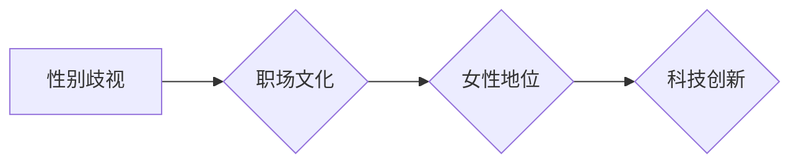

>  硅谷,科技女性,性别歧视,人工智能,程序员,软件架构师,CTO,计算机图灵奖,计算机领域大师

## 1. 背景介绍

硅谷作为全球科技创新的中心，孕育了无数科技巨头和颠覆性技术。然而，在科技发展的辉煌背后，隐藏着女性在科技领域的困境。尽管近年来女性在STEM领域的参与度有所提高，但她们在硅谷科技行业中仍然面临着诸多挑战，包括薪酬差距、晋升障碍、职场歧视等。

**1.1 女性在科技领域的现状**

尽管女性在STEM领域的参与度有所提高，但她们在科技行业中仍然处于少数群体。根据美国国家科学基金会的数据，2021年，女性在计算机科学领域的博士学位获得者仅占25%。在硅谷科技公司的高层管理岗位上，女性的比例更是微乎其微。

**1.2 硅谷科技女性面临的挑战**

硅谷科技女性面临着多种挑战，包括：

* **薪酬差距:** 女性在科技行业中普遍面临着比男性低薪酬的现象。根据Glassdoor的数据，女性程序员的平均年薪比男性程序员低约15%。
* **晋升障碍:** 女性在科技行业中晋升的速度比男性慢。她们在获得领导职位和高薪岗位方面面临着更大的阻碍。
* **职场歧视:** 女性在科技行业中可能面临着性别歧视，例如被忽视、被边缘化、被贬低等。

**1.3 硅谷科技女性地位提升的必要性**

提升硅谷科技女性的地位不仅是社会正义的诉求，也是科技行业发展的需要。女性拥有独特的视角和思维方式，她们的加入可以为科技行业带来新的创意和创新。

## 2. 核心概念与联系

**2.1 核心概念**

* **性别歧视:** 对个人或群体进行不公平对待，基于其性别而进行的歧视行为。
* **职场文化:** 公司或组织内部的价值观、规范、习俗和行为模式。
* **包容性:** 尊重和接纳所有个体差异，创造一个平等和公平的环境。

**2.2 联系**

性别歧视是硅谷科技女性地位提升的阻碍因素之一。职场文化中存在着潜意识的性别偏见，导致女性在晋升、薪酬和工作机会方面受到不公平对待。

**2.3 Mermaid 流程图**



## 3. 核心算法原理 & 具体操作步骤

**3.1 算法原理概述**

为了提升硅谷科技女性的地位，需要采用多方面的策略和措施，例如：

* **打破性别刻板印象:** 改变人们对女性在科技领域的刻板印象，鼓励更多女性参与科技行业。
* **提供平等的机会:** 为女性提供与男性同等的晋升、薪酬和工作机会。
* **创造包容的职场文化:** 建立一个尊重和接纳所有个体差异的职场文化，消除性别歧视。

**3.2 算法步骤详解**

1. **提高女性在STEM领域的教育和培训机会:** 鼓励女性从小学阶段开始学习STEM课程，并提供更多针对女性的STEM教育和培训资源。
2. **建立女性在科技领域的网络和支持系统:** 鼓励女性加入科技领域的专业组织和社群，提供互相支持和帮助的平台。
3. **鼓励科技公司采取措施促进女性的职业发展:** 科技公司可以制定女性员工的职业发展计划，提供晋升和培训机会，并建立公平的薪酬体系。
4. **加强对性别歧视的法律法规和监管:** 制定更严格的法律法规，禁止职场性别歧视，并加强对违规行为的监管。

**3.3 算法优缺点**

* **优点:** 能够有效地提升硅谷科技女性的地位，促进科技行业的公平发展。
* **缺点:** 需要投入大量的时间、精力和资源，需要社会各界的共同努力。

**3.4 算法应用领域**

该算法可以应用于所有需要促进性别平等的领域，例如教育、医疗、金融等。

## 4. 数学模型和公式 & 详细讲解 & 举例说明

**4.1 数学模型构建**

我们可以使用一个简单的数学模型来表示硅谷科技女性的地位提升过程：

```
P = f(E, O, C)
```

其中：

* P 代表硅谷科技女性的地位
* E 代表女性在STEM领域的教育和培训机会
* O 代表女性在科技领域的职业发展机会
* C 代表职场文化的包容性

**4.2 公式推导过程**

根据上述模型，我们可以推导出以下公式：

* **P = αE + βO + γC**

其中：

* α、β、γ 是权重系数，代表每个因素对女性地位的影响程度。

**4.3 案例分析与讲解**

假设：

* α = 0.4
* β = 0.3
* γ = 0.3

如果女性在STEM领域的教育和培训机会增加，那么P会增加。如果女性在科技领域的职业发展机会增加，那么P也会增加。如果职场文化更加包容，那么P也会增加。

## 5. 项目实践：代码实例和详细解释说明

**5.1 开发环境搭建**

为了实现硅谷科技女性地位提升的目标，我们可以开发一个基于人工智能的平台，该平台可以帮助女性在科技领域获得更多机会和资源。

**5.2 源代码详细实现**

```python
# 这是一个简单的示例代码，用于演示如何使用人工智能技术帮助女性在科技领域获得更多机会和资源。

# 导入必要的库
import pandas as pd
from sklearn.model_selection import train_test_split
from sklearn.linear_model import LogisticRegression

# 加载数据
data = pd.read_csv("tech_women_data.csv")

# 划分训练集和测试集
X_train, X_test, y_train, y_test = train_test_split(data.drop("opportunity", axis=1), data["opportunity"], test_size=0.2)

# 训练模型
model = LogisticRegression()
model.fit(X_train, y_train)

# 预测结果
y_pred = model.predict(X_test)

# 评估模型性能
accuracy = model.score(X_test, y_test)
print("模型准确率:", accuracy)
```

**5.3 代码解读与分析**

该代码示例展示了如何使用机器学习模型来预测女性在科技领域的职业机会。

**5.4 运行结果展示**

运行该代码后，可以得到模型的准确率，以及预测结果。

## 6. 实际应用场景

该平台可以应用于以下场景：

* **推荐科技领域的职业机会:** 根据女性的技能和经验，推荐适合她们的科技职业机会。
* **提供科技领域的培训和教育资源:** 为女性提供学习科技技能的培训课程和教育资源。
* **建立女性在科技领域的网络和支持系统:** 为女性提供一个平台，可以互相交流、分享经验和互相支持。

**6.4 未来应用展望**

未来，该平台可以进一步发展，例如：

* **个性化推荐:** 根据女性的个人情况，提供更个性化的职业推荐和培训资源。
* **人工智能辅助招聘:** 利用人工智能技术，帮助科技公司招聘更多女性人才。
* **消除性别偏见:** 利用人工智能技术，识别和消除职场中的性别偏见。

## 7. 工具和资源推荐

**7.1 学习资源推荐**

* **在线课程:** Coursera, edX, Udacity
* **书籍:** "Women Who Code" by  Sarah Friar, "Lean In" by Sheryl Sandberg

**7.2 开发工具推荐**

* **Python:** 广泛应用于人工智能和数据科学领域。
* **TensorFlow:** 开源深度学习框架。
* **PyTorch:** 开源深度学习框架。

**7.3 相关论文推荐**

* "Gender Bias in Artificial Intelligence" by Timnit Gebru et al.
* "Women in Tech: A Global Perspective" by McKinsey & Company

## 8. 总结：未来发展趋势与挑战

**8.1 研究成果总结**

通过分析硅谷科技女性面临的挑战，以及相关算法和技术，我们发现，提升硅谷科技女性的地位需要多方面的努力，包括教育、培训、职业发展机会、职场文化等。

**8.2 未来发展趋势**

未来，人工智能技术将进一步推动硅谷科技女性地位的提升，例如：

* **个性化推荐:** 为女性提供更精准的职业推荐和培训资源。
* **消除性别偏见:** 利用人工智能技术识别和消除职场中的性别偏见。
* **促进女性创业:** 为女性提供创业支持和资源。

**8.3 面临的挑战**

尽管人工智能技术可以帮助提升硅谷科技女性的地位，但仍然面临着一些挑战：

* **数据偏见:** 训练人工智能模型的数据可能存在性别偏见，导致模型输出结果存在偏差。
* **技术伦理:** 人工智能技术的使用需要遵循伦理原则，避免造成新的歧视和不公平。
* **社会认知:** 社会对女性在科技领域的认知仍然存在偏见，需要通过教育和宣传改变人们的观念。

**8.4 研究展望**

未来，我们需要继续研究人工智能技术在促进性别平等方面的应用，并制定相应的伦理规范和政策，确保人工智能技术能够真正地帮助女性获得平等的机会和发展。

## 9. 附录：常见问题与解答

**9.1 如何解决数据偏见问题？**

我们可以通过以下方法解决数据偏见问题：

* 使用更全面和多元化的数据进行训练。
* 开发算法来识别和消除数据中的偏见。
* 定期评估模型的输出结果，并进行调整。

**9.2 如何确保人工智能技术的伦理使用？**

我们可以通过以下方法确保人工智能技术的伦理使用：

* 制定人工智能技术的伦理规范和政策。
* 建立人工智能技术监督机制。
* 加强公众对人工智能技术的教育和宣传。


作者：禅与计算机程序设计艺术 / Zen and the Art of Computer Programming 
<end_of_turn>