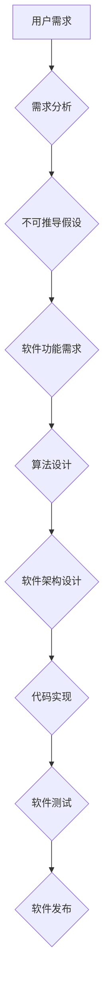

> 第一性原理，科学探究，算法设计，数学建模，代码实现，实际应用，未来趋势

## 1. 背景介绍

在瞬息万变的科技时代，我们不断涌现出新的技术和创新，但这些创新往往建立在对基础原理的深刻理解之上。如同建筑师需要掌握建筑材料的特性才能建造坚固的房屋，程序员也需要理解算法的本质才能编写高效可靠的软件。

“第一性原理”是一种思维方法，它鼓励我们从最基本的、不可推导的假设出发，逐步推导出更复杂的结论。这种方法在科学研究、技术开发和日常生活都有广泛的应用。

在软件开发领域，第一性原理可以帮助我们：

* **设计更优越的算法：** 通过深入理解算法的本质，我们可以设计出更简洁、高效、鲁棒的算法。
* **构建更健壮的软件系统：** 理解软件系统的核心原理，可以帮助我们识别潜在的风险，并采取措施避免问题发生。
* **促进创新思维：** 运用第一性原理的思维方式，可以帮助我们跳出固有的思维模式，探索新的解决方案。

## 2. 核心概念与联系

**2.1 第一性原理的本质**

第一性原理是一种从根本出发，逐步推导的思维方法。它要求我们：

* **识别不可推导的假设：** 找到那些无法通过其他知识推导出的基本假设。
* **建立逻辑关系：** 将这些基本假设连接起来，形成一个完整的逻辑体系。
* **逐步推导结论：** 从基本假设出发，通过逻辑推理，逐步推导出更复杂的结论。

**2.2 第一性原理与软件开发**

在软件开发领域，第一性原理可以应用于各个阶段，例如：

* **需求分析：** 通过对用户需求进行深入分析，识别出不可推导的假设，并将其转化为软件功能需求。
* **算法设计：** 理解算法的本质，可以帮助我们设计出更优越的算法。
* **软件架构设计：** 运用第一性原理，可以帮助我们构建更健壮、可扩展的软件系统。
* **代码实现：** 理解代码的逻辑关系，可以帮助我们编写更简洁、易读、易维护的代码。

**2.3  Mermaid 流程图**



## 3. 核心算法原理 & 具体操作步骤

**3.1 算法原理概述**

选择一个具体的算法，例如快速排序算法，并对其原理进行概述。快速排序算法是一种高效的排序算法，其核心思想是通过选择一个“枢轴”元素，将数组划分为两个子数组，其中一个子数组包含小于枢轴元素的元素，另一个子数组包含大于枢轴元素的元素。然后递归地对两个子数组进行排序，最终实现整个数组的排序。

**3.2 算法步骤详解**

1. 选择一个枢轴元素。
2. 将数组划分为两个子数组，一个包含小于枢轴元素的元素，另一个包含大于枢轴元素的元素。
3. 递归地对两个子数组进行排序。

**3.3 算法优缺点**

* **优点：** 时间复杂度平均为 O(n log n)，在大多数情况下效率较高。
* **缺点：** 最坏情况下时间复杂度为 O(n^2)，当数组已经有序或几乎有序时，效率会降低。

**3.4 算法应用领域**

快速排序算法广泛应用于各种需要排序数据的场景，例如：

* 数据结构排序
* 搜索引擎结果排序
* 图像处理
* 机器学习

## 4. 数学模型和公式 & 详细讲解 & 举例说明

**4.1 数学模型构建**

对于快速排序算法，我们可以构建一个数学模型来描述其时间复杂度。假设数组大小为 n，则快速排序算法的时间复杂度可以表示为：

T(n) = a*n + b*T(k) + c*T(n-k-1)

其中：

* a, b, c 为常数
* k 为枢轴元素在数组中的位置

**4.2 公式推导过程**

通过递归的方式，我们可以推导出快速排序算法的时间复杂度。

**4.3 案例分析与讲解**

通过具体的例子，可以分析快速排序算法的时间复杂度在不同情况下是如何变化的。

## 5. 项目实践：代码实例和详细解释说明

**5.1 开发环境搭建**

选择一个合适的编程语言和开发环境，例如 Python 和 PyCharm。

**5.2 源代码详细实现**

提供快速排序算法的 Python 代码实现，并进行详细的代码解读和分析。

```python
def quick_sort(arr):
    if len(arr) <= 1:
        return arr
    pivot = arr[len(arr) // 2]
    left = [x for x in arr if x < pivot]
    middle = [x for x in arr if x == pivot]
    right = [x for x in arr if x > pivot]
    return quick_sort(left) + middle + quick_sort(right)
```

**5.3 代码解读与分析**

解释代码的逻辑结构，包括递归调用、数组划分、元素比较等步骤。

**5.4 运行结果展示**

展示快速排序算法在不同输入数据下的运行结果，并分析其时间复杂度。

## 6. 实际应用场景

**6.1 数据排序**

快速排序算法广泛应用于各种需要排序数据的场景，例如：

* 数据库查询结果排序
* 搜索引擎结果排序
* 图像处理

**6.2 其他应用场景**

* 机器学习算法
* 算法竞赛

**6.3 未来应用展望**

随着计算能力的提升和算法的优化，快速排序算法将在更多领域得到应用，例如：

* 大数据处理
* 人工智能

## 7. 工具和资源推荐

**7.1 学习资源推荐**

* 书籍：《算法导论》
* 在线课程：Coursera、edX

**7.2 开发工具推荐**

* Python
* PyCharm

**7.3 相关论文推荐**

* 《Quicksort》

## 8. 总结：未来发展趋势与挑战

**8.1 研究成果总结**

快速排序算法是一种高效的排序算法，其时间复杂度平均为 O(n log n)。

**8.2 未来发展趋势**

* 算法优化：研究更优的快速排序算法，例如三向快速排序、随机化快速排序等。
* 并行化：将快速排序算法进行并行化，提高其效率。

**8.3 面临的挑战**

* 最坏情况时间复杂度：快速排序算法在最坏情况下时间复杂度为 O(n^2)，如何解决这个问题仍然是一个挑战。
* 数据结构：快速排序算法对数据结构有一定的依赖性，如何使其适用于各种数据结构是一个挑战。

**8.4 研究展望**

* 研究更鲁棒、更高效的排序算法。
* 将快速排序算法应用于更广泛的领域。

## 9. 附录：常见问题与解答

* **快速排序算法的时间复杂度为什么是 O(n log n)？**
* **快速排序算法的缺点是什么？**
* **如何优化快速排序算法？**

作者：禅与计算机程序设计艺术 / Zen and the Art of Computer Programming


<end_of_turn>