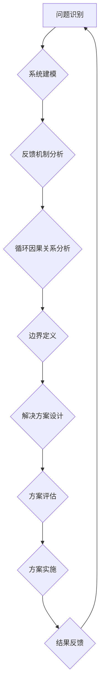

> 系统思考，复杂项目，管理方法，系统架构，风险控制，团队协作，迭代开发

## 1. 背景介绍

在当今科技日新月异的时代，软件开发项目越来越复杂，涉及的领域更加广泛，团队规模也越来越庞大。传统的管理方法已经难以应对这些复杂项目带来的挑战。如何有效地管理复杂项目，确保项目按时、按质、按预算完成，成为了摆在软件开发团队面前的一项重要课题。

系统思考是一种全新的管理方法，它强调要从整体的角度看待问题，分析系统各个部分之间的相互关系和相互影响，并通过优化整个系统的结构和流程来提高系统的整体效能。系统思考对于管理复杂项目具有重要的意义，因为它能够帮助项目经理更好地理解项目复杂性，识别潜在风险，制定有效的解决方案，并提高团队协作效率。

## 2. 核心概念与联系

**2.1 系统思考的核心概念**

系统思考的核心概念包括：

* **系统：** 一个由相互关联的部件组成的整体，这些部件相互作用，共同完成某个目标。
* **反馈机制：** 系统内部的反馈机制可以帮助系统自我调节，保持稳定，并适应外部环境的变化。
* **循环因果关系：** 系统中的各个部件之间存在着复杂的循环因果关系，一个部件的变化可能会导致其他部件的变化，从而引发一系列连锁反应。
* **边界：** 系统的边界定义了系统与外部环境的分界线，有助于我们更好地理解系统的内部结构和功能。

**2.2 系统思考与复杂项目管理的联系**

复杂项目通常具有以下特点：

* **高度复杂性：** 涉及多个领域、多个团队、多个技术，相互关联性强。
* **不确定性：** 项目环境变化快，需求不断变化，风险难以预测。
* **动态性：** 项目需要不断适应环境变化，进行调整和优化。

系统思考能够帮助我们更好地理解和应对这些复杂项目的特点。

**2.3 系统思考的应用场景**

系统思考可以应用于各种复杂项目管理场景，例如：

* 软件开发项目
* 大型基础设施建设项目
* 跨国合作项目
* 医疗保健项目
* 教育改革项目

**2.4 系统思考的优势**

系统思考的优势在于：

* **全局视角：** 能够帮助我们从整体的角度看待问题，避免局部优化导致全局恶化。
* **风险识别：** 能够帮助我们识别潜在风险，并制定相应的应对措施。
* **协同合作：** 能够促进团队成员之间的协作，提高团队效率。
* **持续改进：** 能够帮助我们不断反思和改进项目管理方法，提高项目成功率。

**2.5 系统思考的流程图**



## 3. 核心算法原理 & 具体操作步骤

**3.1 算法原理概述**

系统思考的核心算法原理是基于反馈机制和循环因果关系的分析。通过分析系统的反馈机制和循环因果关系，我们可以识别系统中的关键节点和关键路径，并针对这些关键节点和关键路径进行优化，从而提高系统的整体效能。

**3.2 算法步骤详解**

1. **问题识别：** 首先要明确需要解决的问题，并将其分解成更小的子问题。
2. **系统建模：** 将系统建模为一个图，其中节点代表系统中的各个部件，边代表部件之间的相互关系。
3. **反馈机制分析：** 分析系统中的反馈机制，识别正反馈和负反馈。正反馈会放大系统中的变化，负反馈会抑制系统中的变化。
4. **循环因果关系分析：** 分析系统中的循环因果关系，识别关键节点和关键路径。
5. **边界定义：** 定义系统的边界，明确系统与外部环境的分界线。
6. **解决方案设计：** 根据系统分析的结果，设计相应的解决方案，并评估解决方案的有效性。
7. **方案实施：** 将解决方案实施到系统中，并进行监控和评估。
8. **结果反馈：** 收集结果反馈，并根据反馈进行调整和优化。

**3.3 算法优缺点**

**优点：**

* 全局视角：能够帮助我们从整体的角度看待问题，避免局部优化导致全局恶化。
* 风险识别：能够帮助我们识别潜在风险，并制定相应的应对措施。
* 协同合作：能够促进团队成员之间的协作，提高团队效率。
* 持续改进：能够帮助我们不断反思和改进项目管理方法，提高项目成功率。

**缺点：**

* 复杂度高：系统建模和分析过程比较复杂，需要一定的专业知识和经验。
* 时间成本高：系统思考需要投入较多的时间和精力。
* 数据依赖性强：系统思考需要大量的系统数据作为支撑，如果没有足够的系统数据，则难以进行有效的分析。

**3.4 算法应用领域**

系统思考的应用领域非常广泛，包括：

* 软件开发项目
* 大型基础设施建设项目
* 跨国合作项目
* 医疗保健项目
* 教育改革项目
* 经济发展战略
* 环境保护

## 4. 数学模型和公式 & 详细讲解 & 举例说明

**4.1 数学模型构建**

系统思考中的数学模型通常是基于图论和网络分析的。图论可以用来表示系统的结构，网络分析可以用来分析系统的动态行为。

**4.2 公式推导过程**

系统思考中的公式推导过程通常是基于系统动力学模型的。系统动力学模型是一种用来描述系统动态行为的数学模型，它可以用来预测系统的未来状态。

**4.3 案例分析与讲解**

例如，我们可以使用系统动力学模型来分析软件开发项目的进度。

* **变量：** 项目进度、开发人员数量、代码量、缺陷数量
* **关系：** 开发人员数量与代码量成正比，代码量与缺陷数量成正比，缺陷数量与项目进度成反比。
* **模型：** 可以使用差分方程来描述这些变量之间的关系。

通过分析这个模型，我们可以预测软件开发项目的进度，并根据预测结果制定相应的策略来提高项目进度。

## 5. 项目实践：代码实例和详细解释说明

**5.1 开发环境搭建**

* 操作系统：Windows/macOS/Linux
* 编程语言：Python
* 工具：

    * Jupyter Notebook
    * Matplotlib
    * NetworkX

**5.2 源代码详细实现**

```python
import networkx as nx
import matplotlib.pyplot as plt

# 创建一个简单的网络图
G = nx.Graph()
G.add_edges_from([(1, 2), (1, 3), (2, 4), (3, 5)])

# 绘制网络图
nx.draw(G, with_labels=True, node_color='skyblue', node_size=500, font_size=10)
plt.show()

# 计算网络图的度分布
degree_distribution = nx.degree_histogram(G)
plt.bar(range(len(degree_distribution)), degree_distribution)
plt.xlabel('Degree')
plt.ylabel('Number of Nodes')
plt.title('Degree Distribution')
plt.show()
```

**5.3 代码解读与分析**

* 代码首先使用 NetworkX 库创建了一个简单的网络图。
* 然后使用 Matplotlib 库绘制网络图，并设置节点颜色、节点大小和字体大小。
* 最后使用 NetworkX 库计算网络图的度分布，并使用 Matplotlib 库绘制度分布图。

**5.4 运行结果展示**

运行代码后，会生成一个网络图和一个度分布图。网络图显示了网络图的结构，度分布图显示了网络图中节点的度分布。

## 6. 实际应用场景

**6.1 软件开发项目**

系统思考可以帮助软件开发团队更好地理解项目复杂性，识别潜在风险，制定有效的解决方案，并提高团队协作效率。例如，可以使用系统思考来分析软件开发项目的进度、质量、成本等方面的风险，并制定相应的风险控制措施。

**6.2 大型基础设施建设项目**

系统思考可以帮助大型基础设施建设项目团队更好地协调各方利益，优化项目流程，提高项目效率。例如，可以使用系统思考来分析大型基础设施建设项目的建设进度、资金使用、环境影响等方面的风险，并制定相应的应对措施。

**6.3 跨国合作项目**

系统思考可以帮助跨国合作项目团队更好地理解不同文化背景下的合作模式，协调不同团队之间的工作，提高项目成功率。例如，可以使用系统思考来分析跨国合作项目的沟通方式、决策机制、风险管理等方面的挑战，并制定相应的解决方案。

**6.4 未来应用展望**

随着科技的不断发展，系统思考在未来将有更广泛的应用场景。例如，可以应用于人工智能、物联网、大数据等领域，帮助我们更好地理解和管理这些复杂系统。

## 7. 工具和资源推荐

**7.1 学习资源推荐**

* 《系统思考》 - Peter Senge
* 《第五项修炼》 - Jim Collins
* 《复杂系统》 - Melanie Mitchell

**7.2 开发工具推荐**

* NetworkX
* Gephi
* Cytoscape

**7.3 相关论文推荐**

* "The Fifth Discipline: The Art and Practice of the Learning Organization" - Peter Senge
* "Complexity: A Guided Tour" - Melanie Mitchell
* "System Dynamics Modeling for Business and Policy Analysis" - John Sterman

## 8. 总结：未来发展趋势与挑战

**8.1 研究成果总结**

系统思考已经取得了一定的研究成果，并被广泛应用于各个领域。

**8.2 未来发展趋势**

未来，系统思考的研究将更加注重以下几个方面：

* **人工智能与系统思考的结合：** 利用人工智能技术，提高系统思考的效率和准确性。
* **复杂系统建模与分析的深入研究：** 开发更先进的复杂系统建模和分析方法，能够更好地理解和管理复杂系统。
* **系统思考的应用拓展：** 将系统思考应用到更多新的领域，例如人工智能、物联网、大数据等。

**8.3 面临的挑战**

系统思考的研究也面临着一些挑战：

* **数据获取和处理：** 系统思考需要大量的系统数据作为支撑，而获取和处理这些数据往往比较困难。
* **模型复杂度：** 复杂系统的模型往往非常复杂，难以理解和分析。
* **跨学科合作：** 系统思考需要跨学科合作，而跨学科合作往往比较困难。

**8.4 研究展望**

尽管面临着一些挑战，但系统思考的研究前景仍然非常广阔。随着科技的不断发展，相信系统思考将发挥越来越重要的作用，帮助我们更好地理解和管理复杂世界。

## 9. 附录：常见问题与解答

**9.1 什么是系统思考？**

系统思考是一种全新的管理方法，它强调要从整体的角度看待问题，分析系统各个部分之间的相互关系和相互影响，并通过优化整个系统的结构和流程来提高系统的整体效能。

**9.2 系统思考有什么优势？**

系统思考的优势在于：

* 全局视角：能够帮助我们从整体的角度看待问题，避免局部优化导致全局恶化。
* 风险识别：能够帮助我们识别潜在风险，并制定相应的应对措施。
* 协同合作：能够促进团队成员之间的协作，提高团队效率。
* 持续改进：能够帮助我们不断反思和改进项目管理方法，提高项目成功率。

**9.3 系统思考如何应用于软件开发项目？**

系统思考可以帮助软件开发团队更好地理解项目复杂性，识别潜在风险，制定有效的解决方案，并提高团队协作效率。例如，可以使用系统思考来分析软件开发项目的进度、质量、成本等方面的风险，并制定相应的风险控制措施。


作者：禅与计算机程序设计艺术 / Zen and the Art of Computer Programming 
<end_of_turn>