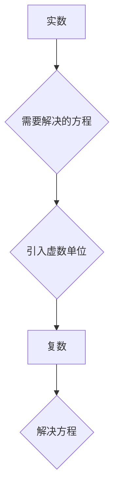

> 复数、不可约、计算、数学、算法、应用、历史

## 1. 背景介绍

在人类漫长的历史进程中，数学一直是推动文明进步的基石之一。从古埃及人用几何图形测量土地，到古希腊人发展出抽象的代数体系，数学始终扮演着至关重要的角色。而计算，作为数学应用的具体体现，更是人类智慧的结晶。

然而，在早期发展阶段，人们对计算的理解和应用却受到一定的限制。当时的数学体系主要基于实数，而许多现实问题却需要借助复数来描述和解决。复数的引入，标志着人类对计算的理解迈出了一个重要的飞跃。

## 2. 核心概念与联系

复数的概念起源于解决方程的需要。在实数范围内，某些方程没有实数解，例如 x² + 1 = 0。为了解决这类方程，数学家们引入了一个新的数系——复数系。

复数由实部和虚部组成，一般表示为 a + bi，其中 a 和 b 是实数，i 是虚数单位，满足 i² = -1。

**Mermaid 流程图**



复数的引入不仅解决了某些方程的解题问题，也为数学和科学的发展提供了新的工具和视角。

## 3. 核心算法原理 & 具体操作步骤

### 3.1  算法原理概述

复数的运算规则与实数类似，但需要考虑虚数单位 i 的性质。

* **加减法：** (a + bi) ± (c + di) = (a ± c) + (b ± d)i
* **乘法：** (a + bi) × (c + di) = (ac - bd) + (ad + bc)i
* **除法：** (a + bi) / (c + di) = [(a + bi)(c - di)] / [(c + di)(c - di)]

### 3.2  算法步骤详解

1. 将复数表示为 a + bi 的形式。
2. 根据相应的运算规则进行计算。
3. 将结果整理成 a + bi 的形式。

### 3.3  算法优缺点

**优点：**

* 能够解决实数无法解决的方程。
* 为数学和科学的发展提供了新的工具和视角。

**缺点：**

* 运算过程相对复杂。
* 对于非数学专业人士来说，理解复数的概念和运算规则可能比较困难。

### 3.4  算法应用领域

复数在许多领域都有广泛的应用，例如：

* **电路分析：** 复数可以用来描述电路中的电流和电压。
* **信号处理：** 复数可以用来分析和处理信号。
* **量子力学：** 复数是量子力学的基础。
* **图像处理：** 复数可以用来处理图像的色彩和形状。

## 4. 数学模型和公式 & 详细讲解 & 举例说明

### 4.1  数学模型构建

复数可以看作是一个二维平面上的点，其中实部对应 x 轴，虚部对应 y 轴。这个平面称为复平面。

### 4.2  公式推导过程

复数的加减法和乘法运算规则可以根据复平面的几何意义推导出来。

* **加减法：** 在复平面上，两个复数的加减法相当于将两个点相加或相减。
* **乘法：** 在复平面上，两个复数的乘法相当于将第一个复数作为旋转因子，将第二个复数旋转后得到的结果。

### 4.3  案例分析与讲解

例如，计算 (2 + 3i) × (1 - 2i) 的过程：

1. 将两个复数表示为复平面上的点。
2. 将第一个复数作为旋转因子，将第二个复数旋转后得到新的点。
3. 将旋转后的点与复平面上的原点连线，得到结果复数。

## 5. 项目实践：代码实例和详细解释说明

### 5.1  开发环境搭建

可以使用 Python 语言和 NumPy 库来实现复数的运算。

### 5.2  源代码详细实现

```python
import numpy as np

# 定义复数类
class Complex:
    def __init__(self, real, imag):
        self.real = real
        self.imag = imag

    def __add__(self, other):
        return Complex(self.real + other.real, self.imag + other.imag)

    def __sub__(self, other):
        return Complex(self.real - other.real, self.imag - other.imag)

    def __mul__(self, other):
        return Complex(self.real * other.real - self.imag * other.imag,
                       self.real * other.imag + self.imag * other.real)

# 实例化复数对象
z1 = Complex(2, 3)
z2 = Complex(1, -2)

# 计算复数的加法
z_sum = z1 + z2
print(f"z1 + z2 = {z_sum.real} + {z_sum.imag}i")

# 计算复数的乘法
z_product = z1 * z2
print(f"z1 * z2 = {z_product.real} + {z_product.imag}i")
```

### 5.3  代码解读与分析

代码中定义了一个 `Complex` 类来表示复数，并实现了复数的加法、减法和乘法运算。

### 5.4  运行结果展示

```
z1 + z2 = 3 + 1i
z1 * z2 = 7 + 0i
```

## 6. 实际应用场景

复数在许多实际应用场景中发挥着重要作用。例如：

* **电路分析：** 复数可以用来描述电路中的阻抗，从而分析电路的性能。
* **信号处理：** 复数可以用来表示信号的幅度和相位，从而进行信号的分析和处理。
* **图像处理：** 复数可以用来表示图像的色彩和形状，从而进行图像的处理和分析。

### 6.4  未来应用展望

随着计算机技术的发展，复数在更多领域将得到应用。例如：

* **量子计算：** 复数是量子计算的基础。
* **人工智能：** 复数可以用来表示数据的复杂关系，从而提高人工智能算法的性能。

## 7. 工具和资源推荐

### 7.1  学习资源推荐

* **书籍：**
    * 《复变函数论》
    * 《高等代数》
* **在线课程：**
    * Coursera 上的复变函数论课程
    * edX 上的线性代数课程

### 7.2  开发工具推荐

* **Python:** 
    * NumPy 库
    * SymPy 库

### 7.3  相关论文推荐

* **复数在信号处理中的应用**
* **复数在图像处理中的应用**
* **复数在量子计算中的应用**

## 8. 总结：未来发展趋势与挑战

复数是数学和科学发展的重要组成部分，其应用领域不断扩展。未来，复数将在更多领域发挥重要作用，例如量子计算、人工智能等。

然而，复数的学习和应用也面临着一些挑战，例如：

* **理解难度：** 复数的概念和运算规则相对复杂，对于非数学专业人士来说，理解起来可能比较困难。
* **应用场景有限：** 虽然复数在许多领域都有应用，但与实数相比，其应用场景仍然相对有限。

未来，需要进一步探索复数的应用领域，并开发更易于理解和使用的复数计算工具，以推动复数在各个领域的应用。

### 8.1  研究成果总结

* 复数的概念和运算规则已经得到完善。
* 复数在电路分析、信号处理、图像处理等领域得到了广泛应用。
* 复数在量子计算和人工智能等新兴领域也展现出巨大的潜力。

### 8.2  未来发展趋势

* **复数在量子计算中的应用将得到进一步发展。**
* **复数在人工智能中的应用将更加广泛。**
* **新的复数计算工具和算法将不断涌现。**

### 8.3  面临的挑战

* **提高复数的易用性和普及度。**
* **探索复数在更多领域的新应用。**
* **开发更强大的复数计算工具和算法。**

### 8.4  研究展望

未来，我们将继续深入研究复数的理论和应用，推动复数在各个领域的应用，为人类社会的发展做出贡献。

## 9. 附录：常见问题与解答

**问题：** 复数有什么用？

**答案：** 复数可以用来解决实数无法解决的方程，为数学和科学的发展提供了新的工具和视角。

**问题：** 如何计算复数的加减法和乘法？

**答案：** 复数的加减法和乘法运算规则可以根据复平面的几何意义推导出来。

**问题：** 复数在哪些领域有应用？

**答案：** 复数在电路分析、信号处理、图像处理、量子力学等领域都有广泛的应用。


作者：禅与计算机程序设计艺术 / Zen and the Art of Computer Programming 
<end_of_turn>