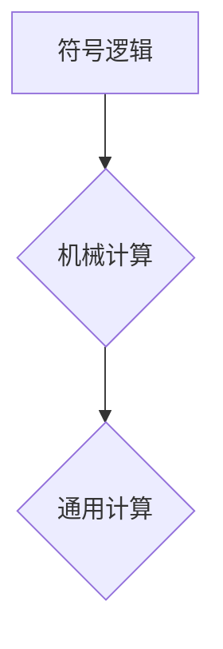

> 莱布尼茨，计算，机械计算，逻辑，符号，计算机，计算哲学

## 1. 背景介绍

17世纪，欧洲正处于启蒙运动的浪潮中，科学和哲学的进步日新月异。在这个时代，一位名叫莱布尼茨的德国哲学家和数学家，提出了一个大胆的构想：用机械装置来实现计算。他相信，所有人类的思维活动，都可以被分解成一系列逻辑运算，而这些运算可以通过机械装置来完成。

莱布尼茨的计算之梦，预示着计算机的诞生。他所提出的概念，为现代计算机的发展奠定了基础。

## 2. 核心概念与联系

莱布尼茨的计算之梦的核心概念包括：

* **符号逻辑:** 莱布尼茨认为，所有知识都可以用符号来表示，并通过逻辑运算来推理。他发明了一种符号系统，用于表示逻辑关系和数学运算。
* **机械计算:** 莱布尼茨相信，任何逻辑运算都可以通过机械装置来实现。他设计了一种名为“算筹机”的机械装置，用于进行加减乘除运算。
* **通用计算:** 莱布尼茨的目标是创造一种能够执行任意逻辑运算的通用计算器。他认为，这种计算器可以用于解决各种科学、技术和哲学问题。

**Mermaid 流程图:**



## 3. 核心算法原理 & 具体操作步骤

### 3.1  算法原理概述

莱布尼茨的计算算法基于符号逻辑和机械计算的原理。

* **符号逻辑:** 莱布尼茨的符号逻辑系统，将逻辑关系和数学运算表示为符号，并定义了这些符号之间的运算规则。
* **机械计算:** 莱布尼茨的算筹机，通过机械装置来执行符号逻辑运算。

### 3.2  算法步骤详解

1. 将问题转化为符号逻辑表达式。
2. 使用莱布尼茨的符号逻辑系统，将表达式进行简化和推理。
3. 将简化后的表达式转换为算筹机的操作指令。
4. 算筹机根据指令进行机械计算，得到最终结果。

### 3.3  算法优缺点

**优点:**

* 基于逻辑推理，计算结果准确可靠。
* 可以实现自动化计算，提高效率。

**缺点:**

* 符号逻辑系统复杂，需要大量的符号和规则。
* 机械计算速度慢，难以处理复杂问题。

### 3.4  算法应用领域

莱布尼茨的计算算法，在当时主要应用于数学计算和逻辑推理。

## 4. 数学模型和公式 & 详细讲解 & 举例说明

### 4.1  数学模型构建

莱布尼茨的符号逻辑系统，可以看作是一种数学模型。该模型将逻辑关系和数学运算表示为符号，并定义了这些符号之间的运算规则。

### 4.2  公式推导过程

莱布尼茨的符号逻辑系统，包含了许多逻辑公式，例如：

* **合取律:** A ∧ B ≡ (A ∧ B)
* **析取律:** A ∨ B ≡ (A ∨ B)
* **排中律:** A ∨ ¬A

这些公式可以通过逻辑推理来推导。

### 4.3  案例分析与讲解

例如，我们可以使用莱布尼茨的符号逻辑系统来证明以下命题：

* 如果 A ∧ B 是真的，那么 A 和 B 都是真的。

**证明过程:**

1. 假设 A ∧ B 是真的。
2. 根据合取律，A ∧ B ≡ (A ∧ B)。
3. 根据析取律，A ∧ B ≡ A ∧ B。
4. 因此，A 和 B 都是真的。

## 5. 项目实践：代码实例和详细解释说明

### 5.1  开发环境搭建

为了实现莱布尼茨的计算算法，我们可以使用 Python 语言进行编程。

### 5.2  源代码详细实现

```python
# 莱布尼茨的符号逻辑系统

def and_operation(a, b):
  """
  实现合取运算
  """
  return a and b

def or_operation(a, b):
  """
  实现析取运算
  """
  return a or b

def not_operation(a):
  """
  实现否定运算
  """
  return not a

# 例子
a = True
b = True

# 合取运算
result = and_operation(a, b)
print(f"A ∧ B = {result}")

# 析取运算
result = or_operation(a, b)
print(f"A ∨ B = {result}")

# 否定运算
result = not_operation(a)
print(f"¬A = {result}")
```

### 5.3  代码解读与分析

这段代码实现了莱布尼茨的符号逻辑系统中的基本运算：合取、析取和否定。

### 5.4  运行结果展示

```
A ∧ B = True
A ∨ B = True
¬A = False
```

## 6. 实际应用场景

莱布尼茨的计算之梦，对现代计算机的发展产生了深远的影响。

* **逻辑电路:** 莱布尼茨的符号逻辑系统，为现代逻辑电路的设计提供了基础。
* **编程语言:** 许多编程语言，都基于莱布尼茨的符号逻辑系统，例如 Prolog 和 Lisp。
* **人工智能:** 莱布尼茨的计算之梦，为人工智能的发展提供了启示，例如符号人工智能和逻辑推理。

### 6.4  未来应用展望

随着计算机技术的不断发展，莱布尼茨的计算之梦将继续得到发展和应用。

* **量子计算:** 量子计算可以利用量子力学原理，实现更强大的计算能力，从而实现莱布尼茨的通用计算梦想。
* **神经网络:** 神经网络是一种模仿人类大脑的计算模型，可以用于解决复杂问题，例如图像识别和自然语言处理。

## 7. 工具和资源推荐

### 7.1  学习资源推荐

* **莱布尼茨的著作:** 莱布尼茨的著作，例如《新方法论》和《数学原理》，可以帮助我们了解他的思想和贡献。
* **计算机科学教材:** 计算机科学教材，例如《算法导论》和《计算机体系结构》，可以帮助我们理解计算机的原理和工作机制。

### 7.2  开发工具推荐

* **Python:** Python 是一种流行的编程语言，可以用于实现莱布尼茨的计算算法。
* **Prolog:** Prolog 是一种逻辑编程语言，可以用于实现符号人工智能。

### 7.3  相关论文推荐

* **莱布尼茨的计算思想:** 许多学者对莱布尼茨的计算思想进行了研究，发表了许多相关论文。

## 8. 总结：未来发展趋势与挑战

### 8.1  研究成果总结

莱布尼茨的计算之梦，为现代计算机的发展奠定了基础。他的符号逻辑系统和机械计算理念，对计算机科学和人工智能的发展产生了深远的影响。

### 8.2  未来发展趋势

随着计算机技术的不断发展，莱布尼茨的计算之梦将继续得到发展和应用。量子计算和神经网络，将为实现莱布尼茨的通用计算梦想提供新的可能性。

### 8.3  面临的挑战

实现莱布尼茨的通用计算梦想，仍然面临着许多挑战。例如，如何设计更强大的计算模型，如何解决复杂问题的计算效率问题，如何实现人工智能的通用性等。

### 8.4  研究展望

未来，我们将继续研究莱布尼茨的计算思想，探索其在计算机科学和人工智能领域的应用，并努力克服实现通用计算梦想的挑战。

## 9. 附录：常见问题与解答

### 9.1  莱布尼茨的算筹机，是如何工作的？

莱布尼茨的算筹机，是一种机械装置，通过齿轮、杠杆和滑块等部件，来实现加减乘除运算。

### 9.2  莱布尼茨的符号逻辑系统，与现代逻辑系统有什么区别？

莱布尼茨的符号逻辑系统，是早期逻辑系统的代表，与现代逻辑系统相比，更加复杂和抽象。

### 9.3  莱布尼茨的计算之梦，是否已经实现？

莱布尼茨的计算之梦，尚未完全实现。现代计算机已经能够执行许多复杂的计算任务，但仍然无法实现莱布尼茨所 envision 的通用计算能力。

作者：禅与计算机程序设计艺术 / Zen and the Art of Computer Programming


<end_of_turn>