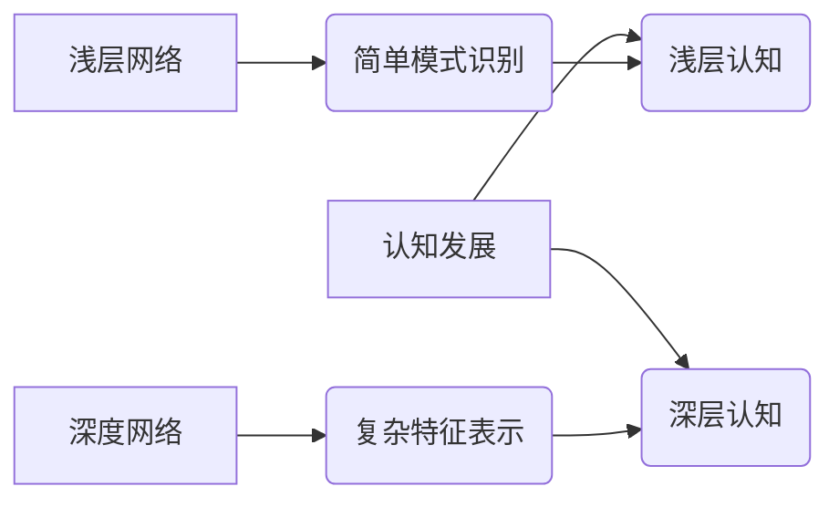

> 深度学习，浅层网络，深度网络，认知发展，人工智能，知识表示，泛化能力

## 1. 背景介绍

人工智能（AI）的蓬勃发展，特别是深度学习技术的突破，为我们带来了前所未有的机遇和挑战。深度学习模型凭借其强大的学习能力，在图像识别、自然语言处理、语音识别等领域取得了令人瞩目的成就。然而，深度学习模型的“黑盒”性质和对大规模数据依赖的特性，也引发了人们对其认知机制和泛化能力的深入思考。

认知科学研究表明，人类的认知发展是一个从浅层到深层的渐进过程。从简单的感知和反应，到复杂的推理和决策，人类认知能力不断深化和扩展。那么，深度学习模型的认知发展是否也遵循类似的规律？浅层网络和深度网络在认知发展中的角色是什么？

## 2. 核心概念与联系

**2.1 浅层网络与深度网络**

浅层网络是指层数较少的网络结构，通常由几层神经元组成。它们擅长处理简单的模式识别任务，但对复杂数据的理解能力有限。深度网络是指层数较多的网络结构，通常包含数十甚至数百层神经元。它们能够学习更复杂的特征表示，并对复杂数据进行更深入的理解。

**2.2 认知发展与网络深度**

人类的认知发展可以看作是一个从浅层到深层的渐进过程。

* **浅层认知:** 初期阶段，人类主要依靠简单的感知和反应，对周围环境进行基本的理解。这类似于浅层网络，能够处理简单的模式识别任务。
* **深层认知:** 随着认知发展，人类逐渐学习更复杂的知识和技能，并能够进行更深入的推理和决策。这类似于深度网络，能够学习更复杂的特征表示，并对复杂数据进行更深入的理解。

**2.3 核心概念关系图**



## 3. 核心算法原理 & 具体操作步骤

**3.1 算法原理概述**

深度学习的核心算法是反向传播算法（Backpropagation）。该算法通过不断调整神经网络权重，使得网络输出与实际目标值之间的误差最小化。

**3.2 算法步骤详解**

1. **前向传播:** 将输入数据通过神经网络传递，计算网络输出。
2. **误差计算:** 计算网络输出与实际目标值之间的误差。
3. **反向传播:** 将误差反向传播到网络各层，计算各层神经元的梯度。
4. **权重更新:** 根据梯度更新网络各层神经元的权重，使得网络输出更接近实际目标值。
5. **重复步骤1-4:** 重复上述步骤，直到网络误差达到预设阈值。

**3.3 算法优缺点**

* **优点:** 能够学习复杂的特征表示，对大规模数据处理能力强。
* **缺点:** 训练时间长，对计算资源要求高，容易陷入局部最优解。

**3.4 算法应用领域**

* **图像识别:** 人脸识别、物体检测、图像分类。
* **自然语言处理:** 机器翻译、文本摘要、情感分析。
* **语音识别:** 语音转文本、语音助手。
* **推荐系统:** 商品推荐、内容推荐。

## 4. 数学模型和公式 & 详细讲解 & 举例说明

**4.1 数学模型构建**

深度学习模型可以看作是一个复杂的函数映射，将输入数据映射到输出结果。

* **输入层:** 接收原始数据，每个神经元代表一个特征。
* **隐藏层:** 对输入数据进行特征提取和组合，层数越多，网络深度越大。
* **输出层:** 生成最终的输出结果，每个神经元代表一个类别或预测值。

**4.2 公式推导过程**

反向传播算法的核心是利用链式法则计算各层神经元的梯度。

* **损失函数:** 用于衡量模型预测结果与实际目标值之间的误差。常见的损失函数包括均方误差（MSE）和交叉熵损失（Cross-Entropy Loss）。
* **梯度下降:** 用于更新网络权重，使得损失函数最小化。

**4.3 案例分析与讲解**

假设我们有一个简单的深度学习模型，用于分类手写数字。输入数据为图像像素值，输出结果为数字类别。

* **损失函数:** 使用交叉熵损失函数，衡量模型预测结果与实际类别之间的差异。
* **梯度下降:** 使用随机梯度下降算法，随机选择一小批数据进行训练，并根据梯度更新网络权重。

## 5. 项目实践：代码实例和详细解释说明

**5.1 开发环境搭建**

使用Python语言和深度学习框架TensorFlow或PyTorch搭建开发环境。

**5.2 源代码详细实现**

```python
import tensorflow as tf

# 定义模型结构
model = tf.keras.models.Sequential([
    tf.keras.layers.Flatten(input_shape=(28, 28)),
    tf.keras.layers.Dense(128, activation='relu'),
    tf.keras.layers.Dense(10, activation='softmax')
])

# 编译模型
model.compile(optimizer='adam',
              loss='sparse_categorical_crossentropy',
              metrics=['accuracy'])

# 加载数据集
(x_train, y_train), (x_test, y_test) = tf.keras.datasets.mnist.load_data()

# 训练模型
model.fit(x_train, y_train, epochs=5)

# 评估模型
loss, accuracy = model.evaluate(x_test, y_test)
print('Test loss:', loss)
print('Test accuracy:', accuracy)
```

**5.3 代码解读与分析**

* **模型结构:** 定义了一个简单的深度学习模型，包含一个扁平化层、一个全连接层和一个输出层。
* **编译模型:** 使用Adam优化器、交叉熵损失函数和准确率作为评估指标。
* **加载数据集:** 使用MNIST数据集进行训练和评估。
* **训练模型:** 使用训练数据训练模型，设置训练轮数为5。
* **评估模型:** 使用测试数据评估模型的性能。

**5.4 运行结果展示**

训练完成后，模型能够准确识别手写数字。

## 6. 实际应用场景

**6.1 图像识别:**

* **自动驾驶:** 识别道路标志、车辆和行人。
* **医疗诊断:** 识别病灶、肿瘤和异常组织。
* **安防监控:** 人脸识别、行为识别和异常检测。

**6.2 自然语言处理:**

* **机器翻译:** 将文本从一种语言翻译成另一种语言。
* **聊天机器人:** 与用户进行自然语言对话。
* **文本摘要:** 自动生成文本的简要摘要。

**6.3 其他应用场景:**

* **语音识别:** 将语音转换为文本。
* **推荐系统:** 根据用户喜好推荐商品或内容。
* **金融分析:** 分析金融数据，预测市场趋势。

**6.4 未来应用展望**

深度学习技术将继续推动人工智能的发展，在更多领域发挥重要作用。例如，在医疗保健领域，深度学习可以帮助医生更快、更准确地诊断疾病；在教育领域，深度学习可以个性化学习体验，提高学习效率。

## 7. 工具和资源推荐

**7.1 学习资源推荐**

* **书籍:**
    * 深度学习 (Deep Learning) - Ian Goodfellow, Yoshua Bengio, Aaron Courville
    * 构建深度学习模型 (Hands-On Machine Learning with Scikit-Learn, Keras & TensorFlow) - Aurélien Géron
* **在线课程:**
    * 深度学习 Specialization - Andrew Ng (Coursera)
    * fast.ai - Practical Deep Learning for Coders

**7.2 开发工具推荐**

* **TensorFlow:** Google开发的开源深度学习框架。
* **PyTorch:** Facebook开发的开源深度学习框架。
* **Keras:** TensorFlow的高级API，易于使用。

**7.3 相关论文推荐**

* **AlexNet:** ImageNet Classification with Deep Convolutional Neural Networks (2012)
* **VGGNet:** Very Deep Convolutional Networks for Large-Scale Image Recognition (2014)
* **ResNet:** Deep Residual Learning for Image Recognition (2015)

## 8. 总结：未来发展趋势与挑战

**8.1 研究成果总结**

深度学习技术取得了令人瞩目的成就，在图像识别、自然语言处理等领域取得了突破性进展。

**8.2 未来发展趋势**

* **模型更深、更广:** 研究更深层次、更广阔结构的深度学习模型。
* **数据更少、更有效:** 研究利用少量数据进行训练的深度学习方法。
* **解释性更强:** 研究深度学习模型的内部机制，提高模型的可解释性。

**8.3 面临的挑战**

* **计算资源:** 训练大型深度学习模型需要大量的计算资源。
* **数据隐私:** 深度学习模型的训练需要大量数据，如何保护数据隐私是一个重要挑战。
* **伦理问题:** 深度学习模型的应用可能带来伦理问题，例如算法偏见和自动决策。

**8.4 研究展望**

未来，深度学习技术将继续发展，在更多领域发挥重要作用。我们需要不断探索新的算法、新的模型和新的应用场景，同时也要关注深度学习技术的伦理和社会影响。

## 9. 附录：常见问题与解答

**9.1 什么是深度学习？**

深度学习是一种机器学习的子领域，它使用多层神经网络来学习数据特征。

**9.2 深度学习的优势是什么？**

深度学习能够学习更复杂的特征表示，对大规模数据处理能力强，在图像识别、自然语言处理等领域取得了突破性进展。

**9.3 深度学习的局限性是什么？**

深度学习模型的训练时间长，对计算资源要求高，容易陷入局部最优解，解释性较差。

**9.4 如何学习深度学习？**

可以通过阅读书籍、参加在线课程、参与开源项目等方式学习深度学习。

作者：禅与计算机程序设计艺术 / Zen and the Art of Computer Programming


<end_of_turn>