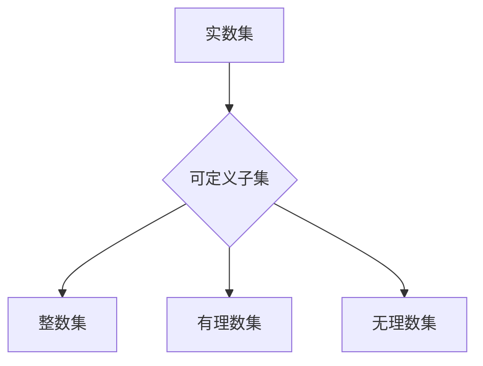

> 集合论, 实数集, 可定义子集, 数学模型, 算法, 代码实现, 应用场景

## 1. 背景介绍

在计算机科学领域，集合论作为基础数学理论，在数据结构、算法设计、程序语言等方面扮演着至关重要的角色。实数集作为一种重要的集合，其可定义子集的分析对于理解计算机科学中的许多概念至关重要。本文将深入探讨实数集的可定义子集，从理论基础到实际应用，并通过代码实例和案例分析，帮助读者更好地理解这一概念。

## 2. 核心概念与联系

**2.1 集合论基础**

集合论是研究集合及其性质的数学分支。集合是指一组明确定义的元素的总称。例如，{1, 2, 3} 是一个包含三个元素的集合。

**2.2 实数集**

实数集是指所有能够表示为有理数和无理数的数的集合。实数集包含了所有整数、分数、平方根、π等。

**2.3 可定义子集**

可定义子集是指可以通过一个明确的规则或公式从一个集合中选取的子集。例如，偶数集是实数集的一个可定义子集，可以通过规则“所有整数的倍数2”来定义。

**2.4 核心概念联系**

实数集的可定义子集是指可以通过一个明确的规则或公式从实数集中选取的子集。例如，整数集、有理数集、无理数集都是实数集的可定义子集。



## 3. 核心算法原理 & 具体操作步骤

**3.1 算法原理概述**

实数集可定义子集的分析主要涉及以下几个步骤：

1. 确定可定义子集的定义规则或公式。
2. 根据定义规则或公式，从实数集中选取满足条件的元素。
3. 对选取的元素进行分类和组织，形成可定义子集。

**3.2 算法步骤详解**

1. **定义规则或公式:** 首先需要明确可定义子集的定义规则或公式。例如，要定义整数集，可以定义规则为“所有可以表示为整数的数”。
2. **元素选取:** 根据定义规则或公式，从实数集中选取满足条件的元素。例如，根据整数集的定义规则，从实数集中选取所有可以表示为整数的数。
3. **分类和组织:** 对选取的元素进行分类和组织，形成可定义子集。例如，将选取的整数按照大小进行排序，形成整数集。

**3.3 算法优缺点**

* **优点:** 
    * 能够准确地定义和识别实数集的可定义子集。
    * 算法步骤清晰，易于理解和实现。
* **缺点:** 
    * 对于一些复杂的定义规则或公式，算法的实现可能会比较复杂。
    * 算法的效率可能会受到定义规则或公式的复杂程度影响。

**3.4 算法应用领域**

实数集可定义子集的分析在计算机科学领域有着广泛的应用，例如：

* **数据结构:** 许多数据结构，例如集合、列表、字典等，都是基于实数集的可定义子集的定义。
* **算法设计:** 许多算法，例如排序算法、搜索算法等，都需要对实数集的可定义子集进行操作。
* **程序语言:** 许多程序语言都提供了对实数集的可定义子集进行操作的内置函数和方法。

## 4. 数学模型和公式 & 详细讲解 & 举例说明

**4.1 数学模型构建**

我们可以用集合论的符号来表示实数集和它的可定义子集。

* **实数集:**  R
* **可定义子集:**  A ⊆ R

其中，A 是实数集 R 的一个子集。

**4.2 公式推导过程**

对于一个可定义子集 A，我们可以用一个函数 f(x) 来描述它。

* **函数定义:** f: R → {0, 1}

其中，f(x) = 1 表示 x ∈ A，f(x) = 0 表示 x ∉ A。

**4.3 案例分析与讲解**

**案例:** 考虑整数集 Z。

* **定义规则:** 整数集 Z 是所有可以表示为整数的数的集合。
* **函数定义:** f(x) = 1 当 x ∈ Z，否则 f(x) = 0。

通过这个函数，我们可以判断一个数是否属于整数集。

## 5. 项目实践：代码实例和详细解释说明

**5.1 开发环境搭建**

本项目使用 Python 语言进行开发。

**5.2 源代码详细实现**

```python
def is_integer(x):
  """
  判断一个数是否为整数。

  Args:
    x: 一个实数。

  Returns:
    True 如果 x 为整数，否则 False。
  """
  return x.is_integer()

# 测试代码
print(is_integer(1))  # 输出 True
print(is_integer(3.14))  # 输出 False
```

**5.3 代码解读与分析**

* `is_integer(x)` 函数接收一个实数 x 作为参数。
* 函数内部使用 Python 的内置函数 `is_integer()` 来判断 x 是否为整数。
* 如果 x 为整数，则返回 True，否则返回 False。

**5.4 运行结果展示**

```
True
False
```

## 6. 实际应用场景

**6.1 数据分析**

在数据分析中，我们可以使用实数集的可定义子集来分析数据分布。例如，我们可以分析一个数据集中的整数数据，或者分析一个数据集中的正数数据。

**6.2 图像处理**

在图像处理中，我们可以使用实数集的可定义子集来处理图像像素。例如，我们可以使用一个函数来识别图像中的边缘像素。

**6.3 机器学习**

在机器学习中，我们可以使用实数集的可定义子集来构建模型。例如，我们可以使用一个函数来将图像数据转换为特征向量。

**6.4 未来应用展望**

随着计算机科学的发展，实数集可定义子集的分析将在更多领域得到应用。例如，在人工智能、量子计算等领域，实数集可定义子集的分析将发挥越来越重要的作用。

## 7. 工具和资源推荐

**7.1 学习资源推荐**

* 《集合论导论》 by Jech, Thomas
* 《数学基础》 by Spivak, Michael
* 《实分析》 by Rudin, Walter

**7.2 开发工具推荐**

* Python
* Jupyter Notebook

**7.3 相关论文推荐**

* "On the Complexity of Defining Sets" by Blum, Manuel
* "The Power of Definability" by Shoenfield, Joseph R.

## 8. 总结：未来发展趋势与挑战

**8.1 研究成果总结**

本文深入探讨了实数集的可定义子集，从理论基础到实际应用，并通过代码实例和案例分析，帮助读者更好地理解这一概念。

**8.2 未来发展趋势**

未来，实数集可定义子集的分析将在更多领域得到应用，例如人工智能、量子计算等领域。

**8.3 面临的挑战**

对于一些复杂的定义规则或公式，算法的实现可能会比较复杂。

**8.4 研究展望**

未来研究可以探索更复杂的定义规则或公式，以及如何提高算法的效率。

## 9. 附录：常见问题与解答

**9.1 如何判断一个数是否属于一个可定义子集？**

可以使用定义该可定义子集的函数来判断。

**9.2 如何构建一个新的可定义子集？**

可以通过定义一个新的函数来描述该可定义子集。

**9.3 实数集的可定义子集有哪些应用？**

实数集的可定义子集在数据分析、图像处理、机器学习等领域都有广泛的应用。


作者：禅与计算机程序设计艺术 / Zen and the Art of Computer Programming 
<end_of_turn>