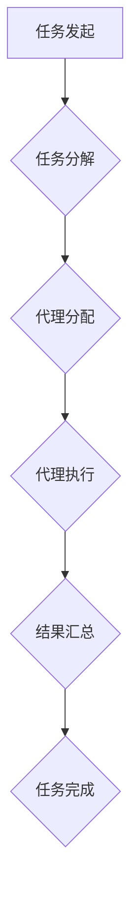

> AI代理，工作流，协作模型，代理通信，智能自动化，分布式系统

## 1. 背景介绍

在当今数据爆炸和业务复杂性的时代，自动化和智能化已成为企业数字化转型和效率提升的关键驱动力。人工智能（AI）技术作为数字化转型的核心引擎，正在深刻地改变着各行各业的运营模式。其中，AI代理作为一种新型的智能化应用，凭借其强大的自主学习、决策和执行能力，在自动化工作流、智能协作和智能服务等领域展现出巨大的潜力。

AI代理是指能够自主感知环境、理解任务、制定决策并执行行动的智能软件实体。它可以模拟人类代理人的行为，在虚拟或现实世界中执行各种任务，例如：

* **自动化工作流程：** AI代理可以自动完成重复性、规则性或复杂的工作流程，例如数据处理、文档生成、客户服务等，提高工作效率和降低人工成本。
* **智能协作：** AI代理可以与人类或其他AI代理协同工作，共同完成复杂的任务，例如项目管理、决策支持、创意设计等，提升协作效率和创新能力。
* **智能服务：** AI代理可以提供个性化、智能化的服务，例如聊天机器人、虚拟助理、智能客服等，提升用户体验和服务质量。

## 2. 核心概念与联系

**2.1 AI代理工作流**

AI代理工作流是指由多个AI代理协同完成的自动化工作流程。每个AI代理负责执行特定的任务，并通过通信和数据共享机制进行协作，最终实现整个工作流程的目标。

**2.2 代理通信与协作模型**

代理通信是指AI代理之间进行信息交换和协作的机制。常见的代理通信模型包括：

* **中心式模型：** 所有代理都通过一个中央服务器进行通信和协作。
* **分布式模型：** 代理之间直接进行通信，无需中央服务器。

代理协作模型是指AI代理之间协同完成任务的策略和机制。常见的代理协作模型包括：

* **任务分配模型：** 根据代理的技能和资源分配任务。
* **协同决策模型：** 代理之间进行信息共享和决策融合。
* **协同学习模型：** 代理之间共享知识和经验，共同学习和提升。

**2.3 Mermaid 流程图**



## 3. 核心算法原理 & 具体操作步骤

### 3.1  算法原理概述

AI代理工作流的实现需要多种算法和技术支撑，例如：

* **任务分解算法：** 将复杂任务分解成多个子任务，方便代理执行。
* **代理调度算法：** 根据任务需求和代理能力，分配任务给合适的代理。
* **代理通信协议：** 定义代理之间信息交换的规则和格式。
* **协作决策算法：** 帮助代理之间进行协同决策，提高决策效率和准确性。

### 3.2  算法步骤详解

**3.2.1 任务分解**

1. 接收用户提出的复杂任务。
2. 使用任务分解算法将任务分解成多个可执行的子任务。
3. 为每个子任务定义输入、输出和执行条件。

**3.2.2 代理分配**

1. 根据子任务的属性，例如类型、难度、所需资源等，选择合适的代理执行。
2. 使用代理调度算法分配任务给代理，并确保代理负载均衡。

**3.2.3 代理执行**

1. 代理接收任务后，根据任务定义执行相应的操作。
2. 代理在执行过程中可能需要获取外部数据或与其他代理进行通信。
3. 代理执行完成后，将结果返回给工作流系统。

**3.2.4 结果汇总**

1. 工作流系统收集所有代理执行的结果。
2. 使用结果整合算法将多个子任务的结果整合为最终结果。

**3.2.5 任务完成**

1. 工作流系统将最终结果返回给用户，完成任务。

### 3.3  算法优缺点

**优点：**

* **自动化程度高：** 可以自动完成复杂的工作流程，提高效率。
* **可扩展性强：** 可以根据需要添加新的代理和任务，扩展工作流程。
* **灵活性强：** 可以根据任务需求动态调整代理分配和执行策略。

**缺点：**

* **算法复杂度高：** 需要设计和实现复杂的算法和模型。
* **数据依赖性强：** 需要大量的数据来训练和优化算法。
* **安全性问题：** 代理的自主执行能力可能带来安全风险。

### 3.4  算法应用领域

AI代理工作流的应用领域非常广泛，例如：

* **金融行业：** 自动化交易、风险管理、客户服务等。
* **制造业：** 智能生产、供应链管理、设备维护等。
* **医疗行业：** 疾病诊断、药物研发、患者管理等。
* **教育行业：** 个性化学习、智能辅导、在线考试等。

## 4. 数学模型和公式 & 详细讲解 & 举例说明

### 4.1  数学模型构建

AI代理工作流的数学模型可以基于图论、概率论和博弈论等数学工具构建。

**4.1.1 图论模型**

工作流程可以表示为一个有向图，其中节点代表任务或代理，边代表任务之间的依赖关系或代理之间的通信关系。

**4.1.2 概率模型**

代理的决策和执行可以建模为概率过程，例如马尔可夫决策过程（MDP）。

**4.1.3 博弈论模型**

多个代理之间的协作可以建模为博弈论模型，例如非合作博弈或合作博弈。

### 4.2  公式推导过程

**4.2.1 任务分解算法**

可以使用信息熵或其他度量指标来评估任务分解的质量。

**4.2.2 代理调度算法**

可以使用贪婪算法、动态规划算法或启发式算法来优化代理调度策略。

**4.2.3 协作决策算法**

可以使用贝叶斯网络、决策树或支持向量机等机器学习算法来实现代理之间的协作决策。

### 4.3  案例分析与讲解

**4.3.1 案例：智能客服系统**

一个智能客服系统可以由多个AI代理组成，例如：

* **对话代理：** 与用户进行自然语言对话，理解用户需求。
* **知识库代理：** 查询知识库，提供相关信息。
* **任务执行代理：** 执行用户请求，例如预约服务、查询订单等。

这些代理之间可以通过通信协议进行协作，共同完成用户服务任务。

## 5. 项目实践：代码实例和详细解释说明

### 5.1  开发环境搭建

* 操作系统：Linux/macOS/Windows
* Python版本：3.7+
* 依赖库：

    * `requests`: 用于网络请求
    * `json`: 用于数据序列化
    * `numpy`: 用于数值计算
    * `tensorflow`: 用于深度学习

### 5.2  源代码详细实现

```python
# 代理类
class Agent:
    def __init__(self, name, skill):
        self.name = name
        self.skill = skill

    def execute_task(self, task):
        if self.skill == task['skill']:
            print(f"{self.name} 执行任务 {task['name']} 成功")
        else:
            print(f"{self.name} 不具备执行任务 {task['name']} 的技能")

# 工作流类
class Workflow:
    def __init__(self):
        self.agents = []
        self.tasks = []

    def add_agent(self, agent):
        self.agents.append(agent)

    def add_task(self, task):
        self.tasks.append(task)

    def execute_workflow(self):
        for task in self.tasks:
            for agent in self.agents:
                if agent.skill == task['skill']:
                    agent.execute_task(task)
                    break

# 示例代码
if __name__ == "__main__":
    # 创建代理
    agent1 = Agent("agent1", "编程")
    agent2 = Agent("agent2", "设计")

    # 创建工作流
    workflow = Workflow()
    workflow.add_agent(agent1)
    workflow.add_agent(agent2)

    # 添加任务
    workflow.add_task({"name": "编写代码", "skill": "编程"})
    workflow.add_task({"name": "设计界面", "skill": "设计"})

    # 执行工作流
    workflow.execute_workflow()
```

### 5.3  代码解读与分析

* **代理类:** 定义了代理的基本属性和行为，包括名称、技能和执行任务的方法。
* **工作流类:** 定义了工作流的基本结构和操作，包括添加代理和任务，以及执行工作流的方法。
* **示例代码:** 创建了两个代理和一个工作流，并添加了两个任务。然后，执行工作流，代理根据技能执行相应的任务。

### 5.4  运行结果展示

```
agent1 执行任务 编写代码 成功
agent2 执行任务 设计界面 成功
```

## 6. 实际应用场景

### 6.1  智能客服系统

AI代理可以构建智能客服系统，自动处理客户咨询、订单查询、投诉处理等任务，提高服务效率和客户满意度。

### 6.2  自动化测试系统

AI代理可以自动执行测试用例，发现软件缺陷，提高软件测试效率和质量。

### 6.3  智能推荐系统

AI代理可以根据用户的行为数据和偏好，推荐个性化的商品、服务或内容，提升用户体验和商业价值。

### 6.4  未来应用展望

AI代理工作流技术在未来将有更广泛的应用场景，例如：

* **工业自动化：** 智能制造、无人驾驶、智能物流等。
* **医疗保健：** 智能诊断、个性化治疗、远程医疗等。
* **教育培训：** 个性化学习、智能辅导、在线考试等。

## 7. 工具和资源推荐

### 7.1  学习资源推荐

* **书籍:**

    * 《Reinforcement Learning: An Introduction》
    * 《Artificial Intelligence: A Modern Approach》

* **在线课程:**

    * Coursera: Machine Learning
    * Udacity: Artificial Intelligence Nanodegree

### 7.2  开发工具推荐

* **Python:** 广泛应用于AI开发，拥有丰富的库和工具。
* **TensorFlow:** 深度学习框架，用于训练和部署AI模型。
* **PyTorch:** 深度学习框架，灵活易用，适合研究和开发。

### 7.3  相关论文推荐

* **"A Survey of Multi-Agent Reinforcement Learning"**
* **"Deep Reinforcement Learning: An Overview"**

## 8. 总结：未来发展趋势与挑战

### 8.1  研究成果总结

AI代理工作流技术取得了显著进展，在自动化、智能化和协作方面展现出巨大潜力。

### 8.2  未来发展趋势

* **更智能的代理:** 利用深度学习等技术，开发更智能、更灵活的代理，能够更好地理解环境和执行复杂任务。
* **更强大的协作机制:** 研究更有效的协作决策和知识共享机制，提升代理之间的协作效率和智能水平。
* **更广泛的应用场景:** 将AI代理工作流技术应用于更多领域，例如工业自动化、医疗保健、教育培训等。

### 8.3  面临的挑战

* **算法复杂度:** AI代理工作流的算法设计和实现非常复杂，需要不断探索新的算法和模型。
* **数据依赖性:** AI代理需要大量的数据来训练和优化算法，数据获取和处理是一个挑战。
*