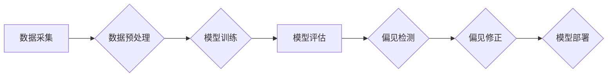

> AI, 人工智能, 算法偏见, 机器学习, 深度学习, 数据科学, 算法公平性, 偏差修正

## 1. 背景介绍

人工智能（AI）技术近年来发展迅速，在各个领域取得了令人瞩目的成就。从自动驾驶汽车到医疗诊断，从个性化推荐到金融风险评估，AI正在深刻地改变着我们的生活。然而，随着AI技术的广泛应用，一个不容忽视的问题逐渐浮出水面：算法偏见。

算法偏见是指AI算法在训练过程中由于数据本身的偏差而导致的歧视性结果。这种偏见可能源于训练数据中存在的社会、文化、经济等方面的差异，最终导致AI系统对不同群体做出不公平、不准确的判断。

例如，在招聘领域，如果AI招聘系统训练数据中男性占据主导地位，那么该系统可能会倾向于选择男性候选人，从而导致女性在招聘过程中处于劣势。

## 2. 核心概念与联系

**2.1 算法偏见产生的原因**

* **数据偏差:** 训练数据本身可能存在偏见，例如种族、性别、年龄、地域等方面的差异。
* **算法设计缺陷:** 算法的设计本身可能存在缺陷，导致算法对某些特征过度敏感，从而放大数据中的偏见。
* **环境因素:** 算法运行的环境因素，例如社会文化背景、法律法规等，也可能影响算法的公平性。

**2.2 算法偏见的影响**

* **社会不公平:** 算法偏见可能导致社会资源分配不均，加剧社会分化。
* **个人权益损害:** 算法偏见可能损害个人的名誉、声誉、就业机会等权益。
* **技术信任危机:** 算法偏见可能导致公众对AI技术的信任度下降。

**2.3 算法偏见检测与修正**

* **偏见检测:** 使用统计方法、机器学习模型等技术检测算法是否存在偏见。
* **偏见修正:** 通过数据预处理、算法调整、公平性约束等方法修正算法的偏见。

**Mermaid 流程图**



## 3. 核心算法原理 & 具体操作步骤

### 3.1  算法原理概述

算法偏见检测和修正涉及到多种机器学习算法和技术，例如：

* **分类算法:** 用于检测算法是否对不同类别进行不公平的分类。
* **回归算法:** 用于检测算法是否对不同群体进行不公平的预测。
* **公平性约束:** 在算法训练过程中引入公平性约束，例如确保不同群体获得相同的预测准确率。

### 3.2  算法步骤详解

**3.2.1 数据预处理**

* **数据清洗:** 去除数据中的缺失值、异常值等。
* **数据转换:** 将数据转换为算法可处理的格式。
* **特征工程:** 选择和提取与算法任务相关的特征。

**3.2.2 模型训练**

* 选择合适的机器学习算法进行模型训练。
* 使用训练数据训练模型，并评估模型的性能。

**3.2.3 偏见检测**

* 使用统计方法、机器学习模型等技术检测算法是否存在偏见。
* 常见的偏见度量指标包括：准确率、召回率、F1-score、AUC等。

**3.2.4 偏见修正**

* 使用数据预处理、算法调整、公平性约束等方法修正算法的偏见。
* 数据预处理方法包括：数据重采样、特征重新编码等。
* 算法调整方法包括：调整模型参数、使用公平性感知算法等。
* 公平性约束方法包括：引入公平性损失函数、使用公平性正则化等。

**3.2.5 模型评估**

* 使用测试数据评估修正后的模型性能。
* 确保修正后的模型在不同群体上表现公平。

### 3.3  算法优缺点

**优点:**

* 可以有效检测和修正算法中的偏见。
* 可以提高算法的公平性和可解释性。

**缺点:**

* 偏见检测和修正是一个复杂的任务，需要专业的知识和技术。
* 算法的公平性是一个相对的概念，难以量化和评估。

### 3.4  算法应用领域

* **招聘:** 避免算法对候选人的性别、种族等特征进行歧视性判断。
* **金融:** 避免算法对借款人的收入、信用评分等特征进行不公平的评估。
* **医疗:** 避免算法对患者的种族、性别等特征进行不公平的诊断和治疗建议。
* **司法:** 避免算法对被告人的种族、性别等特征进行不公平的判决。

## 4. 数学模型和公式 & 详细讲解 & 举例说明

### 4.1  数学模型构建

**4.1.1 偏见度量指标**

* **Disparate Impact (DI):**  衡量算法对不同群体的影响差异。

$$DI = \frac{TP_1 + FN_1}{TP_1 + FP_1 + TN_1 + FN_1} / \frac{TP_2 + FN_2}{TP_2 + FP_2 + TN_2 + FN_2}$$

其中：

* $TP_1$ 和 $TP_2$ 分别表示算法对两个群体的正例预测正确数。
* $FN_1$ 和 $FN_2$ 分别表示算法对两个群体的正例预测错误数。
* $FP_1$ 和 $FP_2$ 分别表示算法对两个群体的负例预测错误数。
* $TN_1$ 和 $TN_2$ 分别表示算法对两个群体的负例预测正确数。

* **Equalized Odds (EO):** 衡量算法对不同群体进行预测的准确率差异。

$$EO = \frac{TPR_1 \cdot FPR_1}{TPR_2 \cdot FPR_2}$$

其中：

* $TPR_1$ 和 $TPR_2$ 分别表示算法对两个群体的正例预测准确率。
* $FPR_1$ 和 $FPR_2$ 分别表示算法对两个群体的负例预测准确率。

**4.1.2 公平性约束**

* **公平性损失函数:** 在模型训练过程中引入公平性损失函数，例如：

$$L_{fair} = \lambda \cdot ||\hat{y}_1 - \hat{y}_2||^2$$

其中：

* $\hat{y}_1$ 和 $\hat{y}_2$ 分别表示算法对两个群体的预测结果。
* $\lambda$ 是一个权重参数，用于控制公平性损失函数的影响。

* **公平性正则化:** 在模型训练过程中对模型参数进行正则化，例如：

$$L_{reg} = \alpha \cdot ||\theta||^2$$

其中：

* $\theta$ 是模型参数。
* $\alpha$ 是一个正则化参数，用于控制正则化项的影响。

### 4.2  公式推导过程

**4.2.1 Disparate Impact (DI) 公式推导**

DI 公式的推导过程基于概率论和统计学原理。

* 假设存在两个群体，分别为群体1和群体2。
* 假设算法对群体1和群体2的预测结果分别为 $TP_1$, $FN_1$, $FP_1$, $TN_1$ 和 $TP_2$, $FN_2$, $FP_2$, $TN_2$。
* DI 公式可以表示为两个群体的预测准确率的比值。

**4.2.2 Equalized Odds (EO) 公式推导**

EO 公式的推导过程基于概率论和统计学原理。

* 假设存在两个群体，分别为群体1和群体2。
* 假设算法对群体1和群体2的预测结果分别为 $TP_1$, $FN_1$, $FP_1$, $TN_1$ 和 $TP_2$, $FN_2$, $FP_2$, $TN_2$。
* EO 公式可以表示为两个群体的正例预测准确率和负例预测准确率的比值。

### 4.3  案例分析与讲解

**4.3.1 医疗诊断案例**

假设一个AI系统用于诊断心脏病，训练数据中男性患者的比例高于女性患者。如果算法没有进行偏见修正，可能会导致该系统对女性患者的诊断结果不准确，从而导致女性患者无法及时获得治疗。

**4.3.2 贷款审批案例**

假设一个AI系统用于审批贷款申请，训练数据中高收入人群的贷款申请比例高于低收入人群。如果算法没有进行偏见修正，可能会导致该系统对低收入人群的贷款申请审批率较低，从而加剧社会经济不平等。

## 5. 项目实践：代码实例和详细解释说明

### 5.1  开发环境搭建

* **操作系统:** Ubuntu 20.04 LTS
* **编程语言:** Python 3.8
* **深度学习框架:** TensorFlow 2.0
* **数据处理库:** Pandas, NumPy
* **可视化库:** Matplotlib, Seaborn

### 5.2  源代码详细实现

```python
import pandas as pd
from sklearn.model_selection import train_test_split
from sklearn.linear_model import LogisticRegression
from sklearn.metrics import accuracy_score, classification_report

# 加载数据
data = pd.read_csv('loan_data.csv')

# 划分训练集和测试集
X = data.drop('loan_approved', axis=1)
y = data['loan_approved']
X_train, X_test, y_train, y_test = train_test_split(X, y, test_size=0.2, random_state=42)

# 训练模型
model = LogisticRegression()
model.fit(X_train, y_train)

# 预测结果
y_pred = model.predict(X_test)

# 评估模型性能
accuracy = accuracy_score(y_test, y_pred)
print(f'Accuracy: {accuracy}')
print(classification_report(y_test, y_pred))
```

### 5.3  代码解读与分析

* **数据加载:** 使用Pandas库加载贷款数据。
* **数据划分:** 使用train_test_split函数将数据划分为训练集和测试集。
* **模型训练:** 使用LogisticRegression模型训练贷款审批算法。
* **模型预测:** 使用训练好的模型对测试集进行预测。
* **模型评估:** 使用accuracy_score和classification_report函数评估模型的性能。

### 5.4  运行结果展示

运行上述代码后，可以得到模型的准确率和分类报告，评估模型的性能。

## 6. 实际应用场景

### 6.1  医疗诊断

* **癌症筛查:** AI系统可以分析患者的影像数据，例如X光片、CT扫描等，帮助医生早期发现癌症。
* **疾病诊断:** AI系统可以分析患者的症状、病史、实验室检查结果等信息，帮助医生诊断疾病。

### 6.2  金融服务

* **贷款审批:** AI系统可以分析借款人的信用评分、收入、资产等信息，帮助银行审批贷款申请。
* **欺诈检测:** AI系统可以分析交易数据，识别异常交易，帮助金融机构防范欺诈行为。

### 6.3  教育

* **个性化学习:** AI系统可以根据学生的学习进度和能力，提供个性化的学习内容和建议。
* **自动批改作业:** AI系统可以自动批改学生的作业，帮助老师节省时间和精力。

### 6.4  未来应用展望

* **自动驾驶:** AI系统可以帮助汽车自动驾驶，提高交通安全和效率。
* **机器人技术:** AI系统可以赋予机器人更强的智能和自主性，用于工业生产、服务