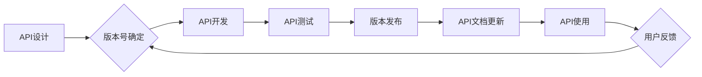
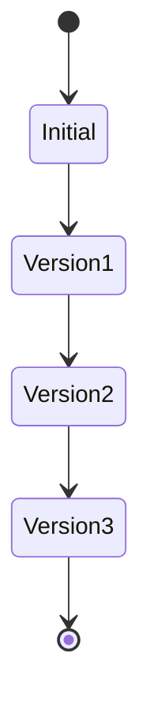

> API版本控制，版本管理，API文档，API设计，API测试，API生命周期

## 1. 背景介绍

在当今以API为中心的软件架构时代，API版本控制已成为确保软件稳定性和可维护性的关键要素。随着应用程序的不断演进和需求的变化，API需要不断更新和改进。然而，频繁的API更改可能会导致现有应用程序的兼容性问题，从而引发一系列问题，例如：

* **应用程序崩溃或错误：** 当应用程序依赖于旧版本的API时，新版本的API更改可能会导致应用程序无法正常运行。
* **数据不一致：** 不同版本的API可能使用不同的数据格式或结构，导致数据不一致。
* **维护成本增加：** 需要不断维护和更新依赖于旧版本的API的应用程序，这会增加开发和维护成本。

因此，有效的API版本控制策略至关重要，它可以帮助我们：

* **确保API的稳定性和兼容性：** 通过版本控制，我们可以确保应用程序能够与最新的API版本兼容，同时避免因API更改而导致的兼容性问题。
* **简化API的维护和更新：** 版本控制可以帮助我们跟踪API的更改历史，并更容易地管理和更新API。
* **提高开发效率：** 版本控制可以帮助开发人员更轻松地协作，并减少因API更改而导致的冲突。

## 2. 核心概念与联系

API版本控制的核心概念包括：

* **版本号：** 用于标识API的不同版本。版本号通常采用语义化版本号（Semantic Versioning）格式，例如 `1.2.3`，其中 `1` 表示主要版本号， `2` 表示次要版本号， `3` 表示修订版本号。
* **版本管理系统：** 用于管理API的版本历史记录和发布流程。常见的版本管理系统包括 Git、SVN 和 Mercurial。
* **API文档：** 用于描述API的功能、接口和使用方式的文档。API文档需要与相应的API版本保持一致。
* **API测试：** 用于验证API功能和兼容性的测试。API测试需要针对不同的API版本进行。

**API版本控制流程图:**



## 3. 核心算法原理 & 具体操作步骤

### 3.1  算法原理概述

API版本控制的核心算法原理是基于版本管理系统的版本控制机制。版本管理系统通过跟踪代码的修改历史记录，并提供版本管理和回滚功能，来实现API版本的管理。

### 3.2  算法步骤详解

1. **版本号确定：** 在API设计阶段，需要确定API的版本号。版本号通常采用语义化版本号格式，例如 `1.2.3`。
2. **API开发：** 开发人员根据API设计文档开发API代码。
3. **API测试：** 开发人员需要对API进行测试，以确保API的功能和兼容性。
4. **版本发布：** 当API测试通过后，可以发布新的API版本。
5. **API文档更新：** API文档需要与相应的API版本保持一致，因此需要在发布新版本后更新API文档。
6. **API使用：** 用户可以使用最新的API版本进行开发和集成。
7. **用户反馈：** 用户可以使用API后，可能会反馈一些问题或建议。这些反馈可以用于改进API的设计和开发。

### 3.3  算法优缺点

**优点：**

* **版本管理：** 可以方便地管理API的版本历史记录。
* **兼容性：** 可以确保不同版本的API兼容性。
* **协作开发：** 可以方便多个开发人员协同开发API。

**缺点：**

* **复杂性：** API版本控制的流程相对复杂，需要一定的学习成本。
* **维护成本：** 需要维护多个版本的API，可能会增加维护成本。

### 3.4  算法应用领域

API版本控制广泛应用于各种软件开发领域，例如：

* **Web服务：** 用于管理Web服务的API版本。
* **移动应用：** 用于管理移动应用的API版本。
* **云计算：** 用于管理云计算平台的API版本。

## 4. 数学模型和公式 & 详细讲解 & 举例说明

API版本控制的数学模型可以抽象为一个状态机模型，其中每个状态代表一个API版本，状态之间的转换代表API版本的更新。

**状态机模型:**



**状态转换规则:**

* 从初始状态到第一个版本状态的转换需要满足API设计和开发完成的条件。
* 从一个版本状态到下一个版本状态的转换需要满足API测试通过和版本发布的条件。

**举例说明:**

假设一个API的初始版本号为 `1.0.0`，经过多次迭代更新，最终版本号为 `2.0.0`。

* 状态转换规则可以描述为：

    * `1.0.0` -> `1.1.0`：API测试通过，版本发布。
    * `1.1.0` -> `1.2.0`：API测试通过，版本发布。
    * `1.2.0` -> `2.0.0`：API测试通过，版本发布。

## 5. 项目实践：代码实例和详细解释说明

### 5.1  开发环境搭建

* 语言：Python
* 版本管理系统：Git
* API框架：Flask

### 5.2  源代码详细实现

```python
from flask import Flask, jsonify

app = Flask(__name__)

# API版本信息
API_VERSION = "1.0.0"

@app.route('/api/v1/data', methods=['GET'])
def get_data():
    data = {'message': f'API Version: {API_VERSION}'}
    return jsonify(data)

if __name__ == '__main__':
    app.run(debug=True)
```

### 5.3  代码解读与分析

* `API_VERSION` 变量存储了当前API的版本号。
* `/api/v1/data` 路由定义了一个获取数据的API接口。
* 接口返回的数据包含了API的版本号信息。

### 5.4  运行结果展示

运行代码后，访问 `http://127.0.0.1:5000/api/v1/data`，可以获取以下JSON数据：

```json
{
  "message": "API Version: 1.0.0"
}
```

## 6. 实际应用场景

API版本控制在实际应用场景中具有广泛的应用价值，例如：

* **电商平台：** 电商平台的API需要支持多种支付方式、物流方式和配送方式，API版本控制可以帮助管理这些不同的API版本。
* **社交媒体平台：** 社交媒体平台的API需要支持多种用户行为，例如发布帖子、评论、点赞等，API版本控制可以帮助管理这些不同的API版本。
* **金融服务平台：** 金融服务平台的API需要支持多种金融业务，例如转账、支付、理财等，API版本控制可以帮助管理这些不同的API版本。

### 6.4  未来应用展望

随着API经济的蓬勃发展，API版本控制将变得更加重要。未来，API版本控制可能会朝着以下方向发展：

* **自动化版本管理：** 利用人工智能和机器学习技术，自动生成API版本号、管理API版本历史记录和发布新版本。
* **API生命周期管理：** 将API版本控制与API生命周期管理相结合，实现对API的完整生命周期管理。
* **API版本兼容性测试：** 利用自动化测试工具，对不同版本的API进行兼容性测试，确保API的稳定性和兼容性。

## 7. 工具和资源推荐

### 7.1  学习资源推荐

* **Semantic Versioning:** https://semver.org/
* **Git:** https://git-scm.com/
* **RESTful API Design:** https://restfulapi.net/

### 7.2  开发工具推荐

* **Postman:** https://www.postman.com/
* **Swagger:** https://swagger.io/

### 7.3  相关论文推荐

* **API Versioning: A Survey:** https://dl.acm.org/doi/10.1145/3341188.3341209

## 8. 总结：未来发展趋势与挑战

### 8.1  研究成果总结

API版本控制已成为现代软件开发中不可或缺的一部分，它可以帮助我们管理API的版本历史记录、确保API的兼容性和稳定性，提高开发效率。

### 8.2  未来发展趋势

未来，API版本控制将朝着自动化、智能化和集成化方向发展，并与API生命周期管理、API兼容性测试等技术相结合，形成更加完善的API管理体系。

### 8.3  面临的挑战

API版本控制也面临一些挑战，例如：

* **版本管理复杂性：** 随着API的不断更新和迭代，版本管理的复杂性会不断增加。
* **兼容性问题：** 不同版本的API之间可能存在兼容性问题，需要进行严格的测试和验证。
* **维护成本：** 需要维护多个版本的API，可能会增加维护成本。

### 8.4  研究展望

未来，我们需要继续研究和探索新的API版本控制技术和方法，以解决上述挑战，并推动API版本控制技术的进一步发展。

## 9. 附录：常见问题与解答

**常见问题：**

* 如何确定API的版本号？
* 如何管理API的版本历史记录？
* 如何测试不同版本的API兼容性？

**解答：**

* API的版本号通常采用语义化版本号格式，例如 `1.2.3`。
* 可以使用版本管理系统，例如 Git，来管理API的版本历史记录。
* 可以使用自动化测试工具，例如 Postman，来测试不同版本的API兼容性。


作者：禅与计算机程序设计艺术 / Zen and the Art of Computer Programming 
<end_of_turn>