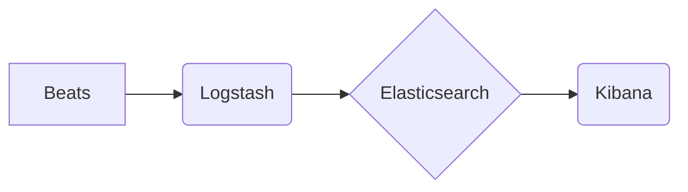

ElasticSearch, Kibana, Elasticsearch, Kibana, Logstash, Beats, ELK Stack, Full-Text Search, Data Visualization, Real-time Analytics

## 1. 背景介绍

在当今数据爆炸的时代，海量数据的收集、存储、分析和可视化已成为企业数字化转型和智能决策的关键。Elasticsearch 和 Kibana 作为开源的搜索和分析平台，凭借其强大的功能和灵活的架构，在日志分析、监控、搜索和数据可视化等领域得到了广泛应用。

Elasticsearch 是一个基于分布式架构的全文搜索引擎，它能够快速高效地索引和检索海量文本数据。Kibana 是一个基于 Elasticsearch 的数据可视化和分析工具，它可以将 Elasticsearch 中的数据以图表、仪表盘和地图等形式展示出来，帮助用户直观地了解数据趋势和异常情况。

## 2. 核心概念与联系

Elasticsearch 和 Kibana 共同构成了 ELK Stack 的核心组件，ELK Stack 还包括 Logstash 和 Beats 等工具，它们共同形成了一个完整的日志收集、分析和可视化平台。

**ELK Stack 架构图**



* **Beats:** 用于收集各种类型的日志和数据，并将其发送到 Logstash。
* **Logstash:** 用于接收、过滤、转换和发送数据到 Elasticsearch。
* **Elasticsearch:** 用于存储和索引数据，并提供全文搜索和分析功能。
* **Kibana:** 用于可视化和分析 Elasticsearch 中的数据。

## 3. 核心算法原理 & 具体操作步骤

### 3.1  算法原理概述

Elasticsearch 的核心算法是基于倒排索引的全文搜索算法。倒排索引是一种数据结构，它将文档中的每个词语映射到包含该词语的所有文档的列表中。

**倒排索引原理**

1. 首先，将所有文档中的词语进行分词和去重。
2. 然后，为每个词语创建一个倒排索引项，该项包含该词语出现的文档列表。
3. 最后，将所有倒排索引项存储在磁盘上。

当用户进行搜索时，Elasticsearch 会根据用户的查询词语，从倒排索引中查找包含该词语的文档列表，并返回这些文档。

### 3.2  算法步骤详解

1. **分词:** 将文档中的文本分割成单个词语。
2. **去重:** 去除重复的词语。
3. **构建倒排索引:** 为每个词语创建一个倒排索引项，该项包含该词语出现的文档列表。
4. **存储倒排索引:** 将所有倒排索引项存储在磁盘上。
5. **搜索:** 当用户进行搜索时，Elasticsearch 会根据用户的查询词语，从倒排索引中查找包含该词语的文档列表，并返回这些文档。

### 3.3  算法优缺点

**优点:**

* **快速高效:** 倒排索引算法能够快速高效地检索海量文本数据。
* **灵活扩展:** Elasticsearch 的分布式架构能够轻松扩展到更大的数据规模。
* **丰富的功能:** Elasticsearch 提供了丰富的搜索和分析功能，例如全文搜索、模糊查询、聚合分析等。

**缺点:**

* **存储空间占用:** 倒排索引算法需要占用较大的存储空间。
* **更新成本:** 当文档发生更新时，需要更新相应的倒排索引项，这可能会带来一定的成本。

### 3.4  算法应用领域

倒排索引算法广泛应用于搜索引擎、信息检索、文本分析等领域。

## 4. 数学模型和公式 & 详细讲解 & 举例说明

### 4.1  数学模型构建

Elasticsearch 的搜索算法可以抽象为一个数学模型，其中用户查询词语作为输入，搜索引擎返回包含该词语的文档列表作为输出。

**数学模型:**

```
S(Q) = {D | D ∈ D, Q ⊆ T(D)}
```

其中:

* S(Q) 表示用户查询词语 Q 的搜索结果集。
* D 表示文档集合。
* T(D) 表示文档 D 中的词语集合。
* Q ⊆ T(D) 表示用户查询词语 Q 是文档 D 中词语集合 T(D) 的子集。

### 4.2  公式推导过程

根据倒排索引算法的原理，我们可以推导出以下公式：

```
S(Q) = ⋃_{t ∈ Q} I(t)
```

其中:

* I(t) 表示词语 t 的倒排索引项，即包含该词语的所有文档列表。

### 4.3  案例分析与讲解

假设我们有一个包含三个文档的集合 D，以及一个用户查询词语 Q = {"苹果"，"香蕉"}。

* D1: "苹果香蕉橘子"
* D2: "香蕉苹果梨子"
* D3: "橘子葡萄"

根据倒排索引算法，我们可以构建以下倒排索引：

* I("苹果") = {D1, D2}
* I("香蕉") = {D1, D2}

因此，根据公式 S(Q) = ⋃_{t ∈ Q} I(t)，我们可以得到搜索结果集 S(Q) = {D1, D2}。

## 5. 项目实践：代码实例和详细解释说明

### 5.1  开发环境搭建

为了方便演示，我们使用 Docker 容器进行开发环境搭建。

1. 安装 Docker。
2. 下载 Elasticsearch 和 Kibana 的 Docker 镜像。
3. 启动 Elasticsearch 和 Kibana 容器。

### 5.2  源代码详细实现

由于 Elasticsearch 和 Kibana 的代码量庞大，这里只展示部分代码示例，例如如何使用 Elasticsearch 的 Java API 进行数据索引和查询。

```java
// 数据索引
client.prepareIndex("my_index", "my_type", "1")
    .setSource("{\"name\":\"John Doe\",\"age\":30}")
    .execute().actionGet();

// 数据查询
SearchResponse response = client.prepareSearch("my_index")
    .setQuery(QueryBuilders.matchQuery("name", "John"))
    .execute().actionGet();

// 处理查询结果
for (SearchHit hit : response.getHits().getHits()) {
    System.out.println(hit.getSourceAsString());
}
```

### 5.3  代码解读与分析

* **数据索引:** 使用 `client.prepareIndex()` 方法创建索引请求，指定索引名称、文档类型和文档 ID，然后使用 `setSource()` 方法设置文档内容，最后使用 `execute().actionGet()` 方法执行请求并获取结果。
* **数据查询:** 使用 `client.prepareSearch()` 方法创建查询请求，指定索引名称，然后使用 `setQuery()` 方法设置查询条件，最后使用 `execute().actionGet()` 方法执行请求并获取结果。
* **处理查询结果:** 使用 `response.getHits().getHits()` 方法获取查询结果，然后遍历结果集，打印每个文档的内容。

### 5.4  运行结果展示

运行上述代码后，将会在 Elasticsearch 中创建名为 "my_index" 的索引，并添加一个名为 "John Doe" 的文档。然后，查询名为 "John" 的文档，并将结果打印到控制台。

## 6. 实际应用场景

Elasticsearch 和 Kibana 在各种实际应用场景中得到了广泛应用，例如：

### 6.1  日志分析

Elasticsearch 可以收集、存储和分析来自各种应用程序和系统的日志数据，帮助用户监控系统运行状态、识别异常情况和进行故障诊断。

### 6.2  监控和告警

Elasticsearch 可以收集和分析来自各种监控指标的数据，例如 CPU 使用率、内存使用率、网络流量等，并设置告警规则，以便及时通知管理员潜在问题。

### 6.3  搜索和检索

Elasticsearch 可以用于构建强大的全文搜索引擎，帮助用户快速高效地检索海量文本数据，例如网站内容、文档库、知识库等。

### 6.4  数据可视化

Kibana 可以将 Elasticsearch 中的数据以图表、仪表盘和地图等形式展示出来，帮助用户直观地了解数据趋势和异常情况。

## 7. 工具和资源推荐

### 7.1  学习资源推荐

* Elasticsearch 官方文档: https://www.elastic.co/guide/en/elasticsearch/reference/current/index.html
* Kibana 官方文档: https://www.elastic.co/guide/en/kibana/current/index.html
* Elasticsearch 中文社区: https://www.elastic.co/cn

### 7.2  开发工具推荐

* Docker: https://www.docker.com/
* Elasticsearch Java API: https://www.elastic.co/guide/en/elasticsearch/client/java-rest/current/java-rest-client.html

### 7.3  相关论文推荐

* Elasticsearch: A Scalable Open-Source Search Platform
* Kibana: A Data Visualization and Analysis Tool for Elasticsearch

## 8. 总结：未来发展趋势与挑战

### 8.1  研究成果总结

Elasticsearch 和 Kibana 作为开源的搜索和分析平台，在数据收集、存储、分析和可视化等领域取得了显著的成果，为企业数字化转型和智能决策提供了强大的工具支持。

### 8.2  未来发展趋势

* **云原生化:** Elasticsearch 和 Kibana 将更加注重云原生化部署和管理，支持 Kubernetes 等容器编排平台。
* **人工智能集成:** Elasticsearch 和 Kibana 将更加深入地集成人工智能技术，例如机器学习和自然语言处理，提供更智能的分析和预测功能。
* **数据安全:** Elasticsearch 和 Kibana 将更加注重数据安全和隐私保护，提供更完善的安全机制和数据加密功能。

### 8.3  面临的挑战

* **数据规模增长:** 海量数据的增长对 Elasticsearch 和 Kibana 的性能和存储能力提出了更高的要求。
* **数据复杂性:** 数据的复杂性和多样性增加了数据分析和可视化的难度。
* **人才短缺:** Elasticsearch 和 Kibana 的开发和运维需要专业的技术人才，人才短缺是制约其发展的瓶颈。

### 8.4  研究展望

未来，Elasticsearch 和 Kibana 将继续朝着云原生化、人工智能化和数据安全化的方向发展，为企业提供更强大、更智能、更安全的搜索和分析平台。

## 9. 附录：常见问题与解答

### 9.1  Elasticsearch 和 MySQL 的区别

Elasticsearch 是一个全文搜索引擎，而 MySQL 是一个关系型数据库。Elasticsearch 擅长处理海量文本数据，提供快速高效的全文搜索功能，而 MySQL 擅长处理结构化数据，提供事务性和数据完整性保障。

### 9.2  Kibana 的主要功能

Kibana 的主要功能包括：

* 数据可视化: 将 Elasticsearch 中的数据以图表、仪表盘和地图等形式展示出来。
* 数据分析: 提供各种数据分析功能，例如聚合分析、趋势分析和异常检测。
* 数据探索: 提供交互式的数据探索功能，帮助用户深入了解数据。
* 数据共享: 允许用户共享数据可视化和分析结果。

### 9.3  Elasticsearch 的部署方式

Elasticsearch 可以采用多种部署方式，例如单机部署、集群部署和云原生部署。

### 9.4  Elasticsearch 的性能优化

Elasticsearch 的性能优化可以从以下几个方面入手：

* 硬件配置: 提升硬件配置，例如增加内存和 CPU 核数。
* 分布式部署: 将 Elasticsearch 部署成集群，提高数据处理能力。
* 索引优化: 优化索引结构和分词策略，提高查询效率。
* 数据压缩: 使用数据压缩技术，减少存储空间占用。


作者：禅与计算机程序设计艺术 / Zen and the Art of Computer Programming 
<end_of_turn>