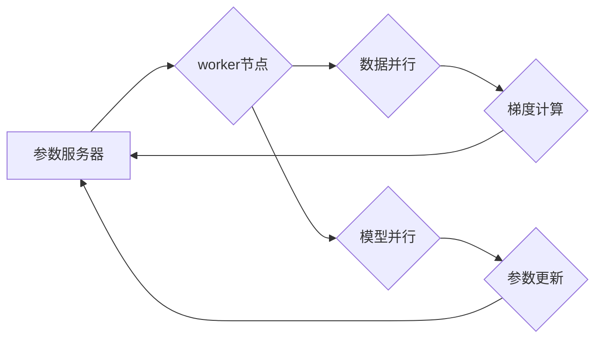

> 深度学习,分布式训练,大型模型,Python,TensorFlow,PyTorch,参数服务器,数据并行,模型并行

## 1. 背景介绍

深度学习近年来取得了令人瞩目的成就，在图像识别、自然语言处理、语音识别等领域取得了突破性的进展。然而，随着模型规模的不断扩大，训练大型深度学习模型面临着巨大的挑战。单机训练的资源消耗巨大，训练时间过长，难以满足对模型性能和效率的需求。分布式训练应运而生，通过将模型和数据分布到多个机器上进行并行训练，有效地解决了单机训练的瓶颈。

本文将深入探讨分布式训练的原理、策略和实践，并以Python为编程语言，使用TensorFlow和PyTorch等主流深度学习框架，详细介绍分布式训练大型模型的策略和技巧。

## 2. 核心概念与联系

分布式训练的核心概念包括：

* **参数服务器:** 负责存储模型参数，并协调各个worker节点的训练过程。
* **worker节点:** 负责接收数据，计算梯度，并更新模型参数。
* **数据并行:** 将训练数据分布到多个worker节点上进行并行处理。
* **模型并行:** 将模型拆分到多个worker节点上进行并行训练。

**Mermaid 流程图:**



## 3. 核心算法原理 & 具体操作步骤

### 3.1  算法原理概述

分布式训练的核心算法是异步梯度下降法。每个worker节点独立地计算梯度，并将梯度发送到参数服务器。参数服务器汇总所有梯度，并更新模型参数。

### 3.2  算法步骤详解

1. **数据分配:** 将训练数据均匀地分配到各个worker节点上。
2. **模型复制:** 将模型复制到每个worker节点上。
3. **梯度计算:** 每个worker节点对分配到的数据进行训练，并计算梯度。
4. **梯度更新:** 每个worker节点将计算出的梯度发送到参数服务器。
5. **参数服务器汇总:** 参数服务器汇总所有worker节点发送的梯度，并更新模型参数。
6. **参数广播:** 参数服务器将更新后的模型参数广播到所有worker节点。
7. **重复步骤3-6:** 重复上述步骤，直到模型训练完成。

### 3.3  算法优缺点

**优点:**

* 并行训练速度快，可以有效缩短训练时间。
* 可以训练更大的模型，因为可以利用多个机器的计算资源。

**缺点:**

* 存在通信开销，需要协调多个机器的通信。
* 训练过程可能不稳定，需要进行参数调整和优化。

### 3.4  算法应用领域

分布式训练广泛应用于各种深度学习领域，例如：

* **图像识别:** 训练大型图像识别模型，例如ResNet、Inception等。
* **自然语言处理:** 训练大型语言模型，例如BERT、GPT等。
* **语音识别:** 训练大型语音识别模型，例如DeepSpeech等。

## 4. 数学模型和公式 & 详细讲解 & 举例说明

### 4.1  数学模型构建

假设我们有一个深度学习模型，其参数为θ，损失函数为L(θ,X,Y)，其中X为输入数据，Y为目标数据。我们的目标是找到最优参数θ，使得损失函数最小化。

### 4.2  公式推导过程

使用梯度下降法，我们可以迭代更新参数θ：

```latex
\theta = \theta - \eta \nabla_{\theta} L(\theta, X, Y)
```

其中，η为学习率，∇θL(θ,X,Y)为损失函数关于参数θ的梯度。

### 4.3  案例分析与讲解

假设我们有一个包含1000个参数的深度学习模型，使用单机训练，需要计算1000个梯度。如果使用分布式训练，可以将模型参数和数据分布到多个机器上，每个机器只负责计算一部分梯度。例如，如果使用4个机器进行分布式训练，每个机器只需要计算250个梯度。这样可以大大减少每个机器的计算量，从而缩短训练时间。

## 5. 项目实践：代码实例和详细解释说明

### 5.1  开发环境搭建

* Python 3.6+
* TensorFlow 2.0+ 或 PyTorch 1.0+
* CUDA 和 cuDNN (可选，用于GPU加速)

### 5.2  源代码详细实现

以下是一个使用TensorFlow进行分布式训练的简单示例代码：

```python
import tensorflow as tf

# 定义模型
model = tf.keras.models.Sequential([
    tf.keras.layers.Dense(128, activation='relu'),
    tf.keras.layers.Dense(10, activation='softmax')
])

# 定义优化器和损失函数
optimizer = tf.keras.optimizers.Adam()
loss_fn = tf.keras.losses.SparseCategoricalCrossentropy()

# 分布式训练策略
strategy = tf.distribute.MirroredStrategy()

# 训练模型
with strategy.scope():
    model.compile(optimizer=optimizer, loss=loss_fn)
    model.fit(x_train, y_train, epochs=10)
```

### 5.3  代码解读与分析

* 使用`tf.distribute.MirroredStrategy()`创建分布式训练策略，将模型和数据分布到多个GPU上进行并行训练。
* 使用`with strategy.scope()`块，确保所有操作都在分布式策略范围内执行。
* `model.compile()`方法配置模型的优化器和损失函数。
* `model.fit()`方法开始训练模型，并自动将数据和梯度分布到各个GPU上进行并行处理。

### 5.4  运行结果展示

运行上述代码后，可以观察到训练过程中的损失值和准确率的变化。由于使用了分布式训练，训练速度会比单机训练快很多。

## 6. 实际应用场景

分布式训练在实际应用场景中得到了广泛应用，例如：

* **图像识别:** 训练大型图像识别模型，例如用于自动驾驶、医疗影像分析等。
* **自然语言处理:** 训练大型语言模型，例如用于机器翻译、文本摘要、对话系统等。
* **推荐系统:** 训练大型推荐模型，例如用于个性化推荐、内容过滤等。

### 6.4  未来应用展望

随着计算资源的不断发展，分布式训练将成为深度学习训练的标准模式。未来，分布式训练技术将更加成熟，并应用于更多领域，例如：

* **科学计算:** 训练大型科学计算模型，例如用于药物发现、材料设计等。
* **金融科技:** 训练大型金融模型，例如用于风险管理、欺诈检测等。

## 7. 工具和资源推荐

### 7.1  学习资源推荐

* **TensorFlow官方文档:** https://www.tensorflow.org/
* **PyTorch官方文档:** https://pytorch.org/
* **深度学习书籍:** 《深度学习》、《动手学深度学习》

### 7.2  开发工具推荐

* **Jupyter Notebook:** 用于编写和运行Python代码，并可视化训练过程。
* **TensorBoard:** 用于可视化TensorFlow模型训练过程。
* **PyTorch Profiler:** 用于分析PyTorch模型训练性能。

### 7.3  相关论文推荐

* **Distributed Deep Learning with TensorFlow:** https://arxiv.org/abs/1707.06347
* **Deep Learning with PyTorch:** https://pytorch.org/tutorials/beginner/deep_learning_with_pytorch.html

## 8. 总结：未来发展趋势与挑战

### 8.1  研究成果总结

分布式训练技术取得了显著进展，为训练大型深度学习模型提供了有效解决方案。

### 8.2  未来发展趋势

* **模型并行:** 将模型进一步拆分，并行训练多个模型子集，提高训练效率。
* **混合精度训练:** 使用混合精度计算，例如FP16和FP32，提高训练速度和内存利用率。
* **自动模型并行:** 自动生成并行训练策略，简化分布式训练的配置和调试。

### 8.3  面临的挑战

* **通信开销:** 分布式训练存在通信开销，需要优化通信策略和网络架构。
* **模型并行复杂度:** 模型并行训练的复杂度较高，需要更复杂的算法和工具支持。
* **数据并行一致性:** 保证数据并行训练的正确性和一致性是一个挑战。

### 8.4  研究展望

未来，分布式训练技术将继续发展，并应用于更多领域。研究者将继续探索新的分布式训练算法和策略，以提高训练效率、降低成本，并推动深度学习技术的进一步发展。

## 9. 附录：常见问题与解答

* **Q: 如何选择合适的分布式训练策略？**

* **A:** 选择合适的分布式训练策略取决于模型规模、数据规模、硬件资源等因素。常见的策略包括数据并行、模型并行和混合并行。

* **Q: 如何优化分布式训练的通信开销？**

* **A:** 可以使用数据压缩、模型压缩和异步通信等技术来优化通信开销。

* **Q: 如何调试分布式训练模型？**

* **A:** 可以使用TensorBoard、PyTorch Profiler等工具来监控和调试分布式训练模型。


作者：禅与计算机程序设计艺术 / Zen and the Art of Computer Programming 
<end_of_turn>