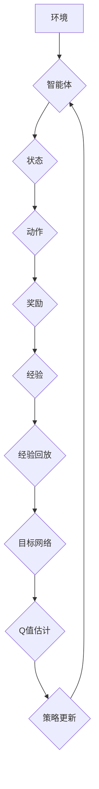

> 深度学习,强化学习,DQN,深度Q网络,Python,游戏AI,机器学习

## 1. 背景介绍

在人工智能领域，强化学习（Reinforcement Learning，RL）作为一种学习方式，吸引了越来越多的研究者和开发者的关注。与监督学习和无监督学习不同，强化学习的核心在于智能体通过与环境的交互，学习最优的策略，以最大化累积的奖励。

深度Q网络（Deep Q-Network，DQN）是近年来深度学习与强化学习相结合的代表性成果之一。它将深度神经网络应用于Q-learning算法，能够学习复杂环境下的策略，并取得了令人瞩目的成果，例如在 Atari 游戏中取得了人类水平的表现。

本篇文章将深入探讨DQN算法的原理、实现细节以及实际应用场景，并通过Python代码实例，帮助读者理解和实践DQN算法。

## 2. 核心概念与联系

**2.1 强化学习基础**

强化学习的核心概念包括：

* **智能体（Agent）：** 与环境交互的学习主体。
* **环境（Environment）：** 智能体所处的外部世界。
* **状态（State）：** 环境的当前描述。
* **动作（Action）：** 智能体在特定状态下可以执行的操作。
* **奖励（Reward）：** 环境对智能体动作的反馈，可以是正向奖励或负向惩罚。
* **策略（Policy）：** 智能体在不同状态下选择动作的规则。

**2.2 Q-learning算法**

Q-learning是一种经典的强化学习算法，其目标是学习一个Q函数，Q函数表示在特定状态下执行特定动作的期望累积奖励。

Q-learning算法的核心思想是通过迭代更新Q函数，使得Q函数逐渐逼近最优策略。更新规则如下：

$$Q(s, a) \leftarrow Q(s, a) + \alpha [r + \gamma \max_{a'} Q(s', a') - Q(s, a)]$$

其中：

* $Q(s, a)$：在状态$s$下执行动作$a$的Q值。
* $\alpha$：学习率，控制学习速度。
* $r$：从状态$s$执行动作$a$后获得的奖励。
* $\gamma$：折扣因子，控制未来奖励的权重。
* $s'$：执行动作$a$后进入的下一个状态。
* $\max_{a'} Q(s', a')$：在下一个状态$s'$下执行所有动作的Q值的期望最大值。

**2.3 深度Q网络（DQN）**

DQN将深度神经网络应用于Q-learning算法，用于学习Q函数。

DQN的主要创新点在于：

* 使用深度神经网络逼近Q函数，能够处理高维状态空间。
* 引入经验回放机制，解决样本不稳定性问题。
* 使用目标网络，稳定训练过程。

**2.4 DQN流程图**



## 3. 核心算法原理 & 具体操作步骤

### 3.1 算法原理概述

DQN算法的核心思想是利用深度神经网络学习一个Q函数，该Q函数能够估计在特定状态下执行特定动作的期望累积奖励。

DQN算法的主要步骤如下：

1. 初始化深度神经网络，作为Q函数的逼近器。
2. 收集环境交互产生的经验数据，存储在经验回放池中。
3. 从经验回放池中随机采样经验数据，用于训练Q网络。
4. 计算目标Q值，用于更新Q网络的权重。
5. 更新Q网络的权重，使得Q函数逐渐逼近最优策略。
6. 根据更新后的Q函数，选择最优动作，与环境交互。

### 3.2 算法步骤详解

1. **初始化Q网络:**

   * 定义深度神经网络的结构，包括输入层、隐藏层和输出层。
   * 初始化网络权重，可以使用随机初始化或预训练模型。

2. **收集经验数据:**

   * 智能体与环境交互，收集状态、动作、奖励和下一个状态的经验数据。
   * 将收集到的经验数据存储在经验回放池中。

3. **经验回放:**

   * 从经验回放池中随机采样多个经验数据，组成一个批次。
   * 使用批次中的经验数据训练Q网络。

4. **目标Q值计算:**

   * 计算目标Q值，用于更新Q网络的权重。
   * 目标Q值是下一个状态下执行最优动作的期望累积奖励，加上当前奖励的折扣。

5. **Q网络更新:**

   * 使用梯度下降算法，更新Q网络的权重，使得Q函数逐渐逼近目标Q值。

6. **策略更新:**

   * 根据更新后的Q函数，选择最优动作，与环境交互。

### 3.3 算法优缺点

**优点:**

* 可以处理高维状态空间。
* 能够学习复杂策略。
* 经验回放机制提高了训练效率。

**缺点:**

* 训练过程可能比较慢。
* 需要大量的经验数据进行训练。
* 容易陷入局部最优解。

### 3.4 算法应用领域

DQN算法在以下领域具有广泛的应用前景：

* **游戏AI:** 在Atari游戏等游戏中取得了人类水平的表现。
* **机器人控制:** 训练机器人执行复杂的任务。
* **推荐系统:** 建立个性化的推荐系统。
* **金融交易:** 进行自动交易策略的优化。

## 4. 数学模型和公式 & 详细讲解 & 举例说明

### 4.1 数学模型构建

DQN算法的核心是Q函数，它是一个映射关系，将状态-动作对映射到期望累积奖励。

$$Q(s, a) = E[\sum_{t=0}^{\infty} \gamma^t r_{t+1} | s_t = s, a_t = a]$$

其中：

* $Q(s, a)$：在状态$s$下执行动作$a$的Q值。
* $E$：期望值。
* $\gamma$：折扣因子，控制未来奖励的权重。
* $r_{t+1}$：从状态$s_t$执行动作$a_t$后获得的奖励。
* $s_t$：时间步$t$的状态。
* $a_t$：时间步$t$的动作。

### 4.2 公式推导过程

DQN算法使用梯度下降算法更新Q函数的权重。

更新规则如下：

$$ \theta_{t+1} = \theta_t - \alpha \nabla_{\theta} L(\theta, D)$$

其中：

* $\theta$：Q网络的权重。
* $\alpha$：学习率。
* $L(\theta, D)$：损失函数，衡量Q网络预测值与目标Q值之间的差异。
* $D$：经验数据。

### 4.3 案例分析与讲解

假设我们有一个简单的游戏环境，智能体可以选择向上、向下、向左、向右四个动作。

在某个状态下，智能体执行向上动作，获得奖励为1，进入下一个状态。

根据DQN算法，我们可以计算出该状态下执行向上动作的Q值，并将其更新到Q网络中。

## 5. 项目实践：代码实例和详细解释说明

### 5.1 开发环境搭建

* Python 3.6+
* TensorFlow 2.0+
* OpenAI Gym

### 5.2 源代码详细实现

```python
import tensorflow as tf
import numpy as np
from tensorflow.keras.models import Sequential
from tensorflow.keras.layers import Dense

# 定义DQN网络
class DQN(tf.keras.Model):
    def __init__(self, state_size, action_size):
        super(DQN, self).__init__()
        self.dense1 = Dense(64, activation='relu')
        self.dense2 = Dense(64, activation='relu')
        self.dense3 = Dense(action_size, activation='linear')

    def call(self, state):
        x = self.dense1(state)
        x = self.dense2(x)
        x = self.dense3(x)
        return x

# 定义训练参数
state_size = 4
action_size = 4
learning_rate = 0.001
gamma = 0.99
epsilon = 0.1
batch_size = 32

# 创建DQN网络
model = DQN(state_size, action_size)
optimizer = tf.keras.optimizers.Adam(learning_rate=learning_rate)

# 训练循环
for episode in range(1000):
    state = env.reset()
    done = False
    total_reward = 0

    while not done:
        # 选择动作
        if np.random.rand() < epsilon:
            action = env.action_space.sample()
        else:
            action = np.argmax(model(state))

        # 执行动作
        next_state, reward, done, _ = env.step(action)

        # 更新经验回放池
        experience = (state, action, reward, next_state, done)
        replay_buffer.append(experience)

        # 训练模型
        if len(replay_buffer) > batch_size:
            experiences = random.sample(replay_buffer, batch_size)
            states = np.array([e[0] for e in experiences])
            actions = np.array([e[1] for e in experiences])
            rewards = np.array([e[2] for e in experiences])
            next_states = np.array([e[3] for e in experiences])
            dones = np.array([e[4] for e in experiences])

            with tf.GradientTape() as tape:
                q_values = model(states)
                target_q_values = rewards + gamma * np.max(model(next_states), axis=1) * (1 - dones)
                loss = tf.keras.losses.mean_squared_error(target_q_values, q_values[np.arange(batch_size), actions])

            gradients = tape.gradient(loss, model.trainable_variables)
            optimizer.apply_gradients(zip(gradients, model.trainable_variables))

        state = next_state
        total_reward += reward

    print(f"Episode: {episode}, Total Reward: {total_reward}")

```

### 5.3 代码解读与分析

* **DQN网络定义:**

   * 使用Sequential模型构建DQN网络，包含三个全连接层。
   * 每个全连接层使用ReLU激活函数，输出层使用线性激活函数。

* **训练参数设置:**

   * 设置学习率、折扣因子、探索率、批处理大小等训练参数。

* **训练循环:**

   * 每个episode中，智能体与环境交互，收集经验数据。
   * 当经验回放池中数据量足够时，进行模型训练。
   * 使用梯度下降算法更新DQN网络的权重。

* **动作选择:**

   * 使用epsilon-greedy策略选择动作，以一定的概率选择随机动作，以提高探索性。

### 5.4 运行结果展示

训练完成后，可以将训练好的DQN模型应用于游戏环境中，观察智能体的表现。

## 6. 实际应用场景

DQN算法在以下领域具有广泛的应用前景：

* **游戏AI:** 在Atari游戏等游戏中取得了人类水平的表现。
* **机器人