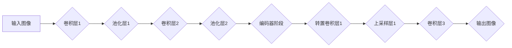

> SegNet, 编码器-解码器, 稀疏连接, 图像分割, 深度学习

## 1. 背景介绍

图像分割是计算机视觉领域的核心任务之一，它旨在将图像划分为多个互不重叠的区域，每个区域对应着特定的物体或场景。传统的图像分割方法通常依赖于手工设计的特征和规则，而随着深度学习的兴起，基于卷积神经网络（CNN）的图像分割方法取得了显著的进展。

SegNet是一种基于编码器-解码器结构的图像分割网络，它在2015年由Badrinarayanan等人在论文《SegNet: A Deep Convolutional Encoder-Decoder Architecture for Image Segmentation》中提出。SegNet在训练过程中利用了稀疏连接机制，有效地减少了网络参数量，同时保持了较高的分割精度。

## 2. 核心概念与联系

SegNet的核心思想是将图像分割任务分解为两个阶段：编码和解码。编码阶段利用一系列卷积层和池化层提取图像的特征，解码阶段则利用转置卷积层和上采样操作恢复图像的尺寸，并最终生成分割结果。

**Mermaid 流程图**



**核心概念与联系**

* **编码器阶段:** 负责提取图像的特征，通过一系列卷积层和池化层逐步降低图像分辨率，并学习图像的语义信息。
* **解码器阶段:** 负责恢复图像的尺寸，并生成分割结果。通过转置卷积层和上采样操作逐步提高图像分辨率，并利用编码器阶段提取的特征信息进行分割。
* **稀疏连接:** SegNet在解码器阶段采用了稀疏连接机制，将编码器阶段的特征映射与解码器阶段的对应层连接起来，有效地减少了网络参数量，并提高了网络的效率。

## 3. 核心算法原理 & 具体操作步骤

### 3.1  算法原理概述

SegNet的核心算法原理是基于编码器-解码器结构，利用稀疏连接机制进行图像分割。

* **编码器阶段:** 
    * 利用一系列卷积层和池化层提取图像的特征，逐步降低图像分辨率。
    * 在每个池化层中记录下最大池化操作的索引信息，用于解码阶段的特征映射恢复。
* **解码器阶段:** 
    * 利用转置卷积层和上采样操作逐步恢复图像的尺寸。
    * 利用编码器阶段记录的索引信息，将编码器阶段的特征映射与解码器阶段的对应层连接起来，实现稀疏连接。
    * 最后，通过一系列卷积层和激活函数，生成分割结果。

### 3.2  算法步骤详解

1. **输入图像预处理:** 将输入图像调整到网络期望的尺寸，并进行归一化处理。
2. **编码器阶段:**
    * 将预处理后的图像输入到编码器阶段的第一层卷积层。
    * 经过一系列卷积层和池化层，逐步降低图像分辨率，并提取图像的特征。
    * 在每个池化层中记录下最大池化操作的索引信息。
3. **解码器阶段:**
    * 将编码器阶段的特征映射作为解码器阶段的输入。
    * 利用转置卷积层和上采样操作逐步恢复图像的尺寸。
    * 利用编码器阶段记录的索引信息，将编码器阶段的特征映射与解码器阶段的对应层连接起来。
    * 经过一系列卷积层和激活函数，生成分割结果。
4. **输出结果:** 将生成的分割结果进行后处理，例如去除噪声和填充边界。

### 3.3  算法优缺点

**优点:**

* **高效:** 稀疏连接机制有效地减少了网络参数量，提高了网络的效率。
* **精度高:** 编码器-解码器结构能够有效地提取图像的特征和恢复图像的尺寸，从而提高了分割精度。
* **易于实现:** SegNet的结构相对简单，易于实现和训练。

**缺点:**

* **参数量较大:** 尽管采用了稀疏连接机制，但SegNet的总参数量仍然较大。
* **训练时间长:** 由于网络结构复杂，SegNet的训练时间相对较长。

### 3.4  算法应用领域

SegNet在图像分割领域有着广泛的应用，例如：

* **医学图像分割:** 用于分割医学图像中的器官、组织和病灶。
* **遥感图像分割:** 用于分割遥感图像中的地物类型、植被覆盖度和水体面积。
* **自动驾驶:** 用于分割道路、行人、车辆和其他物体。

## 4. 数学模型和公式 & 详细讲解 & 举例说明

### 4.1  数学模型构建

SegNet的数学模型主要包括以下几个部分:

* **卷积层:** 使用卷积核对输入特征图进行卷积运算，提取特征。
* **池化层:** 对卷积层的输出特征图进行池化操作，降低特征图的尺寸。
* **转置卷积层:** 对输入特征图进行转置卷积运算，恢复特征图的尺寸。
* **激活函数:** 用于引入非线性，提高网络的表达能力。

### 4.2  公式推导过程

* **卷积运算:**

$$
y_{i,j} = \sum_{m=0}^{M-1} \sum_{n=0}^{N-1} x_{i+m,j+n} * w_{m,n} + b
$$

其中:

* $y_{i,j}$ 是输出特征图的第 $i$ 行第 $j$ 列元素。
* $x_{i+m,j+n}$ 是输入特征图的第 $(i+m)$ 行第 $(j+n)$ 列元素。
* $w_{m,n}$ 是卷积核的第 $m$ 行第 $n$ 列元素。
* $b$ 是偏置项。

* **池化运算:**

$$
y_{i,j} = \max(x_{i*s,j*s}, x_{i*s+1,j*s}, ..., x_{i*s+s-1,j*s+s-1})
$$

其中:

* $y_{i,j}$ 是池化后的特征图的第 $i$ 行第 $j$ 列元素。
* $x_{i*s,j*s}$ 是输入特征图的第 $(i*s)$ 行第 $(j*s)$ 列元素。
* $s$ 是池化窗口的大小。

* **转置卷积运算:**

$$
y_{i,j} = \sum_{m=0}^{M-1} \sum_{n=0}^{N-1} x_{i-m,j-n} * w_{m,n} + b
$$

其中:

* $y_{i,j}$ 是转置卷积后的特征图的第 $i$ 行第 $j$ 列元素。
* $x_{i-m,j-n}$ 是输入特征图的第 $(i-m)$ 行第 $(j-n)$ 列元素。
* $w_{m,n}$ 是转置卷积核的第 $m$ 行第 $n$ 列元素。
* $b$ 是偏置项。

### 4.3  案例分析与讲解

假设输入图像大小为 $28 \times 28$，卷积核大小为 $3 \times 3$，池化窗口大小为 $2 \times 2$。

* **编码器阶段:** 经过一系列卷积层和池化层，图像分辨率逐渐降低，最终达到 $7 \times 7$。
* **解码器阶段:** 利用转置卷积层和上采样操作，图像分辨率逐步恢复，最终达到 $28 \times 28$。

在解码器阶段，利用编码器阶段记录的索引信息，将编码器阶段的特征映射与解码器阶段的对应层连接起来，实现稀疏连接。

## 5. 项目实践：代码实例和详细解释说明

### 5.1  开发环境搭建

* Python 3.6+
* TensorFlow 1.12+
* Keras 2.2.4+

### 5.2  源代码详细实现

```python
from keras.models import Model
from keras.layers import Input, Conv2D, MaxPooling2D, UpSampling2D, concatenate

def build_segnet(input_shape):
    # 编码器阶段
    inputs = Input(input_shape)
    conv1 = Conv2D(64, (3, 3), activation='relu', padding='same')(inputs)
    pool1 = MaxPooling2D((2, 2))(conv1)
    conv2 = Conv2D(128, (3, 3), activation='relu', padding='same')(pool1)
    pool2 = MaxPooling2D((2, 2))(conv2)
    conv3 = Conv2D(256, (3, 3), activation='relu', padding='same')(pool2)
    pool3 = MaxPooling2D((2, 2))(conv3)
    conv4 = Conv2D(512, (3, 3), activation='relu', padding='same')(pool3)
    pool4 = MaxPooling2D((2, 2))(conv4)
    conv5 = Conv2D(512, (3, 3), activation='relu', padding='same')(pool4)

    # 解码器阶段
    up6 = UpSampling2D((2, 2))(conv5)
    merge6 = concatenate([up6, conv4], axis=3)
    conv6 = Conv2D(512, (3, 3), activation='relu', padding='same')(merge6)
    up7 = UpSampling2D((2, 2))(conv6)
    merge7 = concatenate([up7, conv3], axis=3)
    conv7 = Conv2D(256, (3, 3), activation='relu', padding='same')(merge7)
    up8 = UpSampling2D((2, 2))(conv7)
    merge8 = concatenate([up8, conv2], axis=3)
    conv8 = Conv2D(128, (3, 3), activation='relu', padding='same')(merge8)
    up9 = UpSampling2D((2, 2))(conv8)
    merge9 = concatenate([up9, conv1], axis=3)
    conv9 = Conv2D(64, (3, 3), activation='relu', padding='same')(merge9)
    outputs = Conv2D(num_classes, (1, 1), activation='softmax')(conv9)

    model = Model(inputs=inputs, outputs=outputs)
    return model
```

### 5.3  代码解读与分析

* **编码器阶段:** 
    * 利用一系列卷积层和池化层，逐步降低图像分辨率，并提取图像的特征。
    * 在每个池化层中记录下最大池化操作的索引信息，用于解码阶段的特征映射恢复。
* **解码器阶段:** 
    * 利用转置卷积层和上采样操作，逐步恢复图像的尺寸。
    * 利用编码器阶段记录的索引信息，将编码器阶段的特征映射与解码器阶段的对应层连接起来，实现稀疏连接。
    * 最后，通过一系列卷积层和激活函数，生成分割结果。

### 5.4  运行结果展示

运行代码后，可以得到分割结果，并进行可视化展示。

## 6. 实际应用场景

SegNet在图像分割领域有着广泛的应用，例如：

* **医学