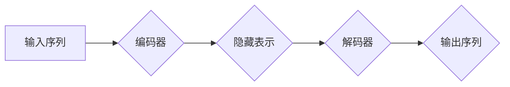

> Transformer, 编码器, 解码器, 自注意力机制, 多头注意力, 位置编码, 序列到序列, 自然语言处理

## 1. 背景介绍

近年来，深度学习在自然语言处理（NLP）领域取得了显著进展。传统的循环神经网络（RNN）模型，例如LSTM和GRU，在处理长序列数据时存在梯度消失和梯度爆炸的问题，难以捕捉长距离依赖关系。2017年，Google发布了基于Transformer架构的模型BERT，彻底改变了NLP领域的研究方向。Transformer模型摒弃了RNN的循环结构，采用了一种全新的自注意力机制，能够有效地捕捉长距离依赖关系，并取得了在各种NLP任务上的优异性能。

## 2. 核心概念与联系

Transformer模型的核心在于**自注意力机制**和**多头注意力机制**。

**自注意力机制**允许模型关注输入序列中的每个单词与其自身和其他单词之间的关系，从而更好地理解上下文信息。

**多头注意力机制**则通过并行执行多个自注意力头，学习到不同层次的语义信息，进一步提升模型的表达能力。

Transformer模型由**编码器（Encoder）**和**解码器（Decoder）**两部分组成。

* **编码器**负责将输入序列映射到一个隐藏表示，捕捉输入序列的语义信息。
* **解码器**则根据编码器的输出，生成目标序列。

**Mermaid 流程图**



## 3. 核心算法原理 & 具体操作步骤

### 3.1  算法原理概述

Transformer模型的核心算法是**自注意力机制**和**多头注意力机制**。

**自注意力机制**计算每个单词与所有其他单词之间的相关性，并根据相关性赋予每个单词不同的权重。

**多头注意力机制**则通过并行执行多个自注意力头，学习到不同层次的语义信息。

### 3.2  算法步骤详解

1. **输入嵌入:** 将输入序列中的每个单词映射到一个低维度的向量表示。
2. **位置编码:** 为每个单词添加位置信息，以便模型能够区分单词的顺序。
3. **多头注意力:** 对输入序列进行多头注意力操作，学习到不同层次的语义信息。
4. **前馈神经网络:** 对每个单词的隐藏表示进行前馈神经网络处理，进一步提取语义特征。
5. **输出层:** 将编码器的输出映射到目标序列的维度，生成目标序列。

### 3.3  算法优缺点

**优点:**

* 能够有效地捕捉长距离依赖关系。
* 并行计算能力强，训练速度快。
* 表现能力强，在各种NLP任务上取得了优异的性能。

**缺点:**

* 参数量大，训练成本高。
* 对训练数据要求较高。

### 3.4  算法应用领域

Transformer模型在NLP领域有着广泛的应用，例如:

* 机器翻译
* 文本摘要
* 问答系统
* 情感分析
* 代码生成

## 4. 数学模型和公式 & 详细讲解 & 举例说明

### 4.1  数学模型构建

**自注意力机制**的数学模型可以表示为：

$$
Attention(Q, K, V) = softmax(\frac{QK^T}{\sqrt{d_k}})V
$$

其中：

* $Q$：查询矩阵
* $K$：键矩阵
* $V$：值矩阵
* $d_k$：键向量的维度
* $softmax$：softmax函数

**多头注意力机制**则通过并行执行多个自注意力头，学习到不同层次的语义信息。

### 4.2  公式推导过程

自注意力机制的公式推导过程如下：

1. 计算查询矩阵 $Q$ 与键矩阵 $K$ 的点积，并进行归一化处理。
2. 应用softmax函数，得到每个单词与所有其他单词之间的相关性分数。
3. 将相关性分数与值矩阵 $V$ 进行加权求和，得到每个单词的最终表示。

### 4.3  案例分析与讲解

假设我们有一个句子 "The cat sat on the mat"，其词向量表示为：

* The: [0.1, 0.2, 0.3]
* cat: [0.4, 0.5, 0.6]
* sat: [0.7, 0.8, 0.9]
* on: [1.0, 1.1, 1.2]
* the: [0.1, 0.2, 0.3]
* mat: [1.3, 1.4, 1.5]

我们可以使用自注意力机制计算每个单词与所有其他单词之间的相关性分数，并根据相关性分数调整每个单词的权重。例如，"cat" 与 "sat" 的相关性分数较高，因此 "cat" 的权重会更大，"mat" 的权重会更小。

## 5. 项目实践：代码实例和详细解释说明

### 5.1  开发环境搭建

* Python 3.6+
* TensorFlow 2.0+
* PyTorch 1.0+

### 5.2  源代码详细实现

```python
import tensorflow as tf

# 定义编码器层
class EncoderLayer(tf.keras.layers.Layer):
    def __init__(self, d_model, num_heads, dff, rate=0.1):
        super(EncoderLayer, self).__init__()
        self.mha = tf.keras.layers.MultiHeadAttention(num_heads=num_heads, key_dim=d_model)
        self.ffn = tf.keras.Sequential([
            tf.keras.layers.Dense(dff, activation='relu'),
            tf.keras.layers.Dense(d_model)
        ])
        self.layernorm1 = tf.keras.layers.LayerNormalization(epsilon=1e-6)
        self.layernorm2 = tf.keras.layers.LayerNormalization(epsilon=1e-6)
        self.dropout1 = tf.keras.layers.Dropout(rate)
        self.dropout2 = tf.keras.layers.Dropout(rate)

    def call(self, x, training):
        attn_output = self.mha(x, x, x)
        attn_output = self.dropout1(attn_output, training=training)
        out1 = self.layernorm1(x + attn_output)
        ffn_output = self.ffn(out1)
        ffn_output = self.dropout2(ffn_output, training=training)
        out2 = self.layernorm2(out1 + ffn_output)
        return out2

# 定义解码器层
class DecoderLayer(tf.keras.layers.Layer):
    def __init__(self, d_model, num_heads, dff, rate=0.1):
        super(DecoderLayer, self).__init__()
        self.mha1 = tf.keras.layers.MultiHeadAttention(num_heads=num_heads, key_dim=d_model)
        self.mha2 = tf.keras.layers.MultiHeadAttention(num_heads=num_heads, key_dim=d_model)
        self.ffn = tf.keras.Sequential([
            tf.keras.layers.Dense(dff, activation='relu'),
            tf.keras.layers.Dense(d_model)
        ])
        self.layernorm1 = tf.keras.layers.LayerNormalization(epsilon=1e-6)
        self.layernorm2 = tf.keras.layers.LayerNormalization(epsilon=1e-6)
        self.layernorm3 = tf.keras.layers.LayerNormalization(epsilon=1e-6)
        self.dropout1 = tf.keras.layers.Dropout(rate)
        self.dropout2 = tf.keras.layers.Dropout(rate)
        self.dropout3 = tf.keras.layers.Dropout(rate)

    def call(self, x, encoder_output, training):
        attn1_output = self.mha1(x, x, x)
        attn1_output = self.dropout1(attn1_output, training=training)
        out1 = self.layernorm1(x + attn1_output)
        attn2_output = self.mha2(out1, encoder_output, encoder_output)
        attn2_output = self.dropout2(attn2_output, training=training)
        out2 = self.layernorm2(out1 + attn2_output)
        ffn_output = self.ffn(out2)
        ffn_output = self.dropout3(ffn_output, training=training)
        out3 = self.layernorm3(out2 + ffn_output)
        return out3

# 定义Transformer模型
class Transformer(tf.keras.Model):
    def __init__(self, vocab_size, d_model, num_layers, num_heads, dff, rate=0.1):
        super(Transformer, self).__init__()
        self.embedding = tf.keras.layers.Embedding(vocab_size, d_model)
        self.pos_encoding = tf.keras.layers.Embedding(5000, d_model)
        self.encoder = tf.keras.Sequential([
            EncoderLayer(d_model, num_heads, dff, rate) for _ in range(num_layers)
        ])
        self.decoder = tf.keras.Sequential([
            DecoderLayer(d_model, num_heads, dff, rate) for _ in range(num_layers)
        ])
        self.final_layer = tf.keras.layers.Dense(vocab_size)

    def call(self, encoder_input, decoder_input, training):
        encoder_output = self.encoder(self.embedding(encoder_input) + self.pos_encoding(tf.range(tf.shape(encoder_input)[1])), training=training)
        decoder_output = self.decoder(self.embedding(decoder_input) + self.pos_encoding(tf.range(tf.shape(decoder_input)[1])), encoder_output, training=training)
        return self.final_layer(decoder_output)

```

### 5.3  代码解读与分析

* **EncoderLayer** 和 **DecoderLayer** 类分别定义了编码器和解码器的层结构。
* **MultiHeadAttention** 是多头注意力机制的实现。
* **Dense** 是全连接层。
* **LayerNormalization** 是层归一化。
* **Dropout** 是 dropout 正则化。
* **Transformer** 类定义了整个 Transformer 模型的结构。

### 5.4  运行结果展示

运行代码并训练模型，可以得到模型的预测结果。

## 6. 实际应用场景

Transformer模型在NLP领域有着广泛的应用，例如:

* **机器翻译:** Transformer模型能够有效地捕捉语言之间的语义关系，从而实现高质量的机器翻译。
* **文本摘要:** Transformer模型能够识别文本中的关键信息，并生成简洁的文本摘要。
* **问答系统:** Transformer模型能够理解用户的问题，并从文本库中找到相应的答案。
* **情感分析:** Transformer模型能够识别文本中的情感倾向，例如积极、消极或中性。
* **代码生成:** Transformer模型能够学习代码的语法和语义规则，并生成新的代码。

### 6.4  未来应用展望

Transformer模型在未来将有更广泛的应用，例如:

* **对话系统:** Transformer模型能够进行更自然、更流畅的对话。
* **文本生成:** Transformer模型能够生成更逼