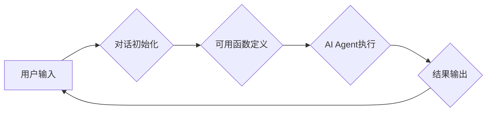

> 大模型、AI Agent、对话初始化、可用函数、应用开发、模型应用

## 1. 背景介绍

近年来，大模型技术取得了飞速发展，其强大的泛化能力和知识表示能力为人工智能领域带来了革命性的变革。大模型能够理解和生成人类语言，进行图像识别、文本摘要、代码生成等多种任务，展现出巨大的应用潜力。

然而，将大模型应用于实际场景并非易事。如何有效地与大模型进行交互，并将其能力转化为可用的功能，是当前研究和开发的重点。AI Agent作为一种能够自主学习、决策和执行任务的智能体，为大模型的应用提供了新的思路。

本篇文章将围绕大模型应用开发，重点介绍如何初始化对话并定义可用函数，从而构建可用于实际应用的AI Agent。

## 2. 核心概念与联系

### 2.1 大模型

大模型是指参数量巨大、训练数据海量的人工智能模型。其强大的学习能力使其能够在各种任务上表现出色，例如：

* **自然语言处理 (NLP)：** 文本生成、机器翻译、问答系统、情感分析等。
* **计算机视觉 (CV)：** 图像识别、物体检测、图像分割等。
* **语音识别 (ASR)：** 语音转文本、语音合成等。

### 2.2 AI Agent

AI Agent是一种能够感知环境、做出决策并执行行动的智能体。它通常由以下几个部分组成：

* **感知模块：** 收集环境信息，例如传感器数据、文本、图像等。
* **决策模块：** 根据感知到的信息，做出最佳的行动决策。
* **执行模块：** 执行决策，与环境进行交互。

### 2.3 大模型与AI Agent的结合

将大模型与AI Agent结合，可以赋予AI Agent更强大的能力，使其能够更好地理解和应对复杂环境。大模型可以提供AI Agent以下方面的支持：

* **知识表示：** 大模型能够存储和理解大量的知识，为AI Agent提供丰富的知识库。
* **语言理解：** 大模型能够理解自然语言，使AI Agent能够与人类进行自然流畅的对话。
* **决策支持：** 大模型可以提供决策建议，帮助AI Agent做出更明智的决策。

**Mermaid 流程图**



## 3. 核心算法原理 & 具体操作步骤

### 3.1 算法原理概述

大模型应用开发的核心算法包括：

* **对话管理算法：** 用于处理用户与AI Agent之间的对话，例如理解用户意图、生成响应文本等。
* **可用函数定义算法：** 用于定义AI Agent可以执行的函数，例如查询数据库、控制设备等。
* **任务执行算法：** 用于执行AI Agent的函数，并返回结果。

### 3.2 算法步骤详解

1. **对话初始化：** 当用户与AI Agent进行交互时，首先需要进行对话初始化。这包括识别用户身份、获取用户上下文信息等。
2. **可用函数定义：** 根据用户的需求，定义AI Agent可以执行的可用函数。这些函数可以是预定义的，也可以是用户自定义的。
3. **用户输入处理：** 用户输入的文本需要进行处理，例如分词、词性标注、句法分析等，以便AI Agent理解用户意图。
4. **意图识别：** 根据用户输入，识别用户的意图，例如查询信息、执行命令等。
5. **对话响应生成：** 根据用户的意图，AI Agent生成相应的对话响应，并将其发送给用户。
6. **可用函数执行：** 如果用户的意图涉及执行可用函数，则AI Agent需要调用相应的函数，并处理返回的结果。

### 3.3 算法优缺点

**优点：**

* **可扩展性强：** 可以根据用户的需求，灵活定义可用函数，扩展AI Agent的功能。
* **可定制性强：** 可以根据用户的偏好，定制对话风格和响应内容。
* **交互性强：** 可以与用户进行自然流畅的对话，提供更人性化的体验。

**缺点：**

* **开发复杂度高：** 需要对对话管理、可用函数定义、任务执行等多个方面进行设计和实现。
* **数据依赖性强：** 需要大量的训练数据来训练大模型，才能保证其准确性和可靠性。
* **安全风险：** 如果AI Agent的可用函数不安全，可能会被恶意利用。

### 3.4 算法应用领域

大模型应用开发的算法在以下领域具有广泛的应用前景：

* **客服机器人：** 提供24小时在线客服服务，解答用户疑问，处理简单的请求。
* **教育机器人：** 为学生提供个性化的学习辅导，解答学习问题，帮助学生提高学习效率。
* **医疗助手：** 辅助医生诊断疾病，提供医疗建议，提高医疗效率。
* **智能家居：** 控制家居设备，例如灯光、空调、电视等，提供更加智能化的家居体验。

## 4. 数学模型和公式 & 详细讲解 & 举例说明

### 4.1 数学模型构建

在AI Agent的对话管理中，可以使用状态机模型来表示对话流程。状态机由状态和转换规则组成。每个状态代表对话中的一个阶段，转换规则则规定了在满足特定条件时，如何从一个状态转换到另一个状态。

### 4.2 公式推导过程

假设一个简单的对话状态机，包含三个状态：

* **初始状态 (INIT)：** 代表对话开始阶段。
* **询问状态 (ASK)：** 代表AI Agent向用户提问阶段。
* **响应状态 (RESP)：** 代表AI Agent响应用户阶段。

状态转换规则如下：

* 从INIT状态到ASK状态的转换条件是：AI Agent需要获取用户的信息。
* 从ASK状态到RESP状态的转换条件是：AI Agent接收到用户的回答。
* 从RESP状态到INIT状态的转换条件是：对话结束。

### 4.3 案例分析与讲解

例如，在问答系统中，AI Agent可以根据用户的提问，从INIT状态进入ASK状态，向用户提问相关信息。当用户回答后，AI Agent会根据用户的回答，从ASK状态进入RESP状态，并给出相应的答案。

## 5. 项目实践：代码实例和详细解释说明

### 5.1 开发环境搭建

本项目使用Python语言开发，需要安装以下软件：

* Python 3.x
* TensorFlow 或 PyTorch
* NLTK
* SpaCy

### 5.2 源代码详细实现

```python
class AI_Agent:
    def __init__(self):
        # 初始化对话状态机
        self.state = "INIT"
        # 定义可用函数
        self.functions = {
            "查询天气": self.query_weather,
            "设置闹钟": self.set_alarm,
        }

    def process_input(self, user_input):
        # 处理用户输入
        # ...

        # 根据用户意图更新对话状态
        if self.state == "INIT":
            if "天气" in user_input:
                self.state = "ASK"
                self.ask_weather()
            elif "闹钟" in user_input:
                self.state = "ASK"
                self.ask_alarm()
        elif self.state == "ASK":
            # ...

    def ask_weather(self):
        # 向用户询问天气信息
        print("你想知道哪个城市的今天天气？")

    def set_alarm(self):
        # 向用户询问闹钟时间
        print("你想设置哪个时间闹钟？")

    def query_weather(self, city):
        # 查询天气信息
        # ...

    def set_alarm(self, time):
        # 设置闹钟
        # ...

# 实例化AI Agent
agent = AI_Agent()

# 与用户交互
while True:
    user_input = input("你:")
    agent.process_input(user_input)
```

### 5.3 代码解读与分析

* `AI_Agent`类定义了AI Agent的基本结构，包括对话状态机、可用函数等。
* `process_input()`方法处理用户输入，并根据用户意图更新对话状态。
* `ask_weather()`和`ask_alarm()`方法分别向用户询问天气信息和闹钟时间。
* `query_weather()`和`set_alarm()`方法分别查询天气信息和设置闹钟。

### 5.4 运行结果展示

当用户输入“今天北京的天气怎么样？”时，AI Agent会执行以下步骤：

1. 识别用户意图为查询天气。
2. 更新对话状态为“ASK”。
3. 调用`ask_weather()`方法，向用户询问城市。
4. 用户输入“北京”。
5. AI Agent调用`query_weather()`方法，查询北京的天气信息。
6. AI Agent返回北京的天气信息给用户。

## 6. 实际应用场景

### 6.1 客服机器人

AI Agent可以作为客服机器人，为用户提供24小时在线服务，解答常见问题，处理简单的请求。例如，用户可以询问产品价格、配送时间等信息，AI Agent可以根据数据库查询返回结果。

### 6.2 教育机器人

AI Agent可以作为教育机器人，为学生提供个性化的学习辅导。例如，学生可以向AI Agent提问数学题，AI Agent可以根据学生的知识水平，给出相应的解答和解释。

### 6.3 医疗助手

AI Agent可以作为医疗助手，辅助医生诊断疾病，提供医疗建议。例如，用户可以向AI Agent描述自己的症状，AI Agent可以根据医学知识库，给出可能的诊断结果和建议。

### 6.4 未来应用展望

随着大模型技术的不断发展，AI Agent的应用场景将会更加广泛。例如，AI Agent可以用于智能家居、自动驾驶、金融服务等领域。

## 7. 工具和资源推荐

### 7.1 学习资源推荐

* **书籍：**
    * 《深度学习》
    * 《自然语言处理》
    * 《人工智能》
* **在线课程：**
    * Coursera
    * edX
    * Udacity

### 7.2 开发工具推荐

* **Python:** 
    * TensorFlow
    * PyTorch
    * NLTK
    * SpaCy

### 7.3 相关论文推荐

* **BERT:** Devlin, J., Chang, M. W., Lee, K., & Toutanova, K. (2018). BERT: Pre-training of deep bidirectional transformers for language understanding. arXiv preprint arXiv:1810.04805.
* **GPT-3:** Brown, T. B., Mann, B., Ryder, N., Subbiah, M., Kaplan, J., Dhariwal, P., ... & Amodei, D. (2020). Language models are few-shot learners. arXiv preprint arXiv:2005.14165.

## 8. 总结：未来发展趋势与挑战

### 8.1 研究成果总结

近年来，大模型应用开发取得了显著进展，AI Agent的性能和功能不断提升。大模型的强大能力为AI Agent提供了更丰富的知识和更智能的决策能力。

### 8.2 未来发展趋势

* **模型规模和能力的进一步提升：** 未来，大模型的规模和能力将会继续提升，从而赋予AI Agent更强大的能力。
* **多模态交互的融合：** AI Agent将能够理解和处理多种模态信息，例如文本、图像、语音等，从而提供更丰富的交互体验。
* **个性化定制的增强：** AI Agent将能够根据用户的个性化需求，定制对话风格、响应内容等，提供更人性化的体验。

### 8.3 面临的挑战

* **数据安全和隐私保护：** 大模型的训练需要大量的训练数据，如何保证数据安全和隐私保护是一个重要的挑战。
* **模型可解释性和信任度：** 大模型的