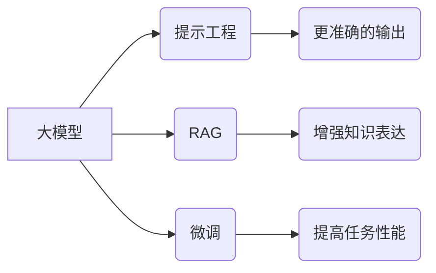

> 大模型、AI Agent、提示工程、RAG、微调、应用开发

## 1. 背景介绍

近年来，大模型技术取得了飞速发展，其强大的泛化能力和知识表示能力为人工智能领域带来了革命性的变革。然而，将大模型应用于实际场景仍然面临着诸多挑战，例如：

* **缺乏针对性：** 大模型通常是通用的，缺乏针对特定任务的优化，导致其在特定场景下的表现不佳。
* **输入输出格式限制：** 大模型通常依赖于文本格式的输入和输出，难以处理其他类型的数据，例如图像、音频等。
* **部署成本高：** 大模型通常体积庞大，部署和推理成本较高，难以在资源有限的设备上运行。

为了解决这些问题，研究者们提出了多种方法，其中提示工程、Retrieval Augmented Generation（RAG）和微调是其中最为重要的技术。

## 2. 核心概念与联系

**提示工程（Prompt Engineering）**

提示工程是指通过精心设计输入提示，引导大模型生成更准确、更符合预期结果的输出。

**RAG（Retrieval Augmented Generation）**

RAG是一种将外部知识库与大模型相结合的技术，通过检索相关知识，增强大模型的知识表达能力和推理能力。

**微调（Fine-tuning）**

微调是指在预训练的大模型基础上，使用特定任务的数据进行训练，从而提高模型在该任务上的性能。

**核心概念关系图：**



## 3. 核心算法原理 & 具体操作步骤

### 3.1  算法原理概述

* **提示工程：** 通过设计不同的提示结构、添加示例数据、使用引导词等方式，引导大模型生成更符合预期结果的输出。
* **RAG：** 将大模型与知识库相结合，通过检索相关知识，增强大模型的知识表达能力和推理能力。
* **微调：** 在预训练的大模型基础上，使用特定任务的数据进行训练，从而提高模型在该任务上的性能。

### 3.2  算法步骤详解

* **提示工程：**
    1. 确定任务目标和输出格式。
    2. 设计不同的提示结构，例如零样本提示、few-shot提示、chain-of-thought提示等。
    3. 添加示例数据，帮助大模型理解任务要求。
    4. 使用引导词，引导大模型生成更符合预期结果的输出。
    5. 评估提示效果，并进行迭代优化。
* **RAG：**
    1. 选择合适的知识库，例如维基百科、知识图谱等。
    2. 设计检索策略，例如关键词检索、向量检索等。
    3. 将检索到的知识与大模型的输入进行融合。
    4. 训练RAG模型，使其能够有效地利用知识库进行文本生成。
* **微调：**
    1. 选择预训练的大模型。
    2. 收集特定任务的数据集。
    3. 对大模型进行微调，使其能够在特定任务上表现更优。
    4. 评估微调效果，并进行迭代优化。

### 3.3  算法优缺点

* **提示工程：**
    * 优点：无需修改模型结构，易于实现，成本低。
    * 缺点：效果依赖于提示设计，难以保证一致性。
* **RAG：**
    * 优点：能够增强大模型的知识表达能力和推理能力。
    * 缺点：需要维护知识库，检索效率可能较低。
* **微调：**
    * 优点：能够显著提高模型在特定任务上的性能。
    * 缺点：需要大量的数据进行训练，成本较高。

### 3.4  算法应用领域

* **提示工程：** 自然语言处理、代码生成、图像描述等。
* **RAG：** 聊天机器人、问答系统、文本摘要等。
* **微调：** 语音识别、机器翻译、情感分析等。

## 4. 数学模型和公式 & 详细讲解 & 举例说明

### 4.1  数学模型构建

**提示工程：**

提示工程的核心是设计一个能够引导大模型生成期望输出的提示。我们可以将提示视为一个输入序列，它包含了任务描述、示例数据、引导词等信息。

**RAG：**

RAG模型通常采用encoder-decoder结构，其中encoder负责编码输入文本和知识库信息，decoder负责生成输出文本。

**微调：**

微调过程本质上是一个参数更新的过程，通过优化模型参数，使模型在特定任务上表现更优。

### 4.2  公式推导过程

**提示工程：**

提示工程的数学模型通常基于概率论，例如使用softmax函数计算不同输出的概率。

**RAG：**

RAG模型的训练目标通常是最大化输出文本与真实文本之间的相似度，可以使用交叉熵损失函数进行优化。

**微调：**

微调过程的数学模型通常基于梯度下降算法，通过更新模型参数，最小化模型预测与真实值之间的误差。

### 4.3  案例分析与讲解

**提示工程：**

例如，在文本摘要任务中，我们可以设计一个提示，包含了文本内容和期望摘要长度的信息，引导大模型生成一个符合要求的摘要。

**RAG：**

例如，在问答系统中，我们可以使用RAG模型检索相关知识，并将其与用户问题进行融合，生成更准确的答案。

**微调：**

例如，我们可以使用微调技术将预训练的大模型用于情感分析任务，使其能够准确地识别文本的情感倾向。

## 5. 项目实践：代码实例和详细解释说明

### 5.1  开发环境搭建

* Python 3.7+
* PyTorch 或 TensorFlow
* CUDA 和 cuDNN

### 5.2  源代码详细实现

```python
# 提示工程示例代码
def generate_text(prompt, model):
    # 使用预训练模型生成文本
    output = model.generate(prompt)
    return output

# RAG示例代码
def retrieve_knowledge(query, knowledge_base):
    # 从知识库中检索相关知识
    results = search_knowledge_base(query, knowledge_base)
    return results

def generate_response(query, results, model):
    # 将检索到的知识与用户问题进行融合，生成响应
    response = model.generate(query + " " + " ".join(results))
    return response

# 微调示例代码
# 使用预训练模型进行微调
model = torch.load("pretrained_model.pth")
optimizer = torch.optim.Adam(model.parameters(), lr=0.001)
loss_fn = torch.nn.CrossEntropyLoss()

for epoch in range(num_epochs):
    for batch in dataloader:
        inputs, labels = batch
        outputs = model(inputs)
        loss = loss_fn(outputs, labels)
        optimizer.zero_grad()
        loss.backward()
        optimizer.step()

# 保存微调后的模型
torch.save(model, "fine_tuned_model.pth")
```

### 5.3  代码解读与分析

* **提示工程示例代码：** 该代码演示了如何使用预训练模型生成文本，其中`generate_text`函数接受提示和模型作为输入，并使用模型生成文本输出。
* **RAG示例代码：** 该代码演示了如何使用RAG模型检索知识并生成响应，其中`retrieve_knowledge`函数从知识库中检索相关知识，`generate_response`函数将检索到的知识与用户问题进行融合，生成响应。
* **微调示例代码：** 该代码演示了如何使用预训练模型进行微调，其中使用`torch.optim.Adam`优化器和`torch.nn.CrossEntropyLoss`损失函数进行训练。

### 5.4  运行结果展示

运行上述代码后，可以根据具体任务生成相应的输出结果，例如文本摘要、问答系统响应、情感分析结果等。

## 6. 实际应用场景

### 6.1  聊天机器人

使用提示工程和RAG技术，可以构建更智能、更自然的聊天机器人，使其能够理解用户意图，并提供更准确、更相关的回复。

### 6.2  问答系统

使用RAG技术，可以构建更强大的问答系统，使其能够检索相关知识，并生成更准确、更全面的答案。

### 6.3  文本摘要

使用提示工程和微调技术，可以构建更精准的文本摘要系统，使其能够自动生成高质量的文本摘要。

### 6.4  未来应用展望

随着大模型技术的不断发展，提示工程、RAG和微调技术将在更多领域得到应用，例如：

* **代码生成：** 使用提示工程和微调技术，可以构建更智能的代码生成工具，帮助程序员更高效地编写代码。
* **图像生成：** 使用提示工程和微调技术，可以构建更强大的图像生成工具，帮助用户生成更逼真的图像。
* **语音合成：** 使用提示工程和微调技术，可以构建更自然、更流畅的语音合成系统。

## 7. 工具和资源推荐

### 7.1  学习资源推荐

* **OpenAI API:** https://platform.openai.com/docs/api-reference
* **Hugging Face Transformers:** https://huggingface.co/docs/transformers/index
* **DeepMind Blog:** https://deepmind.com/blog/

### 7.2  开发工具推荐

* **Jupyter Notebook:** https://jupyter.org/
* **Google Colab:** https://colab.research.google.com/
* **VS Code:** https://code.visualstudio.com/

### 7.3  相关论文推荐

* **BERT: Pre-training of Deep Bidirectional Transformers for Language Understanding**
* **GPT-3: Language Models are Few-Shot Learners**
* **T5: Text-to-Text Transfer Transformer**

## 8. 总结：未来发展趋势与挑战

### 8.1  研究成果总结

提示工程、RAG和微调技术为大模型的应用开发提供了强大的工具，使其能够更好地服务于实际场景。

### 8.2  未来发展趋势

* **更强大的模型：** 未来将出现更强大的大模型，其性能和能力将进一步提升。
* **更智能的提示工程：** 将会开发出更智能的提示工程方法，能够自动生成更有效的提示。
* **更丰富的知识库：** 将会构建更丰富、更全面的知识库，为RAG模型提供更强大的知识支持。
* **更个性化的应用：** 将会开发出更个性化的应用，能够根据用户的需求定制化地生成输出。

### 8.3  面临的挑战

* **数据安全和隐私保护：** 大模型的训练和应用需要大量的数据，如何保证数据安全和隐私保护是一个重要的挑战。
* **模型可解释性和信任度：** 大模型的决策过程通常是复杂的，如何提高模型的可解释性和信任度是一个重要的研究方向。
* **模型公平性和偏见：** 大模型可能存在公平性和偏见问题，如何确保模型的公平性和公正性是一个重要的挑战。

### 8.4  研究展望

未来，我们将继续致力于推动大模型技术的发展，探索其在更多领域中的应用，并解决其面临的挑战，为人类社会创造更多价值。

## 9. 附录：常见问题与解答

**Q1：提示工程如何设计？**

A1：提示工程的设计需要根据具体的任务和模型进行调整，一般需要考虑以下几个方面：

* 任务描述：清晰地描述任务目标和期望输出。
* 示例数据：提供一些示例数据，帮助模型理解任务要求。
* 引导词：使用引导词，引导模型生成更符合预期结果的输出。

**Q2：RAG模型如何选择知识库？**

