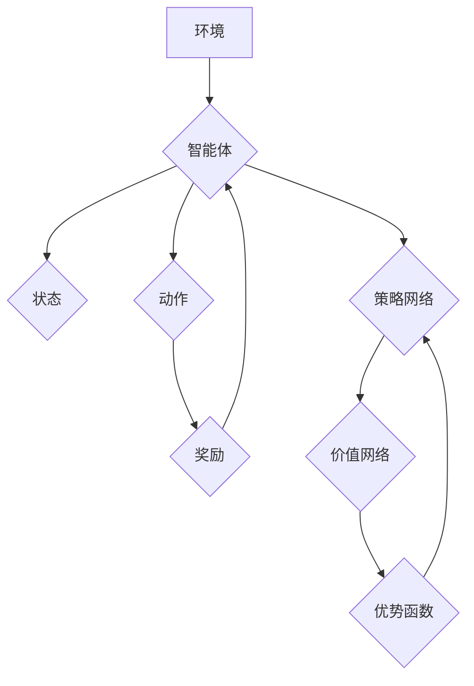

> Deep Q-Network (DQN), Asynchronous Advantage Actor-Critic (A3C), Asynchronous Advantage Actor-Critic (A2C), Reinforcement Learning (RL), Deep Learning, Parallel Training

## 1. 背景介绍

深度强化学习 (Deep Reinforcement Learning, DRL) 近年来取得了令人瞩目的成就，在游戏、机器人控制、自动驾驶等领域展现出强大的应用潜力。其中，Deep Q-Network (DQN) 作为首个成功应用深度学习解决强化学习问题的算法，为DRL的发展奠定了基础。然而，传统的DQN算法存在训练速度慢、样本利用率低等问题。为了解决这些问题，异步方法 A3C 和 A2C 应运而生，它们通过并行训练多个智能体，并利用异步更新策略网络，显著提高了训练效率。

## 2. 核心概念与联系

### 2.1 强化学习基础

强化学习是一种机器学习范式，其核心在于智能体与环境的交互。智能体通过与环境的交互，获得奖励信号，并根据奖励信号调整其行为策略，以最大化累积奖励。

* **智能体 (Agent):**  执行动作并感知环境状态的实体。
* **环境 (Environment):** 智能体与之交互的外部世界。
* **状态 (State):** 环境在特定时刻的描述。
* **动作 (Action):** 智能体在特定状态下可以执行的操作。
* **奖励 (Reward):** 环境对智能体动作的反馈，通常是一个标量值。
* **策略 (Policy):**  智能体在不同状态下选择动作的概率分布。
* **价值函数 (Value Function):**  评估状态或状态-动作对的长期奖励期望。

### 2.2 DQN算法

DQN 算法将深度神经网络应用于强化学习，利用神经网络逼近价值函数，并通过经验回放和目标网络更新等技术，克服了传统强化学习算法的样本效率低和训练不稳定等问题。

### 2.3 异步方法

异步方法通过并行训练多个智能体，并利用异步更新策略网络，显著提高了训练效率。A3C 和 A2C 都是典型的异步方法，它们通过不同的方式实现异步更新，从而在训练速度和稳定性方面各有优劣。

### 2.4 A3C 与 A2C 的关系

A3C 和 A2C 都是基于 Actor-Critic 架构的异步方法，它们都利用多个智能体并行训练，并通过异步更新策略网络来提高训练效率。

* **A3C (Asynchronous Advantage Actor-Critic):** A3C 采用优势函数 (Advantage Function) 来指导策略网络的更新，并利用多个智能体并行训练，每个智能体维护自己的策略网络和价值网络。
* **A2C (Asynchronous Advantage Actor-Critic):** A2C 与 A3C 类似，但它采用单一的策略网络和价值网络，并通过异步更新策略网络来提高训练效率。

**Mermaid 流程图**



## 3. 核心算法原理 & 具体操作步骤

### 3.1 算法原理概述

A3C 和 A2C 都是基于 Actor-Critic 架构的异步方法，它们都利用多个智能体并行训练，并通过异步更新策略网络来提高训练效率。

* **Actor:** 负责根据策略网络输出的动作选择，并与环境交互。
* **Critic:** 负责评估状态或状态-动作对的价值函数。

A3C 和 A2C 的核心思想是：

* **并行训练:**  多个智能体同时与环境交互，并收集经验数据。
* **异步更新:**  策略网络的更新是异步的，即多个智能体可以同时更新策略网络，而不会互相干扰。
* **优势函数:**  A3C 使用优势函数来指导策略网络的更新，优势函数可以衡量动作在特定状态下的价值，从而引导策略网络学习更优的策略。

### 3.2 算法步骤详解

**A3C 算法步骤:**

1. 初始化多个智能体，每个智能体维护自己的策略网络和价值网络。
2. 每个智能体与环境交互，收集经验数据 (状态、动作、奖励、下一个状态)。
3. 将经验数据存储在经验回放缓冲区中。
4. 从经验回放缓冲区中随机采样经验数据，并使用价值网络估计状态-动作对的价值。
5. 计算优势函数，并使用优势函数更新策略网络。
6. 重复步骤 2-5，直到策略网络收敛。

**A2C 算法步骤:**

1. 初始化一个策略网络和一个价值网络。
2. 每个智能体与环境交互，收集经验数据 (状态、动作、奖励、下一个状态)。
3. 使用价值网络估计状态-动作对的价值。
4. 计算优势函数，并使用优势函数更新策略网络。
5. 重复步骤 2-4，直到策略网络收敛。

### 3.3 算法优缺点

**A3C 优点:**

* 训练速度快，效率高。
* 能够学习更复杂的策略。

**A3C 缺点:**

* 训练过程可能不稳定。
* 需要维护多个智能体和网络。

**A2C 优点:**

* 训练过程相对稳定。
* 只需要维护一个策略网络和一个价值网络。

**A2C 缺点:**

* 训练速度可能不如 A3C 快。
* 难以学习非常复杂的策略。

### 3.4 算法应用领域

A3C 和 A2C 广泛应用于各种强化学习任务，例如：

* 游戏 AI
* 机器人控制
* 自动驾驶
* 自然语言处理

## 4. 数学模型和公式 & 详细讲解 & 举例说明

### 4.1 数学模型构建

**策略网络:**

策略网络是一个神经网络，其输出是一个动作概率分布。

**价值网络:**

价值网络是一个神经网络，其输出是一个状态或状态-动作对的价值估计。

**优势函数:**

优势函数衡量动作在特定状态下的价值，其定义如下:

$$A(s, a) = Q(s, a) - V(s)$$

其中:

* $A(s, a)$ 是优势函数。
* $Q(s, a)$ 是状态-动作对的价值函数。
* $V(s)$ 是状态的价值函数。

**目标函数:**

A3C 和 A2C 的目标函数都是最大化策略网络的期望奖励。

### 4.2 公式推导过程

A3C 和 A2C 的目标函数推导过程类似，其核心思想是利用优势函数来指导策略网络的更新。

**A3C 目标函数:**

$$J(\theta) = \mathbb{E}_{\tau \sim \mathcal{D}} \sum_{t=0}^{T} A(s_t, a_t) \nabla_{\theta} \log \pi_{\theta}(a_t | s_t)$$

其中:

* $J(\theta)$ 是策略网络参数 $\theta$ 的目标函数。
* $\mathcal{D}$ 是经验数据集。
* $\tau$ 是一个轨迹。
* $A(s_t, a_t)$ 是优势函数。
* $\pi_{\theta}(a_t | s_t)$ 是策略网络输出的动作概率分布。

**A2C 目标函数:**

$$J(\theta) = \mathbb{E}_{\tau \sim \mathcal{D}} \sum_{t=0}^{T} \left(R_t + \gamma V_{\phi}(s_{t+1}) - V_{\phi}(s_t)\right) \nabla_{\theta} \log \pi_{\theta}(a_t | s_t)$$

其中:

* $R_t$ 是从时间步 $t$ 到终点的奖励总和。
* $\gamma$ 是折扣因子。
* $V_{\phi}(s)$ 是价值网络输出的状态价值估计。

### 4.3 案例分析与讲解

假设我们有一个简单的强化学习任务，智能体需要在一条直线上移动，目标是尽可能地靠近终点。

* **状态:** 智能体的当前位置。
* **动作:** 向左或向右移动。
* **奖励:** 当智能体到达终点时获得最大奖励，否则获得较小的奖励。

我们可以使用 A3C 或 A2C 算法来训练智能体。

* **策略网络:** 可以使用一个简单的全连接神经网络来表示策略网络，其输出是向左或向右移动的概率。
* **价值网络:** 可以使用一个简单的全连接神经网络来表示价值网络，其输出是智能体当前位置的价值估计。

通过训练 A3C 或 A2C 算法，智能体可以学习到一个策略，使得它能够在直线上尽可能地靠近终点。

## 5. 项目实践：代码实例和详细解释说明

### 5.1 开发环境搭建

* Python 3.6+
* TensorFlow 或 PyTorch
* OpenAI Gym

### 5.2 源代码详细实现

```python
import gym
import tensorflow as tf

# 定义策略网络
class PolicyNetwork(tf.keras.Model):
    def __init__(self, state_size, action_size):
        super(PolicyNetwork, self).__init__()
        self.dense1 = tf.keras.layers.Dense(64, activation='relu')
        self.dense2 = tf.keras.layers.Dense(action_size, activation='softmax')

    def call(self, state):
        x = self.dense1(state)
        return self.dense2(x)

# 定义价值网络
class ValueNetwork(tf.keras.Model):
    def __init__(self, state_size):
        super(ValueNetwork, self).__init__()
        self.dense1 = tf.keras.layers.Dense(64, activation='relu')
        self.dense2 = tf.keras.layers.Dense(1)

    def call(self, state):
        x = self.dense1(state)
        return self.dense2(x)

# 定义 A3C 算法
class A3C:
    def __init__(self, state_size, action_size, learning_rate):
        self.state_size = state_size
        self.action_size = action_size
        self.learning_rate = learning_rate
        self.policy_network = PolicyNetwork(state_size, action_size)
        self.value_network = ValueNetwork(state_size)
        self.optimizer = tf.keras.optimizers.Adam(learning_rate=self.learning_rate)

    def train(self, env, num_episodes):
        for episode in range(num_episodes):
            state = env.reset()
            done = False
            total_reward = 0
            while not done:
                # 选择动作
                action_probs = self.policy_network(state)
                action = tf.random.categorical(tf.math.log(action_probs), 1)[0, 0]

                # 执行动作
                next_state, reward, done, _ = env.step(action)

                # 更新经验
                # ...

            # 更新策略网络和价值网络
            # ...

### 5.3 代码解读与分析

* **策略网络:** 策略网络是一个神经网络，其输出是一个动作概率分布。
* **价值网络:** 价值网络是一个神经网络，其输出是一个状态或状态-动作对的价值估计。
* **A3C 算法:** A3C 算法是一个异步方法，它利用多个智能体并行训练，并通过异步更新策略网络来提高训练效率。

### 5.4 运行结果展示

运行 A3C 算法后，智能体可以学习到一个策略，使得它能够在直线上尽可能