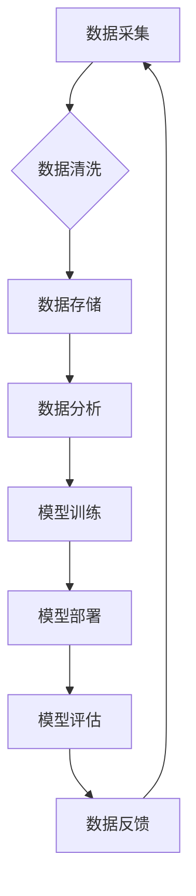

> 人工智能，数据管理，数据质量，数据安全，数据隐私，数据治理，数据可视化，机器学习，深度学习

## 1. 背景介绍

人工智能（AI）正以惊人的速度发展，并深刻地改变着各行各业。从医疗保健到金融，从制造业到零售，AI 正在推动创新，提高效率，创造新的商业模式。然而，AI 的成功离不开高质量的数据支撑。数据是 AI 算法的燃料，是训练模型、发现模式和做出预测的关键要素。

对于 AI 初创企业来说，数据管理的重要性尤为突出。由于资源有限，初创企业需要更加精细地管理数据，以确保数据质量、安全性和隐私性，并将其最大限度地利用。

## 2. 核心概念与联系

**2.1 数据管理概述**

数据管理是指规划、组织、存储、保护和使用数据的一系列活动。它涵盖了数据生命周期的各个阶段，从数据采集到数据分析和决策支持。

**2.2 AI 与数据管理的联系**

AI 算法依赖于大量的数据进行训练和优化。数据质量直接影响 AI 模型的性能和准确性。因此，数据管理成为 AI 发展的重要基石。

**2.3 数据管理在 AI 初创企业中的重要性**

对于 AI 初创企业来说，数据管理的重要性体现在以下几个方面：

* **数据质量：** 高质量的数据是训练高质量 AI 模型的关键。数据不完整、不准确或不一致会导致模型性能下降，甚至产生错误的结果。
* **数据安全：** 数据泄露或被恶意攻击会对 AI 初创企业造成巨大的损失。因此，需要采取有效的措施保护数据安全。
* **数据隐私：** 在处理个人数据时，需要遵守相关法律法规，保护用户隐私。
* **数据可视化：** 通过数据可视化，可以更好地理解数据，发现隐藏的模式和趋势，从而为 AI 模型的开发和优化提供支持。

**2.4 数据管理架构**



## 3. 核心算法原理 & 具体操作步骤

**3.1 算法原理概述**

数据管理的核心算法包括数据清洗、数据转换、数据整合、数据建模等。这些算法利用数学和统计方法，对数据进行处理和分析，以提高数据质量和可利用性。

**3.2 算法步骤详解**

* **数据清洗：** 
    * 识别和处理缺失值、重复值、错误值等数据质量问题。
    * 使用统计方法，例如均值、中位数、众数等，填充缺失值。
    * 使用聚类算法，识别和删除重复数据。
    * 使用正则表达式，识别和修正错误数据。
* **数据转换：** 
    * 将数据从一种格式转换为另一种格式，例如将文本数据转换为数字数据。
    * 使用数据类型转换函数，将数据类型进行转换。
    * 使用数据映射规则，将数据值进行转换。
* **数据整合：** 
    * 从多个数据源中提取数据，并将其整合到一个统一的数据仓库中。
    * 使用数据匹配算法，识别和合并来自不同数据源的相同数据。
    * 使用数据转换规则，将不同数据源的数据格式进行统一。
* **数据建模：** 
    * 使用统计方法和机器学习算法，构建数据模型，以描述数据之间的关系和模式。
    * 使用数据挖掘技术，从数据中发现隐藏的知识和洞察。

**3.3 算法优缺点**

* **优点：** 
    * 可以提高数据质量，增强数据可信度。
    * 可以简化数据分析和决策过程。
    * 可以促进数据共享和协作。
* **缺点：** 
    * 需要一定的技术 expertise。
    * 需要投入一定的资源和时间。
    * 可能存在数据隐私和安全问题。

**3.4 算法应用领域**

数据管理算法广泛应用于各个领域，例如：

* **金融：** 风险管理、欺诈检测、客户画像
* **医疗保健：** 疾病诊断、药物研发、患者管理
* **零售：** 商品推荐、库存管理、客户关系管理
* **制造业：** 质量控制、预测维护、生产优化

## 4. 数学模型和公式 & 详细讲解 & 举例说明

**4.1 数学模型构建**

数据管理可以抽象为一个数学模型，其中数据被视为一个向量，数据质量指标被视为一个函数，数据处理操作被视为一个变换。

**4.2 公式推导过程**

假设数据向量为 X，数据质量指标为 Q(X)，数据处理操作为 T(X)。则数据处理后的数据质量指标为 Q(T(X))。

**4.3 案例分析与讲解**

例如，数据清洗操作可以看作是一个数据变换操作，它可以去除数据中的噪声和错误值，从而提高数据质量。

假设数据向量 X 包含一些缺失值，可以使用均值填充缺失值，得到新的数据向量 Y。则数据处理操作 T(X) = Y，数据质量指标 Q(X) < Q(Y)。

## 5. 项目实践：代码实例和详细解释说明

**5.1 开发环境搭建**

使用 Python 语言和 Pandas 库进行数据处理和分析。

**5.2 源代码详细实现**

```python
import pandas as pd

# 读取数据
data = pd.read_csv('data.csv')

# 数据清洗
# 填充缺失值
data['age'].fillna(data['age'].mean(), inplace=True)

# 删除重复数据
data.drop_duplicates(inplace=True)

# 数据转换
# 将文本数据转换为数字数据
data['gender'] = data['gender'].map({'male': 1, 'female': 0})

# 数据整合
# 从多个数据源中提取数据
data1 = pd.read_csv('data1.csv')
data2 = pd.read_csv('data2.csv')
data = pd.concat([data, data1, data2], axis=0)

# 数据建模
# 使用线性回归模型预测房价
from sklearn.linear_model import LinearRegression
model = LinearRegression()
model.fit(data[['area', 'bedrooms']], data['price'])

# 预测房价
new_data = pd.DataFrame({'area': [100], 'bedrooms': [2]})
predicted_price = model.predict(new_data)
print(predicted_price)
```

**5.3 代码解读与分析**

* 代码首先使用 Pandas 库读取数据，然后进行数据清洗、转换、整合等操作。
* 使用线性回归模型预测房价，并展示预测结果。

**5.4 运行结果展示**

运行代码后，将输出预测房价的结果。

## 6. 实际应用场景

**6.1 数据质量管理**

* 使用数据质量指标，监控数据质量，及时发现和解决数据问题。
* 使用数据清洗工具，自动处理数据质量问题。

**6.2 数据安全管理**

* 使用数据加密技术，保护数据安全。
* 使用访问控制机制，控制对数据的访问权限。

**6.3 数据隐私管理**

* 使用数据脱敏技术，保护用户隐私。
* 遵守相关法律法规，保护用户数据安全。

**6.4 未来应用展望**

* 人工智能驱动的自动化数据管理
* 基于云计算的分布式数据管理
* 数据治理平台的智能化

## 7. 工具和资源推荐

**7.1 学习资源推荐**

* 书籍：《数据科学实战》、《数据挖掘与机器学习》
* 在线课程：Coursera、edX、Udacity

**7.2 开发工具推荐**

* Python：数据分析和机器学习的常用语言
* Pandas：数据处理和分析的常用库
* Scikit-learn：机器学习算法的常用库

**7.3 相关论文推荐**

* 《数据管理在人工智能时代的新挑战》
* 《人工智能驱动的自动化数据管理》

## 8. 总结：未来发展趋势与挑战

**8.1 研究成果总结**

数据管理在人工智能发展中扮演着越来越重要的角色。随着人工智能技术的不断发展，数据管理也面临着新的挑战和机遇。

**8.2 未来发展趋势**

* 人工智能驱动的自动化数据管理
* 基于云计算的分布式数据管理
* 数据治理平台的智能化

**8.3 面临的挑战**

* 数据质量问题
* 数据安全问题
* 数据隐私问题
* 数据治理问题

**8.4 研究展望**

未来，需要进一步研究人工智能驱动的自动化数据管理方法，以及如何更好地解决数据质量、安全、隐私和治理等问题。

## 9. 附录：常见问题与解答

**9.1 如何提高数据质量？**

可以使用数据清洗工具，自动处理数据质量问题。也可以使用数据质量指标，监控数据质量，及时发现和解决数据问题。

**9.2 如何保护数据安全？**

可以使用数据加密技术，保护数据安全。也可以使用访问控制机制，控制对数据的访问权限。

**9.3 如何保护用户隐私？**

可以使用数据脱敏技术，保护用户隐私。也要遵守相关法律法规，保护用户数据安全。


作者：禅与计算机程序设计艺术 / Zen and the Art of Computer Programming 
<end_of_turn>