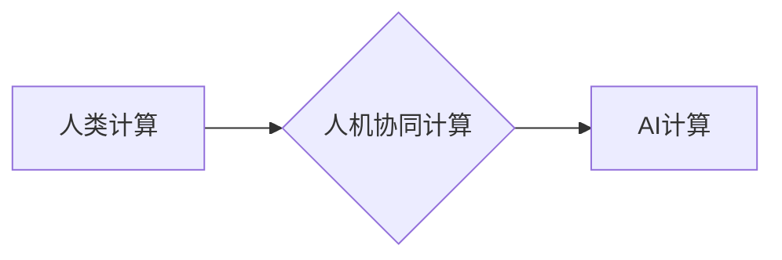

> 人工智能，未来就业，技能培训，人类计算，自动化，数据分析，机器学习，深度学习，自然语言处理

## 1. 背景介绍

人工智能（AI）技术的飞速发展正在深刻地改变着世界，并对未来就业市场和技能培训产生着深远的影响。随着自动化技术的进步，许多传统工作岗位面临被取代的风险，而新的AI相关岗位则不断涌现。在这种情况下，了解AI时代未来就业市场的发展趋势和必要的技能培训需求，对于个人职业发展和社会经济发展都至关重要。

**1.1 AI技术发展现状**

近年来，人工智能技术取得了长足的进步，特别是深度学习算法的突破，使得AI在图像识别、语音识别、自然语言处理等领域取得了令人瞩目的成就。AI技术正在广泛应用于各个行业，例如医疗、金融、制造、零售等，并不断推动着社会数字化转型和智能化升级。

**1.2 AI对就业市场的影响**

AI技术的应用一方面会带来新的就业机会，例如AI工程师、数据科学家、机器学习专家等，另一方面也会导致一些传统工作岗位被自动化取代。例如，自动驾驶技术的发展可能会导致货车司机等职业的减少。

**1.3 技能培训需求**

面对AI时代带来的挑战和机遇，我们需要不断提升自身技能，适应未来就业市场的发展趋势。AI相关技能，例如数据分析、机器学习、深度学习、自然语言处理等，将成为未来就业市场中非常重要的竞争力。

## 2. 核心概念与联系

**2.1 人类计算**

人类计算是指人类利用自身的认知能力和计算能力来解决问题和完成任务的过程。在传统意义上，人类计算主要依靠逻辑思维、推理能力和经验积累。

**2.2 AI计算**

AI计算是指利用人工智能算法和技术来模拟和增强人类的计算能力的过程。AI计算可以处理海量数据，识别复杂模式，并做出智能决策。

**2.3 人机协同计算**

人机协同计算是指人类和AI系统共同合作完成任务的过程。在这种模式下，人类提供创意、决策和情感理解，而AI系统提供数据处理、计算和自动化能力。

**2.4 融合关系**

人类计算和AI计算是互补的，两者可以相互融合，形成更强大的计算能力。人机协同计算是未来计算模式的发展趋势，它将充分发挥人类和AI的各自优势，实现更高效、更智能的计算。



## 3. 核心算法原理 & 具体操作步骤

**3.1 算法原理概述**

深度学习算法是人工智能领域的核心算法之一，它能够学习和识别复杂模式，并进行智能决策。深度学习算法的核心是多层神经网络，这些神经网络由多个隐藏层组成，每层神经元之间通过权重连接，通过训练数据学习权重，从而实现对数据的学习和识别。

**3.2 算法步骤详解**

1. **数据预处理:** 将原始数据进行清洗、转换和格式化，使其适合深度学习算法的训练。
2. **网络结构设计:** 根据任务需求设计深度神经网络的结构，包括神经元的数量、连接方式和激活函数等。
3. **参数初始化:** 为神经网络中的权重和偏置赋予初始值。
4. **前向传播:** 将输入数据通过神经网络进行传递，计算输出结果。
5. **反向传播:** 计算输出结果与真实值的误差，并根据误差反向传播，更新神经网络的权重和偏置。
6. **迭代训练:** 重复前向传播和反向传播的过程，直到模型的性能达到预期的水平。

**3.3 算法优缺点**

**优点:**

* 能够学习和识别复杂模式
* 性能优于传统机器学习算法
* 可应用于多种任务，例如图像识别、语音识别、自然语言处理等

**缺点:**

* 训练数据量大，需要大量计算资源
* 训练过程复杂，需要专业知识
* 模型解释性差，难以理解模型的决策过程

**3.4 算法应用领域**

深度学习算法广泛应用于各个领域，例如：

* **图像识别:** 人脸识别、物体检测、图像分类
* **语音识别:** 语音转文本、语音助手
* **自然语言处理:** 机器翻译、文本摘要、情感分析
* **医疗诊断:** 病情预测、疾病诊断
* **金融分析:** 风险评估、欺诈检测

## 4. 数学模型和公式 & 详细讲解 & 举例说明

**4.1 数学模型构建**

深度学习算法的核心是多层神经网络，每个神经元接收多个输入信号，并通过加权求和和激活函数进行处理，输出一个信号。神经网络的结构可以表示为一个 directed acyclic graph (DAG)，其中每个节点代表一个神经元，每个边代表一个连接。

**4.2 公式推导过程**

* **激活函数:** 激活函数用于引入非线性，使神经网络能够学习复杂模式。常见的激活函数包括 sigmoid 函数、ReLU 函数、tanh 函数等。

* **损失函数:** 损失函数用于衡量模型的预测结果与真实值的差异。常见的损失函数包括均方误差 (MSE)、交叉熵损失 (Cross-Entropy Loss) 等。

* **梯度下降:** 梯度下降算法用于更新神经网络的权重和偏置，使其朝着最小化损失函数的方向进行调整。

**4.3 案例分析与讲解**

假设我们有一个简单的深度学习模型，用于识别手写数字。模型的输入是一个 28x28 的图像，输出是一个 10 维的向量，分别代表数字 0 到 9 的概率。

* **训练数据:** 我们使用 MNIST 数据集进行训练，该数据集包含 60,000 张手写数字图像。
* **模型结构:** 我们使用一个简单的全连接神经网络，包含两层隐藏层，每层神经元数量为 128。
* **损失函数:** 我们使用交叉熵损失函数。
* **梯度下降:** 我们使用随机梯度下降算法进行训练，学习率为 0.01。

通过训练，模型能够学习识别手写数字的特征，并达到较高的准确率。

## 5. 项目实践：代码实例和详细解释说明

**5.1 开发环境搭建**

* **操作系统:** Ubuntu 20.04
* **编程语言:** Python 3.8
* **深度学习框架:** TensorFlow 2.0

**5.2 源代码详细实现**

```python
import tensorflow as tf

# 定义模型结构
model = tf.keras.models.Sequential([
    tf.keras.layers.Flatten(input_shape=(28, 28)),
    tf.keras.layers.Dense(128, activation='relu'),
    tf.keras.layers.Dense(10, activation='softmax')
])

# 编译模型
model.compile(optimizer='adam',
              loss='sparse_categorical_crossentropy',
              metrics=['accuracy'])

# 加载训练数据
(x_train, y_train), (x_test, y_test) = tf.keras.datasets.mnist.load_data()

# 训练模型
model.fit(x_train, y_train, epochs=5)

# 评估模型
loss, accuracy = model.evaluate(x_test, y_test)
print('Test loss:', loss)
print('Test accuracy:', accuracy)
```

**5.3 代码解读与分析**

* **模型结构:** 我们定义了一个简单的全连接神经网络，包含两层隐藏层，每层神经元数量为 128。
* **编译模型:** 我们使用 Adam 优化器、交叉熵损失函数和准确率作为评估指标。
* **加载训练数据:** 我们使用 MNIST 数据集进行训练。
* **训练模型:** 我们训练模型 5 个 epochs。
* **评估模型:** 我们使用测试数据评估模型的性能。

**5.4 运行结果展示**

运行代码后，会输出测试集上的损失值和准确率。

## 6. 实际应用场景

**6.1 医疗诊断**

深度学习算法可以用于分析医学图像，例如 X 光片、CT 扫描和 MRI 图像，辅助医生诊断疾病。例如，深度学习算法可以用于识别肺癌、乳腺癌和脑肿瘤等疾病。

**6.2 金融风险评估**

深度学习算法可以用于分析金融数据，例如股票价格、交易记录和客户信息，识别潜在的金融风险。例如，深度学习算法可以用于检测欺诈交易、评估信用风险和预测市场波动。

**6.3 自动驾驶**

深度学习算法是自动驾驶技术的核心技术之一，可以用于识别道路场景、预测车辆运动和控制车辆行驶。例如，深度学习算法可以用于识别行人、车辆和交通信号灯，并根据这些信息控制车辆行驶。

**6.4 未来应用展望**

随着人工智能技术的不断发展，深度学习算法将在更多领域得到应用，例如：

* **个性化教育:** 根据学生的学习情况，提供个性化的学习内容和教学方法。
* **智能客服:** 利用自然语言处理技术，提供更加智能和人性化的客服服务。
* **科学研究:** 加速科学研究的进程，例如药物研发、材料科学等。

## 7. 工具和资源推荐

**7.1 学习资源推荐**

* **在线课程:** Coursera、edX、Udacity 等平台提供深度学习相关的在线课程。
* **书籍:** 《深度学习》、《动手学深度学习》等书籍对深度学习算法和应用进行了详细介绍。
* **开源代码库:** TensorFlow、PyTorch 等开源代码库提供了深度学习算法的实现代码和示例。

**7.2 开发工具推荐**

* **编程语言:** Python 是深度学习开发的主要编程语言。
* **深度学习框架:** TensorFlow、PyTorch、Keras 等深度学习框架提供了丰富的工具和功能，简化了深度学习模型的开发和训练过程。
* **数据处理工具:** Pandas、NumPy 等数据处理工具可以帮助我们处理和分析深度学习所需的训练数据。

**7.3 相关论文推荐**

* **AlexNet:** 《ImageNet Classification with Deep Convolutional Neural Networks》
* **VGGNet:** 《Very Deep Convolutional Networks for Large-Scale Image Recognition》
* **ResNet:** 《Deep Residual Learning for Image Recognition》

## 8. 总结：未来发展趋势与挑战

**8.1 研究成果总结**

近年来，深度学习算法取得了长足的进步，在图像识别、语音识别、自然语言处理等领域取得了令人瞩目的成就。

**8.2 未来发展趋势**

* **模型规模和复杂度提升:** 未来深度学习模型将更加庞大，包含更多层和参数，从而能够学习更加复杂和抽象的特征。
* **数据驱动和自动化:** 数据将成为深度学习发展的关键要素，而自动化技术将进一步简化深度学习模型的开发和训练过程。
* **跨模态学习:** 未来深度学习模型将能够处理多种模态数据，例如文本、图像、音频和视频，从而实现更加智能的理解和交互。

**8.3 面临的挑战**

* **数据获取和隐私保护:** 深度学习算法需要大量数据进行训练，而数据获取和隐私保护是一个重要的挑战。
* **模型解释性和可信度:** 深度学习模型的决策过程往往难以解释，这使得模型的可信度受到质疑。
* **计算资源和能源消耗:** 训练大型深度学习模型需要大量的计算资源和能源，这带来了环境和经济方面的挑战。

**8.4 研究展望**

未来，我们需要继续探索深度学习算法的潜力，解决其面临的挑战，并将其应用于更多领域，推动人工智能技术的发展和应用。

## 9. 附录：常见问题与解答

**9.1 如何选择合适的深度学习框架？**

选择深度学习框架需要根据具体项目需求和个人偏好进行考虑。TensorFlow 和 PyTorch 是目前最流行的深度学习框架，它们都提供了丰富的功能和强大的社区支持。

**9.2 如何处理深度学习训练过程中遇到的过拟合问题？**

过拟合是指模型在训练