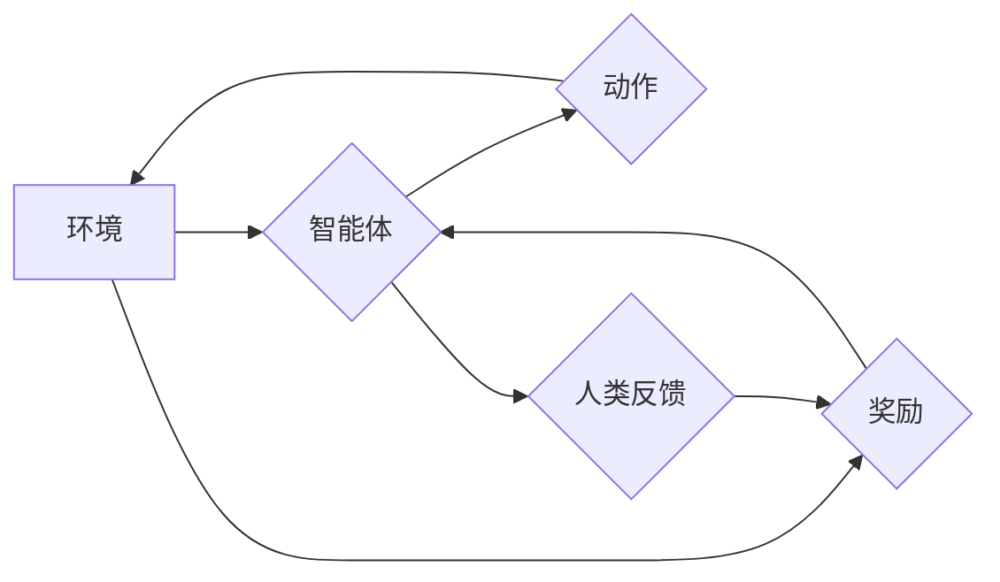

> 强化学习，人类反馈，模型训练，幻觉，伦理问题，安全问题

## 1. 背景介绍

近年来，人工智能领域取得了令人瞩目的进展，其中强化学习（Reinforcement Learning，RL）作为一种重要的机器学习范式，在游戏、机器人控制、自动驾驶等领域展现出强大的应用潜力。强化学习的核心思想是通过奖励机制引导智能体在环境中学习最优策略，从而达到预期的目标。

传统的强化学习算法主要依赖于环境反馈，通过奖励和惩罚信号来调整智能体的行为策略。然而，人类反馈的引入为强化学习带来了新的机遇和挑战。人类反馈可以提供更丰富、更细粒度的信息，帮助智能体更好地理解人类意图和期望，从而学习出更符合人类需求的策略。

## 2. 核心概念与联系

**2.1 人类反馈强化学习 (Human Feedback Reinforcement Learning，HFRL)**

HFRL 是一种结合人类反馈和强化学习的学习范式。它利用人类对模型输出的评价和指导，来优化模型的训练过程。

**2.2 核心概念**

* **奖励函数:**  传统强化学习中，奖励函数由环境定义，用于评估智能体行为的好坏。在 HFRL 中，奖励函数可以由人类提供，更直接地反映人类对模型输出的满意程度。
* **人类反馈:**  人类反馈可以是直接的评分，也可以是更细粒度的评论和建议。这些反馈信息可以用于调整奖励函数，引导模型学习更符合人类期望的行为。
* **模型训练:**  HFRL 算法利用人类反馈来更新模型参数，从而提高模型的性能和符合人类意图的能力。

**2.3 架构图**



## 3. 核心算法原理 & 具体操作步骤

**3.1 算法原理概述**

HFRL 算法的核心思想是利用人类反馈来引导模型学习。它通常采用以下步骤：

1. **初始模型训练:**  使用传统的强化学习算法对模型进行初步训练，使其具备基本的决策能力。
2. **人类反馈收集:**  让人类对模型的输出进行评价和反馈，例如评分、评论、建议等。
3. **奖励函数调整:**  根据人类反馈，调整模型的奖励函数，使其更符合人类期望。
4. **模型再训练:**  使用更新后的奖励函数对模型进行进一步训练，使其学习出更符合人类意图的行为策略。

**3.2 算法步骤详解**

1. **初始化:**  设置初始奖励函数，并根据环境和任务定义智能体的动作空间和状态空间。
2. **模型训练:**  使用传统的强化学习算法对模型进行初步训练，使其能够在环境中进行基本的交互和决策。
3. **人类反馈收集:**  将模型输出展示给人类，并收集人类对模型输出的评价和反馈。
4. **反馈处理:**  对收集到的人类反馈进行处理，例如将评分转化为奖励信号，将评论和建议转化为奖励函数的调整方向。
5. **奖励函数更新:**  根据处理后的反馈信息，更新模型的奖励函数，使其更符合人类期望。
6. **模型再训练:**  使用更新后的奖励函数对模型进行进一步训练，使其学习出更符合人类意图的行为策略。
7. **迭代:**  重复步骤 3-6，直到模型性能达到预期的目标。

**3.3 算法优缺点**

**优点:**

* 可以学习出更符合人类期望的行为策略。
* 可以利用人类的知识和经验，提高模型的学习效率。
* 可以解决传统强化学习算法难以解决的问题，例如缺乏明确的奖励函数。

**缺点:**

* 收集高质量的人类反馈成本较高。
* 人类反馈可能存在主观性和偏差。
* 模型可能过度依赖人类反馈，导致缺乏泛化能力。

**3.4 算法应用领域**

HFRL 算法在以下领域具有广泛的应用前景:

* **自然语言处理:**  训练更符合人类语言习惯和语义的语言模型。
* **计算机视觉:**  训练能够理解和解释图像内容的视觉模型。
* **机器人控制:**  训练能够更好地理解和响应人类指令的机器人。
* **个性化推荐:**  训练能够根据用户偏好提供个性化推荐的系统。

## 4. 数学模型和公式 & 详细讲解 & 举例说明

**4.1 数学模型构建**

HFRL 算法可以建模为一个马尔可夫决策过程 (MDP)，其中智能体在环境中采取行动，并根据环境反馈获得奖励。

* **状态空间:**  环境的当前状态，例如游戏中的棋盘状态或机器人的位置。
* **动作空间:**  智能体可以采取的行动，例如在游戏中移动棋子或机器人改变方向。
* **奖励函数:**  评估智能体行为的好坏的函数，可以由环境定义或由人类提供。
* **转移概率:**  从一个状态到另一个状态的概率，取决于智能体采取的行动。

**4.2 公式推导过程**

HFRL 算法的目标是找到一个最优策略，使得智能体在环境中获得最大的累积奖励。可以使用动态规划或蒙特卡罗方法来求解最优策略。

* **Bellman 方程:**  描述了最优价值函数的递推关系。
* **价值函数:**  评估智能体在特定状态下采取特定策略的预期累积奖励。

**4.3 案例分析与讲解**

例如，训练一个聊天机器人，可以使用 HFRL 算法。

* **状态空间:**  聊天对话的历史记录。
* **动作空间:**  聊天机器人可以发送的文本消息。
* **奖励函数:**  由人类对聊天机器人的回复进行评分，例如流畅度、相关性、幽默感等。
* **转移概率:**  由聊天对话的历史记录和聊天机器人的回复决定。

通过训练，聊天机器人可以学习到更符合人类期望的对话风格和内容。

## 5. 项目实践：代码实例和详细解释说明

**5.1 开发环境搭建**

* Python 3.7+
* TensorFlow 或 PyTorch
* 其他必要的库，例如 NumPy、Pandas 等

**5.2 源代码详细实现**

```python
import tensorflow as tf

# 定义模型结构
model = tf.keras.Sequential([
    tf.keras.layers.Embedding(input_dim=vocab_size, output_dim=embedding_dim),
    tf.keras.layers.LSTM(units=hidden_size),
    tf.keras.layers.Dense(units=vocab_size, activation='softmax')
])

# 定义损失函数和优化器
loss_fn = tf.keras.losses.CategoricalCrossentropy()
optimizer = tf.keras.optimizers.Adam()

# 定义训练循环
def train_step(inputs, targets):
    with tf.GradientTape() as tape:
        predictions = model(inputs)
        loss = loss_fn(targets, predictions)
    gradients = tape.gradient(loss, model.trainable_variables)
    optimizer.apply_gradients(zip(gradients, model.trainable_variables))

# 训练模型
for epoch in range(num_epochs):
    for batch in dataset:
        train_step(batch['inputs'], batch['targets'])

```

**5.3 代码解读与分析**

* 代码定义了一个基于 LSTM 的文本生成模型。
* 模型输入是文本序列的词嵌入，输出是下一个词的概率分布。
* 训练过程使用交叉熵损失函数和 Adam 优化器。
* 训练循环迭代训练模型，并根据人类反馈调整模型参数。

**5.4 运行结果展示**

训练完成后，模型可以用来生成新的文本。

## 6. 实际应用场景

**6.1 游戏开发**

HFRL 可以用于训练更智能的游戏 AI，使其能够更好地理解游戏规则和玩家行为，从而提供更具挑战性和趣味性的游戏体验。

**6.2 机器人控制**

HFRL 可以用于训练机器人，使其能够更好地理解人类指令和环境信息，从而执行更复杂的任务。

**6.3 个性化推荐**

HFRL 可以用于训练个性化推荐系统，使其能够根据用户的偏好和行为提供更精准的推荐。

**6.4 未来应用展望**

HFRL 算法在未来将有更广泛的应用前景，例如：

* **医疗诊断:**  训练能够辅助医生诊断疾病的 AI 系统。
* **教育教学:**  训练能够个性化教学的 AI 辅导员。
* **科学研究:**  训练能够加速科学发现的 AI 助手。

## 7. 工具和资源推荐

**7.1 学习资源推荐**

* **书籍:**
    * Reinforcement Learning: An Introduction by Richard S. Sutton and Andrew G. Barto
    * Deep Reinforcement Learning Hands-On by Maxim Lapan
* **课程:**
    * Stanford CS234: Reinforcement Learning
    * DeepMind's Reinforcement Learning Specialization

**7.2 开发工具推荐**

* **TensorFlow:**  开源深度学习框架，支持 HFRL 算法的实现。
* **PyTorch:**  开源深度学习框架，支持 HFRL 算法的实现。
* **OpenAI Gym:**  强化学习环境库，提供各种标准的强化学习任务。

**7.3 相关论文推荐**

* **Human Feedback for Reinforcement Learning** by  Amodei et al. (2016)
* **Learning to Rank with Human Feedback** by  Liu et al. (2009)
* **Reward Modeling with Human Feedback** by  Levine et al. (2016)

## 8. 总结：未来发展趋势与挑战

**8.1 研究成果总结**

HFRL 算法取得了显著的进展，在许多领域展现出强大的应用潜力。

**8.2 未来发展趋势**

* **更有效的反馈机制:**  开发更有效的收集和处理人类反馈的方法，提高反馈的质量和效率。
* **更鲁棒的模型:**  训练更鲁棒的模型，使其能够更好地应对人类反馈的偏差和不确定性。
* **更广泛的应用:**  将 HFRL 算法应用到更多领域，例如医疗、教育、科学研究等。

**8.3 面临的挑战**

* **数据标注成本:**  收集高质量的人类反馈成本较高。
* **反馈偏差:**  人类反馈可能存在主观性和偏差。
* **模型安全性:**  确保 HFRL 算法训练出的模型安全可靠，避免产生负面影响。

**8.4 研究展望**

未来研究将继续探索 HFRL 算法的理论基础和应用潜力，并致力于解决算法面临的挑战，推动 HFRL 算法在人工智能领域的进一步发展。

## 9. 附录：常见问题与解答

**9.1 如何收集高质量的人类反馈？**

可以使用以下方法收集高质量的人类反馈：

* **A/B 测试:**  比较不同模型的输出，让用户选择更符合期望的模型。
* **打分和评论:**  让用户对模型的输出进行评分和评论，提供更详细的反馈信息。
* **对话式反馈:**  与用户进行对话，引导用户表达对模型的期望和建议。

**9.2 如何处理人类反馈的偏差？**

可以使用以下方法处理人类反馈的偏差：

* **数据清洗:**  去除明显错误或偏激的反馈信息。
* **反馈聚合:**  将多个用户的反馈进行聚合，降低单个用户的偏差影响。
* **模型校准:**  使用统计方法对模型的输出进行校准，减少模型对反馈偏差的敏感性。


作者：禅与计算机程序设计艺术 / Zen and the Art of Computer Programming 
<end_of_turn>