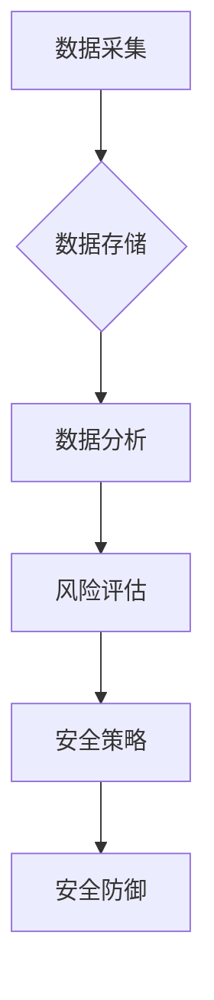

> 大数据，安全管理，信息差，风险评估，预测分析，机器学习，人工智能，安全策略

## 1. 背景介绍

在当今数字化时代，信息化建设日益深入，网络安全面临着前所未有的挑战。传统的安全管理模式往往依赖于规则和人工干预，难以应对日益复杂的网络攻击和数据泄露风险。大数据技术的出现为安全管理带来了新的机遇，其海量数据存储、分析处理能力，为弥补信息差、提升安全管理水平提供了强有力的支撑。

## 2. 核心概念与联系

**2.1 信息差与安全风险**

信息差是指在安全管理中，攻击者和防守方之间信息不对称的状况。攻击者往往掌握着更多关于目标系统的内部结构、漏洞信息和攻击策略，而防守方则缺乏对攻击者的动机、手段和目标的全面了解。这种信息差是网络安全风险的主要根源，导致防守方难以及时预判和应对攻击。

**2.2 大数据与安全管理**

大数据是指海量、高速度、多样化的数据集合。其核心特征包括：

* **海量数据**: 大数据量级巨大，难以通过传统方法进行处理和分析。
* **高速度**: 数据生成和更新速度极快，需要实时处理和分析。
* **多样化**: 数据类型多样，包括结构化数据、非结构化数据和半结构化数据。

大数据技术可以帮助安全管理者收集、存储、分析和利用海量安全数据，弥补信息差，提升安全管理水平。

**2.3 核心架构**



## 3. 核心算法原理 & 具体操作步骤

**3.1 算法原理概述**

大数据安全管理的核心算法主要包括：

* **机器学习**: 利用机器学习算法，从海量安全数据中学习攻击模式和特征，实现自动化威胁检测和响应。
* **深度学习**: 深度学习算法能够学习更复杂的特征和模式，提高威胁检测的准确性和效率。
* **预测分析**: 利用统计模型和机器学习算法，预测未来可能发生的网络攻击和数据泄露风险。

**3.2 算法步骤详解**

**机器学习算法步骤：**

1. **数据采集**: 收集各种安全日志、网络流量数据、威胁情报等海量数据。
2. **数据预处理**: 对收集到的数据进行清洗、转换、特征提取等预处理操作，使其适合机器学习算法的训练。
3. **模型训练**: 选择合适的机器学习算法，利用预处理后的数据进行模型训练，学习攻击模式和特征。
4. **模型评估**: 对训练好的模型进行评估，测试其准确率、召回率等指标，并进行调整优化。
5. **模型部署**: 将训练好的模型部署到生产环境中，实时监控网络流量和安全事件，进行威胁检测和响应。

**3.3 算法优缺点**

**优点:**

* 自动化威胁检测和响应，提高安全效率。
* 能够学习复杂的攻击模式，提升检测准确率。
* 预测未来可能发生的网络攻击和数据泄露风险。

**缺点:**

* 需要海量安全数据进行训练，数据质量对算法效果至关重要。
* 模型训练和部署需要专业技术人员。
* 算法本身存在一定的误差率，需要结合其他安全措施进行防御。

**3.4 算法应用领域**

* **入侵检测与预防**: 利用机器学习算法识别网络攻击行为，并采取相应的防御措施。
* **恶意软件检测**: 利用机器学习算法识别恶意软件，并将其隔离或删除。
* **数据泄露检测**: 利用机器学习算法检测数据泄露行为，并采取措施保护数据安全。
* **安全事件响应**: 利用机器学习算法分析安全事件，快速定位问题根源，并采取相应的响应措施。

## 4. 数学模型和公式 & 详细讲解 & 举例说明

**4.1 数学模型构建**

假设我们有一个网络安全系统，包含N个节点，每个节点都有其自身的风险等级。我们可以用一个向量来表示每个节点的风险等级，其中每个元素代表一个节点的风险等级。

```
风险等级向量 = [风险等级1, 风险等级2, ..., 风险等级N]
```

**4.2 公式推导过程**

我们可以利用机器学习算法，从历史安全事件数据中学习每个节点的风险等级。例如，我们可以使用逻辑回归模型，将节点的特征作为输入，预测节点的风险等级。

**逻辑回归模型公式:**

```
P(风险等级 = 1 | 特征) = 1 / (1 + exp(-(β0 + β1*特征1 + β2*特征2 + ... + βn*特征n)))
```

其中：

* P(风险等级 = 1 | 特征) 是节点风险等级为1的概率。
* 特征 是节点的特征向量。
* β0, β1, β2, ..., βn 是模型参数。

**4.3 案例分析与讲解**

假设我们有一个网络系统，包含三个节点，每个节点都有其自身的特征，例如：

* 节点1：访问次数高，漏洞数量多。
* 节点2：访问次数低，漏洞数量少。
* 节点3：访问次数中等，漏洞数量中等。

我们可以利用机器学习算法，从历史安全事件数据中学习每个节点的风险等级。例如，我们可以使用逻辑回归模型，将节点的特征作为输入，预测节点的风险等级。

通过训练模型，我们可以得到每个节点的风险等级预测值。例如：

* 节点1：风险等级预测值为0.8，表示该节点风险较高。
* 节点2：风险等级预测值为0.2，表示该节点风险较低。
* 节点3：风险等级预测值为0.5，表示该节点风险中等。

## 5. 项目实践：代码实例和详细解释说明

**5.1 开发环境搭建**

* 操作系统：Ubuntu 20.04 LTS
* Python 版本：3.8.10
* 必要的库：pandas, numpy, scikit-learn, matplotlib

**5.2 源代码详细实现**

```python
import pandas as pd
from sklearn.model_selection import train_test_split
from sklearn.linear_model import LogisticRegression
from sklearn.metrics import accuracy_score

# 加载数据
data = pd.read_csv('security_data.csv')

# 提取特征和目标变量
features = data[['访问次数', '漏洞数量']]
target = data['风险等级']

# 将数据划分为训练集和测试集
X_train, X_test, y_train, y_test = train_test_split(features, target, test_size=0.2, random_state=42)

# 创建逻辑回归模型
model = LogisticRegression()

# 训练模型
model.fit(X_train, y_train)

# 对测试集进行预测
y_pred = model.predict(X_test)

# 计算模型准确率
accuracy = accuracy_score(y_test, y_pred)
print('模型准确率:', accuracy)
```

**5.3 代码解读与分析**

* 代码首先加载安全数据，并提取特征和目标变量。
* 然后将数据划分为训练集和测试集，用于模型训练和评估。
* 创建逻辑回归模型，并使用训练集进行模型训练。
* 最后对测试集进行预测，并计算模型准确率。

**5.4 运行结果展示**

运行代码后，会输出模型的准确率。

## 6. 实际应用场景

**6.1 网络入侵检测**

利用机器学习算法分析网络流量数据，识别恶意流量和攻击行为，及时阻止攻击。

**6.2 恶意软件检测**

利用机器学习算法分析文件特征，识别恶意软件，并将其隔离或删除。

**6.3 数据泄露检测**

利用机器学习算法分析数据访问日志，识别异常访问行为，及时发现数据泄露风险。

**6.4 安全事件响应**

利用机器学习算法分析安全事件数据，快速定位问题根源，并采取相应的响应措施。

**6.5 未来应用展望**

随着大数据技术的不断发展，其在安全管理领域的应用将更加广泛和深入。未来，大数据安全管理将朝着以下方向发展：

* **更智能化**: 利用深度学习等更先进的机器学习算法，实现更智能的威胁检测和响应。
* **更自动化**: 利用自动化技术，实现安全管理流程的自动化，提高效率和降低成本。
* **更个性化**: 根据用户的不同需求和安全等级，提供个性化的安全管理服务。

## 7. 工具和资源推荐

**7.1 学习资源推荐**

* **书籍**:
    * 《大数据安全》
    * 《机器学习实战》
* **在线课程**:
    * Coursera: 数据科学
    * edX: 机器学习
* **博客**:
    * 博客园: 大数据安全
    * CSDN: 机器学习

**7.2 开发工具推荐**

* **数据处理工具**:
    * Hadoop
    * Spark
* **机器学习库**:
    * scikit-learn
    * TensorFlow
* **安全分析工具**:
    * Snort
    * Wireshark

**7.3 相关论文推荐**

* 《大数据安全管理技术研究》
* 《基于机器学习的网络入侵检测方法》

## 8. 总结：未来发展趋势与挑战

**8.1 研究成果总结**

大数据技术为安全管理带来了新的机遇，其海量数据存储、分析处理能力，为弥补信息差、提升安全管理水平提供了强有力的支撑。机器学习算法能够从海量安全数据中学习攻击模式和特征，实现自动化威胁检测和响应，提高安全效率。

**8.2 未来发展趋势**

未来，大数据安全管理将朝着更智能化、更自动化、更个性化的方向发展。深度学习等更先进的机器学习算法将被广泛应用，实现更智能的威胁检测和响应。自动化技术将被用于实现安全管理流程的自动化，提高效率和降低成本。

**8.3 面临的挑战**

大数据安全管理也面临着一些挑战，例如：

* 数据质量问题：大数据安全管理依赖于海量安全数据，数据质量直接影响算法效果。
* 模型训练成本：训练大型机器学习模型需要大量的计算资源和时间。
* 隐私保护问题：大数据安全管理需要处理大量敏感数据，如何保护用户隐私是一个重要问题。

**8.4 研究展望**

未来，我们需要继续研究大数据安全管理的理论和技术，解决上述挑战，推动大数据安全管理的发展。


## 9. 附录：常见问题与解答

**9.1 如何保证大数据安全管理的准确性？**

大数据安全管理的准确性取决于数据的质量、算法的选取和模型的训练。

* 确保数据质量：数据采集、清洗、预处理等环节需要严格控制，保证数据的准确性和完整性。
* 选择合适的算法：不同的算法适用于不同的场景，需要根据实际情况选择合适的算法。
* 训练模型：模型的训练需要使用足够多的数据，并进行充分的测试和评估。

**9.2 如何解决大数据安全管理的隐私保护问题？**

大数据安全管理需要处理大量敏感数据，如何保护用户隐私是一个重要问题。

* 数据脱敏：对敏感数据进行脱敏处理，去除个人可识别信息。
* 加密技术：使用加密技术对敏感数据进行加密，防止未授权访问。
* 访问控制：对敏感数据的访问进行严格控制，只允许授权用户访问。


作者：禅与计算机程序设计艺术 / Zen and the Art of Computer Programming 
<end_of_turn>