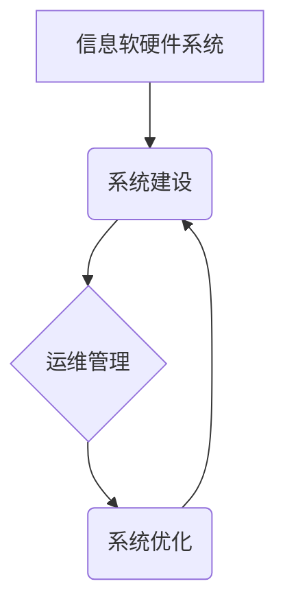

> 信息系统,软硬件,系统建设,运维管理,云计算,大数据,人工智能,安全保障,敏捷开发

## 1. 背景介绍

在当今数字化时代，信息技术已成为各行各业不可或缺的基础设施。信息软硬件系统建设与运维管理作为信息技术应用的核心环节，直接关系到企业数字化转型、业务创新和持续发展。随着云计算、大数据、人工智能等新兴技术的快速发展，信息软硬件系统建设与运维管理面临着新的挑战和机遇。

传统的软硬件系统建设模式往往以单一、封闭、静态的特点为主，难以适应快速变化的业务需求和技术环境。而现代信息系统建设则更加注重灵活、开放、动态的特点，强调系统架构的模块化、可扩展性和可维护性。

## 2. 核心概念与联系

**2.1 信息软硬件系统**

信息软硬件系统是指以计算机硬件为基础，利用软件进行数据处理、信息存储和传输的整体系统。它包括硬件设备、操作系统、应用软件、数据库等多个组成部分。

**2.2 系统建设**

系统建设是指根据用户需求，规划、设计、开发、部署和维护信息系统，使其能够满足用户业务需求的过程。

**2.3 运维管理**

运维管理是指对信息系统进行日常运行、维护、监控和优化，确保系统稳定、可靠、高效运行的过程。

**2.4 核心概念联系**

信息软硬件系统建设与运维管理是相互关联、相互依存的两个重要环节。系统建设为运维管理提供基础设施和运行环境，而运维管理则保障系统稳定运行，为系统建设提供反馈和改进依据。

## 3. 核心算法原理 & 具体操作步骤

**3.1 算法原理概述**

在信息软硬件系统建设与运维管理中，各种算法扮演着至关重要的角色。例如，在系统性能优化方面，可以使用算法分析系统瓶颈，并提出相应的优化方案；在数据存储和检索方面，可以使用算法构建高效的数据结构和索引，提高数据访问速度；在安全防护方面，可以使用算法进行入侵检测和恶意代码识别。

**3.2 算法步骤详解**

具体算法的步骤详解取决于所选用的算法类型。例如，常见的排序算法包括冒泡排序、插入排序、快速排序等，每种算法都有其独特的步骤和时间复杂度。

**3.3 算法优缺点**

不同的算法具有不同的优缺点，需要根据实际应用场景选择合适的算法。例如，冒泡排序简单易实现，但时间复杂度较高；快速排序时间复杂度较低，但实现复杂度较高。

**3.4 算法应用领域**

算法在信息软硬件系统建设与运维管理中应用广泛，包括：

* 系统性能优化
* 数据存储和检索
* 安全防护
* 网络流量控制
* 资源调度

## 4. 数学模型和公式 & 详细讲解 & 举例说明

**4.1 数学模型构建**

在信息软硬件系统建设与运维管理中，可以使用数学模型来描述系统行为、分析系统性能和预测系统未来状态。例如，可以使用 queuing theory 来建模系统等待时间和服务时间，分析系统吞吐量和响应时间。

**4.2 公式推导过程**

数学模型的公式推导过程需要根据具体模型和应用场景进行。例如，在 queuing theory 中，等待时间和服务时间服从指数分布，可以推导出系统平均等待时间和平均服务时间等公式。

**4.3 案例分析与讲解**

可以使用实际案例来分析和讲解数学模型的应用。例如，可以分析一个电商平台的订单处理系统，使用 queuing theory 建模，并根据模型结果优化系统配置，提高订单处理效率。

## 5. 项目实践：代码实例和详细解释说明

**5.1 开发环境搭建**

在进行项目实践之前，需要搭建相应的开发环境。例如，可以使用虚拟机或云平台搭建开发环境，并安装必要的软件工具。

**5.2 源代码详细实现**

具体源代码实现取决于项目需求和技术选型。例如，可以使用 Python 语言开发一个数据分析系统，并使用 Pandas 和 Scikit-learn 库进行数据处理和机器学习。

**5.3 代码解读与分析**

需要对源代码进行详细解读和分析，理解代码逻辑、数据流和算法实现。

**5.4 运行结果展示**

需要运行代码并展示运行结果，验证代码功能和性能。

## 6. 实际应用场景

**6.1 云计算平台**

云计算平台需要高效的软硬件系统建设和运维管理，以保证平台稳定运行、资源利用率高和服务质量优。

**6.2 大数据平台**

大数据平台需要处理海量数据，需要高效的数据存储、处理和分析算法，以及完善的运维管理机制。

**6.3 人工智能应用**

人工智能应用需要强大的计算能力和数据支撑，需要高效的软硬件系统建设和运维管理，以保证模型训练和部署的效率。

**6.4 未来应用展望**

随着云计算、大数据、人工智能等技术的不断发展，信息软硬件系统建设与运维管理将面临更多新的挑战和机遇。例如，边缘计算、物联网、区块链等新兴技术将对系统架构和运维模式产生新的影响。

## 7. 工具和资源推荐

**7.1 学习资源推荐**

* 书籍：《计算机系统概论》、《操作系统导论》、《数据库系统概论》
* 在线课程：Coursera、edX、Udemy 等平台提供丰富的计算机科学和信息技术课程。

**7.2 开发工具推荐**

* 操作系统：Linux、Windows、macOS
* 编程语言：Python、Java、C++
* 数据库：MySQL、PostgreSQL、MongoDB
* 云平台：AWS、Azure、GCP

**7.3 相关论文推荐**

* ACM Digital Library
* IEEE Xplore

## 8. 总结：未来发展趋势与挑战

**8.1 研究成果总结**

信息软硬件系统建设与运维管理领域取得了显著的成果，例如，云计算、容器化、微服务架构等技术的发展，极大地提高了系统部署、扩展和维护的效率。

**8.2 未来发展趋势**

未来，信息软硬件系统建设与运维管理将朝着以下方向发展：

* **自动化运维:** 利用人工智能和自动化技术，实现系统运维的自动化和智能化。
* **容器化和微服务架构:** 采用容器化和微服务架构，提高系统弹性和可扩展性。
* **边缘计算:** 将计算能力部署到边缘节点，降低数据传输延迟和提高实时性。
* **安全保障:** 加强系统安全防护，应对不断演变的网络安全威胁。

**8.3 面临的挑战**

信息软硬件系统建设与运维管理也面临着一些挑战，例如：

* **技术复杂性:** 新兴技术的快速发展，使得系统架构和运维模式更加复杂。
* **人才短缺:** 缺乏经验丰富的系统架构师和运维工程师。
* **安全风险:** 网络安全威胁不断升级，需要加强系统安全防护。

**8.4 研究展望**

未来，需要加强对信息软硬件系统建设与运维管理领域的理论研究和实践探索，推动技术创新和应用，为数字化转型和社会发展提供强有力的技术支撑。

## 9. 附录：常见问题与解答

**9.1 系统性能优化常见问题**

* 系统响应时间过慢？
* 系统资源利用率低？
* 系统出现频繁宕机？

**9.2 数据存储和检索常见问题**

* 数据存储空间不足？
* 数据检索速度慢？
* 数据备份和恢复问题？

**9.3 安全防护常见问题**

* 系统遭受网络攻击？
* 数据泄露风险？
* 用户身份验证问题？

作者：禅与计算机程序设计艺术 / Zen and the Art of Computer Programming 
<end_of_turn>