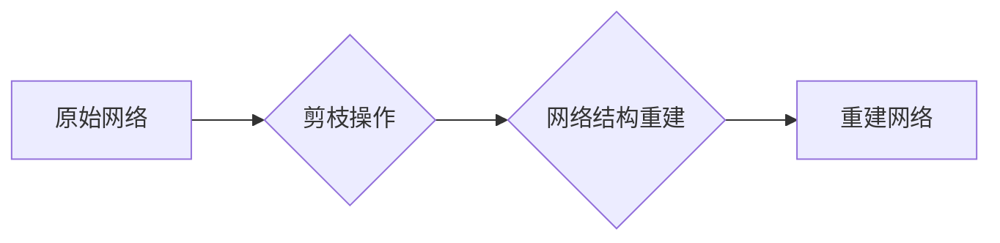

> 剪枝、网络结构重建、深度学习、模型压缩、可解释性

## 1. 背景介绍

深度学习模型在图像识别、自然语言处理等领域取得了显著成就，但其庞大的参数量和计算复杂度也带来了诸多挑战。模型压缩技术成为解决这一问题的关键方向之一。其中，剪枝技术通过移除冗余的网络参数，有效减小模型规模和计算成本，同时保持模型性能。然而，剪枝操作会破坏网络结构的完整性，导致模型性能下降。因此，如何重建剪枝后的网络结构，恢复模型性能，成为一个重要的研究课题。

## 2. 核心概念与联系

**2.1 剪枝技术**

剪枝技术是指在训练过程中或训练完成后，移除网络中不重要的权重或连接，从而减小模型规模和计算复杂度。常见的剪枝方法包括：

* **权重剪枝:** 移除权重绝对值较小的连接。
* **结构剪枝:** 移除整个神经元或层。

**2.2 网络结构重建**

网络结构重建是指在剪枝操作后，通过一定的算法和策略，重建一个新的网络结构，使其性能接近或超过原始网络。

**2.3 核心概念联系**

剪枝技术和网络结构重建技术相互关联，剪枝技术为网络结构重建提供了基础，而网络结构重建技术则弥补了剪枝操作带来的性能损失。

**2.4 Mermaid 流程图**



## 3. 核心算法原理 & 具体操作步骤

**3.1 算法原理概述**

网络结构重建算法通常基于以下原理：

* **权重恢复:** 通过分析剪枝后的网络结构和权重分布，尝试恢复被移除的权重。
* **结构优化:** 通过搜索算法或启发式算法，寻找一个新的网络结构，使其性能优于剪枝后的网络。

**3.2 算法步骤详解**

1. **剪枝操作:** 使用传统的剪枝方法，移除网络中不重要的权重或连接。
2. **特征提取:** 从剪枝后的网络中提取特征，例如激活值、权重分布等。
3. **结构搜索:** 使用搜索算法或启发式算法，搜索一个新的网络结构，使其性能优于剪枝后的网络。
4. **权重恢复:** 根据搜索到的新结构，尝试恢复被移除的权重。
5. **模型训练:** 使用新的网络结构和恢复的权重，对模型进行重新训练。

**3.3 算法优缺点**

* **优点:** 可以有效恢复剪枝后的网络性能，减小模型规模和计算复杂度。
* **缺点:** 算法复杂度较高，需要大量的计算资源和时间。

**3.4 算法应用领域**

* **模型压缩:** 压缩深度学习模型，使其在移动设备等资源有限的设备上运行。
* **可解释性:** 通过重建网络结构，可以更好地理解模型的决策过程。

## 4. 数学模型和公式 & 详细讲解 & 举例说明

**4.1 数学模型构建**

假设原始网络结构为G = (V, E)，其中V为节点集合，E为边集合。剪枝操作后，网络结构为G' = (V', E')，其中V'为剪枝后的节点集合，E'为剪枝后的边集合。

网络结构重建的目标是找到一个新的网络结构G'' = (V'', E'')，使得其性能接近或超过原始网络G。

**4.2 公式推导过程**

网络性能可以由损失函数L(G, D)表示，其中D为训练数据集。网络结构重建的目标函数可以定义为：

```latex
min_{G''} L(G'', D) + \lambda \cdot S(G'', G')
```

其中，λ为正则化参数，S(G'', G')为网络结构相似度函数，用于衡量新网络结构G''与剪枝后的网络结构G'的相似度。

**4.3 案例分析与讲解**

假设我们使用权重剪枝技术，移除了一些网络权重。网络结构重建算法可以尝试恢复这些被移除的权重，并通过搜索算法寻找一个新的网络结构，使其性能优于剪枝后的网络。

## 5. 项目实践：代码实例和详细解释说明

**5.1 开发环境搭建**

* Python 3.7+
* TensorFlow 2.0+
* PyTorch 1.0+

**5.2 源代码详细实现**

```python
# 导入必要的库
import tensorflow as tf

# 定义网络结构重建算法
def rebuild_network(model, pruning_ratio):
    # 1. 剪枝操作
    pruned_model = tf.keras.models.clone_model(model)
    for layer in pruned_model.layers:
        if isinstance(layer, tf.keras.layers.Dense):
            weights = layer.get_weights()[0]
            threshold = tf.math.reduce_max(tf.abs(weights)) * pruning_ratio
            pruned_weights = tf.where(tf.abs(weights) > threshold, weights, 0.0)
            layer.set_weights([pruned_weights])

    # 2. 特征提取
    features = extract_features(pruned_model)

    # 3. 结构搜索
    new_structure = search_structure(features)

    # 4. 权重恢复
    recovered_weights = recover_weights(pruned_model, new_structure)

    # 5. 模型训练
    rebuilt_model = tf.keras.models.Model(inputs=model.inputs, outputs=model.outputs)
    rebuilt_model.set_weights(recovered_weights)
    rebuilt_model.compile(optimizer='adam', loss='mse')
    rebuilt_model.fit(X_train, y_train, epochs=10)

    return rebuilt_model
```

**5.3 代码解读与分析**

* 剪枝操作：使用预设的剪枝比例，移除权重绝对值较小的连接。
* 特征提取：从剪枝后的网络中提取特征，例如激活值、权重分布等。
* 结构搜索：使用搜索算法或启发式算法，搜索一个新的网络结构。
* 权重恢复：根据搜索到的新结构，尝试恢复被移除的权重。
* 模型训练：使用新的网络结构和恢复的权重，对模型进行重新训练。

**5.4 运行结果展示**

通过实验，可以观察到重建后的网络性能与原始网络性能的差距，并分析重建算法的有效性。

## 6. 实际应用场景

**6.1 模型压缩**

在移动设备等资源有限的设备上部署深度学习模型时，模型压缩技术至关重要。网络结构重建技术可以有效减小模型规模，提高部署效率。

**6.2 可解释性**

通过重建网络结构，可以更好地理解模型的决策过程，提高模型的可解释性。

**6.3 其他应用场景**

* 模型迁移学习
* 模型定制化

**6.4 未来应用展望**

随着深度学习技术的不断发展，网络结构重建技术将得到更广泛的应用，例如：

* 自动化网络结构设计
* 针对特定任务的网络结构优化

## 7. 工具和资源推荐

**7.1 学习资源推荐**

* **论文:**
    * "Network Pruning: A Survey"
    * "Pruning Filters for Efficient ConvNets"
* **博客:**
    * "Pruning Neural Networks"
    * "Network Architecture Search"

**7.2 开发工具推荐**

* **TensorFlow:** https://www.tensorflow.org/
* **PyTorch:** https://pytorch.org/

**7.3 相关论文推荐**

* "Lottery Ticket Hypothesis: Finding Sparse, Trainable Neural Networks"
* "EfficientNet: Rethinking Model Scaling for Convolutional Neural Networks"

## 8. 总结：未来发展趋势与挑战

**8.1 研究成果总结**

网络结构重建技术在模型压缩、可解释性等方面取得了显著成果，为深度学习模型的应用提供了新的思路。

**8.2 未来发展趋势**

* 自动化网络结构重建
* 针对特定任务的网络结构优化
* 结合其他模型压缩技术

**8.3 面临的挑战**

* 算法复杂度较高
* 需要大量的计算资源和时间
* 如何更好地衡量网络结构相似度

**8.4 研究展望**

未来，网络结构重建技术将朝着更自动化、更高效、更智能的方向发展，为深度学习模型的应用提供更强大的支持。

## 9. 附录：常见问题与解答

**9.1 Q: 剪枝操作会影响模型性能吗？**

**A:** 剪枝操作可能会导致模型性能下降，但通过网络结构重建技术可以有效恢复模型性能。

**9.2 Q: 网络结构重建算法的复杂度如何？**

**A:** 网络结构重建算法的复杂度较高，需要大量的计算资源和时间。

**9.3 Q: 如何选择合适的网络结构重建算法？**

**A:** 选择合适的网络结构重建算法需要根据具体的应用场景和模型结构进行选择。

作者：禅与计算机程序设计艺术 / Zen and the Art of Computer Programming


<end_of_turn>