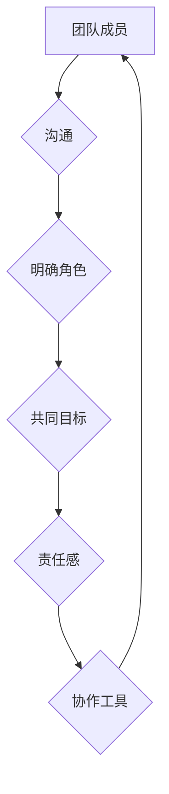

> 团队协作，软件开发，项目管理，沟通技巧，冲突解决，协作工具，敏捷开发

## 1. 背景介绍

在当今科技日新月异的时代，软件开发已经成为推动社会进步的重要引擎。然而，复杂的软件项目往往需要多位工程师、设计师、产品经理等不同角色的协作才能完成。如何有效地组织和管理团队协作，成为了软件开发领域的一项关键挑战。

传统的软件开发模式往往以瀑布模型为主，强调分工明确、流程严格，但这种模式难以适应快速变化的市场需求和用户反馈。随着敏捷开发理念的兴起，团队协作的重要性被更加凸显。敏捷开发强调迭代开发、持续集成、频繁沟通，鼓励团队成员共同参与决策和解决问题。

## 2. 核心概念与联系

团队协作的核心在于建立高效的沟通机制、明确的角色分工、共同的目标和责任感。

**2.1 沟通机制**

良好的沟通是团队协作的基础。团队成员需要能够清晰、准确地表达自己的想法和需求，并能够积极倾听和理解他人的观点。

**2.2 角色分工**

明确的角色分工可以提高团队效率。每个成员都应该清楚自己的职责和任务，并能够有效地协同工作。

**2.3 共通目标**

团队成员需要共同理解和追求同一个目标，并为实现目标而努力。

**2.4 责任感**

每个成员都应该对团队的成果负责，并积极承担自己的责任。

**2.5 协作工具**

现代的协作工具可以帮助团队成员更好地沟通、协作和管理项目。例如，版本控制系统、项目管理软件、即时通讯工具等。



## 3. 核心算法原理 & 具体操作步骤

### 3.1 算法原理概述

团队协作的本质是一种复杂的系统行为，涉及到人际关系、沟通机制、决策过程等多方面因素。虽然没有一个完美的算法可以完全解决团队协作问题，但我们可以借鉴一些算法原理和方法来提高团队协作效率。

例如，**图论**可以用来建模团队成员之间的关系，分析信息传播路径和决策流程。**博弈论**可以用来分析团队成员之间的利益冲突和合作机制。**机器学习**可以用来预测团队成员的行为模式和协作效率。

### 3.2 算法步骤详解

1. **建模:** 将团队成员和他们的关系建模为一个图结构，其中节点代表团队成员，边代表成员之间的关系。
2. **分析:** 使用图论算法分析图结构，例如寻找关键节点、信息传播路径、社区结构等。
3. **预测:** 使用机器学习算法预测团队成员的行为模式和协作效率。
4. **优化:** 根据分析结果和预测结果，提出优化团队协作的建议，例如调整角色分工、改进沟通机制、优化决策流程等。

### 3.3 算法优缺点

**优点:**

* 可以提供客观的分析和预测结果，帮助团队成员更好地了解自身和团队的现状。
* 可以提出针对性的优化建议，提高团队协作效率。

**缺点:**

* 算法模型的建立和分析需要一定的专业知识和技术能力。
* 算法结果的准确性依赖于数据质量和模型的有效性。

### 3.4 算法应用领域

* 软件开发团队协作
* 项目管理
* 组织管理
* 人才招聘

## 4. 数学模型和公式 & 详细讲解 & 举例说明

### 4.1 数学模型构建

我们可以使用**社交网络分析**的数学模型来描述团队成员之间的关系。

**4.1.1 邻接矩阵:**

邻接矩阵是一个n x n的矩阵，其中n代表团队成员的数量。矩阵元素a<sub>ij</sub>表示团队成员i和j之间的关系强度，例如：

* a<sub>ij</sub> = 1 表示成员i和j之间存在关系。
* a<sub>ij</sub> = 0 表示成员i和j之间不存在关系。

**4.1.2 度矩阵:**

度矩阵是一个n x n的矩阵，其中每个元素d<sub>i</sub>表示团队成员i的度，即与该成员相连的边的数量。

### 4.2 公式推导过程

我们可以使用**PageRank算法**来计算每个团队成员的重要性。PageRank算法基于以下公式：

```latex
PR(i) = (1 - d) + d * \sum_{j \in \text{in}(i)} \frac{PR(j)}{C(j)}
```

其中：

* PR(i) 表示团队成员i的重要性得分。
* d 是阻尼因子，通常取值为0.85。
* in(i) 表示指向团队成员i的边的集合。
* C(j) 表示团队成员j的出度，即与该成员相连的边的数量。

### 4.3 案例分析与讲解

假设我们有一个团队有5个成员，他们的邻接矩阵如下：

```
[0 1 0 0 1]
[1 0 1 0 0]
[0 1 0 1 0]
[0 0 1 0 1]
[1 0 0 1 0]
```

我们可以使用PageRank算法计算每个成员的重要性得分。

## 5. 项目实践：代码实例和详细解释说明

### 5.1 开发环境搭建

* 操作系统：Linux/macOS/Windows
* 编程语言：Python
* 依赖库：NetworkX, matplotlib

### 5.2 源代码详细实现

```python
import networkx as nx
import matplotlib.pyplot as plt

# 创建邻接矩阵
adj_matrix = [
    [0, 1, 0, 0, 1],
    [1, 0, 1, 0, 0],
    [0, 1, 0, 1, 0],
    [0, 0, 1, 0, 1],
    [1, 0, 0, 1, 0]
]

# 创建图对象
graph = nx.from_numpy_array(adj_matrix)

# 计算PageRank得分
pagerank = nx.pagerank(graph)

# 绘制图
nx.draw(graph, with_labels=True, node_color=[pagerank[node] for node in graph.nodes()])
plt.show()
```

### 5.3 代码解读与分析

* 我们首先创建了一个邻接矩阵来表示团队成员之间的关系。
* 然后，我们使用NetworkX库创建了一个图对象，并将邻接矩阵作为输入。
* 接着，我们使用PageRank算法计算每个成员的重要性得分。
* 最后，我们使用matplotlib库绘制了图，并将每个节点的颜色设置为其PageRank得分。

### 5.4 运行结果展示

运行代码后，会生成一个图，其中每个节点代表一个团队成员，节点的大小代表其PageRank得分。

## 6. 实际应用场景

### 6.1 软件开发团队

* 识别团队中的关键成员，例如技术专家、项目经理等。
* 分析团队成员之间的合作关系，发现潜在的冲突或合作机会。
* 优化团队结构和角色分工，提高团队协作效率。

### 6.2 项目管理

* 识别项目中的关键任务和关键路径。
* 分析项目成员的资源分配和工作量，避免资源浪费和项目延期。
* 预测项目风险和潜在问题，及时采取措施进行风险控制。

### 6.3 组织管理

* 分析组织结构和人员流动，发现潜在的瓶颈和问题。
* 识别组织中的关键人才和潜在领导者。
* 优化组织结构和人员配置，提高组织效率和竞争力。

### 6.4 未来应用展望

随着人工智能技术的不断发展，团队协作领域将迎来更多新的应用场景和技术突破。例如：

* **智能协作助手:** 可以自动分析团队成员的行为模式和沟通内容，提供个性化的协作建议和支持。
* **虚拟团队协作平台:** 可以帮助跨地域、跨文化团队进行高效的协作。
* **协作智能合约:** 可以自动执行团队协作协议，确保公平公正的合作关系。

## 7. 工具和资源推荐

### 7.1 学习资源推荐

* **书籍:**
    * 《团队协作的艺术》
    * 《敏捷软件开发》
    * 《人际关系的艺术》
* **在线课程:**
    * Coursera: 团队协作与领导力
    * Udemy: 敏捷软件开发
    * edX: 人际沟通与协作

### 7.2 开发工具推荐

* **版本控制系统:** Git, SVN
* **项目管理软件:** Jira, Trello, Asana
* **即时通讯工具:** Slack, Microsoft Teams, Discord

### 7.3 相关论文推荐

* **PageRank算法:** PageRank: The Anatomy of a Web Page Rank
* **社交网络分析:** Social Network Analysis: Methods and Applications
* **团队协作模型:** A Survey of Team Collaboration Models

## 8. 总结：未来发展趋势与挑战

### 8.1 研究成果总结

团队协作研究取得了显著进展，提出了多种理论模型和算法，并开发了多种协作工具。这些成果为提高团队协作效率和效果提供了重要的理论和实践支持。

### 8.2 未来发展趋势

* **人工智能驱动的协作:** 人工智能技术将进一步融入团队协作领域，提供更智能、更个性化的协作支持。
* **虚拟现实和增强现实协作:** VR/AR技术将为团队成员提供更沉浸式的协作体验，打破地域限制。
* **跨文化协作:** 随着全球化进程的加速，跨文化协作将成为新的挑战和机遇。

### 8.3 面临的挑战

* **数据隐私和安全:** 团队协作数据往往包含敏感信息，需要采取有效的措施保护数据隐私和安全。
* **算法公平性和可解释性:** 算法模型的公平性和可解释性需要得到进一步研究和改进，避免算法歧视和误判。
* **人类因素:** 团队协作是一个复杂的人机交互系统，需要考虑人类因素的影响，例如沟通风格、文化差异等。

### 8.4 研究展望

未来团队协作研究需要关注以下几个方面:

* 开发更智能、更人性化的协作工具。
* 研究跨文化协作的有效机制。
* 探索人工智能与人类协作的最佳模式。


## 9. 附录：常见问题与解答

**Q1: 如何提高团队成员之间的沟通效率？**

**A1:** 建立清晰的沟通机制，例如定期召开团队会议、使用协作工具进行信息共享等。鼓励团队成员积极表达自己的想法和需求，并学会倾听和理解他人的观点。

**Q2: 如何解决团队成员之间的冲突？**

**A2:** 冲突是团队协作中不可避免的一部分。需要建立有效的冲突解决机制，例如：

* 鼓励团队成员坦诚沟通，表达自己的观点和感受。
* 寻找共同目标，寻求双方都能接受的解决方案。
* 寻求第三方调解，帮助团队成员达成共识。

**Q3: 如何评估团队协作的效率？**

**A3:** 可以通过以下指标来评估团队协作的效率：

* 项目完成时间
* 项目质量
* 团队成员满意度
* 团队成员之间的合作度

作者：禅与计算机程序设计艺术 / Zen and the Art of Computer Programming


<end_of_turn>