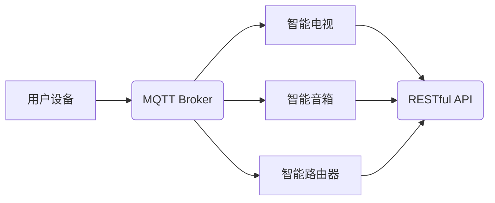

> MQTT, RESTful API, 智能家居, 多媒体娱乐, 物联网, 远程控制, 协议栈, 软件架构

## 1. 背景介绍

随着物联网技术的快速发展，智能家居已成为现代生活的重要组成部分。智能家居系统能够通过网络连接各种智能设备，实现对家居环境的自动化控制和远程管理，为用户提供更加便捷、舒适的生活体验。多媒体娱乐是智能家居系统中不可或缺的功能之一，它能够为用户提供丰富的娱乐内容，例如视频、音乐、游戏等。

传统的智能家居多媒体娱乐系统通常采用中心化架构，所有设备都连接到一个中央服务器，这会导致系统性能瓶颈和网络带宽压力。此外，传统的控制方式也较为单一，主要依赖于手机APP或遥控器，缺乏灵活性。

为了解决上述问题，本文提出了一种基于MQTT协议和RESTful API的智能家居多媒体娱乐系统架构，该架构具有以下特点：

* **分布式架构:** 系统采用分布式架构，各个设备之间通过MQTT协议进行直接通信，无需依赖中央服务器，提高了系统的可靠性和扩展性。
* **轻量级协议:** MQTT协议是一种轻量级的消息传输协议，适合于资源受限的嵌入式设备，能够有效降低网络带宽占用。
* **RESTful API:** RESTful API提供了一种标准化的接口，方便用户和第三方应用与系统进行交互，实现灵活的控制和数据获取。
* **多平台支持:** 系统支持多种平台，例如手机、平板电脑、电脑等，用户可以根据自己的需求选择合适的设备进行控制。

## 2. 核心概念与联系

### 2.1 MQTT协议

MQTT（Message Queuing Telemetry Transport）是一种轻量级的消息传输协议，专门设计用于物联网应用场景。它采用发布/订阅模式，消息发布者将消息发布到特定的主题，订阅者可以根据自己的兴趣订阅特定的主题，接收相关消息。

MQTT协议具有以下特点：

* **轻量级:** MQTT协议的协议栈非常小，适合于资源受限的嵌入式设备。
* **低功耗:** MQTT协议采用断线重连机制，能够有效降低设备的功耗。
* **可靠性:** MQTT协议提供多种质量保证机制，确保消息的可靠传输。

### 2.2 RESTful API

RESTful API（Representational State Transfer Application Programming Interface）是一种基于HTTP协议的软件架构风格，它采用资源和操作的模式，提供了一种标准化的接口，方便用户和第三方应用与系统进行交互。

RESTful API具有以下特点：

* **标准化:** RESTful API遵循HTTP协议规范，易于理解和使用。
* **可扩展性:** RESTful API可以轻松扩展，支持多种数据格式和操作类型。
* **安全性:** RESTful API可以利用HTTP协议的安全机制，保障数据传输的安全。

### 2.3 系统架构

基于MQTT协议和RESTful API的智能家居多媒体娱乐系统架构如图所示：



**系统架构说明:**

* 用户设备通过MQTT协议与MQTT Broker进行通信，发布控制指令或订阅消息。
* MQTT Broker负责消息的转发和路由，将消息发送到相应的设备。
* 智能电视、智能音箱和智能路由器等智能设备通过MQTT协议接收消息，执行相应的操作。
* RESTful API提供了一个统一的接口，方便用户和第三方应用与系统进行交互。

## 3. 核心算法原理 & 具体操作步骤

### 3.1  算法原理概述

本系统核心算法基于MQTT协议的发布/订阅机制，实现设备之间的实时通信和数据交互。

* **发布/订阅模式:** 用户设备或智能设备可以发布消息到特定的主题，其他订阅该主题的设备可以接收该消息。
* **消息格式:** MQTT协议的消息格式包含主题、消息内容和质量保证信息等。
* **主题管理:** MQTT Broker负责管理主题，并根据订阅关系转发消息。

### 3.2  算法步骤详解

1. **设备注册:** 智能设备连接到MQTT Broker，并注册自己的设备ID和订阅主题。
2. **用户控制:** 用户设备通过MQTT协议发布控制指令到相应的主题。
3. **消息转发:** MQTT Broker根据订阅关系，将控制指令转发到相应的智能设备。
4. **设备执行:** 智能设备接收控制指令后，执行相应的操作。
5. **状态反馈:** 智能设备将操作结果反馈到MQTT Broker，并发布到相应的主题。
6. **用户接收:** 用户设备订阅相应的主题，接收设备反馈的状态信息。

### 3.3  算法优缺点

**优点:**

* **实时性:** MQTT协议的发布/订阅机制能够实现设备之间的实时通信。
* **可靠性:** MQTT协议提供多种质量保证机制，确保消息的可靠传输。
* **扩展性:** MQTT协议支持多个主题和订阅者，能够轻松扩展系统规模。

**缺点:**

* **安全性:** MQTT协议本身没有内置的安全机制，需要额外配置安全措施。
* **复杂度:** MQTT协议的实现较为复杂，需要专业的开发人员进行开发和维护。

### 3.4  算法应用领域

MQTT协议广泛应用于物联网、智能家居、工业自动化等领域，例如：

* **智能家居:** 控制灯光、空调、窗帘等智能设备。
* **工业自动化:** 监控设备状态、控制生产流程。
* **农业物联网:** 监测土壤湿度、温度等环境参数。

## 4. 数学模型和公式 & 详细讲解 & 举例说明

### 4.1  数学模型构建

本系统中，我们可以使用图论模型来表示设备之间的连接关系。

* **节点:** 代表系统中的每个设备，例如智能电视、智能音箱、用户设备等。
* **边:** 代表设备之间的通信连接，例如MQTT Broker与设备之间的连接，设备之间的直接连接等。

### 4.2  公式推导过程

我们可以使用图论中的度数公式来计算每个设备的连接数，即每个设备与其他设备连接的边的数量。

* **度数公式:**  度数 = 连接边的数量

### 4.3  案例分析与讲解

假设我们有一个包含3个设备的智能家居系统，其中智能电视与MQTT Broker连接，智能音箱与MQTT Broker和智能电视连接，用户设备与MQTT Broker连接。

* 智能电视的度数为1。
* 智能音箱的度数为2。
* 用户设备的度数为1。

## 5. 项目实践：代码实例和详细解释说明

### 5.1  开发环境搭建

本系统可以使用Python语言进行开发，并使用Paho MQTT库进行MQTT协议的实现。

### 5.2  源代码详细实现

```python
# 导入Paho MQTT库
import paho.mqtt.client as mqtt

# MQTT Broker地址
broker_address = "mqtt.example.com"

# 设备ID
device_id = "my_device"

# 主题
topic = "home/entertainment"

# 连接到MQTT Broker
client = mqtt.Client(device_id)
client.connect(broker_address)

# 订阅主题
client.subscribe(topic)

# 发布消息
def publish_message(message):
    client.publish(topic, message)

# 处理接收到的消息
def on_message(client, userdata, message):
    print("Received message:", str(message.payload.decode()))

# 设置消息接收回调函数
client.on_message = on_message

# 启动消息循环
client.loop_forever()
```

### 5.3  代码解读与分析

* 代码首先导入Paho MQTT库，并设置MQTT Broker地址、设备ID和主题。
* 然后创建一个MQTT客户端对象，并连接到MQTT Broker。
* 订阅指定的主题，以便接收相关消息。
* 定义一个`publish_message`函数，用于发布消息到指定的主题。
* 定义一个`on_message`函数，用于处理接收到的消息。
* 设置`on_message`函数作为消息接收回调函数。
* 启动消息循环，持续接收和处理消息。

### 5.4  运行结果展示

当用户设备发布消息到指定的主题时，智能电视和智能音箱会接收该消息，并执行相应的操作。例如，用户设备发布“播放音乐”的消息，智能音箱会播放音乐。

## 6. 实际应用场景

### 6.1  智能家居控制

用户可以通过手机APP或语音助手控制智能家居设备，例如灯光、空调、窗帘等。

### 6.2  多媒体娱乐

用户可以通过智能电视、智能音箱等设备观看视频、听音乐、玩游戏等。

### 6.3  远程监控

用户可以通过智能摄像头远程监控家居环境，例如查看家中是否有异常情况。

### 6.4  未来应用展望

随着物联网技术的不断发展，基于MQTT协议和RESTful API的智能家居多媒体娱乐系统将拥有更广泛的应用场景，例如：

* **智能家居自动化:** 通过机器学习和人工智能技术，实现更加智能化的家居自动化控制。
* **个性化娱乐体验:** 根据用户的喜好和需求，提供更加个性化的娱乐内容和服务。
* **家庭安全保障:** 利用智能传感器和监控设备，增强家庭安全保障。

## 7. 工具和资源推荐

### 7.1  学习资源推荐

* **MQTT协议官方文档:** https://mqtt.org/
* **Paho MQTT库官方文档:** https://pypi.org/project/paho-mqtt/
* **RESTful API设计规范:** https://restfulapi.net/

### 7.2  开发工具推荐

* **Eclipse Paho:** https://www.eclipse.org/paho/
* **Mosquitto:** https://mosquitto.org/
* **Postman:** https://www.postman.com/

### 7.3  相关论文推荐

* **MQTT协议的应用研究**
* **基于MQTT协议的智能家居系统设计**
* **RESTful API在物联网中的应用**

## 8. 总结：未来发展趋势与挑战

### 8.1  研究成果总结

本文提出了基于MQTT协议和RESTful API的智能家居多媒体娱乐系统架构，并详细介绍了系统的核心概念、算法原理、代码实现以及实际应用场景。该架构具有分布式、轻量级、可扩展等特点，能够满足智能家居多媒体娱乐的需求。

### 8.2  未来发展趋势

未来，智能家居多媒体娱乐系统将朝着以下方向发展：

* **更加智能化:** 利用机器学习和人工智能技术，实现更加智能化的家居自动化控制和个性化娱乐体验。
* **更加安全可靠:** 加强系统安全防护，保障用户数据安全和隐私保护。
* **更加生态化:** 与更多第三方应用和服务进行整合，构建更加丰富的智能家居生态系统。

### 8.3  面临的挑战

智能家居多媒体娱乐系统的发展也面临着一些挑战：

* **安全性和隐私保护:** 如何保障用户数据安全和隐私保护，是系统开发中需要重点考虑的问题。
* **系统复杂度:** 智能家居系统涉及多个设备和协议，系统开发和维护难度较大。
* **标准化问题:** 目前智能家居行业缺乏统一的标准，不同厂商的产品互操作性较差。

### 8.4  研究展望

未来，我们将继续深入研究智能家居多媒体娱乐系统，探索更加智能、安全、可靠和生态化的解决方案，为用户提供更加便捷、舒适和丰富的智能家居体验。

## 9. 附录：常见问题与解答

### 9.1  常见问题

* **MQTT协议和RESTful API有什么区别？**
* **如何选择合适的MQTT Broker？**
* **如何实现智能家居设备的远程控制？**

### 9.2  解答

* **MQTT协议和RESTful API有什么区别？**

MQTT协议是一种轻量级的消息传输协议，适合于物联网应用场景，而RESTful API是一种基于HTTP协议的软件架构风格，提供了一种标准化的接口，方便用户和第三方应用与系统进行交互。