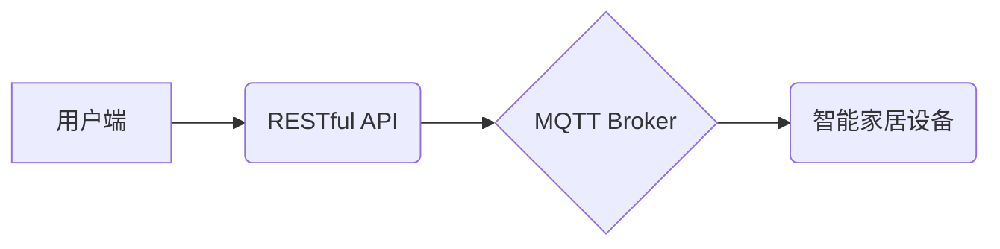

> MQTT, RESTful API, 智能家居, 物联网, 电子操作, 协议, 架构, 安全

## 1. 背景介绍

随着物联网技术的快速发展，智能家居已成为现代生活的重要组成部分。智能家居系统能够通过网络连接各种电子设备，实现远程控制、自动化管理和数据分析等功能，为用户提供更加便捷、舒适和安全的居住体验。

然而，智能家居系统的构建和应用面临着诸多挑战，例如：

* **设备互联互通性差:** 不同品牌、不同协议的智能家居设备难以相互兼容，导致用户体验受限。
* **数据安全和隐私保护问题:** 智能家居系统收集和处理大量用户数据，需要确保数据安全和隐私的保护。
* **系统可靠性和稳定性:** 智能家居系统需要能够稳定运行，并能够应对突发事件和网络故障。

为了解决这些问题，业界不断探索新的技术方案和标准。MQTT协议和RESTful API作为两种成熟的通信协议，在智能家居系统中得到了广泛应用。

## 2. 核心概念与联系

**2.1 MQTT协议**

MQTT（Message Queuing Telemetry Transport）是一种轻量级的、基于发布/订阅的机器对机器（M2M）通信协议。它设计用于在网络带宽有限、设备资源受限的场景下进行可靠的数据传输。

MQTT协议的核心特点包括：

* **轻量级:** MQTT协议的协议栈非常小，占用资源少，适合嵌入式设备使用。
* **发布/订阅:** MQTT协议采用发布/订阅模式，消息发布者将消息发布到特定的主题，订阅者可以根据自己的兴趣订阅特定的主题，接收相关消息。
* **可靠性:** MQTT协议提供多种消息确认机制，确保消息的可靠传输。

**2.2 RESTful API**

RESTful API（Representational State Transfer Application Programming Interface）是一种基于HTTP协议的软件架构风格。它采用资源、请求和状态转移的方式进行数据交互，提供了一种简单、灵活和可扩展的接口设计模式。

RESTful API的核心特点包括：

* **资源化:** RESTful API将数据视为资源，每个资源都有唯一的标识符（URI）。
* **HTTP方法:** RESTful API使用HTTP方法（GET、POST、PUT、DELETE等）进行数据操作。
* **状态转移:** RESTful API通过状态码（例如200 OK、404 Not Found）指示请求的结果。

**2.3 MQTT和RESTful API的结合**

在智能家居系统中，MQTT协议和RESTful API可以协同工作，实现高效、可靠的数据传输和设备控制。

* **MQTT协议用于设备间通信:** 智能家居设备可以使用MQTT协议进行实时数据交换，例如温度、湿度、灯光状态等。
* **RESTful API用于用户端控制和数据管理:** 用户可以使用RESTful API通过手机APP或网页端控制智能家居设备，并获取设备状态和历史数据。

**2.4 架构图**



## 3. 核心算法原理 & 具体操作步骤

### 3.1  算法原理概述

在基于MQTT协议和RESTful API的智能家居系统中，核心算法主要涉及消息发布订阅、数据处理和设备控制等方面。

* **消息发布订阅:** MQTT协议的发布/订阅机制是核心算法的基础，它允许设备和用户端根据需要订阅和发布特定主题的消息。
* **数据处理:** 智能家居系统需要对接收到的设备数据进行处理和分析，例如温度、湿度、灯光状态等，并根据预设规则进行控制或报警。
* **设备控制:** 用户端可以通过RESTful API发送控制指令到设备，例如打开/关闭灯光、调节温度等。

### 3.2  算法步骤详解

1. **设备注册:** 智能家居设备需要向MQTT Broker注册，并订阅相关的主题。
2. **数据发布:** 设备根据预设规则，将数据发布到指定的主题。
3. **消息订阅:** 用户端订阅相关的主题，接收设备发布的消息。
4. **数据处理:** 智能家居系统对接收到的设备数据进行处理和分析，例如温度、湿度、灯光状态等。
5. **设备控制:** 用户端可以通过RESTful API发送控制指令到设备，例如打开/关闭灯光、调节温度等。

### 3.3  算法优缺点

**优点:**

* **轻量级:** MQTT协议和RESTful API都是轻量级的协议，适合嵌入式设备使用。
* **可靠性:** MQTT协议提供多种消息确认机制，确保消息的可靠传输。
* **扩展性:** RESTful API提供了一种灵活的接口设计模式，可以方便地扩展新的功能和设备。

**缺点:**

* **安全性:** MQTT协议和RESTful API本身没有内置的安全性机制，需要额外进行安全防护。
* **复杂性:** 构建复杂的智能家居系统需要对MQTT协议和RESTful API有深入的了解。

### 3.4  算法应用领域

基于MQTT协议和RESTful API的智能家居系统在以下领域得到了广泛应用:

* **家庭自动化:** 控制灯光、空调、窗帘等设备，实现智能家居场景。
* **远程监控:** 通过摄像头和传感器，远程监控家庭安全和环境状况。
* **健康管理:** 通过智能设备，监测用户的健康数据，提供个性化的健康建议。

## 4. 数学模型和公式 & 详细讲解 & 举例说明

### 4.1  数学模型构建

在智能家居系统中，我们可以使用数学模型来描述设备之间的关系、数据流向和控制逻辑。例如，我们可以使用状态机模型来描述设备的运行状态，使用网络拓扑模型来描述设备之间的连接关系，使用数据流模型来描述数据在系统中的传输路径。

### 4.2  公式推导过程

在智能家居系统中，我们可以使用数学公式来计算设备的运行参数、数据处理结果和控制指令。例如，我们可以使用温度控制公式来计算空调的运行功率，使用灯光亮度公式来计算灯光的亮度值，使用安全距离公式来计算设备之间的安全距离。

### 4.3  案例分析与讲解

**案例:** 温度控制

假设我们有一个智能空调，其温度控制逻辑如下:

* 当室内温度高于设定温度时，空调开启，并根据设定温度和当前温度计算出所需的冷却功率。
* 当室内温度低于设定温度时，空调关闭。

我们可以使用以下数学公式来描述空调的温度控制逻辑:

```
Cooling Power = (Set Temperature - Current Temperature) * K
```

其中:

* Cooling Power: 空调的冷却功率
* Set Temperature: 设置的温度
* Current Temperature: 当前的温度
* K: 一个常数，代表空调的冷却能力

通过这个公式，我们可以计算出空调所需的冷却功率，并根据这个功率控制空调的运行状态。

## 5. 项目实践：代码实例和详细解释说明

### 5.1  开发环境搭建

为了实现基于MQTT协议和RESTful API的智能家居系统，我们需要搭建一个开发环境。

* **操作系统:** Linux、Windows 或 macOS
* **编程语言:** Python、Java 或 Node.js
* **MQTT Broker:** Mosquitto、HiveMQ 或 EMQX
* **RESTful API框架:** Flask、Django 或 Express.js

### 5.2  源代码详细实现

以下是一个使用Python和Flask框架实现的简单智能家居系统代码示例:

```python
from flask import Flask, request, jsonify
import paho.mqtt.client as mqtt

app = Flask(__name__)

# MQTT Broker配置
mqtt_broker = "mqtt.example.com"
mqtt_port = 1883

# 创建MQTT客户端
client = mqtt.Client()
client.connect(mqtt_broker, mqtt_port)

# 设备主题
device_topic = "home/device/status"

# 注册设备
def register_device(device_id):
    client.publish(device_topic, f"device_{device_id} connected")

# 获取设备状态
def get_device_status(device_id):
    # 从MQTT Broker获取设备状态
    message = client.loop_start()
    while message is None:
        message = client.loop_forever(timeout=1)
    return message

# 控制设备
def control_device(device_id, command):
    # 发送控制指令到MQTT Broker
    client.publish(device_topic, f"device_{device_id} {command}")

# RESTful API接口
@app.route("/devices/<device_id>", methods=["GET"])
def get_device_status_api(device_id):
    status = get_device_status(device_id)
    return jsonify({"status": status})

@app.route("/devices/<device_id>", methods=["POST"])
def control_device_api(device_id):
    data = request.get_json()
    command = data.get("command")
    control_device(device_id, command)
    return jsonify({"message": "Command sent"})

if __name__ == "__main__":
    app.run(debug=True)
```

### 5.3  代码解读与分析

* **MQTT Broker配置:** 代码首先配置了MQTT Broker的地址和端口。
* **MQTT客户端创建:** 创建了一个MQTT客户端，并连接到MQTT Broker。
* **设备主题:** 定义了一个设备主题，用于设备之间通信。
* **注册设备:** `register_device()`函数用于注册设备，将设备ID发布到MQTT Broker。
* **获取设备状态:** `get_device_status()`函数从MQTT Broker获取设备状态。
* **控制设备:** `control_device()`函数发送控制指令到MQTT Broker。
* **RESTful API接口:** 代码定义了两个RESTful API接口:
    * `/devices/<device_id>` (GET): 获取设备状态
    * `/devices/<device_id>` (POST): 控制设备

### 5.4  运行结果展示

运行以上代码后，我们可以通过浏览器访问RESTful API接口，控制智能家居设备。例如，我们可以访问 `/devices/1` 接口，获取设备1的状态，或者访问 `/devices/1` 接口，发送控制指令，例如打开灯光。

## 6. 实际应用场景

### 6.1 智能家居场景

* **灯光控制:** 用户可以通过手机APP或语音助手控制智能灯光，实现场景切换、定时开关等功能。
* **空调控制:** 用户可以通过手机APP或语音助手控制智能空调，实现温度调节、定时开关等功能。
* **窗帘控制:** 用户可以通过手机APP或语音助手控制智能窗帘，实现自动开合、遮光等功能。

### 6.2  远程监控场景

* **家庭安全监控:** 用户可以通过手机APP远程监控家庭摄像头，实时查看家庭环境，并接收报警信息。
* **老人照护:** 用户可以通过手机APP远程监控老人状态，例如体温、血压、活动轨迹等，并及时提供帮助。
* **宠物监控:** 用户可以通过手机APP远程监控宠物状态，例如进食、饮水、活动轨迹等，并及时提供关爱。

### 6.3  健康管理场景

* **睡眠监测:** 智能床垫可以监测用户的睡眠质量，并提供个性化的睡眠建议。
* **运动监测:** 智能手表可以监测用户的运动数据，例如步数、心率、卡路里消耗等，并提供运动指导。
* **健康数据分析:** 智能家居系统可以收集用户的健康数据，并进行分析，提供个性化的健康管理方案。

### 6.4  未来应用展望

随着物联网技术的不断发展，基于MQTT协议和RESTful API的智能家居系统将拥有更加丰富的应用场景，例如:

* **智能家居协同控制:** 多种智能家居设备可以协同工作，实现更加智能化的场景控制。
* **个性化定制:** 智能家居系统可以根据用户的喜好和需求进行个性化定制，提供更加贴心的服务。
* **人工智能集成:** 人工智能技术可以集成到智能家居系统中，实现更加智能化的语音控制、场景识别和数据分析。

## 7. 工具和资源推荐

### 7.1  学习资源推荐

* **MQTT协议:**
    * [MQTT官网](https://mqtt.org/)
    * [