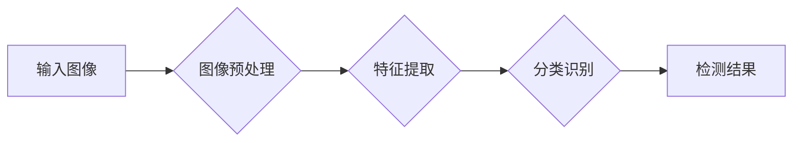

> 人眼检测、OpenCV、计算机视觉、深度学习、图像处理

## 1. 背景介绍

人眼作为人类感知世界的重要器官，其检测和跟踪在计算机视觉领域有着广泛的应用前景。从人机交互、安防监控到医疗诊断，人眼检测技术都扮演着至关重要的角色。传统的基于特征的检测方法，例如Haar特征、LBP特征等，在复杂场景下容易受到光照变化、姿态变化等因素的影响，检测精度较低。近年来，随着深度学习技术的快速发展，基于深度学习的人眼检测方法取得了显著的进展，其检测精度和鲁棒性得到了大幅提升。

本篇文章将详细介绍基于OpenCV的人眼检测系统的设计与实现，涵盖算法原理、数学模型、代码实现以及实际应用场景等方面。

## 2. 核心概念与联系

### 2.1 人眼检测系统架构

人眼检测系统通常由以下几个模块组成：

* **图像预处理模块:** 对输入图像进行预处理，例如灰度化、去噪、尺寸调整等，以提高检测精度。
* **特征提取模块:** 从预处理后的图像中提取人眼特征，例如边缘、纹理、颜色等。
* **分类识别模块:** 利用提取的特征进行分类识别，判断图像中是否存在人眼，并定位其位置。
* **结果输出模块:** 将检测结果以图像标注、坐标信息等形式输出。

### 2.2  OpenCV库

OpenCV（Open Source Computer Vision Library）是一个开源的计算机视觉库，提供了丰富的图像处理、计算机视觉算法和工具。它支持多种编程语言，例如C++、Python、Java等。

OpenCV库在人眼检测系统中扮演着重要的角色，它提供了图像处理、特征提取、机器学习等方面的功能，可以帮助我们快速搭建人眼检测系统。

### 2.3 深度学习模型

深度学习模型在人眼检测领域取得了显著的进展，例如YOLO、SSD、Faster R-CNN等。这些模型通过学习大量的图像数据，能够自动提取人眼特征，并实现高效的检测和定位。

OpenCV库支持多种深度学习框架，例如TensorFlow、PyTorch等，我们可以利用这些框架训练和部署深度学习模型，实现高精度的人眼检测。

**Mermaid 流程图**



## 3. 核心算法原理 & 具体操作步骤

### 3.1  算法原理概述

本系统采用基于深度学习的人眼检测算法，具体使用YOLOv5模型。YOLOv5是一种实时目标检测算法，其特点是速度快、精度高、易于训练和部署。

YOLOv5模型将图像划分为多个网格单元，每个网格单元负责预测该区域内是否存在目标，以及目标的类别和位置信息。模型通过学习大量的图像数据，能够自动提取人眼特征，并实现高效的检测和定位。

### 3.2  算法步骤详解

1. **图像预处理:** 对输入图像进行尺寸调整、归一化等预处理操作，以提高模型的检测精度。
2. **特征提取:** 将预处理后的图像输入到YOLOv5模型中，模型会提取图像的特征信息。
3. **目标检测:** 模型根据提取的特征信息，预测每个网格单元内是否存在人眼，以及人眼的类别和位置信息。
4. **后处理:** 对检测结果进行非极大值抑制、坐标调整等后处理操作，去除冗余检测框，提高检测结果的准确性。

### 3.3  算法优缺点

**优点:**

* 检测速度快，能够实现实时检测。
* 检测精度高，能够准确定位人眼。
* 易于训练和部署，可以使用现成的模型进行应用。

**缺点:**

* 对训练数据要求较高，需要大量的标注数据进行训练。
* 在复杂场景下，例如遮挡、模糊等情况，检测精度可能会下降。

### 3.4  算法应用领域

* **人机交互:** 人眼检测可以用于人机交互系统，例如手势识别、眼动追踪等。
* **安防监控:** 人眼检测可以用于安防监控系统，例如人脸识别、行为分析等。
* **医疗诊断:** 人眼检测可以用于医疗诊断系统，例如眼部疾病检测、眼球运动分析等。

## 4. 数学模型和公式 & 详细讲解 & 举例说明

### 4.1  数学模型构建

YOLOv5模型采用卷积神经网络结构，其核心是多个卷积层、池化层和激活函数层。这些层通过学习图像特征，最终实现人眼检测的目标。

### 4.2  公式推导过程

YOLOv5模型的训练过程是一个优化过程，目标是找到模型参数，使得模型的预测结果与真实标签之间的误差最小化。

常用的损失函数包括：

* **分类损失函数:** 用于衡量模型预测的类别与真实类别之间的差异。
* **位置损失函数:** 用于衡量模型预测的边界框与真实边界框之间的差异。

### 4.3  案例分析与讲解

假设我们有一个输入图像，包含一个人的眼睛。YOLOv5模型会将图像划分为多个网格单元，每个网格单元负责预测该区域内是否存在人眼，以及人眼的类别和位置信息。

模型会根据训练数据学习到的特征，预测每个网格单元内的人眼概率、类别和位置信息。然后，通过后处理操作，例如非极大值抑制、坐标调整等，最终得到最终的检测结果，即人眼的坐标信息。

## 5. 项目实践：代码实例和详细解释说明

### 5.1  开发环境搭建

* **操作系统:** Windows/Linux/macOS
* **编程语言:** Python
* **库依赖:** OpenCV、TensorFlow/PyTorch、YOLOv5

### 5.2  源代码详细实现

```python
import cv2
import numpy as np

# 加载YOLOv5模型
net = cv2.dnn.readNet("yolov5s.weights", "yolov5s.cfg")

# 获取输入图像
image = cv2.imread("input.jpg")

# 获取图像高度和宽度
height, width = image.shape[:2]

# 创建blob
blob = cv2.dnn.blobFromImage(image, 1/255, (416, 416), (0, 0, 0), True, crop=False)

# 设置输入
net.setInput(blob)

# 获取输出层
output_layers_names = net.getUnconnectedOutLayersNames()
outputs = net.forward(output_layers_names)

# 后处理
boxes = []
confidences = []
class_ids = []

for output in outputs:
    for detection in output:
        scores = detection[5:]
        class_id = np.argmax(scores)
        confidence = scores[class_id]

        if confidence > 0.5:
            center_x = int(detection[0] * width)
            center_y = int(detection[1] * height)
            w = int(detection[2] * width)
            h = int(detection[3] * height)

            x = int(center_x - w / 2)
            y = int(center_y - h / 2)

            boxes.append([x, y, w, h])
            confidences.append(float(confidence))
            class_ids.append(class_id)

# 非极大值抑制
indexes = cv2.dnn.NMSBoxes(boxes, confidences, 0.5, 0.4)

# 绘制检测结果
for i in range(len(boxes)):
    if i in indexes:
        x, y, w, h = boxes[i]
        label = str(class_ids[i])
        confidence = confidences[i]
        color = (0, 255, 0)
        cv2.rectangle(image, (x, y), (x + w, y + h), color, 2)
        cv2.putText(image, f"{label} {confidence:.2f}", (x, y - 10), cv2.FONT_HERSHEY_SIMPLEX, 0.5, color, 2)

# 显示结果
cv2.imshow("Output", image)
cv2.waitKey(0)
```

### 5.3  代码解读与分析

* **加载YOLOv5模型:** 使用`cv2.dnn.readNet()`函数加载预训练的YOLOv5模型。
* **获取输入图像:** 使用`cv2.imread()`函数读取输入图像。
* **创建blob:** 使用`cv2.dnn.blobFromImage()`函数将图像转换为blob格式，以便输入到模型中。
* **设置输入:** 使用`net.setInput()`函数将blob数据作为模型的输入。
* **获取输出层:** 使用`net.getUnconnectedOutLayersNames()`函数获取模型的输出层名称。
* **获取输出:** 使用`net.forward()`函数进行前向传播，获取模型的输出。
* **后处理:** 对模型输出进行后处理，例如非极大值抑制、坐标调整等，以获得最终的检测结果。
* **绘制检测结果:** 使用`cv2.rectangle()`和`cv2.putText()`函数绘制检测框和标签。
* **显示结果:** 使用`cv2.imshow()`函数显示检测结果图像。

### 5.4  运行结果展示

运行代码后，将显示输入图像，并在图像上绘制出检测到的眼睛位置和标签。

## 6. 实际应用场景

### 6.1 人机交互

人眼检测可以用于人机交互系统，例如手势识别、眼动追踪等。例如，我们可以利用人眼检测技术实现语音助手，通过识别用户的眼动轨迹，控制语音助手的操作。

### 6.2 安防监控

人眼检测可以用于安防监控系统，例如人脸识别、行为分析等。例如，我们可以利用人眼检测技术识别监控画面中的可疑人员，并进行报警。

### 6.3 医疗诊断

人眼检测可以用于医疗诊断系统，例如眼部疾病检测、眼球运动分析等。例如，我们可以利用人眼检测技术检测患者的眼压、视力等指标，辅助医生进行诊断。

### 6.4 未来应用展望

随着深度学习技术的不断发展，人眼检测技术将会得到更广泛的应用。例如，我们可以利用人眼检测技术实现虚拟现实、增强现实等新兴技术的应用。

## 7. 工具和资源推荐

### 7.1 学习资源推荐

* **OpenCV官方文档:** https://docs.opencv.org/
* **YOLOv5官方文档:** https://github.com/ultralytics/yolov5
* **深度学习教程:** https://www.tensorflow.org/tutorials

### 7.2 开发工具推荐

* **Python:** https://www.python.org/
* **Visual Studio Code:** https://code.visualstudio.com/

### 7.3 相关论文推荐

* **YOLO: You Only Look Once:** https://arxiv.org/abs/1506.02640
* **YOLOv5:** https://arxiv.org/abs/2004.10934

## 8. 总结：未来发展趋势与挑战

### 8.1 研究成果总结

本篇文章详细介绍了基于OpenCV的人眼检测系统的设计与实现，涵盖了算法原理、数学模型、代码实现以及实际应用场景等方面。

### 8.2 未来发展趋势

* **更高精度:** 随着深度学习技术的不断发展，人眼检测的精度将会得到进一步提升。
* **更实时:** 人眼检测的速度将会更快，能够实现更实时的人眼跟踪。
* **更鲁棒:** 人眼检测的鲁棒性将会更高，能够更好地应对复杂场景下的挑战。

### 8.3 面临的挑战

*