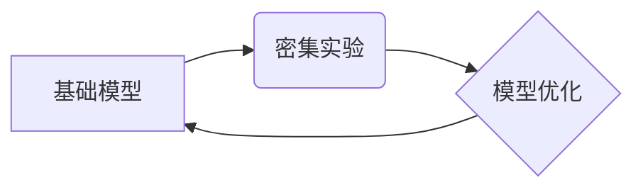

> 基础模型、密集实验、模型训练、性能评估、数据增强、迁移学习、自动化测试

## 1. 背景介绍

近年来，基础模型在人工智能领域取得了显著进展，例如 GPT-3、DALL-E 2 等模型展现出强大的泛化能力和应用潜力。这些模型通常拥有庞大的参数规模和海量训练数据，能够在各种下游任务中取得优异的性能。然而，基础模型的训练和调优是一个复杂且耗时的过程，需要大量的计算资源和专业知识。

为了加速基础模型的开发和应用，密集实验的需求日益迫切。密集实验是指在短时间内进行大量模型训练和评估，通过收集大量数据和经验，快速探索最佳模型架构、训练策略和超参数组合。

## 2. 核心概念与联系

**2.1 基础模型**

基础模型是指预先训练的通用模型，能够在多种下游任务中进行微调。其特点包括：

* **庞大的参数规模:** 基础模型通常拥有数亿甚至数十亿个参数，能够学习到更复杂的特征表示。
* **海量的训练数据:** 基础模型需要大量的训练数据才能有效学习，通常使用公开数据集或私有数据集进行训练。
* **强大的泛化能力:** 基础模型能够在未见过的任务和数据上表现出良好的性能。

**2.2 密集实验**

密集实验是指在短时间内进行大量模型训练和评估，通过收集大量数据和经验，快速探索最佳模型架构、训练策略和超参数组合。其特点包括：

* **自动化:** 密集实验通常使用自动化工具和平台，减少人工干预，提高效率。
* **并行化:** 密集实验通常利用多台机器进行并行训练，缩短训练时间。
* **数据驱动:** 密集实验依赖于大量数据和指标评估，指导模型优化。

**2.3 核心概念联系**

基础模型和密集实验相互促进，形成良性循环。密集实验可以帮助快速探索和优化基础模型的架构、训练策略和超参数，从而提升基础模型的性能。而基础模型的强大能力可以为密集实验提供更强大的基础，支持更复杂和更深入的探索。



## 3. 核心算法原理 & 具体操作步骤

**3.1 算法原理概述**

密集实验的核心算法原理是基于**搜索算法**和**强化学习**。

* **搜索算法:** 用于探索模型架构、训练策略和超参数组合的搜索空间。常见的搜索算法包括**随机搜索、网格搜索、贝叶斯优化**等。
* **强化学习:** 用于根据模型性能反馈，调整搜索策略，提高探索效率。

**3.2 算法步骤详解**

1. **定义搜索空间:** 确定模型架构、训练策略和超参数的候选范围。
2. **初始化模型:** 根据搜索空间随机初始化模型参数。
3. **训练模型:** 使用训练数据训练模型，并评估模型性能。
4. **更新搜索策略:** 根据模型性能反馈，更新搜索策略，例如调整搜索范围、增加探索力度等。
5. **重复步骤3-4:** 直到满足终止条件，例如达到目标性能或耗尽资源。

**3.3 算法优缺点**

* **优点:**

    * 自动化程度高，提高效率。
    * 能够探索更广阔的搜索空间。
    * 能够根据模型性能反馈，动态调整搜索策略。

* **缺点:**

    * 需要大量的计算资源和时间。
    * 难以保证找到全局最优解。
    * 需要精心设计搜索空间和评估指标。

**3.4 算法应用领域**

密集实验广泛应用于各种人工智能领域，例如：

* **自然语言处理:** 探索最佳语言模型架构和训练策略。
* **计算机视觉:** 优化图像识别、目标检测和图像生成模型。
* **机器学习:** 寻找最佳机器学习算法和超参数组合。

## 4. 数学模型和公式 & 详细讲解 & 举例说明

**4.1 数学模型构建**

密集实验的数学模型通常基于**目标函数**和**搜索策略**。

* **目标函数:** 用于衡量模型性能，例如准确率、召回率、F1-score 等。
* **搜索策略:** 用于探索模型参数空间，例如随机搜索、网格搜索、贝叶斯优化等。

**4.2 公式推导过程**

例如，使用贝叶斯优化进行密集实验，目标函数为模型准确率，搜索策略为贝叶斯优化算法。贝叶斯优化算法的核心思想是构建一个**概率模型**来估计目标函数的分布，并根据概率模型选择最优的模型参数。

**4.3 案例分析与讲解**

假设我们想要训练一个图像分类模型，目标函数为模型准确率。可以使用贝叶斯优化算法进行密集实验，探索最佳模型架构、训练策略和超参数组合。

贝叶斯优化算法会首先随机选择一些模型参数进行训练，并记录模型性能。然后，根据这些数据构建一个概率模型，估计目标函数的分布。根据概率模型，算法会选择最有可能获得高准确率的模型参数进行训练。

重复上述过程，直到达到目标准确率或耗尽资源。

## 5. 项目实践：代码实例和详细解释说明

**5.1 开发环境搭建**

* 操作系统: Ubuntu 20.04
* Python 版本: 3.8
* 必要的库: TensorFlow, PyTorch, scikit-learn, hyperopt

**5.2 源代码详细实现**

```python
import hyperopt
from hyperopt import fmin, tpe, hp, Trials

# 定义目标函数
def objective(params):
    # 使用模型参数进行训练，并评估模型性能
    # 返回模型性能指标，例如准确率
    pass

# 定义搜索空间
space = {
    'learning_rate': hp.loguniform('learning_rate', -5, 0),
    'batch_size': hp.choice('batch_size', [32, 64, 128]),
    'epochs': hp.choice('epochs', [10, 20, 30]),
}

# 初始化 Trials 对象
trials = Trials()

# 使用贝叶斯优化算法进行搜索
best = fmin(fn=objective,
            space=space,
            algo=tpe.suggest,
            max_evals=100,
            trials=trials)

# 打印最佳参数
print(best)
```

**5.3 代码解读与分析**

* `objective` 函数定义了模型训练和性能评估过程。
* `space` 定义了搜索空间，包括学习率、批处理大小和训练轮数等超参数。
* `Trials` 对象用于记录搜索过程中的数据。
* `fmin` 函数使用贝叶斯优化算法进行搜索，并返回最佳参数。

**5.4 运行结果展示**

运行代码后，会输出最佳模型参数，以及相应的模型性能指标。

## 6. 实际应用场景

密集实验在人工智能领域有着广泛的应用场景，例如：

* **自然语言处理:** 探索最佳语言模型架构和训练策略，例如 BERT、GPT-3 等模型的训练。
* **计算机视觉:** 优化图像识别、目标检测和图像生成模型，例如 ResNet、YOLO 等模型的训练。
* **机器学习:** 寻找最佳机器学习算法和超参数组合，例如决策树、支持向量机等算法的调优。

**6.4 未来应用展望**

随着计算资源的不断提升和算法的不断发展，密集实验将在人工智能领域发挥更加重要的作用。未来，密集实验将更加自动化、智能化和高效化，能够帮助研究人员更快地探索和优化人工智能模型，推动人工智能技术的进步。

## 7. 工具和资源推荐

**7.1 学习资源推荐**

* **书籍:**
    * "Hands-On Machine Learning with Scikit-Learn, Keras & TensorFlow" by Aurélien Géron
    * "Deep Learning" by Ian Goodfellow, Yoshua Bengio, and Aaron Courville
* **在线课程:**
    * Coursera: Machine Learning by Andrew Ng
    * Udacity: Deep Learning Nanodegree

**7.2 开发工具推荐**

* **TensorFlow:** 开源深度学习框架
* **PyTorch:** 开源深度学习框架
* **Keras:** 高级深度学习API

**7.3 相关论文推荐**

* "Hyperparameter Optimization for Deep Learning" by Bergstra et al.
* "Bayesian Optimization: A Review" by Snoek et al.

## 8. 总结：未来发展趋势与挑战

**8.1 研究成果总结**

密集实验为人工智能模型的开发和优化提供了高效的工具和方法。通过自动化、智能化和高效化的探索，密集实验能够帮助研究人员更快地找到最佳模型架构、训练策略和超参数组合，从而提升人工智能模型的性能。

**8.2 未来发展趋势**

* **更智能的搜索策略:** 探索更先进的搜索算法，例如强化学习、进化算法等，提高搜索效率和准确性。
* **更强大的计算资源:** 利用云计算、分布式计算等技术，提供更强大的计算资源，支持更复杂和更深入的密集实验。
* **更丰富的实验数据:** 收集和共享更多实验数据，构建更完善的模型性能评估体系，提高实验结果的可靠性和可重复性。

**8.3 面临的挑战**

* **计算资源成本:** 密集实验需要大量的计算资源，成本较高。
* **算法复杂度:** 一些密集实验算法非常复杂，需要专业的知识和经验才能有效应用。
* **数据隐私问题:** 密集实验需要使用大量数据，如何保护数据隐私是一个重要的挑战。

**8.4 研究展望**

未来，密集实验将继续朝着更智能、更高效、更安全的方向发展，为人工智能的进步做出更大的贡献。


## 9. 附录：常见问题与解答

**9.1 如何选择合适的搜索算法？**

选择合适的搜索算法取决于具体的应用场景和数据特点。例如，对于高维搜索空间，贝叶斯优化算法通常表现较好；对于低维搜索空间，随机搜索或网格搜索也可能是一个不错的选择。

**9.2 如何评估模型性能？**

模型性能的评估指标取决于具体的应用场景。例如，对于图像分类任务，可以使用准确率、召回率、F1-score 等指标进行评估；对于文本生成任务，可以使用BLEU、ROUGE 等指标进行评估。

**9.3 如何处理数据隐私问题？**

在进行密集实验时，需要采取措施保护数据隐私。例如，可以使用数据脱敏技术，将敏感信息替换为非敏感信息；可以使用联邦学习技术，在不共享原始数据的情况下进行模型训练。


作者：禅与计算机程序设计艺术 / Zen and the Art of Computer Programming 
<end_of_turn>