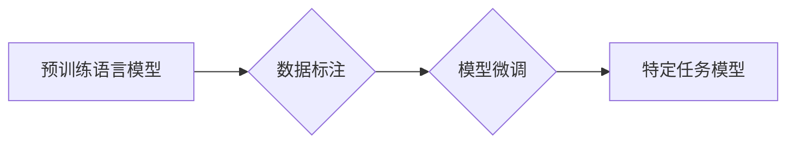
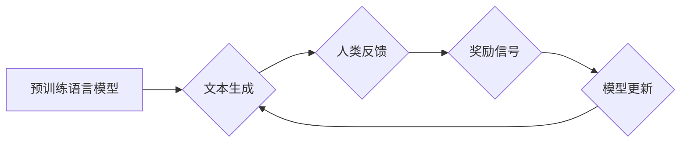

> 大规模语言模型，SFT模型，RL模型，评估，文本生成，自然语言处理，深度学习

## 1. 背景介绍

近年来，大规模语言模型（Large Language Models，LLMs）在自然语言处理（Natural Language Processing，NLP）领域取得了显著进展，展现出强大的文本生成、翻译、问答和代码生成能力。这些模型通常基于Transformer架构，拥有数十亿甚至数千亿个参数，通过海量文本数据进行预训练，能够学习到丰富的语言知识和模式。

然而，现有的LLMs在实际应用中仍然存在一些挑战，例如：

* **偏差和偏见：** 训练数据可能包含社会偏见，导致模型生成带有歧视性或不准确的文本。
* **可解释性和透明度：** LLMs 的决策过程复杂，难以理解模型是如何生成特定文本的。
* **安全性和鲁棒性：** LLMs 可能被恶意利用生成虚假信息、进行攻击或传播有害内容。

为了解决这些问题，研究者们提出了多种方法，其中包括：

* **监督式预训练（Supervised Fine-Tuning，SFT）：** 在预训练模型的基础上，使用标注数据进行微调，使其能够更好地完成特定任务。
* **强化学习预训练（Reinforcement Learning from Human Feedback，RLHF）：** 利用人类反馈来训练模型，使其生成更符合人类期望的文本。

## 2. 核心概念与联系

### 2.1 SFT模型

SFT模型是基于预训练语言模型的监督式微调方法。其核心思想是利用标注数据来进一步训练预训练模型，使其能够更好地完成特定任务。

**流程图：**



### 2.2 RL模型

RL模型利用强化学习的原理来训练语言模型。其核心思想是通过人类反馈来奖励模型生成符合期望的文本，并惩罚生成不符合期望的文本。

**流程图：**



### 2.3 SFT与RL模型的联系

SFT和RL模型都是基于预训练语言模型的训练方法，但它们在训练目标和数据使用方式上有所不同。SFT模型利用标注数据进行监督式训练，而RL模型则利用人类反馈进行强化学习训练。

## 3. 核心算法原理 & 具体操作步骤

### 3.1  算法原理概述

SFT模型和RL模型都基于深度学习算法，其核心原理是通过调整模型参数来最小化预测误差。

* **SFT模型：** 使用交叉熵损失函数来衡量模型预测与真实标签之间的差异，通过反向传播算法更新模型参数。
* **RL模型：** 使用奖励函数来衡量模型生成的文本质量，通过策略梯度算法更新模型参数。

### 3.2  算法步骤详解

#### 3.2.1 SFT模型

1. **预训练语言模型：** 使用大量的文本数据对语言模型进行预训练，使其学习到语言的语法和语义知识。
2. **数据标注：** 为特定任务收集标注数据，例如文本分类、情感分析或机器翻译。
3. **模型微调：** 将预训练模型加载到训练环境中，使用标注数据进行微调，调整模型参数以提高特定任务的性能。
4. **模型评估：** 使用独立的测试集评估模型的性能，并根据评估结果进行模型调优。

#### 3.2.2 RL模型

1. **预训练语言模型：** 与SFT模型相同，使用大量的文本数据对语言模型进行预训练。
2. **人类反馈收集：** 收集人类对模型生成文本的反馈，例如评分、排名或打标签。
3. **奖励函数设计：** 设计一个奖励函数，将人类反馈转换为模型可以理解的奖励信号。
4. **策略梯度训练：** 使用策略梯度算法训练模型，使其生成能够获得更高奖励的文本。
5. **模型评估：** 使用独立的测试集评估模型的性能，并根据评估结果进行模型调优。

### 3.3  算法优缺点

#### 3.3.1 SFT模型

* **优点：**
    * 训练相对简单，易于实现。
    * 可以利用现有的标注数据进行训练。
    * 在某些任务上可以取得较好的性能。
* **缺点：**
    * 需要大量的标注数据，标注成本较高。
    * 容易受到训练数据偏差的影响。
    * 难以学习到复杂的语言知识和模式。

#### 3.3.2 RL模型

* **优点：**
    * 不需要大量的标注数据，可以利用人类反馈进行训练。
    * 可以学习到更复杂的语言知识和模式。
    * 生成文本更符合人类期望。
* **缺点：**
    * 训练过程复杂，需要设计合适的奖励函数。
    * 训练效率较低，需要大量的计算资源。
    * 容易出现训练不稳定等问题。

### 3.4  算法应用领域

* **文本生成：** 生成小说、诗歌、剧本等创意文本。
* **机器翻译：** 将文本从一种语言翻译成另一种语言。
* **问答系统：** 回答用户提出的问题。
* **对话系统：** 与用户进行自然语言对话。
* **代码生成：** 根据自然语言描述生成代码。

## 4. 数学模型和公式 & 详细讲解 & 举例说明

### 4.1  数学模型构建

#### 4.1.1 SFT模型

SFT模型的数学模型可以表示为：

$$
\hat{y} = f(x; \theta)
$$

其中：

* $\hat{y}$ 是模型预测的输出。
* $x$ 是输入文本。
* $f$ 是模型的函数，例如多层感知机或Transformer。
* $\theta$ 是模型的参数。

#### 4.1.2 RL模型

RL模型的数学模型可以表示为：

$$
\theta = \arg\max_{\theta} \mathbb{E}_{\tau \sim \pi_{\theta}} \sum_{t=1}^{T} r_t
$$

其中：

* $\theta$ 是模型的参数。
* $\pi_{\theta}$ 是模型生成的策略。
* $\tau$ 是一个轨迹，包含一系列的输入和输出。
* $r_t$ 是在时间步 $t$ 的奖励。
* $T$ 是轨迹的长度。

### 4.2  公式推导过程

#### 4.2.1 SFT模型

SFT模型的损失函数通常使用交叉熵损失函数：

$$
L = -\sum_{i=1}^{N} y_i \log(\hat{y}_i)
$$

其中：

* $N$ 是样本数量。
* $y_i$ 是真实标签。
* $\hat{y}_i$ 是模型预测的输出。

通过反向传播算法，更新模型参数 $\theta$：

$$
\theta = \theta - \alpha \nabla_{\theta} L
$$

其中：

* $\alpha$ 是学习率。
* $\nabla_{\theta} L$ 是损失函数对参数 $\theta$ 的梯度。

#### 4.2.2 RL模型

RL模型的策略梯度算法更新模型参数 $\theta$：

$$
\theta = \theta + \alpha \nabla_{\theta} \mathbb{E}_{\tau \sim \pi_{\theta}} \sum_{t=1}^{T} r_t
$$

其中：

* $\alpha$ 是学习率。
* $\nabla_{\theta} \mathbb{E}_{\tau \sim \pi_{\theta}} \sum_{t=1}^{T} r_t$ 是策略梯度。

### 4.3  案例分析与讲解

#### 4.3.1 SFT模型案例

使用SFT模型进行文本分类任务，例如判断文本是正面评价还是负面评价。

* **数据标注：** 收集大量文本数据，并为每个文本标注其情感类别。
* **模型微调：** 使用预训练语言模型，并使用标注数据进行微调，使其能够准确地预测文本的情感类别。
* **模型评估：** 使用独立的测试集评估模型的性能，例如准确率、召回率和F1-score。

#### 4.3.2 RL模型案例

使用RL模型进行对话系统训练，例如聊天机器人。

* **人类反馈收集：** 收集人类对聊天机器人的对话反馈，例如评分、排名或打标签。
* **奖励函数设计：** 设计一个奖励函数，将人类反馈转换为模型可以理解的奖励信号，例如奖励模型生成流畅、自然、有意义的对话。
* **策略梯度训练：** 使用策略梯度算法训练模型，使其生成能够获得更高奖励的对话。
* **模型评估：** 使用独立的测试集评估模型的性能，例如对话流畅度、自然度和相关性。

## 5. 项目实践：代码实例和详细解释说明

### 5.1  开发环境搭建

* **操作系统：** Linux或macOS
* **编程语言：** Python
* **深度学习框架：** TensorFlow或PyTorch
* **其他工具：** Git、Jupyter Notebook

### 5.2  源代码详细实现

以下是一个使用PyTorch实现SFT模型文本分类的简单代码示例：

```python
import torch
import torch.nn as nn
from torch.utils.data import Dataset, DataLoader

class TextDataset(Dataset):
    def __init__(self, texts, labels):
        self.texts = texts
        self.labels = labels

    def __len__(self):
        return len(self.texts)

    def __getitem__(self, idx):
        return self.texts[idx], self.labels[idx]

# 定义模型
class TextClassifier(nn.Module):
    def __init__(self, vocab_size, embedding_dim, hidden_dim, num_classes):
        super(TextClassifier, self).__init__()
        self.embedding = nn.Embedding(vocab_size, embedding_dim)
        self.lstm = nn.LSTM(embedding_dim, hidden_dim)
        self.fc = nn.Linear(hidden_dim, num_classes)

    def forward(self, x):
        x = self.embedding(x)
        x, _ = self.lstm(x)
        x = x[:, -1, :]
        x = self.fc(x)
        return x

# 训练模型
model = TextClassifier(vocab_size=10000, embedding_dim=128, hidden_dim=256, num_classes=2)
optimizer = torch.optim.Adam(model.parameters())
criterion = nn.CrossEntropyLoss()

dataset = TextDataset(texts, labels)
dataloader = DataLoader(dataset, batch_size=32)

for epoch in range(10):
    for batch_idx, (data, target) in enumerate(dataloader):
        optimizer.zero_grad()
        output = model(data)
        loss = criterion(output, target)
        loss.backward()
        optimizer.step()

# 评估模型
# ...
```

### 5.3  代码解读与分析

* **数据预处理：** 将文本数据转换为数字向量，例如使用词嵌入技术。
* **模型定义：** 定义一个神经网络模型，例如使用LSTM或Transformer架构。
* **损失函数：** 选择一个合适的损失函数，例如交叉熵损失函数。
* **优化器：** 选择一个合适的优化器，例如Adam优化器。
* **训练模型：** 使用训练数据训练模型，并根据损失函数值调整模型参数。
* **评估模型：** 使用测试数据评估模型的性能。

### 5.4  运行结果展示

* **准确率：