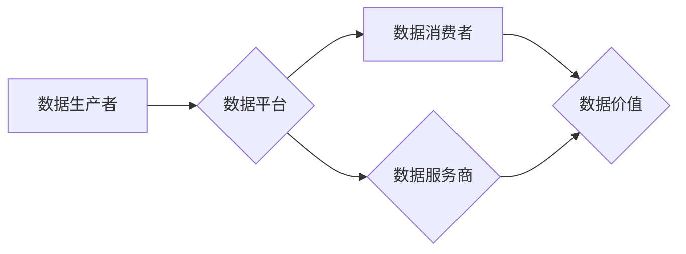

> 平台经济、数据生态、数据治理、数据安全、数据隐私、数据价值、数据开放、数据共享、数据标准

## 1. 背景介绍

平台经济的蓬勃发展，为数据生态的构建提供了广阔的舞台。数据作为平台经济的核心驱动力，其价值正在被越来越多的企业和个人所认识。然而，数据生态的构建并非易事，它需要平台方、开发者、用户等多方共同参与，并建立起一套完善的数据治理体系。

当前，数据生态面临着诸多挑战：

* **数据孤岛问题：** 数据分散在不同的平台和系统中，难以进行有效整合和利用。
* **数据安全和隐私问题：** 数据泄露和滥用风险日益增加，用户对数据安全和隐私的担忧日益突出。
* **数据标准化问题：** 缺乏统一的数据标准，导致数据互操作性差，难以实现数据共享和协同。
* **数据价值挖掘问题：** 如何将海量数据转化为有价值的商业资产，仍然是一个难题。

## 2. 核心概念与联系

**2.1 数据生态**

数据生态是指围绕数据资源，形成的由数据生产者、数据消费者、数据服务商等多方参与的生态系统。它是一个开放、共享、协同的数据价值网络，通过数据流通、数据服务、数据应用等方式，实现数据价值的创造和共享。

**2.2 平台经济**

平台经济是指以平台为核心，通过连接供给方和需求方，实现资源共享和价值创造的经济模式。平台经济的核心是数据，平台通过收集和分析用户数据，为供给方和需求方提供个性化服务，并从中获取收益。

**2.3 数据治理**

数据治理是指对数据生命周期的各个环节进行管理和控制，以确保数据的质量、安全、合规和可信度。数据治理体系包括数据策略、数据标准、数据安全、数据隐私、数据质量等方面。

**2.4 数据价值**

数据价值是指数据能够为企业或个人创造的经济、社会或其他方面的价值。数据价值的体现形式多种多样，包括商业价值、决策价值、创新价值、社会价值等。

**2.5 数据开放**

数据开放是指平台方将部分或全部数据资源向外部开放，供其他企业或个人进行使用和开发。数据开放可以促进数据共享和协同，推动数据价值的释放。

**2.6 数据共享**

数据共享是指多个主体之间协同利用数据资源，共同创造价值。数据共享可以降低数据孤岛问题，提高数据利用效率。

**2.7 数据标准**

数据标准是指数据格式、结构、语义等方面的规范，它可以保证数据互操作性和可交换性。

**2.8 数据安全**

数据安全是指保护数据免受未经授权的访问、使用、修改或销毁的措施。数据安全是数据生态建设的基础，也是用户信任的关键。

**2.9 数据隐私**

数据隐私是指个人信息在收集、使用、存储和处理过程中，应受到保护的权利。数据隐私是数据生态建设的重要原则，也是社会道德的体现。

**2.10 数据价值链**

数据价值链是指从数据采集到数据应用的全过程，包括数据采集、数据清洗、数据分析、数据应用等环节。数据价值链的各个环节相互关联，共同构成了数据价值的创造和释放过程。

**2.11 数据治理体系**

数据治理体系是指平台方建立的管理和控制数据资源的制度体系，包括数据策略、数据标准、数据安全、数据隐私、数据质量等方面。

**2.12 数据生态治理**

数据生态治理是指平台方、开发者、用户等多方共同参与，建立起一套完善的数据治理体系，以确保数据生态的健康发展。

**2.13 数据生态建设**

数据生态建设是指平台方通过技术创新、政策引导、市场机制等方式，构建一个开放、共享、协同的数据价值网络。

**2.14 数据生态服务**

数据生态服务是指为数据生产者、数据消费者、数据服务商等提供的数据相关服务，包括数据存储、数据分析、数据应用等。

**2.15 数据生态平台**

数据生态平台是指提供数据资源共享、数据服务、数据应用等功能的平台，它可以连接数据生产者、数据消费者、数据服务商等，促进数据生态的构建和发展。

**2.16 数据生态治理机制**

数据生态治理机制是指平台方、开发者、用户等多方共同参与，制定和实施数据治理规则，以确保数据生态的健康发展。

**2.17 数据生态发展趋势**

数据生态发展趋势包括数据开放、数据共享、数据标准化、数据安全、数据隐私等方面。

**2.18 数据生态挑战**

数据生态面临的挑战包括数据孤岛问题、数据安全和隐私问题、数据标准化问题、数据价值挖掘问题等。

**2.19 数据生态未来展望**

数据生态未来将更加开放、共享、协同，数据价值将得到更加充分的释放。

**2.20 数据生态案例分析**

数据生态案例分析可以帮助我们更好地理解数据生态的构建和发展。

**Mermaid 流程图**



## 3. 核心算法原理 & 具体操作步骤

### 3.1 算法原理概述

数据生态构建的核心算法原理是基于数据价值链的分析和优化。通过对数据采集、清洗、分析、应用等环节进行分析，可以识别数据价值，并制定相应的策略和措施，以提高数据利用效率和价值创造。

### 3.2 算法步骤详解

1. **数据采集:** 收集来自不同来源的数据，包括用户行为数据、传感器数据、社会媒体数据等。
2. **数据清洗:** 对采集到的数据进行清洗和预处理，去除噪声、缺失值和重复数据，确保数据质量。
3. **数据分析:** 使用数据挖掘、机器学习等技术对数据进行分析，发现数据中的模式、趋势和规律。
4. **数据应用:** 将分析结果应用于实际业务场景，例如个性化推荐、精准营销、风险控制等。
5. **数据价值评估:** 对数据应用的效果进行评估，并根据评估结果调整数据采集、清洗、分析和应用策略。

### 3.3 算法优缺点

**优点:**

* 可以有效提高数据利用效率和价值创造。
* 可以帮助企业更好地了解用户需求和市场趋势。
* 可以促进数据共享和协同，推动数据生态的构建。

**缺点:**

* 数据采集、清洗和分析需要投入大量的人力和物力。
* 数据安全和隐私问题需要得到充分重视。
* 数据算法的准确性和可靠性需要不断提高。

### 3.4 算法应用领域

数据生态构建算法广泛应用于各个领域，例如：

* **电商平台:** 个性化推荐、精准营销、库存管理等。
* **社交媒体平台:** 用户画像分析、内容推荐、社区运营等。
* **金融机构:** 风险控制、欺诈检测、客户服务等。
* **医疗机构:** 疾病诊断、药物研发、患者管理等。

## 4. 数学模型和公式 & 详细讲解 & 举例说明

### 4.1 数学模型构建

数据生态构建可以抽象为一个网络模型，其中节点代表数据生产者、数据消费者、数据服务商等主体，边代表数据流向。

**节点类型:**

* 数据生产者: 生成数据的主体，例如用户、传感器、设备等。
* 数据消费者: 利用数据进行分析、决策或应用的主体，例如企业、研究机构、个人等。
* 数据服务商: 提供数据存储、分析、应用等服务的机构或企业。

**边类型:**

* 数据流向: 指数据从生产者到消费者的流动方向。
* 数据共享: 指数据在不同主体之间进行共享的连接。
* 数据服务: 指数据服务商提供的服务连接。

**模型公式:**

```
G = (V, E)
```

其中:

* G 代表数据生态网络模型。
* V 代表节点集合，包含数据生产者、数据消费者、数据服务商等。
* E 代表边集合，包含数据流向、数据共享、数据服务等连接。

### 4.2 公式推导过程

数据生态网络模型的构建可以基于以下公式推导过程:

1. **节点数量:**

```
|V| = N
```

其中:

* |V| 代表节点集合的 cardinality。
* N 代表数据生态网络中主体的数量。

2. **边数量:**

```
|E| = M
```

其中:

* |E| 代表边集合的 cardinality。
* M 代表数据生态网络中连接的数量。

3. **数据流向:**

```
F = {f_ij}
```

其中:

* F 代表数据流向集合。
* f_ij 代表从节点 i 到节点 j 的数据流向。

4. **数据共享:**

```
S = {s_ij}
```

其中:

* S 代表数据共享集合。
* s_ij 代表节点 i 和节点 j 之间的共享数据。

5. **数据服务:**

```
D = {d_ij}
```

其中:

* D 代表数据服务集合。
* d_ij 代表节点 i 和节点 j 之间的服务连接。

### 4.3 案例分析与讲解

例如，一个电商平台的数据生态网络模型可以包含以下节点和边:

* **节点:** 用户、商品、商家、平台系统等。
* **边:** 用户浏览商品、用户购买商品、商家发布商品、平台推荐商品等。

通过分析这些节点和边的连接关系，可以了解用户行为、商品需求、商家运营等信息，并为平台提供数据驱动的决策支持。

## 5. 项目实践：代码实例和详细解释说明

### 5.1 开发环境搭建

* 操作系统: Ubuntu 20.04 LTS
* 编程语言: Python 3.8
* 开发工具: Jupyter Notebook

### 5.2 源代码详细实现

```python
# 数据采集
import requests

def get_user_data(user_id):
  url = f"https://api.example.com/users/{user_id}"
  response = requests.get(url)
  return response.json()

# 数据清洗
def clean_user_data(user_data):
  # 去除不需要的数据字段
  user_data = {
    "user_id": user_data["user_id"],
    "username": user_data["username"],
    "age": user_data["age"],
  }
  return user_data

# 数据分析
import pandas as pd

def analyze_user_data(user_data):
  df = pd.DataFrame(user_data)
  # 计算平均年龄
  average_age = df["age"].mean()
  print(f"平均年龄: {average_age}")

# 数据应用
def recommend_products(user_id):
  # 根据用户数据推荐产品
  # ...

# 数据价值评估
def evaluate_data_value(user_data):
  # 评估数据应用的效果
  # ...

# 示例代码
user_id = 123
user_data = get_user_data(user_id)
cleaned_user_data = clean_user_data(user_data)
analyze_user_data(cleaned_user_data)
recommend_products(user_id)
evaluate_data_value(cleaned_user_data)
```

### 5.3 代码解读与分析

这段代码展示了数据生态构建的基本流程，包括数据采集、数据清洗、数据分析、数据应用和数据价值评估。

* 数据采集模块使用 `requests` 库从 API 获取用户数据。
* 数据清洗模块使用字典操作去除不需要的数据字段。
* 数据分析模块使用 `pandas` 库计算用户平均年龄。
* 数据应用模块使用 `recommend_products` 函数根据用户数据推荐产品。
