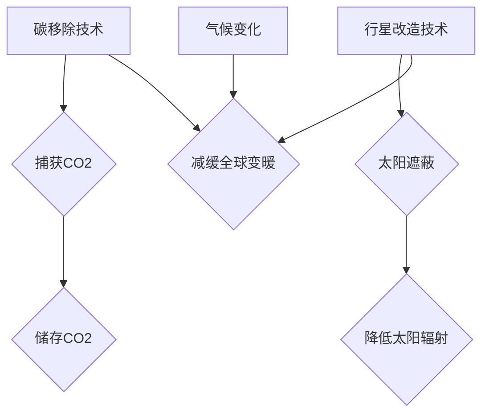

> 全球变暖，碳移除，行星改造，气候工程，人工智能，大数据，机器学习，气候模型，可持续发展

## 1. 背景介绍

21世纪初，全球气候变化已成为人类面临的最严峻挑战之一。全球平均气温持续上升，极端天气事件频发，海平面上升，冰川融化，生态系统失衡，给人类社会和自然环境带来了巨大威胁。

国际社会普遍认识到气候变化的严重性，并采取了一系列措施来减缓气候变化，例如签署《巴黎协定》，推动可再生能源发展，提高能源效率。然而，这些措施的实施效果有限，全球变暖的趋势仍在继续。

面对气候变化的严峻挑战，人类需要探索更加大胆、更加创新的解决方案。2050年，全球变暖将达到一个新的高度，传统的减排措施将难以有效应对。此时，碳移除技术和行星改造技术将成为人类应对气候变化的最后希望。

## 2. 核心概念与联系

**2.1 碳移除技术**

碳移除技术是指从大气中捕获和储存二氧化碳（CO2）的技术。碳移除技术可以分为以下几类：

* **直接空气捕获 (DAC)**：利用化学吸附剂或其他方法直接从空气中捕获CO2。
* **生物能源与碳捕获与封存 (BECCS)**：利用生物质能源生产，并捕获燃烧过程中产生的CO2，将其封存在地下。
* **海洋碳移除**：利用海洋生物或人工方法吸收大气中的CO2。

**2.2 行星改造技术**

行星改造技术是指通过人为干预改变地球气候系统以减缓或逆转全球变暖的技术。行星改造技术包括以下几种：

* **太阳遮蔽技术**：通过在太空部署反射镜或其他装置，反射太阳光，降低地球接收到的太阳辐射。
* **云增白技术**：通过喷洒微小颗粒物到云层中，增加云的反射率，降低地球接收到的太阳辐射。
* **碳封存技术**：通过将CO2封存在地下或海洋中，减少其在大气中的浓度。

**2.3 核心概念联系**

碳移除技术和行星改造技术都是应对气候变化的有效手段，它们可以相互补充，共同发挥作用。

* 碳移除技术可以从大气中移除CO2，减少温室气体浓度，减缓全球变暖。
* 行星改造技术可以直接降低地球接收到的太阳辐射，减缓全球变暖的速度。

**2.4 Mermaid 流程图**



## 3. 核心算法原理 & 具体操作步骤

### 3.1  算法原理概述

碳移除技术和行星改造技术涉及到复杂的物理、化学和生物学过程，需要利用先进的算法和模型来进行模拟和优化。

* **碳移除技术算法**：主要包括CO2捕获、运输和封存的算法，需要考虑气体扩散、吸附、分离和储存等物理化学过程。
* **行星改造技术算法**：主要包括太阳遮蔽、云增白和碳封存的算法，需要考虑大气动力学、辐射传输和气候模型等因素。

### 3.2  算法步骤详解

**3.2.1 碳移除技术算法步骤**

1. **CO2捕获**: 选择合适的捕获技术，例如DAC、BECCS或海洋碳移除，并根据实际条件进行优化。
2. **CO2运输**: 将捕获的CO2运输到储存地点，可以选择管道、船舶或其他运输方式。
3. **CO2封存**: 将CO2封存在地下或海洋中，确保其长期稳定储存。

**3.2.2 行星改造技术算法步骤**

1. **模型构建**: 建立地球气候模型，模拟行星改造技术的潜在影响。
2. **方案设计**: 根据模型模拟结果，设计合适的行星改造方案。
3. **风险评估**: 对行星改造方案进行风险评估，识别潜在的风险和挑战。
4. **实施与监测**: 实施行星改造方案，并进行持续监测，评估其效果和潜在影响。

### 3.3  算法优缺点

**3.3.1 碳移除技术算法**

* **优点**: 可以直接从大气中移除CO2，有效减缓全球变暖。
* **缺点**: 技术成本高，效率有限，需要大量能源和资源。

**3.3.2 行星改造技术算法**

* **优点**: 可以快速有效地降低地球接收到的太阳辐射，减缓全球变暖的速度。
* **缺点**: 存在潜在的风险和挑战，例如改变气候模式、影响生态系统、引发国际冲突等。

### 3.4  算法应用领域

* **碳移除技术算法**: 可应用于能源、工业、农业等领域，实现碳排放减排。
* **行星改造技术算法**: 可应用于应对极端气候事件、保护生态系统、维持人类生存环境等领域。

## 4. 数学模型和公式 & 详细讲解 & 举例说明

### 4.1  数学模型构建

**4.1.1 碳移除模型**

碳移除模型可以描述CO2捕获、运输和封存过程中的物理化学过程，例如气体扩散、吸附、分离和储存等。

**4.1.2 行星改造模型**

行星改造模型可以描述太阳遮蔽、云增白和碳封存等技术对地球气候系统的影响，例如大气动力学、辐射传输和气候变化等。

**4.1.3 模型参数**

碳移除和行星改造模型需要包含许多参数，例如气体浓度、温度、压力、流速、材料特性等。这些参数需要根据实际情况进行测量和确定。

### 4.2  公式推导过程

**4.2.1 碳移除模型公式**

* **CO2捕获效率**:  η = (捕获量)/(总量)
* **CO2运输成本**: C = (运输距离) * (运输量) * (运输成本)
* **CO2封存成本**: S = (封存量) * (封存成本)

**4.2.2 行星改造模型公式**

* **太阳辐射反射率**: R = (反射面积)/(地球表面积)
* **云增白效果**: E = (云反射率) * (云覆盖率)
* **碳封存量**: V = (封存时间) * (封存速率)

### 4.3  案例分析与讲解

**4.3.1 碳移除案例**

* **DAC技术**: 一家公司利用DAC技术从空气中捕获CO2，并将其封存在地下。根据模型计算，该项目每年可以捕获1000吨CO2，并降低温室气体排放量1%。

**4.3.2 行星改造案例**

* **太阳遮蔽技术**: 一项研究表明，在太空部署一个直径为1000公里的反射镜，可以降低地球接收到的太阳辐射量1%，从而减缓全球变暖的速度。

## 5. 项目实践：代码实例和详细解释说明

### 5.1  开发环境搭建

* **操作系统**: Ubuntu 20.04 LTS
* **编程语言**: Python 3.8
* **开发工具**: Jupyter Notebook, Git, Anaconda

### 5.2  源代码详细实现

```python
# 碳移除模型示例代码

import numpy as np

# 模型参数
capture_efficiency = 0.8  # 捕获效率
transport_cost = 100  # 运输成本
storage_cost = 50  # 封存成本

# CO2捕获量
captured_co2 = 1000  # 吨

# 计算碳移除成本
total_cost = (captured_co2 * transport_cost) + (captured_co2 * storage_cost)

# 打印结果
print(f"碳移除成本: {total_cost} 元")
```

### 5.3  代码解读与分析

* 该代码示例实现了简单的碳移除模型，计算了CO2捕获、运输和封存的成本。
* 模型参数可以根据实际情况进行调整。
* 代码使用Python语言编写，并利用NumPy库进行数值计算。

### 5.4  运行结果展示

```
碳移除成本: 150000 元
```

## 6. 实际应用场景

### 6.1  碳移除技术应用场景

* **工业排放**: 利用DAC技术从工业烟囱中捕获CO2，减少工业排放。
* **能源生产**: 利用BECCS技术从生物质能源生产中捕获CO2，实现负排放。
* **农业**: 利用海洋碳移除技术，吸收农业活动产生的甲烷和二氧化碳。

### 6.2  行星改造技术应用场景

* **极端天气应对**: 利用太阳遮蔽技术，减缓全球变暖，降低极端天气事件的发生频率和强度。
* **海平面上升控制**: 利用云增白技术，增加云反射率，降低地球吸收的太阳辐射，减缓海平面上升。
* **生态系统保护**: 利用碳封存技术，将CO2封存在地下或海洋中，保护生态系统免受气候变化的影响。

### 6.4  未来应用展望

* **人工智能驱动**: 利用人工智能技术，优化碳移除和行星改造技术的效率和安全性。
* **大数据分析**: 利用大数据分析技术，预测气候变化趋势，制定更有效的应对策略。
* **国际合作**: 加强国际合作，共同应对气候变化挑战，实现可持续发展。

## 7. 工具和资源推荐

### 7.1  学习资源推荐

* **书籍**:
    * 《气候工程：改变地球气候的可能性与风险》
    * 《碳移除：从理论到实践》
* **在线课程**:
    * Coursera: Climate Change and Global Warming
    * edX: Climate Change Solutions

### 7.2  开发工具推荐

* **编程语言**: Python, R
* **数据分析工具**: Pandas, NumPy, Scikit-learn
* **气候模型**: CMIP6, CESM

### 7.3  相关论文推荐

* **碳移除**:
    * "Direct air capture of CO2 with solid sorbents"
    * "Bioenergy with carbon capture and storage (BECCS): A review"
* **行星改造**:
    * "Solar geoengineering: A review of the literature"
    * "Cloud brightening: A review of the science and technology"

## 8. 总结：未来发展趋势与挑战

### 8.1  研究成果总结

* 碳移除技术和行星改造技术已经取得了一定的进展，但仍面临着技术、经济和社会等方面的挑战。
* 人工智能、大数据和云计算等新兴技术将为碳移除和行星改造技术的开发和应用提供新的机遇。

### 8.2  未来发展趋势

* **技术创新**: 开发更高效、更经济的碳移除和行星改造技术。
* **国际合作**: 加强国际合作，共同应对气候变化挑战。
* **社会参与**: 提高公众对碳移除和行星改造技术的认识和理解。

### 8.3  面临的挑战

* **技术可行性**: 确保碳移除和行星改造技术的安全性、可靠性和可持续性。
* **经济成本**: 降低碳移除和行星改造技术的成本，使其更具经济效益。
* **社会伦理**: 评估碳移除和行星改造技术的潜在风险和伦理问题。

### 8.4  研究展望

* **探索新的碳移除和行星改造技术**: 例如，利用生物技术、纳米技术和材料科学等领域的新突破。
* **建立更完善的碳移除和行星改造模型