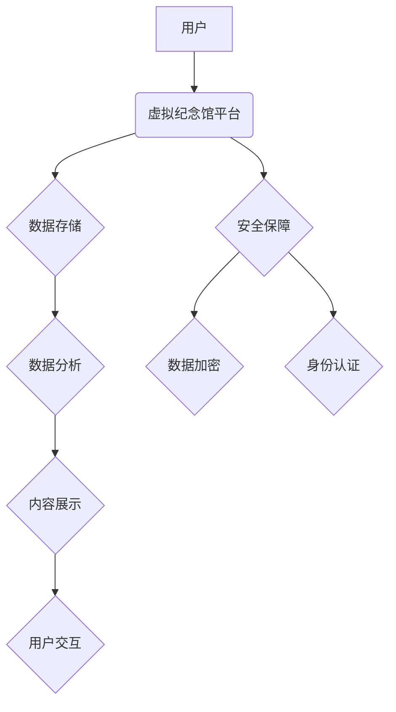

> 数字遗产，虚拟纪念馆，人工智能，区块链，数据永存，记忆传承，数字身份，元宇宙

## 1. 背景介绍

随着科技的飞速发展，人类的数字足迹日益庞大。从社交媒体上的互动记录到个人文件和创作作品，我们生活的方方面面都留下了大量的数字化信息。这些信息构成了我们独特的数字遗产，承载着个人经历、情感记忆和知识积累。然而，随着时间的推移，这些数字遗产面临着数据丢失、格式过时和访问权限问题等挑战。

传统的“数字墓园”模式，即将数据存储在物理服务器上，存在着数据安全、可访问性和可持续性问题。随着硬件老化、技术迭代和数据中心维护成本的增加，数字遗产的保存和传承面临着巨大的风险。

## 2. 核心概念与联系

**2.1 数字遗产**

数字遗产是指个人或组织在数字环境中创造、积累和留存的所有信息资源，包括但不限于：

* **个人信息:** 个人资料、社交媒体记录、通讯记录、照片、视频、音乐等。
* **创作作品:** 文学作品、音乐作品、绘画作品、软件代码等。
* **知识产权:** 专利、著作权、商标权等。
* **金融资产:** 虚拟货币、数字资产等。

**2.2 虚拟纪念馆**

虚拟纪念馆是一种基于互联网和新兴技术的数字平台，旨在保存、展示和传承数字遗产。它可以采用多种形式，例如：

* **个人纪念馆:** 用户可以创建自己的虚拟纪念馆，展示自己的数字足迹和故事。
* **家族纪念馆:** 家庭成员可以共同创建虚拟纪念馆，记录家族历史和传承家族文化。
* **公共纪念馆:** 博物馆、图书馆、档案馆等机构可以创建公共纪念馆，展示历史事件、文化遗产和重要人物的数字遗产。

**2.3 核心技术**

虚拟纪念馆的建设和运营需要依赖多种核心技术，包括：

* **人工智能:** 用于数据分析、内容识别、智能推荐和虚拟助手等。
* **区块链:** 用于数据安全、数据溯源和数字身份认证等。
* **云计算:** 用于数据存储、数据处理和平台扩展等。
* **元宇宙:** 用于构建沉浸式虚拟环境和增强现实体验等。

**2.4 架构图**

## 3. 核心算法原理 & 具体操作步骤

**3.1 算法原理概述**

虚拟纪念馆的核心算法主要围绕数据存储、数据分析、内容展示和用户交互等方面。

* **数据存储:** 利用分布式存储技术，将数据分散存储在多个节点上，提高数据安全性和容错性。
* **数据分析:** 利用机器学习算法，对用户数据进行分析，识别用户兴趣、行为模式和情感倾向，为用户提供个性化服务。
* **内容展示:** 利用自然语言处理和计算机视觉技术，对数据进行格式化处理和可视化呈现，使数据更易于理解和记忆。
* **用户交互:** 利用虚拟现实和增强现实技术，构建沉浸式虚拟环境，让用户能够与数字遗产进行互动和体验。

**3.2 算法步骤详解**

1. **数据采集:** 从各种来源收集用户数据，包括社交媒体记录、个人文件、创作作品等。
2. **数据清洗:** 对收集到的数据进行清洗和预处理，去除重复数据、噪声数据和无效数据。
3. **数据结构化:** 将清洗后的数据进行结构化处理，例如将文本数据转换为关键词、将图像数据转换为特征向量等。
4. **数据分析:** 利用机器学习算法对数据进行分析，识别用户兴趣、行为模式和情感倾向。
5. **内容生成:** 根据数据分析结果，生成个性化内容，例如推荐相关作品、生成用户画像、构建虚拟纪念馆等。
6. **用户交互:** 提供多种交互方式，例如文本输入、语音识别、手势控制等，让用户能够与虚拟纪念馆进行互动。

**3.3 算法优缺点**

**优点:**

* **个性化:** 根据用户数据进行个性化分析和内容生成，提供更贴近用户需求的服务。
* **智能化:** 利用人工智能算法，自动完成数据分析、内容生成和用户交互等任务，提高效率和准确性。
* **可持续性:** 数据存储在分布式网络中，提高数据安全性和可持续性。

**缺点:**

* **数据隐私:** 数据分析和个性化服务可能会涉及用户隐私问题，需要采取相应的安全措施。
* **算法偏见:** 机器学习算法可能会存在偏见问题，需要不断改进算法模型和数据样本。
* **技术门槛:** 建设和运营虚拟纪念馆需要一定的技术门槛，需要专业人员进行开发和维护。

**3.4 算法应用领域**

虚拟纪念馆的核心算法可以应用于多个领域，例如：

* **个人记忆传承:** 用户可以创建自己的虚拟纪念馆，记录自己的生活经历和情感记忆。
* **家族历史记录:** 家庭成员可以共同创建虚拟纪念馆，记录家族历史和传承家族文化。
* **文化遗产保护:** 博物馆、图书馆、档案馆等机构可以创建虚拟纪念馆，展示历史事件、文化遗产和重要人物的数字遗产。
* **教育和科研:** 虚拟纪念馆可以作为教育和科研工具，帮助用户了解历史、文化和科学知识。

## 4. 数学模型和公式 & 详细讲解 & 举例说明

**4.1 数学模型构建**

虚拟纪念馆的构建可以抽象为一个图论模型，其中：

* 节点代表用户、作品、事件等实体。
* 边代表实体之间的关系，例如用户对作品的点赞、作品的创作时间、事件的发生地点等。

**4.2 公式推导过程**

基于图论模型，可以利用 PageRank 算法计算节点的重要性，例如：

* **PageRank(u) = d * Σ(PageRank(v) / 度(v))**

其中：

* u 是节点
* d 是阻尼因子 (0 < d < 1)
* v 是指向 u 的节点
* 度(v) 是 v 的出度

**4.3 案例分析与讲解**

假设一个虚拟纪念馆包含了 100 个用户和 1000 个作品，我们可以利用 PageRank 算法计算每个用户的重要性，并根据重要性排序用户，推荐给其他用户。

## 5. 项目实践：代码实例和详细解释说明

**5.1 开发环境搭建**

虚拟纪念馆的开发环境可以基于云平台搭建，例如 AWS、Azure 或 Google Cloud。

**5.2 源代码详细实现**

虚拟纪念馆的源代码可以采用多种编程语言实现，例如 Python、Java 或 Go。

**5.3 代码解读与分析**

代码可以分为以下几个模块：

* 数据存储模块：负责数据存储、数据检索和数据备份。
* 数据分析模块：负责数据清洗、数据结构化和数据分析。
* 内容展示模块：负责内容格式化、内容可视化和内容交互。
* 用户交互模块：负责用户注册、用户登录、用户操作等。

**5.4 运行结果展示**

虚拟纪念馆的运行结果可以展示为一个网页界面，用户可以通过网页界面访问和交互。

## 6. 实际应用场景

**6.1 个人记忆传承**

用户可以创建自己的虚拟纪念馆，记录自己的生活经历、情感记忆和知识积累。

**6.2 家族历史记录**

家庭成员可以共同创建虚拟纪念馆，记录家族历史、传承家族文化和纪念先辈。

**6.3 文化遗产保护**

博物馆、图书馆、档案馆等机构可以创建虚拟纪念馆，展示历史事件、文化遗产和重要人物的数字遗产。

**6.4 未来应用展望**

随着人工智能、区块链和元宇宙技术的不断发展，虚拟纪念馆将拥有更强大的功能和更丰富的应用场景，例如：

* **沉浸式虚拟体验:** 利用虚拟现实和增强现实技术，构建沉浸式虚拟环境，让用户能够身临其境地体验历史事件、文化遗产和个人记忆。
* **数字身份认证:** 利用区块链技术，为用户提供数字身份认证服务，确保数字遗产的真实性和可信度。
* **跨时空互动:** 利用人工智能技术，模拟历史人物和虚拟角色，让用户能够与他们进行互动，体验跨时空的交流。

## 7. 工具和资源推荐

**7.1 学习资源推荐**

* **书籍:**
    * 《数字遗产：从数据到记忆》
    * 《人工智能与数字遗产》
    * 《区块链技术与数字遗产》
* **在线课程:**
    * Coursera: 人工智能、区块链、数据科学
    * edX: 数字遗产管理、虚拟现实技术

**7.2 开发工具推荐**

* **云平台:** AWS、Azure、Google Cloud
* **数据库:** MongoDB、Cassandra
* **人工智能框架:** TensorFlow、PyTorch
* **区块链平台:** Ethereum、Hyperledger Fabric

**7.3 相关论文推荐**

* 《数字遗产的定义和分类》
* 《虚拟纪念馆的设计与实现》
* 《人工智能在数字遗产管理中的应用》

## 8. 总结：未来发展趋势与挑战

**8.1 研究成果总结**

虚拟纪念馆作为一种新兴技术，在数字遗产保存、传承和体验方面具有巨大的潜力。

**8.2 未来发展趋势**

未来，虚拟纪念馆将朝着以下方向发展：

* **更加个性化:** 利用人工智能技术，提供更加个性化的内容推荐和交互体验。
* **更加沉浸式:** 利用虚拟现实和增强现实技术，构建更加沉浸式的虚拟环境。
* **更加安全可靠:** 利用区块链技术，确保数字遗产的真实性和可信度。

**8.3 面临的挑战**

虚拟纪念馆的发展也面临着一些挑战：

* **数据隐私:** 如何保护用户数据隐私，是虚拟纪念馆发展面临的重要挑战。
* **技术门槛:** 建设和运营虚拟纪念馆需要一定的技术门槛，需要专业人员进行开发和维护。
* **社会接受度:** 虚拟纪念馆的概念还比较新颖，需要时间来提高社会公众的接受度。

**8.4 研究展望**

未来，我们需要继续深入研究虚拟纪念馆的技术、应用和伦理问题，推动虚拟纪念馆的发展，为人类的数字遗产保存和传承做出更大的贡献。

## 9. 附录：常见问题与解答

**9.1 如何创建虚拟纪念馆？**

您可以选择使用现有的虚拟纪念馆平台，或者自行开发虚拟纪念馆。

**9.2 如何保护数字遗产的隐私？**

虚拟纪念馆平台需要采取相应的安全措施，例如数据加密、身份认证和访问控制，保护用户数据的隐私。

**9.3 虚拟纪念馆的未来发展趋势是什么？**

未来，虚拟纪念馆将更加个性化、沉浸式和安全可靠。

作者：禅与计算机程序设计艺术 / Zen and the Art of Computer Programming

<end_of_turn>