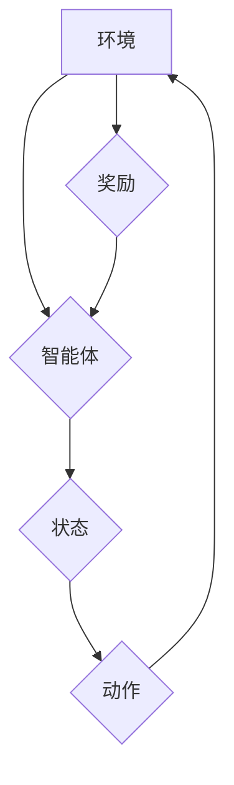

> 强化学习，RL，Markov决策过程，Q学习，深度强化学习，环境，代理，奖励，策略

## 1. 背景介绍

在人工智能领域，强化学习 (Reinforcement Learning, RL) 作为一种重要的机器学习范式，近年来取得了显著进展，并在许多应用领域展现出强大的潜力。与监督学习和无监督学习不同，强化学习的核心在于训练一个智能体 (agent) 在与环境交互的过程中，通过不断尝试和学习，最终找到最优的策略来最大化累积奖励。

强化学习的应用场景广泛，包括游戏、机器人控制、推荐系统、自动驾驶等。例如，AlphaGo 通过强化学习战胜了世界围棋冠军，自动驾驶汽车也利用强化学习技术进行路径规划和决策。

## 2. 核心概念与联系

**2.1 核心概念**

* **环境 (Environment):** 强化学习系统中的外部世界，它提供给智能体感知信息和反馈。
* **智能体 (Agent):** 学习和决策的实体，它与环境交互，并根据环境反馈调整策略。
* **状态 (State):** 环境在特定时刻的描述，它代表着环境的当前情况。
* **动作 (Action):** 智能体可以采取的行动，它会改变环境的状态。
* **奖励 (Reward):** 环境对智能体采取的动作给予的反馈，它可以是正向的或负向的，用于指导智能体的学习。
* **策略 (Policy):** 智能体在不同状态下采取动作的概率分布，它决定了智能体如何行为。

**2.2  Markov决策过程 (MDP)**

强化学习的核心模型是Markov决策过程 (MDP)，它描述了智能体与环境交互的过程。MDP 由以下要素组成：

* 状态空间 (S)：所有可能的环境状态。
* 动作空间 (A)：智能体可以采取的所有动作。
* 转移概率 (P)：从一个状态到另一个状态的概率，取决于智能体采取的动作。
* 奖励函数 (R)：环境对智能体采取的动作给予的奖励。

**2.3  流程图**



## 3. 核心算法原理 & 具体操作步骤

**3.1  算法原理概述**

Q学习是一种经典的强化学习算法，它通过学习一个Q表来估计在每个状态下采取每个动作的期望回报。Q表是一个表格，其中每个单元格存储了在特定状态下采取特定动作的期望回报。

**3.2  算法步骤详解**

1. 初始化Q表，将所有单元格的值设置为0。
2. 在环境中随机选择一个状态。
3. 在当前状态下随机选择一个动作。
4. 执行动作，观察环境的反馈，包括下一个状态和奖励。
5. 更新Q表：

```
Q(s, a) = Q(s, a) + α * [r + γ * max(Q(s', a')) - Q(s, a)]
```

其中：

* Q(s, a) 是当前状态s下采取动作a的期望回报。
* α 是学习率，控制着学习速度。
* r 是从当前状态到下一个状态的奖励。
* γ 是折扣因子，控制着未来奖励的权重。
* s' 是下一个状态。
* a' 是下一个状态下采取的动作，选择动作a'时，选择最大期望回报的动作。

6. 重复步骤2-5，直到Q表收敛。

**3.3  算法优缺点**

* **优点:**

    * 算法简单易懂，易于实现。
    * 可以应用于离散状态和动作空间的问题。

* **缺点:**

    * 对于连续状态和动作空间的问题，Q表会变得非常庞大，难以存储和更新。
    * 算法的性能依赖于学习率和折扣因子的选择。

**3.4  算法应用领域**

* 游戏
* 机器人控制
* 自动驾驶
* 推荐系统

## 4. 数学模型和公式 & 详细讲解 & 举例说明

**4.1  数学模型构建**

强化学习的数学模型可以表示为一个马尔可夫决策过程 (MDP)，它由以下要素组成：

* 状态空间 S：所有可能的环境状态的集合。
* 动作空间 A：智能体可以采取的所有动作的集合。
* 转移概率 P：从一个状态到另一个状态的概率，取决于智能体采取的动作。
* 奖励函数 R：环境对智能体采取的动作给予的奖励。

**4.2  公式推导过程**

Q学习算法的目标是学习一个策略 π，使得智能体在与环境交互的过程中，累积的奖励最大化。策略 π 可以表示为一个状态-动作值函数 Q，它估计在每个状态下采取每个动作的期望回报。

Q学习算法的更新规则如下：

```
Q(s, a) = Q(s, a) + α * [r + γ * max(Q(s', a')) - Q(s, a)]
```

其中：

* Q(s, a) 是当前状态s下采取动作a的期望回报。
* α 是学习率，控制着学习速度。
* r 是从当前状态到下一个状态的奖励。
* γ 是折扣因子，控制着未来奖励的权重。
* s' 是下一个状态。
* a' 是下一个状态下采取的动作，选择动作a'时，选择最大期望回报的动作。

**4.3  案例分析与讲解**

假设有一个智能体在玩一个简单的游戏，游戏中有两种状态： "开始" 和 "结束"，智能体可以采取两种动作： "前进" 和 "后退"。

* 从 "开始" 状态出发，采取 "前进" 动作，奖励为 1，进入 "结束" 状态。
* 从 "开始" 状态出发，采取 "后退" 动作，奖励为 -1，回到 "开始" 状态。
* 从 "结束" 状态出发，无论采取什么动作，奖励为 0。

使用 Q学习算法，我们可以训练智能体学习在不同状态下采取最佳动作，最终达到 "结束" 状态并获得最大奖励。

## 5. 项目实践：代码实例和详细解释说明

**5.1  开发环境搭建**

* Python 3.x
* TensorFlow 或 PyTorch

**5.2  源代码详细实现**

```python
import numpy as np

# 定义状态空间和动作空间
states = ['start', 'end']
actions = ['forward', 'backward']

# 初始化 Q 表
Q = np.zeros((len(states), len(actions)))

# 设置学习参数
alpha = 0.1
gamma = 0.9

# 训练过程
for episode in range(1000):
    current_state = 'start'
    while current_state != 'end':
        # 选择动作
        action = np.argmax(Q[states.index(current_state)])

        # 执行动作，观察奖励和下一个状态
        next_state, reward = get_next_state_and_reward(current_state, action)

        # 更新 Q 表
        Q[states.index(current_state), actions.index(action)] = Q[states.index(current_state), actions.index(action)] + alpha * (reward + gamma * np.max(Q[states.index(next_state)]) - Q[states.index(current_state), actions.index(action)])

        # 更新当前状态
        current_state = next_state

# 打印最终的 Q 表
print(Q)
```

**5.3  代码解读与分析**

* 代码首先定义了状态空间和动作空间。
* 然后初始化 Q 表，将所有单元格的值设置为 0。
* 训练过程使用一个循环，模拟智能体与环境交互的过程。
* 在每个时间步，智能体根据 Q 表选择动作，执行动作，观察奖励和下一个状态。
* 根据 Q 学习算法的更新规则，更新 Q 表的值。
* 训练结束后，打印最终的 Q 表。

**5.4  运行结果展示**

运行代码后，会输出一个 Q 表，其中每个单元格的值代表了在特定状态下采取特定动作的期望回报。

## 6. 实际应用场景

**6.1  游戏**

强化学习在游戏领域取得了显著成果，例如 AlphaGo、AlphaZero 等程序通过强化学习技术战胜了世界冠军。

**6.2  机器人控制**

强化学习可以用于训练机器人控制策略，例如让机器人学会行走、抓取物体等。

**6.3  推荐系统**

强化学习可以用于个性化推荐，例如推荐用户可能感兴趣的商品或内容。

**6.4  未来应用展望**

强化学习在未来将有更广泛的应用，例如自动驾驶、医疗诊断、金融交易等。

## 7. 工具和资源推荐

**7.1  学习资源推荐**

* 强化学习：强化学习算法与应用 (Sutton & Barto)
* 深度强化学习 (Deep Reinforcement Learning)
* 强化学习入门 (Reinforcement Learning for Beginners)

**7.2  开发工具推荐**

* TensorFlow
* PyTorch
* OpenAI Gym

**7.3  相关论文推荐**

* Deep Q-Network (DQN)
* Proximal Policy Optimization (PPO)
* Trust Region Policy Optimization (TRPO)

## 8. 总结：未来发展趋势与挑战

**8.1  研究成果总结**

近年来，强化学习取得了显著进展，例如深度强化学习的出现，使得强化学习能够应用于更复杂的任务。

**8.2  未来发展趋势**

* 更高效的强化学习算法
* 适用于连续状态和动作空间的强化学习算法
* 结合其他机器学习技术的强化学习算法

**8.3  面临的挑战**

* 训练强化学习模型需要大量的计算资源和时间。
* 强化学习模型的解释性和可解释性较差。
* 强化学习模型在现实世界中的应用面临安全性和可靠性挑战。

**8.4  研究展望**

未来，强化学习的研究将继续朝着更有效、更通用、更安全的方向发展。


## 9. 附录：常见问题与解答

**9.1  Q学习和SARSA的区别？**

Q学习和SARSA都是经典的强化学习算法，但它们在策略更新的方式上有所不同。Q学习使用的是贪婪策略，即在更新 Q 值时，选择动作a'时，选择最大期望回报的动作，而SARSA则使用的是当前策略，即在更新 Q 值时，选择动作a'时，选择当前策略下采取的动作。

**9.2  强化学习的学习率和折扣因子如何设置？**

学习率控制着学习速度，折扣因子控制着未来奖励的权重。学习率过大可能会导致学习不稳定，折扣因子过大可能会导致模型过于关注长期奖励，而忽略短期奖励。

**9.3  强化学习的应用场景有哪些？**

强化学习的应用场景广泛，包括游戏、机器人控制、自动驾驶、推荐系统等。


作者：禅与计算机程序设计艺术 / Zen and the Art of Computer Programming 
<end_of_turn>