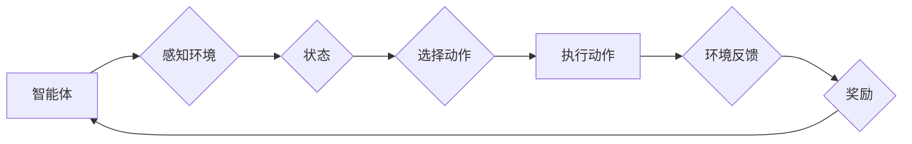

> 强化学习，机器人技术，深度学习，强化信号，状态空间，动作空间，奖励函数，策略梯度，Q学习，SARSA

## 1. 背景介绍

机器人技术作为人工智能领域的重要分支，一直致力于开发能够感知、理解和交互于环境的智能机器。近年来，随着深度学习技术的飞速发展，机器人技术取得了显著进步，例如自动驾驶、工业机器人、服务机器人等领域都取得了突破性进展。然而，传统的机器学习方法在处理复杂、动态环境下的机器人控制问题时仍然存在局限性。

强化学习 (Reinforcement Learning, RL) 作为一种基于交互学习的机器学习方法，为解决机器人技术中的复杂控制问题提供了新的思路。强化学习的核心思想是通过在环境中与环境交互，学习一个策略，使得机器人能够在环境中取得最大的累积奖励。

## 2. 核心概念与联系

强化学习的核心概念包括：

* **智能体 (Agent):**  执行动作并与环境交互的实体，例如机器人。
* **环境 (Environment):** 智能体所处的外部世界，包括状态和奖励。
* **状态 (State):** 环境的当前描述，例如机器人的位置、速度、传感器读数等。
* **动作 (Action):** 智能体可以执行的操作，例如移动、抓取、旋转等。
* **奖励 (Reward):** 环境对智能体动作的反馈，可以是正向奖励或负向奖励。
* **策略 (Policy):**  智能体根据当前状态选择动作的规则，可以是确定性策略或概率性策略。

**强化学习流程图:**



## 3. 核心算法原理 & 具体操作步骤

### 3.1  算法原理概述

强化学习算法的目标是学习一个能够使智能体在环境中获得最大累积奖励的策略。常用的强化学习算法包括：

* **Q学习:**  Q学习是一种基于价值函数的强化学习算法，它学习一个状态-动作价值函数 Q(s, a)，表示在状态 s 下执行动作 a 的预期累积奖励。
* **SARSA:** SARSA 是一种基于策略的强化学习算法，它学习一个策略 π(s)，表示在状态 s 下选择动作 a 的概率。

### 3.2  算法步骤详解

**Q学习算法步骤:**

1. 初始化状态-动作价值函数 Q(s, a) 为 0。
2. 在环境中与环境交互，根据当前状态 s 选择动作 a。
3. 执行动作 a，观察环境反馈，获得下一个状态 s' 和奖励 r。
4. 更新状态-动作价值函数 Q(s, a) 为：

```
Q(s, a) = Q(s, a) + α [r + γ max Q(s', a') - Q(s, a)]
```

其中：

* α 是学习率，控制着学习速度。
* γ 是折扣因子，控制着未来奖励的权重。
* max Q(s', a') 是在下一个状态 s' 下所有动作的价值函数的最大值。

5. 重复步骤 2-4，直到策略收敛。

**SARSA算法步骤:**

1. 初始化策略 π(s) 为随机策略。
2. 在环境中与环境交互，根据当前策略 π(s) 选择动作 a。
3. 执行动作 a，观察环境反馈，获得下一个状态 s' 和奖励 r。
4. 根据策略 π(s') 选择下一个动作 a'。
5. 更新策略 π(s, a) 为：

```
π(s, a) = π(s, a) + α [r + γ π(s', a') - π(s, a)]
```

6. 重复步骤 2-5，直到策略收敛。

### 3.3  算法优缺点

**Q学习:**

* **优点:** 能够学习最优策略，适用于离散状态和动作空间。
* **缺点:** 需要探索所有状态和动作，学习过程可能较慢。

**SARSA:**

* **优点:** 能够学习在线策略，适用于连续状态和动作空间。
* **缺点:** 可能无法学习最优策略，容易陷入局部最优。

### 3.4  算法应用领域

强化学习算法广泛应用于机器人技术领域，例如：

* **机器人控制:**  学习机器人运动控制策略，例如导航、抓取、避障等。
* **机器人规划:**  学习机器人任务规划策略，例如路径规划、运动规划等。
* **机器人学习:**  学习机器人新的技能和知识，例如模仿学习、逆强化学习等。

## 4. 数学模型和公式 & 详细讲解 & 举例说明

### 4.1  数学模型构建

强化学习的核心数学模型是状态-动作价值函数 (State-Action Value Function)，它表示在状态 s 下执行动作 a 的预期累积奖励。

* **Q函数:**  Q(s, a) 表示在状态 s 下执行动作 a 的预期累积奖励。

### 4.2  公式推导过程

Q学习算法的更新公式如下：

```
Q(s, a) = Q(s, a) + α [r + γ max Q(s', a') - Q(s, a)]
```

其中：

* α 是学习率，控制着学习速度。
* γ 是折扣因子，控制着未来奖励的权重。
* r 是当前状态下获得的奖励。
* s' 是下一个状态。
* a' 是在下一个状态下执行的动作。

该公式表示，状态-动作价值函数 Q(s, a) 的更新等于当前 Q(s, a) 值加上学习率 α 乘以奖励 r 和未来奖励的折扣 γ 倍的期望值。

### 4.3  案例分析与讲解

假设一个机器人需要学习在迷宫中找到出口。

* 状态空间：迷宫中的所有位置。
* 动作空间：向上、向下、向左、向右四个方向。
* 奖励函数：到达出口时获得最大奖励，迷宫中其他位置获得零奖励。

使用 Q学习算法，机器人可以学习每个位置执行每个动作的预期累积奖励。通过不断地探索迷宫，机器人会更新 Q 函数，最终学习到最优策略，即找到到达出口的最短路径。

## 5. 项目实践：代码实例和详细解释说明

### 5.1  开发环境搭建

* Python 3.x
* TensorFlow 或 PyTorch 深度学习框架
* OpenAI Gym 机器人仿真环境

### 5.2  源代码详细实现

```python
import gym
import numpy as np

# 定义 Q 函数
Q = np.zeros((env.observation_space.n, env.action_space.n))

# 设置超参数
alpha = 0.1
gamma = 0.99

# 训练循环
for episode in range(1000):
    state = env.reset()
    done = False

    while not done:
        # 选择动作
        action = np.argmax(Q[state, :])

        # 执行动作
        next_state, reward, done, _ = env.step(action)

        # 更新 Q 函数
        Q[state, action] = Q[state, action] + alpha * (reward + gamma * np.max(Q[next_state, :]) - Q[state, action])

        # 更新状态
        state = next_state

# 测试策略
state = env.reset()
while True:
    action = np.argmax(Q[state, :])
    state, reward, done, _ = env.step(action)
    env.render()
    if done:
        break
```

### 5.3  代码解读与分析

* 代码首先定义 Q 函数，并初始化为零。
* 然后设置学习率 α 和折扣因子 γ。
* 训练循环中，机器人从初始状态开始，不断地执行动作，观察环境反馈，并更新 Q 函数。
* 选择动作时，使用贪婪策略，选择 Q 函数值最大的动作。
* 测试阶段，使用训练好的 Q 函数，执行最优策略，并渲染环境。

### 5.4  运行结果展示

运行代码后，机器人将在迷宫中学习并最终找到出口。

## 6. 实际应用场景

强化学习在机器人技术中的应用场景非常广泛，例如：

* **自动驾驶:**  学习驾驶策略，例如路径规划、车速控制、避障等。
* **工业机器人:**  学习执行复杂任务的策略，例如焊接、喷漆、装配等。
* **服务机器人:**  学习与人类交互的策略，例如导航、对话、任务执行等。

### 6.4  未来应用展望

随着深度学习和强化学习技术的不断发展，强化学习在机器人技术中的应用将更加广泛和深入。未来，强化学习可能用于：

* **自主导航:**  开发能够自主导航的机器人，例如无人驾驶汽车、无人机等。
* **复杂任务规划:**  学习执行复杂任务的策略，例如手术机器人、灾害救援机器人等。
* **机器人学习:**  开发能够学习新技能和知识的机器人，例如模仿学习、逆强化学习等。

## 7. 工具和资源推荐

### 7.1  学习资源推荐

* **书籍:**
    * Reinforcement Learning: An Introduction by Richard S. Sutton and Andrew G. Barto
    * Deep Reinforcement Learning Hands-On by Maxim Lapan
* **在线课程:**
    * Coursera: Reinforcement Learning Specialization by David Silver
    * Udacity: Deep Reinforcement Learning Nanodegree

### 7.2  开发工具推荐

* **OpenAI Gym:**  机器人仿真环境
* **TensorFlow:**  深度学习框架
* **PyTorch:**  深度学习框架

### 7.3  相关论文推荐

* Deep Q-Network (DQN)
* Proximal Policy Optimization (PPO)
* Trust Region Policy Optimization (TRPO)

## 8. 总结：未来发展趋势与挑战

### 8.1  研究成果总结

强化学习在机器人技术领域取得了显著进展，例如自动驾驶、工业机器人、服务机器人等领域都取得了突破性进展。

### 8.2  未来发展趋势

未来，强化学习在机器人技术中的应用将更加广泛和深入，例如自主导航、复杂任务规划、机器人学习等。

### 8.3  面临的挑战

强化学习在机器人技术中的应用仍然面临一些挑战，例如：

* **数据效率:** 强化学习算法通常需要大量的训练数据，而收集机器人训练数据成本高昂。
* **安全性和可靠性:** 强化学习算法的决策过程可能不可解释，难以保证安全性和可靠性。
* **复杂环境适应性:** 强化学习算法难以适应复杂、动态变化的环境。

### 8.4  研究展望

未来研究方向包括：

* **提高数据效率:**  开发新的强化学习算法，能够利用少量的训练数据学习有效策略。
* **增强安全性和可靠性:**  开发可解释的强化学习算法，并设计安全机制，保证机器人决策的安全性和可靠性。
* **提高复杂环境适应性:**  开发能够适应复杂、动态变化环境的强化学习算法。

## 9. 附录：常见问题与解答

**Q1: 强化学习与监督学习的区别是什么？**

**A1:** 强化学习是一种基于交互学习的机器学习方法，它通过与环境交互，学习一个策略，使得智能体能够在环境中取得最大的累积奖励。而监督学习是一种基于标注数据的机器学习方法，它通过学习训练数据中的输入输出关系，预测新的输入的输出。

**Q2: 强化学习算法有哪些？**

**A2:** 常用的强化学习算法包括 Q学习、SARSA、Deep Q-Network (DQN)、Proximal Policy Optimization (PPO) 等。

**Q3: 强化学习在机器人技术中的应用有哪些？**

**A3:** 强化学习在机器人技术中的应用非常广泛，例如自动驾驶、工业机器人、服务机器人等。

**作者：禅与计算机程序设计艺术 / Zen and the Art of Computer Programming**


<end_of_turn>