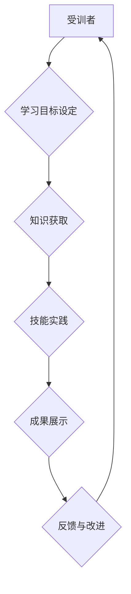

> 技术培训，培训者，受训者，知识传递，教学方法，实践应用，学习策略，技术社区

## 1. 背景介绍

在当今科技日新月异的时代，技术培训已成为个人成长和企业发展的关键驱动力。无论是初入职场的新人，还是经验丰富的技术专家，都需要不断学习新知识、掌握新技能，以适应不断变化的市场需求。然而，传统的技术培训模式往往存在着一些弊端，例如缺乏互动性、理论性过强、与实际应用脱节等。因此，如何有效提升技术培训的质量，激发受训者的学习热情，并将其转化为实际应用能力，成为一个亟待解决的问题。

## 2. 核心概念与联系

技术培训的核心在于知识的传递和技能的提升。培训者需要具备扎实的专业知识和丰富的教学经验，能够将复杂的技术概念以易于理解的方式传授给受训者。受训者则需要具备积极主动的学习态度，能够认真聆听、积极思考、并尝试将所学知识应用到实际项目中。

**培训流程图:**

## 3. 核心算法原理 & 具体操作步骤

### 3.1  算法原理概述

在技术培训中，算法原理的讲解是至关重要的。培训者需要能够清晰地解释算法的逻辑、步骤和时间复杂度，帮助受训者理解算法的本质和应用场景。

### 3.2  算法步骤详解

对于复杂的算法，培训者需要将其分解成一个个小的步骤，并用图示、代码示例等方式进行详细讲解。受训者可以通过逐步理解算法的步骤，逐步掌握算法的实现方法。

### 3.3  算法优缺点

在讲解算法时，培训者需要同时分析算法的优缺点，帮助受训者了解算法的适用范围和局限性。

### 3.4  算法应用领域

培训者需要将算法与实际应用场景相结合，帮助受训者理解算法的价值和意义。

## 4. 数学模型和公式 & 详细讲解 & 举例说明

在某些技术领域，例如机器学习、数据科学等，数学模型和公式是不可或缺的。培训者需要能够清晰地解释数学模型的含义，并用具体的例子进行讲解。

### 4.1  数学模型构建

培训者需要引导受训者理解数学模型的构建过程，例如如何选择合适的变量、如何建立数学关系等。

### 4.2  公式推导过程

对于复杂的公式，培训者需要逐步推导公式的推导过程，帮助受训者理解公式的由来和含义。

### 4.3  案例分析与讲解

培训者需要用实际案例来解释数学模型和公式的应用，帮助受训者理解其在实际场景中的作用。

## 5. 项目实践：代码实例和详细解释说明

实践是检验真理的唯一标准。培训者需要设计一些实践项目，让受训者能够将所学知识应用到实际项目中，并通过实践来巩固学习成果。

### 5.1  开发环境搭建

培训者需要指导受训者搭建开发环境，例如安装软件、配置环境变量等。

### 5.2  源代码详细实现

培训者需要提供完整的源代码示例，并逐行解释代码的含义，帮助受训者理解代码的逻辑和结构。

### 5.3  代码解读与分析

培训者需要引导受训者进行代码解读和分析，例如分析代码的执行流程、识别代码中的关键逻辑等。

### 5.4  运行结果展示

培训者需要指导受训者运行代码，并解释运行结果的含义，帮助受训者验证代码的正确性。

## 6. 实际应用场景

培训者需要将技术知识与实际应用场景相结合，帮助受训者理解技术在实际应用中的价值和意义。

### 6.4  未来应用展望

培训者需要引导受训者思考技术的未来发展趋势，并探讨技术的未来应用场景。

## 7. 工具和资源推荐

培训者需要推荐一些学习资源、开发工具和相关论文，帮助受训者进一步深入学习和探索。

### 7.1  学习资源推荐

培训者可以推荐一些在线课程、书籍、博客等学习资源，帮助受训者掌握更深入的技术知识。

### 7.2  开发工具推荐

培训者可以推荐一些常用的开发工具，例如代码编辑器、调试工具、版本控制系统等，帮助受训者提高开发效率。

### 7.3  相关论文推荐

培训者可以推荐一些相关的学术论文，帮助受训者了解最新的技术研究成果。

## 8. 总结：未来发展趋势与挑战

### 8.1  研究成果总结

培训者需要总结本次培训的成果，例如受训者的学习效果、培训内容的优缺点等。

### 8.2  未来发展趋势

培训者需要展望技术培训的未来发展趋势，例如人工智能、虚拟现实等新技术的应用。

### 8.3  面临的挑战

培训者需要分析技术培训面临的挑战，例如知识更新速度快、培训成本高等。

### 8.4  研究展望

培训者需要提出未来技术培训的研究方向，例如如何提高培训的互动性和个性化程度等。

## 9. 附录：常见问题与解答

培训者可以收集一些常见问题，并提供相应的解答，帮助受训者解决学习过程中遇到的问题。

作者：禅与计算机程序设计艺术 / Zen and the Art of Computer Programming 
<end_of_turn>