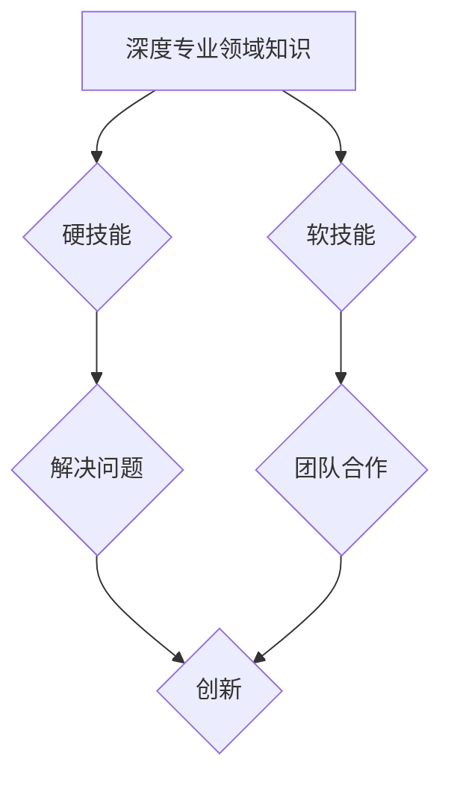

> 技术技能，硬技能，软技能，专业领域知识，深度学习，人工智能，软件开发，项目管理，职业发展

## 1. 背景介绍

在当今瞬息万变的科技时代，技术技能显得尤为重要。无论是软件开发、数据分析、人工智能还是云计算，都需要具备扎实的技术基础才能在竞争激烈的市场中脱颖而出。然而，仅仅拥有技术技能还不够，深度的专业领域知识才是你真正的看家本领。

近年来，"硬技能"和"软技能"的讨论日益频繁。硬技能是指具体的、可量化的技能，例如编程语言、数据库管理、数据结构等。而软技能则指的是更抽象、更难以量化的技能，例如沟通能力、团队合作、解决问题的能力等。

许多人认为，在当今科技行业，硬技能比软技能更重要。的确，掌握最新的技术和工具是必不可少的，但仅仅依靠硬技能是远远不够的。深度专业领域知识能够帮助你更深入地理解技术，更好地解决问题，并最终取得更大的成功。

## 2. 核心概念与联系

**2.1 深度专业领域知识**

深度专业领域知识是指在某个特定领域拥有深入的理解和掌握，能够独立思考、解决问题，并做出创新性的贡献。它不仅仅是掌握表面上的知识，更重要的是理解知识背后的原理和逻辑，并能够将其应用于实际问题中。

**2.2 硬技能与软技能的协同作用**

硬技能和软技能并非相互排斥，而是相互补充、协同作用的。硬技能是实现目标的工具，而软技能是使用这些工具的智慧。

* **硬技能**为我们提供解决问题的工具和方法，而**软技能**则帮助我们更好地理解问题、与他人合作、沟通交流和管理项目。

* **硬技能**可以帮助我们快速学习新技术，而**软技能**则帮助我们更好地应用这些技术，并将其转化为实际价值。

**2.3 深度专业领域知识的构建**

构建深度专业领域知识需要持续学习、实践和反思。

* **持续学习:** 关注行业最新动态，阅读专业书籍和论文，参加技术研讨会和培训课程。
* **实践应用:** 将所学知识应用于实际项目中，不断积累经验，并从中总结和反思。
* **反思总结:** 定期回顾自己的学习和实践成果，发现不足之处，并制定改进计划。

**2.4 Mermaid 流程图**

## 3. 核心算法原理 & 具体操作步骤

**3.1 算法原理概述**

选择一个具体的算法，例如快速排序算法，并对其原理进行概述。

**3.2 算法步骤详解**

详细描述快速排序算法的步骤，包括选择主元、划分数组、递归排序等操作。

**3.3 算法优缺点**

分析快速排序算法的优缺点，例如时间复杂度、空间复杂度、稳定性等。

**3.4 算法应用领域**

介绍快速排序算法在实际应用中的场景，例如数据排序、查找等。

## 4. 数学模型和公式 & 详细讲解 & 举例说明

**4.1 数学模型构建**

构建一个数学模型来描述算法的运行过程，例如使用时间复杂度公式来描述快速排序算法的时间复杂度。

**4.2 公式推导过程**

详细推导数学模型中的公式，并解释公式的含义。

**4.3 案例分析与讲解**

通过一个具体的例子来分析和讲解数学模型的应用。

## 5. 项目实践：代码实例和详细解释说明

**5.1 开发环境搭建**

介绍项目开发所需的工具和环境，例如编程语言、IDE、库等。

**5.2 源代码详细实现**

提供快速排序算法的源代码，并进行详细的注释和解释。

**5.3 代码解读与分析**

对代码进行解读和分析，解释代码的逻辑和功能。

**5.4 运行结果展示**

展示快速排序算法的运行结果，并进行分析和比较。

## 6. 实际应用场景

**6.1 数据排序**

介绍快速排序算法在数据排序中的应用场景，例如数据库索引、搜索引擎排名等。

**6.2 查找操作**

介绍快速排序算法在查找操作中的应用场景，例如二分查找等。

**6.3 其他应用场景**

介绍快速排序算法在其他领域的应用场景，例如机器学习、图像处理等。

**6.4 未来应用展望**

展望快速排序算法在未来应用的趋势和发展方向。

## 7. 工具和资源推荐

**7.1 学习资源推荐**

推荐一些学习算法和数据结构的书籍、网站和课程。

**7.2 开发工具推荐**

推荐一些用于开发和测试算法的工具和 IDE。

**7.3 相关论文推荐**

推荐一些关于快速排序算法的论文和研究成果。

## 8. 总结：未来发展趋势与挑战

**8.1 研究成果总结**

总结快速排序算法的研究成果和发展历程。

**8.2 未来发展趋势**

展望快速排序算法的未来发展趋势，例如并行排序、分布式排序等。

**8.3 面临的挑战**

分析快速排序算法面临的挑战，例如数据规模的增长、算法效率的提升等。

**8.4 研究展望**

展望未来对快速排序算法的研究方向和展望。

## 9. 附录：常见问题与解答

解答一些关于快速排序算法的常见问题，例如时间复杂度、空间复杂度、稳定性等。

作者：禅与计算机程序设计艺术 / Zen and the Art of Computer Programming 
<end_of_turn>