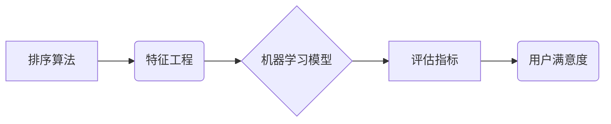

> 智能排序，用户满意度，算法优化，机器学习，推荐系统，数据结构，性能评估，用户体验

## 1. 背景介绍

在当今数据爆炸的时代，信息获取和处理效率已成为至关重要的竞争力。智能排序技术作为信息检索和推荐的核心技术，在搜索引擎、电商平台、社交媒体等领域发挥着至关重要的作用。用户对排序结果的满意度直接影响着他们的使用体验和平台粘性。因此，深入研究智能排序技术的用户满意度，并探索提升用户满意度的有效方法，对于提升平台竞争力和用户价值至关重要。

传统的排序算法主要基于规则和启发式策略，例如基于关键词匹配、TF-IDF算法、PageRank算法等。然而，这些算法难以适应用户个性化需求和动态变化的信息环境。随着机器学习技术的快速发展，智能排序技术逐渐成为主流趋势。基于机器学习的排序算法能够学习用户行为模式和偏好，并根据用户历史数据、上下文信息等进行个性化排序，从而提升用户满意度。

## 2. 核心概念与联系

智能排序技术的核心概念包括：

* **排序算法**: 用于对数据进行排列的算法，例如基于规则的排序算法、基于机器学习的排序算法等。
* **特征工程**: 从原始数据中提取用于排序的特征，例如用户行为特征、商品属性特征、文本内容特征等。
* **机器学习模型**: 用于学习用户偏好和排序规则的机器学习模型，例如线性回归模型、支持向量机模型、深度学习模型等。
* **评估指标**: 用于衡量排序结果质量的指标，例如NDCG、MAP、Precision@K等。

**核心概念架构图:**



## 3. 核心算法原理 & 具体操作步骤

### 3.1  算法原理概述

基于机器学习的排序算法通常采用以下原理：

* **学习用户偏好**: 通过分析用户历史行为数据，例如点击、购买、收藏等，学习用户的兴趣偏好和排序规则。
* **特征表示**: 将用户和物品信息转换为机器学习模型可以理解的特征向量，例如用户年龄、性别、购买历史、商品价格、类别等。
* **排序模型训练**: 使用训练数据训练机器学习模型，学习用户偏好和排序规则。
* **排序预测**: 将新的用户请求和物品信息作为输入，使用训练好的模型预测排序结果。

### 3.2  算法步骤详解

**基于深度学习的排序算法步骤:**

1. **数据预处理**: 收集用户行为数据、商品信息等数据，并进行清洗、转换、特征工程等预处理操作。
2. **模型构建**: 选择合适的深度学习模型，例如深度神经网络、Transformer等，并根据任务需求进行模型设计和参数设置。
3. **模型训练**: 使用训练数据训练深度学习模型，并使用交叉验证等方法进行模型评估和调参。
4. **模型部署**: 将训练好的模型部署到线上环境，并进行实时排序预测。

### 3.3  算法优缺点

**优点**:

* **个性化排序**: 可以根据用户的个性化需求进行排序，提升用户体验。
* **动态适应**: 可以根据用户行为和数据变化动态调整排序规则，保持排序结果的有效性。
* **高准确率**: 深度学习模型能够学习复杂的排序规则，实现更高的排序准确率。

**缺点**:

* **数据依赖**: 需要大量的用户行为数据进行训练，否则模型效果会下降。
* **计算复杂度**: 深度学习模型训练和预测过程计算复杂度高，需要强大的计算资源支持。
* **可解释性差**: 深度学习模型的决策过程较为复杂，难以解释模型的排序结果。

### 3.4  算法应用领域

基于机器学习的排序算法广泛应用于以下领域:

* **搜索引擎**: 根据用户搜索关键词和历史行为，提供个性化搜索结果。
* **电商平台**: 根据用户浏览历史、购买记录等信息，推荐相关商品。
* **社交媒体**: 根据用户兴趣和好友关系，推荐相关内容和用户。
* **新闻推荐**: 根据用户阅读偏好，推荐相关新闻资讯。

## 4. 数学模型和公式 & 详细讲解 & 举例说明

### 4.1  数学模型构建

基于深度学习的排序算法通常采用以下数学模型:

* **深度神经网络**: 使用多层神经网络结构，学习用户偏好和排序规则。
* **Transformer**: 使用注意力机制，学习用户和物品之间的关系，实现更精准的排序。

### 4.2  公式推导过程

深度神经网络的训练过程主要基于反向传播算法，其核心公式包括:

* **损失函数**: 用于衡量模型预测结果与真实结果之间的差异，例如交叉熵损失函数。
* **梯度下降**: 用于更新模型参数，使其朝着降低损失函数的方向进行调整。

### 4.3  案例分析与讲解

假设我们有一个电商平台，需要根据用户历史购买记录推荐商品。我们可以使用深度神经网络模型进行排序。

* **输入特征**: 用户ID、商品ID、用户购买历史、商品属性等。
* **模型结构**: 使用多层神经网络结构，例如两层全连接层和一层输出层。
* **损失函数**: 使用交叉熵损失函数，衡量模型预测结果与用户实际购买行为之间的差异。
* **梯度下降**: 使用随机梯度下降算法，更新模型参数，使其能够更好地预测用户购买行为。

## 5. 项目实践：代码实例和详细解释说明

### 5.1  开发环境搭建

* **操作系统**: Ubuntu 20.04
* **编程语言**: Python 3.8
* **深度学习框架**: TensorFlow 2.0
* **其他工具**: Jupyter Notebook、Git

### 5.2  源代码详细实现

```python
import tensorflow as tf

# 定义模型结构
model = tf.keras.Sequential([
    tf.keras.layers.Dense(64, activation='relu', input_shape=(10,)),
    tf.keras.layers.Dense(32, activation='relu'),
    tf.keras.layers.Dense(1, activation='sigmoid')
])

# 定义损失函数和优化器
model.compile(loss='binary_crossentropy', optimizer='adam', metrics=['accuracy'])

# 训练模型
model.fit(x_train, y_train, epochs=10, batch_size=32)

# 评估模型
loss, accuracy = model.evaluate(x_test, y_test)
print('Loss:', loss)
print('Accuracy:', accuracy)
```

### 5.3  代码解读与分析

* **模型结构**: 使用两层全连接层和一层输出层构建深度神经网络模型。
* **激活函数**: 使用ReLU激活函数，提高模型的非线性表达能力。
* **损失函数**: 使用交叉熵损失函数，适合二分类问题。
* **优化器**: 使用Adam优化器，能够快速收敛。
* **训练过程**: 使用训练数据训练模型，并使用验证数据进行模型评估。

### 5.4  运行结果展示

训练完成后，可以评估模型的性能，例如准确率、召回率等。

## 6. 实际应用场景

### 6.1  电商平台商品推荐

基于机器学习的排序算法可以根据用户的浏览历史、购买记录等信息，推荐相关商品，提升用户购物体验。

### 6.2  搜索引擎结果排序

搜索引擎可以根据用户的搜索关键词和历史行为，提供个性化搜索结果，提高搜索效率。

### 6.3  社交媒体内容推荐

社交媒体平台可以根据用户的兴趣和好友关系，推荐相关内容和用户，提升用户粘性。

### 6.4  未来应用展望

随着人工智能技术的不断发展，智能排序技术将应用于更多领域，例如医疗诊断、金融风险评估、教育推荐等。

## 7. 工具和资源推荐

### 7.1  学习资源推荐

* **书籍**:
    * 《深度学习》
    * 《机器学习实战》
* **在线课程**:
    * Coursera: 深度学习
    * Udacity: 机器学习工程师

### 7.2  开发工具推荐

* **深度学习框架**: TensorFlow, PyTorch
* **数据处理工具**: Pandas, NumPy
* **可视化工具**: Matplotlib, Seaborn

### 7.3  相关论文推荐

* **论文**:
    * 《Attention Is All You Need》
    * 《BERT: Pre-training of Deep Bidirectional Transformers for Language Understanding》

## 8. 总结：未来发展趋势与挑战

### 8.1  研究成果总结

智能排序技术取得了显著进展，能够提供个性化、动态、精准的排序结果。

### 8.2  未来发展趋势

* **模型复杂度提升**: 使用更复杂的深度学习模型，例如Transformer、Graph Neural Networks等，提升排序精度。
* **多模态排序**: 将文本、图像、音频等多模态信息融合到排序模型中，实现更全面的用户理解。
* **联邦学习**: 使用联邦学习技术，保护用户隐私的同时进行排序模型训练。

### 8.3  面临的挑战

* **数据隐私**: 如何保护用户隐私数据，同时实现个性化排序，是一个重要的挑战。
* **模型可解释性**: 深度学习模型的决策过程较为复杂，难以解释模型的排序结果，需要进一步研究模型可解释性。
* **公平性**: 排序算法可能存在偏见，导致不公平的结果，需要研究如何构建公平的排序算法。

### 8.4  研究展望

未来，智能排序技术将继续朝着更智能、更公平、更安全的方向发展，为用户提供更优质的体验。

## 9. 附录：常见问题与解答

* **Q1**: 如何评估智能排序算法的性能？
* **A1**: 可以使用NDCG、MAP、Precision@K等指标评估智能排序算法的性能。
* **Q2**: 如何处理缺失数据？
* **A2**: 可以使用插值法、删除缺失数据等方法处理缺失数据。
* **Q3**: 如何防止排序算法出现偏见？
* **A3**: 可以使用公平性度量指标，并进行算法调参，以减少排序算法的偏见。


作者：禅与计算机程序设计艺术 / Zen and the Art of Computer Programming 
<end_of_turn>