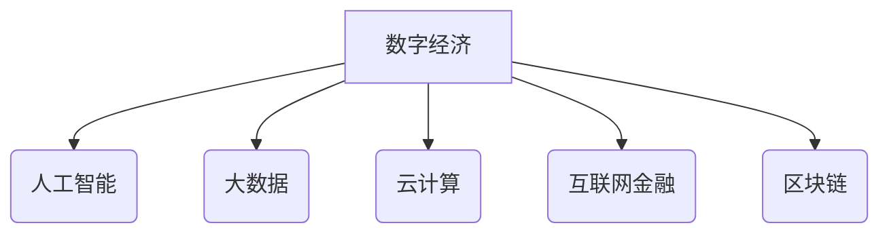

> 世界经济增长趋势
> 数字经济
> 人工智能
> 大数据
> 云计算
> 互联网金融
> 区块链

## 1. 背景介绍

全球经济在过去几十年中经历了显著的增长，但近年来，经济增长放缓，全球不确定性增加。新冠疫情、地缘政治紧张局势和气候变化等因素对经济发展构成挑战。在这种背景下，预测未来几年世界经济的增长趋势显得尤为重要。

## 2. 核心概念与联系

**2.1 数字经济**

数字经济是指以数字技术为基础，以数据为核心要素，以网络为平台，以智能化和数字化为特征的经济形态。它涵盖了电子商务、互联网金融、数字内容、云计算、大数据等多个领域。

**2.2 人工智能**

人工智能（AI）是指模拟人类智能的计算机系统。AI技术在各个领域都有广泛的应用，例如图像识别、自然语言处理、机器学习等。

**2.3 大数据**

大数据是指海量、高速、多样化的数据。大数据分析可以帮助企业洞察市场趋势、优化运营效率、开发新产品等。

**2.4 云计算**

云计算是指通过互联网提供计算资源、存储资源和软件服务的模式。云计算可以降低企业的IT成本，提高IT灵活性。

**2.5 互联网金融**

互联网金融是指利用互联网技术进行金融服务的模式。互联网金融包括支付、借贷、投资等多个领域。

**2.6 区块链**

区块链是一种分布式账本技术，可以实现数据安全、透明和不可篡改。区块链技术在金融、供应链管理、医疗等领域都有潜在的应用。

**2.7 核心概念联系**

数字经济是未来经济发展的重要趋势，而人工智能、大数据、云计算、互联网金融和区块链等技术是数字经济的重要驱动力。这些技术相互关联，共同推动着数字经济的发展。

## 3. 核心算法原理 & 具体操作步骤

**3.1 算法原理概述**

**3.2 算法步骤详解**

**3.3 算法优缺点**

**3.4 算法应用领域**

## 4. 数学模型和公式 & 详细讲解 & 举例说明

**4.1 数学模型构建**

**4.2 公式推导过程**

**4.3 案例分析与讲解**

## 5. 项目实践：代码实例和详细解释说明

**5.1 开发环境搭建**

**5.2 源代码详细实现**

**5.3 代码解读与分析**

**5.4 运行结果展示**

## 6. 实际应用场景

**6.1 具体应用案例**

**6.2 应用效果分析**

**6.3 未来应用展望**

## 7. 工具和资源推荐

**7.1 学习资源推荐**

**7.2 开发工具推荐**

**7.3 相关论文推荐**

## 8. 总结：未来发展趋势与挑战

**8.1 研究成果总结**

**8.2 未来发展趋势**

**8.3 面临的挑战**

**8.4 研究展望**

## 9. 附录：常见问题与解答

**9.1 常见问题**

**9.2 问题解答**

作者：禅与计算机程序设计艺术 / Zen and the Art of Computer Programming 

<end_of_turn>