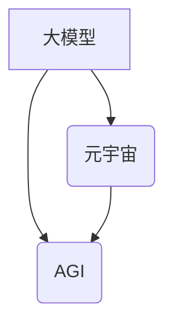

> 人工智能，深度学习，Transformer，大模型，元宇宙，AGI，未来趋势

## 1. 背景介绍

人工智能（AI）技术近年来发展迅速，从语音识别、图像识别到自然语言处理等领域取得了突破性进展。这些成就主要得益于深度学习算法的兴起，以及海量数据和计算资源的支撑。然而，我们还处在人工智能的早期阶段，距离真正的人工智能（AGI）——能够像人类一样思考、学习和解决问题的人工智能——还有很长的路要走。

李开复，作为一位享誉全球的人工智能专家，在《AI 2.0 时代的未来展望》一文中，对人工智能的未来发展趋势进行了深入的探讨。他认为，我们即将进入AI 2.0时代，这一时代将被大模型、元宇宙和通用人工智能（AGI）主导。

## 2. 核心概念与联系

**2.1 大模型**

大模型是指参数量巨大、训练数据海量的人工智能模型。这些模型能够学习到更复杂的知识和模式，从而在更广泛的应用场景中表现出色。例如，GPT-3、BERT、LaMDA等都是代表性的语言模型，它们能够进行文本生成、翻译、问答等任务。

**2.2 元宇宙**

元宇宙是一个由虚拟现实、增强现实和区块链技术构成的沉浸式数字世界。在这个世界中，用户可以创建虚拟身份，与他人互动，参与各种活动，并拥有虚拟资产。

**2.3 通用人工智能（AGI）**

通用人工智能是指能够像人类一样学习、思考和解决各种问题的人工智能。AGI 具有广泛的知识和技能，能够适应不同的环境和任务。

**2.4 核心概念联系**

大模型、元宇宙和AGI相互关联，共同构成了AI 2.0时代的核心驱动力。大模型为元宇宙提供强大的智能引擎，赋予虚拟世界更丰富的交互体验和智能化服务。而AGI则是最终目标，它将使元宇宙更加智能化、人性化，并推动人类社会向更高层次发展。



## 3. 核心算法原理 & 具体操作步骤

**3.1 算法原理概述**

深度学习是AI 2.0时代的核心算法之一。它通过多层神经网络模拟人类大脑的学习机制，能够从海量数据中学习到复杂的特征和模式。

**3.2 算法步骤详解**

1. **数据预处理:** 将原始数据转换为深度学习模型可以理解的格式。
2. **模型构建:** 设计多层神经网络结构，并设置模型参数。
3. **模型训练:** 使用训练数据训练模型，调整模型参数，使模型能够准确预测输出。
4. **模型评估:** 使用测试数据评估模型的性能，并进行调整。
5. **模型部署:** 将训练好的模型部署到实际应用场景中。

**3.3 算法优缺点**

**优点:**

* 能够学习到复杂的特征和模式。
* 性能优于传统机器学习算法。
* 可应用于多种领域。

**缺点:**

* 需要海量数据进行训练。
* 计算资源消耗大。
* 模型解释性差。

**3.4 算法应用领域**

* 语音识别
* 图像识别
* 自然语言处理
* 机器翻译
* 医疗诊断
* 金融预测

## 4. 数学模型和公式 & 详细讲解 & 举例说明

**4.1 数学模型构建**

深度学习模型通常使用神经网络结构，其中每个神经元都接收来自其他神经元的输入，并通过激活函数进行处理，输出到下一层神经元。

**4.2 公式推导过程**

神经网络的训练过程基于梯度下降算法，其目标是找到最优的模型参数，使模型的预测结果与真实值之间的误差最小化。

损失函数用于衡量模型预测结果与真实值的差异。常用的损失函数包括均方误差（MSE）和交叉熵损失（Cross-Entropy Loss）。

梯度下降算法通过计算损失函数对模型参数的梯度，并根据梯度方向更新模型参数，逐步降低损失函数的值。

**4.3 案例分析与讲解**

例如，在图像分类任务中，可以使用卷积神经网络（CNN）作为模型。CNN能够学习图像的特征，并将其映射到不同的类别。

训练CNN模型时，需要使用大量的图像数据，并使用交叉熵损失函数和梯度下降算法进行训练。

## 5. 项目实践：代码实例和详细解释说明

**5.1 开发环境搭建**

可以使用Python语言和深度学习框架（例如TensorFlow、PyTorch）进行深度学习模型的开发。

**5.2 源代码详细实现**

```python
import tensorflow as tf

# 定义模型结构
model = tf.keras.models.Sequential([
    tf.keras.layers.Conv2D(32, (3, 3), activation='relu', input_shape=(28, 28, 1)),
    tf.keras.layers.MaxPooling2D((2, 2)),
    tf.keras.layers.Conv2D(64, (3, 3), activation='relu'),
    tf.keras.layers.MaxPooling2D((2, 2)),
    tf.keras.layers.Flatten(),
    tf.keras.layers.Dense(10, activation='softmax')
])

# 编译模型
model.compile(optimizer='adam',
              loss='sparse_categorical_crossentropy',
              metrics=['accuracy'])

# 训练模型
model.fit(x_train, y_train, epochs=5)

# 评估模型
loss, accuracy = model.evaluate(x_test, y_test)
print('Test loss:', loss)
print('Test accuracy:', accuracy)
```

**5.3 代码解读与分析**

这段代码定义了一个简单的卷积神经网络模型，用于手写数字识别任务。

模型结构包括两个卷积层、两个最大池化层、一个全连接层和一个输出层。

模型使用Adam优化器、交叉熵损失函数和准确率作为评估指标。

**5.4 运行结果展示**

训练完成后，模型能够对新的手写数字图像进行识别。

## 6. 实际应用场景

**6.1 语音助手**

例如，Siri、Alexa和Google Assistant等语音助手都使用了深度学习技术，能够理解用户的语音指令并提供相应的服务。

**6.2 图像识别**

例如，Facebook的自动脸部识别功能、Google的图片搜索功能都使用了深度学习技术，能够识别图像中的物体和场景。

**6.3 自然语言处理**

例如，ChatGPT、LaMDA等聊天机器人都使用了深度学习技术，能够进行自然流畅的对话。

**6.4 未来应用展望**

AI 2.0时代将带来更多更广泛的应用场景，例如：

* 自动驾驶
* 医疗诊断
* 金融预测
* 教育个性化

## 7. 工具和资源推荐

**7.1 学习资源推荐**

* 深度学习课程：Coursera、edX、Udacity等平台提供丰富的深度学习课程。
* 深度学习书籍：
    * 《深度学习》
    * 《动手学深度学习》
    * 《深度学习实战》

**7.2 开发工具推荐**

* TensorFlow
* PyTorch
* Keras

**7.3 相关论文推荐**

* 《ImageNet Classification with Deep Convolutional Neural Networks》
* 《Attention Is All You Need》
* 《BERT: Pre-training of Deep Bidirectional Transformers for Language Understanding》

## 8. 总结：未来发展趋势与挑战

**8.1 研究成果总结**

AI 2.0时代取得了显著的成果，大模型、元宇宙和AGI成为未来发展的重要方向。

**8.2 未来发展趋势**

* 模型规模和能力将继续提升。
* 应用场景将更加广泛和深入。
* 人工智能与其他技术（例如生物技术、纳米技术）的融合将带来新的突破。

**8.3 面临的挑战**

* 数据安全和隐私保护
* 模型可解释性和透明度
* 算法偏见和公平性
* 人工智能伦理问题

**8.4 研究展望**

未来研究将重点关注解决上述挑战，推动人工智能技术朝着更安全、更可靠、更可持续的方向发展。

## 9. 附录：常见问题与解答

**9.1 什么是深度学习？**

深度学习是一种机器学习的子领域，它使用多层神经网络模拟人类大脑的学习机制。

**9.2 什么是大模型？**

大模型是指参数量巨大、训练数据海量的人工智能模型。

**9.3 元宇宙是什么？**

元宇宙是一个由虚拟现实、增强现实和区块链技术构成的沉浸式数字世界。

**9.4 AGI 是什么？**

通用人工智能是指能够像人类一样学习、思考和解决各种问题的人工智能。


作者：禅与计算机程序设计艺术 / Zen and the Art of Computer Programming 
<end_of_turn>