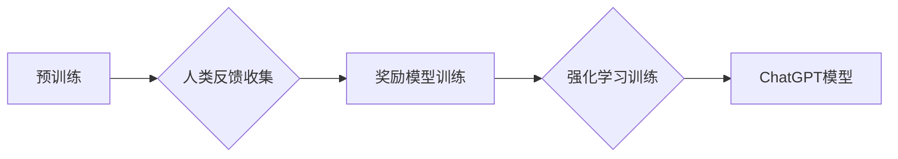

> ChatGPT, 人类反馈, 强化学习, 语言模型, 训练方法, 算法原理, 应用场景

## 1. 背景介绍

近年来，人工智能领域取得了令人瞩目的进展，其中自然语言处理（NLP）领域尤为突出。大型语言模型（LLM）的出现，例如GPT-3、LaMDA等，展现了强大的文本生成、理解和对话能力，为我们带来了全新的交互体验。然而，这些模型的训练主要依赖于海量文本数据，缺乏对人类反馈的有效利用，导致生成的文本有时存在偏差、不准确或缺乏针对性。

ChatGPT是OpenAI开发的一款基于人类反馈的强化学习（RLHF）训练的对话式AI，它在文本生成、对话理解和任务执行方面表现出色。ChatGPT的成功，标志着人类反馈在AI训练中的重要性得到进一步认可，为构建更智能、更安全、更符合人类需求的AI系统提供了新的思路。

## 2. 核心概念与联系

### 2.1 人类反馈

人类反馈是指人类对AI模型输出的评价和指导，它可以是文本、评分、排名等多种形式。通过收集和分析人类反馈，我们可以了解模型的优缺点，并将其用于模型的改进和优化。

### 2.2 强化学习

强化学习是一种机器学习方法，它通过奖励和惩罚机制来训练模型。模型在执行任务时，会根据环境的反馈获得奖励或惩罚，并根据这些反馈调整自己的行为策略，最终学习到最优的策略。

### 2.3 RLHF流程

ChatGPT的训练流程可以概括为以下步骤：

1. **预训练:** 使用海量文本数据预训练一个语言模型，例如GPT-3。
2. **人类反馈收集:** 让人类对模型生成的文本进行评价和打分，收集人类反馈数据。
3. **奖励模型训练:** 使用收集到的人类反馈数据训练一个奖励模型，该模型能够预测人类对文本的喜好程度。
4. **强化学习训练:** 使用奖励模型作为反馈机制，通过强化学习算法训练语言模型，使其生成更符合人类喜好的文本。

**Mermaid 流程图:**



## 3. 核心算法原理 & 具体操作步骤

### 3.1 算法原理概述

ChatGPT的训练基于强化学习算法，具体来说是使用Proximal Policy Optimization（PPO）算法。PPO是一种基于策略梯度的强化学习算法，它能够有效地解决强化学习中的样本效率问题，并能够稳定地训练模型。

### 3.2 算法步骤详解

1. **状态定义:** 模型的输入文本作为状态，表示当前对话的上下文信息。
2. **动作空间:** 模型的输出文本作为动作，表示模型在当前状态下生成的文本。
3. **奖励函数:** 根据人类反馈数据，定义一个奖励函数，用于评估模型生成的文本质量。
4. **策略网络:** 使用神经网络构建策略网络，该网络将状态作为输入，输出动作的概率分布。
5. **价值网络:** 使用神经网络构建价值网络，该网络将状态作为输入，输出状态的价值函数。
6. **训练过程:** 使用PPO算法更新策略网络和价值网络的权重，使其能够最大化奖励函数的期望值。

### 3.3 算法优缺点

**优点:**

* 样本效率高，能够有效利用有限的人类反馈数据。
* 稳定性好，能够避免强化学习训练中的震荡问题。
* 能够生成高质量的文本，符合人类的语言习惯和表达方式。

**缺点:**

* 训练过程复杂，需要大量的计算资源和专业知识。
* 奖励函数的设计至关重要，如果奖励函数设计不合理，可能会导致模型生成不符合预期结果的文本。

### 3.4 算法应用领域

ChatGPT的RLHF训练方法在以下领域具有广泛的应用前景：

* **对话系统:** 构建更自然、更智能的对话系统，例如聊天机器人、虚拟助手等。
* **文本生成:** 生成高质量的文本内容，例如文章、故事、诗歌等。
* **机器翻译:** 提高机器翻译的准确性和流畅度。
* **代码生成:** 自动生成代码，提高开发效率。

## 4. 数学模型和公式 & 详细讲解 & 举例说明

### 4.1 数学模型构建

ChatGPT的训练过程可以看作是一个马尔可夫决策过程（MDP）。

* 状态空间：S，表示对话的上下文信息。
* 动作空间：A，表示模型可以生成的文本。
* 奖励函数：R(s, a)，表示模型在状态s执行动作a获得的奖励。
* 策略网络：π(a|s)，表示模型在状态s下选择动作a的概率分布。
* 价值函数：V(s)，表示状态s的价值。

### 4.2 公式推导过程

PPO算法的目标是最大化奖励函数的期望值：

```latex
J(π) = E_{τ~π}[∑_{t=0}^{T} γ^t R(s_t, a_t)]
```

其中：

* J(π) 是策略π的价值函数。
* τ 是一个轨迹，表示从初始状态到终止状态的一系列状态和动作。
* γ 是折扣因子，控制未来奖励的权重。
* R(s_t, a_t) 是在状态s_t执行动作a_t获得的奖励。

PPO算法通过更新策略网络的权重来最大化奖励函数的期望值。更新规则如下：

```latex
θ_{new} = θ_{old} + α ∇_{θ} L(θ)
```

其中：

* θ 是策略网络的权重。
* α 是学习率。
* L(θ) 是PPO算法的损失函数，它包含了策略网络的KL散度和奖励函数的期望值。

### 4.3 案例分析与讲解

假设我们训练一个聊天机器人，其目标是与用户进行自然流畅的对话。我们可以使用人类反馈数据来训练奖励模型，例如：

* 当聊天机器人生成符合用户意图的回复时，给予高奖励。
* 当聊天机器人生成不相关或不恰当的回复时，给予低奖励。

通过训练奖励模型，我们可以得到一个能够评估聊天机器人回复质量的函数。然后，我们可以使用PPO算法训练策略网络，使其能够生成符合人类喜好的回复。

## 5. 项目实践：代码实例和详细解释说明

### 5.1 开发环境搭建

ChatGPT的训练需要强大的计算资源和专业的开发环境。建议使用以下工具和平台：

* **编程语言:** Python
* **深度学习框架:** TensorFlow 或 PyTorch
* **云计算平台:** Google Cloud Platform、Amazon Web Services 或 Microsoft Azure

### 5.2 源代码详细实现

由于ChatGPT的代码开源，我们可以直接使用其源代码进行训练和部署。

### 5.3 代码解读与分析

ChatGPT的源代码包含了预训练模型、训练脚本、评估脚本等。我们可以通过阅读代码，了解模型的架构、训练过程和评估指标。

### 5.4 运行结果展示

训练完成后，我们可以使用ChatGPT进行对话测试，并评估其性能。

## 6. 实际应用场景

### 6.1 文本生成

ChatGPT可以用于生成各种类型的文本内容，例如：

* **文章:** 可以根据给定的主题和关键词生成高质量的文章。
* **故事:** 可以根据给定的情节和人物生成富有创意的故事。
* **诗歌:** 可以根据给定的主题和风格生成优美的诗歌。

### 6.2 对话系统

ChatGPT可以用于构建更智能、更自然的对话系统，例如：

* **聊天机器人:** 可以与用户进行自然流畅的对话，回答用户的问题，提供信息和服务。
* **虚拟助手:** 可以帮助用户完成各种任务，例如设置提醒、预订酒店、查询天气等。

### 6.3 其他应用场景

ChatGPT还可以应用于其他领域，例如：

* **机器翻译:** 可以提高机器翻译的准确性和流畅度。
* **代码生成:** 可以自动生成代码，提高开发效率。
* **教育:** 可以作为教学工具，帮助学生学习和理解知识。

### 6.4 未来应用展望

随着技术的不断发展，ChatGPT的应用场景将会更加广泛，例如：

* **个性化教育:** 根据学生的学习情况和需求，提供个性化的学习内容和辅导。
* **医疗诊断:** 辅助医生进行疾病诊断，提高诊断准确率。
* **创意写作:** 帮助作家克服创作瓶颈，激发创意灵感。

## 7. 工具和资源推荐

### 7.1 学习资源推荐

* **OpenAI官方文档:** https://openai.com/blog/chatgpt/
* **论文:** "Language Models are Few-Shot Learners"
* **在线课程:** Coursera、edX 等平台上的深度学习课程

### 7.2 开发工具推荐

* **Python:** https://www.python.org/
* **TensorFlow:** https://www.tensorflow.org/
* **PyTorch:** https://pytorch.org/

### 7.3 相关论文推荐

* "Proximal Policy Optimization Algorithms"
* "Language Models are Few-Shot Learners"
* "Reinforcement Learning: An Introduction"

## 8. 总结：未来发展趋势与挑战

### 8.1 研究成果总结

ChatGPT的成功证明了人类反馈在AI训练中的重要性，并为构建更智能、更安全、更符合人类需求的AI系统提供了新的思路。

### 8.2 未来发展趋势

未来，ChatGPT和类似的RLHF训练模型将会朝着以下方向发展：

* **更强大的模型:** 训练更大规模、更复杂的模型，以提高模型的性能和能力。
* **更有效的训练方法:** 开发更有效的训练方法，以降低训练成本和时间。
* **更广泛的应用场景:** 将RLHF训练模型应用于更多领域，例如医疗、教育、金融等。

### 8.3 面临的挑战

ChatGPT的训练和应用也面临着一些挑战：

* **数据安全和隐私:** 人类反馈数据可能包含敏感信息，需要采取措施保护数据安全和隐私。
* **模型偏见:** 模型的训练数据可能存在偏见，导致模型生成带有偏见的文本。
* **伦理问题:** AI模型的应用可能会引发一些伦理问题，例如算法歧视、虚假信息传播等。

### 8.4 研究展望

未来，我们需要继续研究RLHF训练方法，解决其面临的挑战，并将其应用于更多领域，为人类社会带来更多福祉。

## 9. 附录：常见问题与解答

### 9.1 什么是RLHF？

RLHF全称为Reinforcement Learning from Human Feedback，即从人类反馈中进行强化学习。

### 9.2 ChatGPT的训练数据是什么？

ChatGPT的训练数据包括大量的文本数据，例如书籍、文章、代码等。

### 9.3 ChatGPT的应用场景有哪些？

ChatGPT的应用场景包括文本生成、对话系统、机器翻译、代码生成等。

### 9.4 ChatGPT的优势和劣势是什么？

ChatGPT的优势在于能够生成高质量的文本，符合人类的语言习惯和表达方式。其劣势在于训练过程复杂，需要大量的计算资源和专业知识。

### 9.5 ChatGPT的未来发展趋势是什么？

ChatGPT的未来发展趋势包括训练更强大的模型、开发更有效的训练方法、应用于更多领域。


作者：禅与计算机程序设计艺术 / Zen and the Art of Computer Programming 
<end_of_turn>