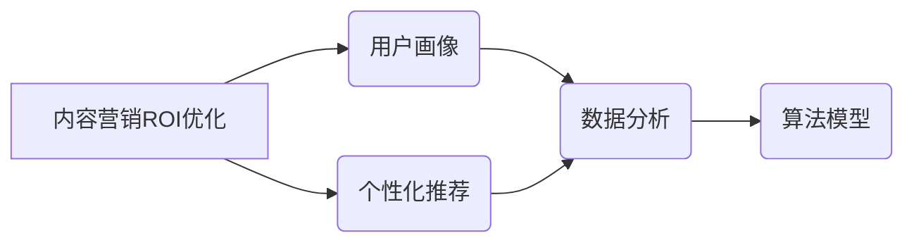

> 内容营销, ROI优化, 知识付费, 数据分析, 算法模型, 用户画像, 个性化推荐

## 1. 背景介绍

知识付费行业近年来蓬勃发展，涌现出众多优质内容创作者和平台。然而，在激烈的市场竞争中，如何有效提升内容营销的ROI（投资回报率）成为众多创业者和平台面临的共同挑战。传统的内容营销模式往往依赖于大规模的推广和曝光，难以精准触达目标用户，导致资源浪费和转化率低。

随着人工智能、大数据等技术的快速发展，内容营销的模式正在发生深刻变革。数据驱动、个性化、智能化成为新的趋势。通过对用户行为、偏好等数据的分析和挖掘，我们可以构建更精准的用户画像，并利用算法模型实现个性化内容推荐，从而提升内容营销的效率和效果。

## 2. 核心概念与联系

**2.1 内容营销ROI优化**

内容营销ROI优化是指通过数据分析、算法模型等手段，提升内容营销活动带来的投资回报率。其核心目标是：

* **提高内容曝光率和用户参与度:** 通过精准的受众定位和内容策划，吸引目标用户关注和互动。
* **提升转化率和用户留存率:** 通过个性化内容推荐和用户体验优化，引导用户完成目标行为，例如购买课程、订阅会员等。
* **降低营销成本和提高效率:** 通过数据分析和自动化运营，优化资源分配，提高营销活动的效率。

**2.2 用户画像与个性化推荐**

用户画像是指对目标用户进行深入分析，构建出其特征、行为、偏好等方面的描述。个性化推荐是指根据用户的画像信息，推荐与其兴趣相符的内容，提升用户体验和转化率。

**2.3 数据分析与算法模型**

数据分析是指对用户行为、内容表现等数据进行收集、清洗、分析和挖掘，以获取有价值的 insights。算法模型是指利用机器学习等技术，构建能够预测用户行为、推荐内容的模型。

**2.4 核心概念关系图**



## 3. 核心算法原理 & 具体操作步骤

### 3.1 算法原理概述

内容营销ROI优化的核心算法通常基于机器学习和深度学习技术，主要包括以下几种类型：

* **协同过滤算法:** 根据用户的历史行为和相似用户的信息，预测用户对特定内容的兴趣。
* **内容基准算法:** 基于内容的主题、标签、关键词等特征，推荐与用户兴趣相符的内容。
* **混合推荐算法:** 结合协同过滤和内容基准算法，实现更精准的推荐。

### 3.2 算法步骤详解

**1. 数据收集和预处理:** 收集用户行为数据、内容特征数据等，并进行清洗、转换、编码等预处理操作。

**2. 特征工程:** 从原始数据中提取用户画像特征、内容特征等，构建算法模型所需的输入特征。

**3. 模型训练:** 选择合适的算法模型，利用训练数据进行模型训练，并进行参数调优。

**4. 模型评估:** 使用测试数据评估模型的性能，例如准确率、召回率、覆盖率等指标。

**5. 模型部署和优化:** 将训练好的模型部署到线上环境，并根据用户反馈和数据分析进行模型优化。

### 3.3 算法优缺点

**优点:**

* **精准推荐:** 基于用户画像和内容特征，实现更精准的个性化推荐。
* **提升用户体验:** 提供更符合用户兴趣的内容，提升用户体验和留存率。
* **提高转化率:** 引导用户完成目标行为，例如购买课程、订阅会员等。

**缺点:**

* **数据依赖:** 算法模型的性能依赖于数据的质量和数量。
* **冷启动问题:** 对新用户和新内容的推荐效果可能较差。
* **算法解释性:** 一些深度学习模型的决策过程难以解释，难以进行调试和优化。

### 3.4 算法应用领域

* **知识付费平台:** 个性化推荐课程、文章、视频等内容。
* **电商平台:** 推荐商品、优惠券、促销活动等信息。
* **社交媒体平台:** 推荐好友、话题、文章等内容。
* **新闻资讯平台:** 推荐新闻、文章、视频等内容。

## 4. 数学模型和公式 & 详细讲解 & 举例说明

### 4.1 数学模型构建

**协同过滤算法**

协同过滤算法的核心思想是：用户对相似物品的喜好具有相关性。

**用户-物品交互矩阵:**

```
用户1  物品1  物品2  物品3
用户2  物品1  物品2  物品3
用户3  物品1  物品2  物品3
```

其中，每个单元格代表用户对物品的评分或交互行为。

**相似度计算:**

常用的相似度计算方法包括余弦相似度、皮尔逊相关系数等。

**预测评分:**

```
预测评分 =  ∑(相似度 * 用户评分) / ∑(相似度)
```

**举例说明:**

假设用户1和用户2对物品1和物品2都进行了评分，并且他们的评分相似度较高。那么，我们可以预测用户1对物品3的评分，参考用户2对物品3的评分。

### 4.2 公式推导过程

**协同过滤算法的相似度计算公式:**

**余弦相似度:**

```
相似度 = (用户1向量 * 用户2向量) / (||用户1向量|| * ||用户2向量||)
```

其中，用户1向量和用户2向量分别表示用户对所有物品的评分向量。

**皮尔逊相关系数:**

```
相似度 =  ∑((用户1评分 - 平均用户1评分) * (用户2评分 - 平均用户2评分)) / (√(∑((用户1评分 - 平均用户1评分)^2)) * √(∑((用户2评分 - 平均用户2评分)^2)))
```

其中，平均用户1评分和平均用户2评分分别表示用户对所有物品的评分的平均值。

### 4.3 案例分析与讲解

**案例:**

假设一个知识付费平台有1000个用户和1000个课程，用户对课程进行了评分。

**分析:**

* 使用协同过滤算法，计算用户之间的相似度。
* 根据用户相似度，推荐用户可能感兴趣的课程。
* 评估推荐效果，例如点击率、转化率等指标。

**讲解:**

通过协同过滤算法，可以实现基于用户的兴趣和行为进行个性化推荐，提升用户体验和平台的商业价值。

## 5. 项目实践：代码实例和详细解释说明

### 5.1 开发环境搭建

* 操作系统: Ubuntu 20.04 LTS
* Python 版本: 3.8.10
* 虚拟环境: venv
* 库依赖: pandas, numpy, scikit-learn, matplotlib

### 5.2 源代码详细实现

```python
import pandas as pd
from sklearn.metrics.pairwise import cosine_similarity

# 加载用户-物品交互数据
data = pd.read_csv('user_item_interaction.csv')

# 构建用户-物品交互矩阵
user_item_matrix = data.pivot_table(index='user_id', columns='item_id', values='rating')

# 计算用户之间的余弦相似度
user_similarity = cosine_similarity(user_item_matrix)

# 获取用户1的相似用户
user1_id = 1
similar_users = pd.DataFrame(user_similarity[user1_id - 1]).sort_values(ascending=False)
similar_users = similar_users[similar_users.index != user1_id]

# 推荐用户1可能感兴趣的课程
recommended_items = user_item_matrix.loc[similar_users.index].mean().sort_values(ascending=False)
print(recommended_items)
```

### 5.3 代码解读与分析

* **数据加载和预处理:** 使用pandas库加载用户-物品交互数据，并构建用户-物品交互矩阵。
* **相似度计算:** 使用scikit-learn库的cosine_similarity函数计算用户之间的余弦相似度。
* **相似用户获取:** 根据用户ID获取其相似用户的列表。
* **课程推荐:** 根据相似用户的平均评分，推荐用户可能感兴趣的课程。

### 5.4 运行结果展示

运行代码后，将输出用户1可能感兴趣的课程列表，并按照评分排序。

## 6. 实际应用场景

### 6.1 知识付费平台

* **课程推荐:** 根据用户的学习历史、兴趣偏好等信息，推荐相关课程，提升用户学习体验和课程转化率。
* **用户画像构建:** 分析用户的学习行为、课程评价等数据，构建用户画像，为内容创作和营销提供参考。
* **个性化学习路径:** 根据用户的学习目标和进度，构建个性化学习路径，提高学习效率和用户满意度。

### 6.2 电商平台

* **商品推荐:** 根据用户的购买历史、浏览记录等信息，推荐相关商品，提升用户购物体验和转化率。
* **个性化营销:** 根据用户的兴趣偏好和购买行为，进行个性化营销推广，提高营销效率和ROI。
* **用户画像构建:** 分析用户的购买行为、评价等数据，构建用户画像，为产品开发和营销策略提供参考。

### 6.3 社交媒体平台

* **内容推荐:** 根据用户的兴趣爱好、好友关系等信息，推荐相关内容，提升用户活跃度和粘性。
* **话题推荐:** 根据用户的兴趣爱好和社交关系，推荐相关话题，促进用户互动和社区建设。
* **广告投放:** 根据用户的兴趣爱好和行为特征，精准投放广告，提高广告效果和ROI。

### 6.4 未来应用展望

随着人工智能技术的不断发展，内容营销ROI优化的应用场景将更加广泛，例如：

* **医疗健康领域:** 个性化医疗建议、疾病预防知识推荐。
* **教育培训领域:** 个性化学习方案、在线课程推荐。
* **金融理财领域:** 个性化理财建议、投资产品推荐。

## 7. 工具和资源推荐

### 7.1 学习资源推荐

* **书籍:**
    * 《推荐系统实践》
    * 《机器学习》
    * 《深度学习》
* **在线课程:**
    * Coursera: 机器学习、深度学习
    * edX: 数据科学、人工智能
    * Udemy: 推荐系统、数据分析

### 7.2 开发工具推荐

* **Python:** 广泛应用于数据分析、机器学习和深度学习领域。
* **scikit-learn:** Python机器学习库，提供各种算法模型和工具。
* **TensorFlow:** Google开发的开源深度学习框架。
* **PyTorch:** Facebook开发的开源深度学习框架。

### 7.3 相关论文推荐

* **Collaborative Filtering for Implicit Feedback Datasets**
* **Matrix Factorization Techniques for Recommender Systems**
* **Deep Learning for Recommender Systems**

## 8. 总结：未来发展趋势与挑战

### 8.1 研究成果总结

内容营销ROI优化的研究取得了显著进展，算法模型不断完善，推荐效果不断提升。

### 8.2 未来发展趋势

* **更精准的个性化推荐:** 利用更丰富的用户数据和更先进的算法模型，实现更精准的个性化推荐。
* **跨平台内容推荐:** 打破平台壁垒，实现跨平台的内容推荐，提升用户体验和内容传播效果。
* **多模态内容推荐:** 融合文本、图像、视频等多模态内容，实现更丰富的用户体验和内容推荐。

### 8.3 面临的挑战

* **数据隐私保护:** 如何平衡数据利用和用户隐私保护，是内容营销ROI优化面临的重要挑战。
* **算法可解释性:** 一些深度学习模型的决策过程难以解释，难以进行调试和优化。
* **冷启动问题:** 对新用户和新内容的推荐效果可能较差，需要探索新的解决方案。

### 8.4 研究展望

