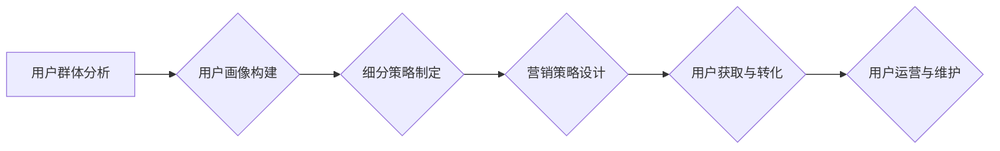

> 知识付费、用户群体细分、市场分析、用户画像、营销策略、内容运营

## 1. 背景介绍

知识付费行业近年来发展迅速，成为互联网经济的新增长点。随着人们对知识的需求不断增加，以及互联网技术的不断发展，知识付费模式也呈现出多元化、个性化的趋势。然而，在激烈的市场竞争中，如何精准地把握目标用户群体，制定有效的营销策略，成为知识付费创业者面临的重大挑战。

用户群体细分是知识付费创业成功的关键。通过对用户群体的深入分析和研究，可以精准地定位目标用户，制定针对性的内容和营销策略，提高用户转化率和用户粘性。

## 2. 核心概念与联系

**2.1 用户群体细分**

用户群体细分是指将用户群体根据一定的特征进行分类，形成不同的用户群体，以便针对不同的用户群体进行个性化的营销和服务。

**2.2 用户画像**

用户画像是指对用户群体的描述，包括用户的基本信息、行为特征、心理特征、兴趣爱好等方面。用户画像是用户群体细分的基础，也是制定营销策略的重要依据。

**2.3 知识付费用户画像**

知识付费用户画像是指对知识付费平台的用户进行分析和描述，包括用户的年龄、性别、职业、收入、教育水平、兴趣爱好、学习习惯、付费意愿等方面。

**2.4 细分策略**

知识付费用户群体细分策略是指根据用户群体的不同特征，制定不同的细分策略，例如：

* **按年龄段细分:**  针对不同年龄段的用户，提供不同的知识付费内容和服务。
* **按职业细分:**  针对不同职业的用户，提供相关的专业知识和技能培训。
* **按兴趣爱好细分:**  针对不同兴趣爱好用户，提供相关的兴趣课程和知识分享。
* **按付费意愿细分:**  针对不同付费意愿的用户，提供不同的付费模式和价格策略。

**2.5 营销策略**

知识付费用户群体细分后的营销策略是指针对不同的用户群体，制定不同的营销方案，例如：

* **精准投放广告:**  根据用户画像，在用户经常浏览的平台上精准投放广告。
* **内容营销:**  根据用户兴趣爱好，创作相关的优质内容，吸引用户关注。
* **社群运营:**  建立用户社群，加强用户互动，提升用户粘性。
* **口碑营销:**  鼓励用户分享学习经验，提升品牌口碑。

**2.6 流程图**



## 3. 核心算法原理 & 具体操作步骤

**3.1 算法原理概述**

用户群体细分算法通常基于机器学习和数据挖掘技术，通过对用户数据的分析和处理，识别用户群体的特征和规律，并将其进行分类。常见的算法包括：

* **K-means聚类算法:**  将用户数据划分为K个簇，每个簇代表一个用户群体。
* **层次聚类算法:**  将用户数据从底层到顶层进行层次化聚类，形成树状结构的用户群体划分。
* **关联规则挖掘算法:**  发现用户行为之间的关联规则，识别用户群体的共同特征。

**3.2 算法步骤详解**

1. **数据收集:**  收集用户数据，包括用户基本信息、行为特征、心理特征等方面。
2. **数据预处理:**  对收集到的用户数据进行清洗、转换、编码等预处理操作，使其符合算法的输入要求。
3. **特征选择:**  选择与用户群体细分相关的特征，例如年龄、性别、职业、兴趣爱好、学习习惯等。
4. **算法训练:**  使用选定的算法对用户数据进行训练，学习用户群体的特征和规律。
5. **用户群体划分:**  根据算法的输出结果，将用户数据划分为不同的用户群体。
6. **用户画像构建:**  对每个用户群体进行描述，构建用户画像。

**3.3 算法优缺点**

* **优点:**  能够自动识别用户群体的特征和规律，提高细分效率和准确性。
* **缺点:**  需要大量的用户数据进行训练，算法的性能受数据质量的影响较大。

**3.4 算法应用领域**

* **电商平台:**  根据用户的购买行为和兴趣爱好，进行用户细分，推荐个性化商品。
* **社交媒体平台:**  根据用户的兴趣爱好和社交关系，进行用户细分，推送个性化内容。
* **教育平台:**  根据用户的学习习惯和知识水平，进行用户细分，提供个性化学习方案。

## 4. 数学模型和公式 & 详细讲解 & 举例说明

**4.1 数学模型构建**

用户群体细分可以采用聚类算法，例如K-means算法，构建数学模型。K-means算法的目标是将数据点划分为K个簇，每个簇的中心点称为聚类中心。

**4.2 公式推导过程**

K-means算法的迭代过程如下：

1. **随机初始化K个聚类中心:**  

2. **计算每个数据点到每个聚类中心的距离:**  

3. **将每个数据点分配到距离最近的聚类中心:**  

4. **重新计算每个聚类中心的坐标:**  

5. **重复步骤2-4，直到聚类中心不再变化:**  

**4.3 案例分析与讲解**

假设我们有10个用户数据点，需要将其划分为2个簇。

1. **随机初始化两个聚类中心:**  例如，中心点1为(1,1)，中心点2为(9,9)。

2. **计算每个数据点到每个聚类中心的距离:**  例如，数据点1到中心点1的距离为1，到中心点2的距离为8。

3. **将每个数据点分配到距离最近的聚类中心:**  例如，数据点1分配到中心点1，数据点2分配到中心点2。

4. **重新计算每个聚类中心的坐标:**  例如，中心点1的坐标变为(1.5,1.5)，中心点2的坐标变为(8.5,8.5)。

5. **重复步骤2-4，直到聚类中心不再变化:**  例如，经过多次迭代后，中心点1的坐标为(2,2)，中心点2的坐标为(8,8)。

最终，10个用户数据点被划分为两个簇，每个簇的用户具有相似的特征。

## 5. 项目实践：代码实例和详细解释说明

**5.1 开发环境搭建**

* Python 3.x
* scikit-learn 库

**5.2 源代码详细实现**

```python
from sklearn.cluster import KMeans

# 用户数据
data = [[1, 2], [1.5, 1.8], [5, 8], [8, 8], [1, 0.6], [9, 11]]

# 设定聚类数
n_clusters = 2

# 创建K-means模型
kmeans = KMeans(n_clusters=n_clusters, random_state=0)

# 训练模型
kmeans.fit(data)

# 获取聚类标签
labels = kmeans.labels_

# 打印聚类标签
print(labels)

# 获取聚类中心
centers = kmeans.cluster_centers_

# 打印聚类中心
print(centers)
```

**5.3 代码解读与分析**

* 首先，导入必要的库，例如scikit-learn库中的KMeans类。
* 然后，定义用户数据，例如一个包含用户特征的列表。
* 设定聚类数，例如将用户数据划分为2个簇。
* 创建K-means模型，并指定聚类数和随机种子。
* 训练模型，将用户数据进行聚类。
* 获取聚类标签，每个标签代表一个用户所属的簇。
* 获取聚类中心，每个中心点代表一个簇的平均特征。

**5.4 运行结果展示**

运行上述代码，可以得到用户数据被划分为两个簇的标签和聚类中心。

## 6. 实际应用场景

**6.1 知识付费平台用户细分**

知识付费平台可以根据用户的年龄、职业、兴趣爱好、学习习惯等特征，进行用户细分，提供个性化的课程推荐和学习方案。

**6.2 在线教育平台用户细分**

在线教育平台可以根据用户的学习水平、学习目标、学习风格等特征，进行用户细分，提供个性化的学习内容和学习路径。

**6.3 社交媒体平台用户细分**

社交媒体平台可以根据用户的兴趣爱好、社交关系、行为特征等特征，进行用户细分，推送个性化的内容和广告。

**6.4 未来应用展望**

随着人工智能技术的不断发展，用户群体细分将更加精准和智能化。未来，用户群体细分将应用于更多领域，例如医疗、金融、零售等，为用户提供更加个性化和定制化的服务。

## 7. 工具和资源推荐

**7.1 学习资源推荐**

* **书籍:**  《数据挖掘：概念与技术》
* **在线课程:**  Coursera上的《机器学习》课程

**7.2 开发工具推荐**

* **Python:**  Python是一种流行的编程语言，广泛应用于数据分析和机器学习。
* **scikit-learn:**  scikit-learn是一个开源的机器学习库，提供各种聚类算法和数据处理工具。

**7.3 相关论文推荐**

* **K-means聚类算法:**  MacQueen, J. (1967). Some methods for classification and analysis of multivariate observations. In Proceedings of the fifth Berkeley symposium on mathematical statistics and probability (pp. 281-297).


## 8. 总结：未来发展趋势与挑战

**8.1 研究成果总结**

用户群体细分是知识付费创业成功的关键，通过对用户群体的深入分析和研究，可以精准地定位目标用户，制定针对性的内容和营销策略，提高用户转化率和用户粘性。

**8.2 未来发展趋势**

* **更加精准的细分:**  随着人工智能技术的不断发展，用户群体细分将更加精准和智能化。
* **个性化定制:**  用户群体细分将更加注重个性化定制，为用户提供更加个性化的内容和服务。
* **跨平台融合:**  用户群体细分将跨越平台边界，将用户数据进行整合，提供更加全面的用户画像。

**8.3 面临的挑战**

* **数据隐私保护:**  用户群体细分需要收集和分析用户的个人数据，因此数据隐私保护是一个重要的挑战。
* **算法准确性:**  用户群体细分算法的准确性受数据质量和算法本身的影响，需要不断改进算法和数据处理方法。
* **用户接受度:**  用户对数据收集和分析的接受度需要不断提高，需要加强用户教育和隐私保护措施。

**8.4 研究展望**

未来，用户群体细分研究将更加注重以下方面:

* **隐私保护技术:**  研究更加隐私保护的算法和数据处理方法。
* **跨平台数据融合:**  研究跨平台用户数据融合的技术和方法。
* **个性化定制技术:**  研究更加精准的个性化定制技术，为用户提供更加个性化的服务。


## 9. 附录：常见问题与解答

**9.1 如何收集用户数据？**

用户数据可以从以下渠道收集：

* 用户注册信息
* 用户行为日志
* 用户反馈意见
* 用户问卷调查

**9.2 如何保证数据质量？**

数据质量可以通过以下方式保证：

* 数据清洗：去除重复数据、错误数据等。
* 数据转换：将数据转换为统一格式。
* 数据编码：将数据转换为数字格式。

**9.3 如何选择合适的聚类算法？**

选择合适的聚类算法需要考虑以下因素：

* 数据类型
* 数据规模
* 聚类目标

**9.4 如何评估聚类结果？**

聚类结果可以通过以下指标